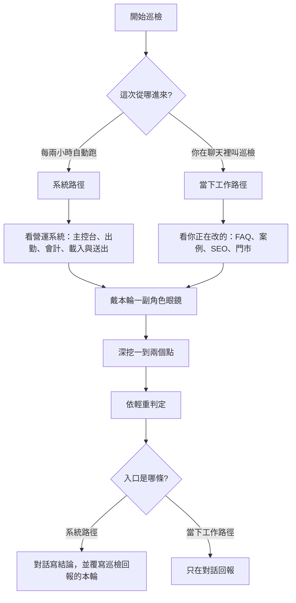

# 營運系統真人巡檢

**一句定位**：同一副角色眼鏡、**兩條入口**。排程看營運系統；聊天裡叫巡檢則看你正在做的事。找錯、找不穩、找升級；再依等級動手或只回報。

## 先判斷入口（必做第一步）

不要把兩條路併成一條。認完入口，才讀視角、才選切入點。

| 入口 | 怎麼認 | 看什麼 | 回報寫哪 |
|------|--------|--------|----------|
| **系統路徑** | Cloud Agent／Automations／每 2 小時／指示寫「自動化排程」 | 營運系統：主控台、出勤、會計、載入／送出、失敗當空 | 對話結論＋覆寫 `TOS/巡檢回報.md` 的「本輪」 |
| **當下工作路徑** | 對話裡 `/system-human-patrol`、@ 本 skill、你在聊天叫巡檢 | 本對話正在改／剛抱怨的（FAQ、案例、SEO、門市…） | **只寫對話**；不覆寫巡檢回報檔 |

認不出來：沒有使用者對話脈絡 → **系統路徑**；有使用者剛叫、且有正在做的事 → **當下工作路徑**。



排程設定與可貼指示：[`TOS/營運系統真人巡檢_自動化指示.md`](../../../TOS/營運系統真人巡檢_自動化指示.md)。Dashboard 步驟：[`TOS/營運系統真人巡檢_切換步驟.md`](../../../TOS/營運系統真人巡檢_切換步驟.md)。

## 必做順序

1. **先判斷入口**（上表）。之後依該入口走對應「怎麼選切入點」。
2. 讀同目錄 [`perspectives.md`](perspectives.md)、[`實作備註.md`](實作備註.md)。
3. 讀 [`TOS/巡檢回報.md`](../../../TOS/巡檢回報.md)：定**本輪視角**。
   - **系統路徑**：避開剛查過的同頁／同 API（除非中間有產品向新提交或標了要再驗）。
   - **當下工作路徑**：剛查過可避開，但若那就是當下工作則繼續深挖；不要為了換題去查無關營運頁。
4. 載入 [`ui-flow`](../ui-flow/SKILL.md)、[`human-comfortable`](../human-comfortable/SKILL.md)。
5. 依本入口的選點規則深挖 **1～2** 個切入點（不是全系統盤查）。
6. 每條發現套用下方判定矩陣並執行對應動作。
7. **立刻在本對話回報**（見下方「回報格式」）。不要把「寫檔」當唯一交差。
8. 巡檢回報檔：
   - **系統路徑**：覆寫 `TOS/巡檢回報.md` 的「本輪」與輪替指針；P2／P3 追加「待你決定」。
   - **當下工作路徑**：**不要**覆寫該檔。
9. **兩條路都不要**覆寫根目錄 `下一輪該改什麼.md`。

## 六種視角（每輪只戴一副）

順序：`總監` → `會計` → `行政` → `設計師` → `現場施工` → `客人` →（回頭）。

- 上一輪視角的**下一個**＝本輪；若無紀錄則從 `總監` 起。
- 急訊號可暫時插隊：系統路徑 → 與該系統問題最相關的視角；當下工作路徑 → 與當下工作最相關的視角。下一輪仍回到順序。
- 細節口吻見 [`perspectives.md`](perspectives.md)。

## 怎麼選切入點｜系統路徑（自動排程）

眼鏡戴在**營運系統**上。每輪一種視角、1～2 點；發現走 P0～P3。覆寫巡檢回報「本輪」。**不要**覆寫 `下一輪該改什麼.md`。巡檢回報檔本身不是產品。

1. 本輪視角「較常盯」× 尚未近期查過的載入／送出閉環（主控台、出勤、會計、班表、戰情側欄都算系統，這條路就該看）。
2. 最近產品向提交（`liff-checkin` + `Backend_GAS`）。略過純案例頁／sitemap／巡檢回報本身（公開行銷頁不是這條路的主場）。
3. `LOG/` 未勾、`SPEC` 與程式不一致。
4. 反模式：失敗當空、無逾時、無重試、乾等空白、前後端數字兩套。

中間若無新提交：仍要換視角或換閉環；禁止整份回報複製貼上。

## 怎麼選切入點｜當下工作路徑（對話手動）

眼鏡戴在**眼前這件事**上。每輪一種視角、1～2 點；發現走 P0～P3。不覆寫巡檢回報檔。**不要**覆寫 `下一輪該改什麼.md`。巡檢回報檔本身不是產品。

1. **第一優先：當下工作。** 讀本對話使用者正在改／剛改／剛抱怨的畫面與流程（含公開頁、FAQ、案例、SEO、門市文案、開著的頁、未提交的本機改動、上一句在問的產品）。「純案例頁／sitemap」**不得**當略過理由而避開當下主題。
2. **第二：該視角怎麼看這件事**（怕什麼、會點哪、會不會跑錯店／找不到答案／搜不到）。`perspectives.md` 的「較常盯」只在當下工作對不上時當備援，**禁止**因為戰情側欄、班表等剛好符合反模式就跑題。
3. **第三才輪到** 尚未查過的載入閉環、最近 `liff-checkin`／GAS 產品提交、`LOG/` 未勾或 `SPEC` 與程式不一致。
4. 反模式（失敗當空、無逾時、無重試、乾等空白、前後端數字兩套）只用來檢查**已選定的當下工作**，不當選題清單。

僅當對話裡沒有當下工作、也沒有可跟的脈絡時，才略過本輪（不要擅自改去戰情／班表交差）。禁止整份回報複製貼上。

## 每輪深挖必問

1. **對不對**：空／失敗／權限不足有沒有分開？數字與規則一致嗎？  
2. **穩不穩**：失敗會不會自動再試？人能不能再試？會不會誤導成「沒資料」？  
3. **快不快**：資料不複雜卻久等？  
4. **走得完嗎**：點了有下文嗎？（ui-flow）  
5. **人好過嗎**：本輪角色會不會怕、放棄？（human-comfortable；客人輪特別嚴格）  
6. **能不能升級**：這個角色還會自然想要什麼？

## 判定矩陣（必遵）

| 等級 | 長相（白話） | Agent 做什麼 | 部署 |
|------|--------------|--------------|------|
| **P0 立即** | 會讓人以為系統壞了或資料錯了，且修法明確、範圍小、不改商業規則。例：失敗當空清單、無重試、錯誤吞掉、明顯卡死主流程 | 直接改 → 載入 [`deploy-runbook`](../deploy-runbook/SKILL.md) 窄範圍部署 → 報告「已修已上線」 | **允許**（僅此級；一次一事、可回滾） |
| **P1 小迭代** | 不影響主功能正確性，但明顯更好用／更快／更穩 | 開分支改完 → push 分支（不進 main／不上正式）→ 報告附連結 | **不上線** |
| **P2 建議** | 系統結構、產品方向、政策開關、跨模組大改 | 只寫建議＋驗收方式 | 不上線、不開大 PR |
| **P3 流程升級** | 人怎麼走這件事可以更好 | 只寫建議＋動作流程表草稿 | 等使用者決定 |

**保守原則**

- P0 一次只修一件；改完要能驗證（讀碼／既有 verify／人話驗收）。  
- 假勤政策、獎金切換、全公司 LINE 選單、權限模型、資料表結構 → **一律 P2／P3**。  
- 不確定「真的空」還是「讀失敗」→ 先當 P0 候選（狀態分離＋重試）。  
- 使用者未說「部署」時，**僅本 Skill 判定 P0 且通過 deploy-runbook 閘門**才可部署。  
- GAS 改動另載 [`GAS-Backend-Expert`](../GAS-Backend-Expert/SKILL.md)。

P1 分支：`patrol/<簡短主題>-YYYYMMDD`；PR 標題加 `[巡檢P1]`。

## 標準反例（會計／載入閉環）

廠商名冊（或同類列表）：第一次讀取失敗卻顯示成「空的」；沒有真實狀況回報、沒有自動重試；讀表比對並不複雜卻等太久。  
→ 狀態分離＋重試＋人話錯誤＝典型 **P0**；純加速／骨架屏而無錯誤誤導＝可 **P1**。  
（系統路徑常會遇到；當下工作路徑只有當下主題真的是這類列表時才套。）

## 回報格式

兩條路都要**立刻在對話寫結論**（判定與若有 P0／P1 動作做完後）。  
另外：系統路徑還要寫 `TOS/巡檢回報.md`；當下工作路徑不要寫該檔。

每條發現寫清楚：

- 本輪入口、視角、等級、人怎麼踩到、為什麼不對／可升級、建議或已做、狀態（`已部署`／`分支待看`／`等你決定`）、驗收方式

結尾固定三行：

```text
P0 已上線：N 件（一句話或「無」）
P1 分支待看：連結或「無」
待你決定（P2／P3）：N 件（一句話或「無」）
```

## 禁止

- 把兩條入口併成一條（排程卻只盯聊天 FAQ；聊天卻跑去戰情交差）
- 同一輪假裝六種人格各講一遍
- 只重抄舊看板「續1還沒做」當本輪成果
- **當下工作路徑**：為遷就視角或反模式硬查無關頁（戰情側欄、班表等）而跳過當下工作
- **系統路徑**：因為「對話當下工作優先」而略過主控台／出勤／會計
- 編造沒讀過的流程
- 覆寫 `下一輪該改什麼.md`
- 當下工作路徑把寫入 `TOS/巡檢回報.md` 當交差
