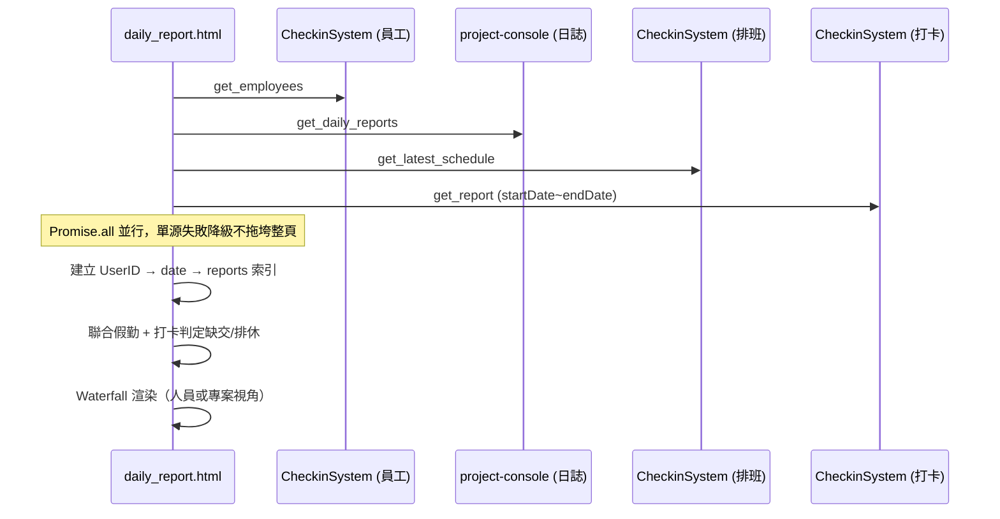

# CODING 戰情前端開發手冊

> **對象**：設計總監、前端維護者  
> **核心模組**：`modules/projects/daily_report.html` + `js/daily_report_main.js`  
> **欄位唯一來源**：`SPEC/專案全域資料字典.md`（§6 每日回報與打卡整合 API）

---

## 1. 戰情室非同步聯表原理

戰情室不在後端做 JOIN，而是在瀏覽器同時拉四份資料，再本地對齊。



### 1.1 四路並行請求

| 來源 | API action | 用途 |
|------|------------|------|
| CheckinSystem | `get_employees` | 組別、姓名、userId |
| project-console | `get_daily_reports` | 施工日誌 Content、PhotoLinks |
| CheckinSystem | `get_latest_schedule` | 排休/特休/假別 |
| CheckinSystem | `get_report` | 進退場 checkIn / checkOut |

### 1.2 本地 JOIN 鍵

- **主鍵**：`userId`（員工/考勤） ↔ `UserID`（日誌）— 同一 LINE UID，大小寫依字典不可混用。
- **日期鍵**：`YYYY-MM-DD`，日誌取自 `Timestamp` 前 10 字，打卡取自 `dailyData[dateStr]`。
- **索引結構**：`reportsByUserIdAndDate[userId][dateStr] = [report, ...]`，避免在員工迴圈內重複 reduce。

### 1.3 錯誤降級

`Promise.all` 內每一路各自 `.catch()`，失敗時回傳空陣列/空物件，頁面仍可部分顯示並在 console 印 `[降級警告]`。

---

## 2. 五種過濾流水線 (Filters)

資料進入畫面前，依序經過五道篩選（前四道可即時重繪，不重新打 API）：

| # | 名稱 | 觸發位置 | 行為 |
|---|------|----------|------|
| 1 | **權限過濾** | `fetchEmployees()` | 只保留 `permission === 2 \|\| 3` 的設計/工務人員 |
| 2 | **日期區間** | `#start-date-picker` ~ `#end-date-picker` | 決定 API 查詢範圍與時間軸 `getDateRange()`；**未來日期**不顯示缺交列 |
| 3 | **組別過濾** | `#group-filter-container` checkbox | 依 `group`（對應 Sheets「組別」）篩選員工與專案視角下的日誌 |
| 4 | **人員搜尋** | `#person-search-input` | 依 `userName` 子字串（不分大小寫）過濾 |
| 5 | **視角切換** | `#view-mode-employee` / `#view-mode-project` | 人員模式：依員工卡片 + 時間軸；專案模式：依 `ProjectName` 分組 |

**缺交/排休判定**（渲染層邏輯，非獨立 filter）：

- 全天假且無打卡 → 灰色「排休未進場」，整卡 `opacity-60` 淡化。
- 應出勤或已打卡但無日誌 → 紅色 Missing 警示列（`REPORT_STYLES.missingReportRow`）。

---

## 3. KPI 戰情看板

`#kpi-dashboard` 在每次渲染後由 `updateKPIDashboard()` 更新：

| 卡片 | 指標 | 說明 |
|------|------|------|
| 今日出勤 | 實到 / 應到 | 有 `checkIn` 者為實到；應到 = 非全天假或已打卡者 |
| 本日請假 | 排休人數 | 全天假且未打卡 |
| 日報繳交率 | % + 缺交名單 | 查「今日」時改統計**昨日**缺交，避免當日尚未截止誤判 |

---

## 4. 施工照片（Dropbox / Drive）

`getPhotoUrl(url, size)` 統一處理：

- **Dropbox**：`www.dropbox.com` → `dl.dropboxusercontent.com`，`dl=0` → `raw=1`（免登入直連）
- **Google Drive**：`extractDriveFileId` + thumbnail API
- 縮圖與 Lightbox 大圖共用同一轉換邏輯

---

## 5. 修改 UI 時如何不破壞資料字典一致性

### 必守三條

1. **先改字典，再改程式**  
   新欄位、新 API key 必須先寫入 `SPEC/專案全域資料字典.md`，禁止在前端自創 `projectId`、`ctx_project_no` 等別名。

2. **禁止 Mapping Table**  
   畫面綁定必須直接使用字典名稱，例如：
   - 員工：`userId`, `userName`, `group`, `pcName`
   - 日誌：`UserID`, `UserName`, `Content`, `PhotoLinks`, `ProjectName`, `Timestamp`
   - 考勤：`checkIn`, `checkOut`, `date`

3. **大小寫是契約的一部分**  
   日誌系統用大寫 `UserID`；員工/考勤用小寫 `userId`。JOIN 時只做鍵對齊，不做 rename。

### 建議流程

```
需求 → 查 專案全域資料字典 §6
     → 缺欄位？先補字典 + 後端 backend/
     → 改 daily_report_main.js / daily_report.html
     → 本地開 daily_report.html?uid=...&name=... 驗證
     → upload.bat 推送 CODING（使用者要求部署時）
```

### 樣式封裝

狀態 CSS 集中在 `daily_report_main.js` 的 `REPORT_STYLES`：

- `fullDayLeaveFade`：`opacity-60`（特休整卡淡化）
- `missingReportRow`：缺交紅字警示
- `leaveNoClockRow`：排休未進場

修改視覺時改此物件，避免在 HTML 字串散落 class。

---

## 6. 相關檔案

| 路徑 | 說明 |
|------|------|
| `modules/projects/daily_report.html` | 頁面骨架、KPI、篩選器、排班快取 |
| `modules/projects/js/daily_report_main.js` | 聯表、過濾、KPI、雙視角渲染 |
| `modules/projects/js/ui.js` | 圖片 lazy load |
| `shared/js/config.js` | GAS WebApp URL |
| `SPEC/專案全域資料字典.md` | 欄位唯一事實來源 |
| `.agents/workflows/test_daily_report.md` | 自動化測試檢查清單 |

---

## 7. 本地驗證

```
https://info.tanxin.space/modules/projects/daily_report.html?uid=YOUR_UID&name=YOUR_NAME
```

或本機 `127.0.0.1` 會自動帶入測試 uid（見 `initializeUser()`）。

檢查項：KPI 三卡、組別勾選、人員搜尋、雙視角切換、Dropbox 縮圖、特休淡化、缺交紅字。
