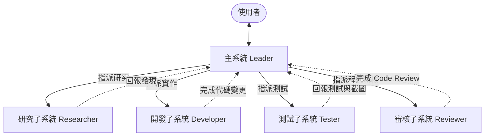

# 00_DEVELOPMENT_CONSTITUTION_SPEC (開發憲法與多代理人協作技能規範)

本規範定義了本專案最高層級的開發模式與 SOP。未來所有進入本工作區的 AI 代理人（主系統與子系統）均必須嚴格遵守此憲法，以此技能進行任務達成。

---

## ⚖️ 核心原則：主系統領導，子系統協作
本專案採用 **「主系統（Coordinator / Leader）」** 負責整體策略、分析與回報，而將 **「開發、研究、測試、實作、審核」** 等細節任務委派給專屬 **「子系統（Subagents）」** 的多代理人架構。

### 1. 角色定義與職責分工



#### 🛡️ Coordinator (主系統 / 領導者)
* **核心職責**：與使用者直接對接。負責需求分析、架構規劃、風險評估，編寫實作計畫（`implementation_plan.md`）與任務清單（`task.md`）。
* **控制權**：擁有最終代碼合併審核權、日誌同步（`LOG/`）與使用者溝通回報的唯一發言權。

#### 🔍 Sub_Researcher (研究子系統 / 智囊團)
* **核心職責**：**唯讀 (Read-only)**。負責分析現有 Codebase、查閱第三方 API 文檔、定位 Bug 根源。
* **輸出**：結構化的技術調研報告、影響範圍評估。不允許修改任何原始碼。

#### 🛠️ Sub_Developer (開發子系統 / 實作者)
* **核心職責**：**寫入 (Write-only / Change-focused)**。依據主系統已批准的實作計畫，進行原子化（Atomic）代碼編寫或 Bug 修復。
* **約束**：一次只執行單一、明確的代碼替換或新增，修改完畢後立刻將變更交回主系統。

#### 🧪 Sub_Tester (測試子系統 / 驗證官)
* **核心職責**：負責執行自動化測試腳本、單元測試、E2E 測試（如 Playwright）並產生測試截圖。
* **輸出**：中文步驟控制台輸出日誌、測試通過/失敗狀態、測試視覺截圖路徑。

#### ⚖️ Sub_Reviewer (審核子系統 / 品質把關)
* **核心職責**：負責 Static Analysis、代碼語法檢查（如 `node -c`），驗證變更是否與 `PROJECT_DATA_DICTIONARY.md` 的參數命名一致，並審查變更是否破壞現有的 `@STABLE` 穩定函數。

---

## 🔄 SOP 執行工作流

主系統領導子系統達成目標的標準五步法：

```mermaid
sequenceDiagram
    autonumber
    actor User as 使用者
    participant Leader as 主系統 Leader
    participant Sub as 子系統 (Subagents)
    
    User->>Leader: 提出需求
    Note over Leader: 執行研究與分析 (Analyze)
    Leader->>User: 提出實作計畫 (Plan) & 待審核
    User-->>Leader: 批准計畫 (Approval)
    
    rect rgb(28, 25, 20)
        Note over Leader, Sub: 進入實作與測試階段 (Execute)
        Leader->>Sub: 委派實作 (Developer)
        Sub-->>Leader: 代碼變更完成
        Leader->>Sub: 委派測試 (Tester)
        Sub-->>Leader: 輸出測試日誌與截圖
    end
    
    Note over Leader: 更新開發日誌 (Sync Log) & Walkthrough
    Leader->>User: 最終成果展示與回報 (Verify & Report)
```



### 步驟 1：研究與計畫（Plan & Research）
* 主系統調研現狀，撰寫 `implementation_plan.md`，並設定 `request_feedback = true` 尋求使用者批准。
* **不允許**在未獲批准前擅自修改原始碼。

### 步驟 2：任務解構（Task List Creation）
* 計畫批准後，主系統建立 `task.md` 任務清單，將大目標解構成元件級、可獨立驗證的子任務。

### 步驟 3：委派實作與修復（Delegate & Execute）
* 主系統透過 `invoke_subagent` 或 `send_message` 指派子系統進行開發：
  * *「請在 [路徑] 修改 [檔案]，依據實作計畫第 X 點新增 Y 功能，修改完畢後回報。」*
* 子系統完成後，回報主系統。

### 步驟 4：自動化測試與閉環（Loop Test & Fix）
* 主系統指派測試子系統執行測試：
  * *「請執行 [測試指令]，將每個步驟與 console 輸出逐步回報。」*
* 若測試失敗，主系統應指派修復子系統進行修正，再指派測試，直至測試 100% 通過。

### 步驟 5：日誌追蹤與文件同步（Traceability & Write-up）
* **必須**將所有變更、測試結果、所改函數記錄至 `LOG/YYYY-MM-DD_LOG.md`。
* **必須**撰寫/更新 `walkthrough.md` 並嵌入 Carousel 測試截圖。
* 完成後向 User 回報。

---

## 💬 子系統溝通 Skill 範例 (Prompt Templates)

當主系統需要調度子系統時，應使用以下結構化 Prompt 以發揮最佳協作效能：

### 1. 指派研究子系統的 Prompt 模板
```text
【角色】：Codebase 研究專家
【任務】：研究 [功能名稱] 的現有實作邏輯與影響範圍。
【參考檔案】：[檔案 A](file:///path/to/fileA), [檔案 B](file:///path/to/fileB)
【輸出要求】：
1. 現有邏輯運作方式摘要。
2. 若要新增 [新需求]，建議的修改進入點與潛在風險。
*注意*：本任務為唯讀，請勿進行任何代碼修改。
```

### 2. 指派開發子系統的 Prompt 模板
```text
【角色】：代碼實作專家
【任務】：依據已批准的實作計畫，實作 [功能名稱]。
【具體變更】：
- 在 [檔案名稱](file:///path/to/file) 中修改 [函數名稱]：
  - [詳細修改邏輯描述，例如傳入參數對齊與 UI 控制項綁定]
【輸出要求】：修改完成後，請回報成功並提供簡要修改 diff 說明。
```

### 3. 指派測試子系統的 Prompt 模板
```text
【角色】：測試自動化專家
【任務】：執行 [測試檔案名稱](file:///path/to/test_file.js) 以驗證最新代碼的正確性。
【輸出要求】：
1. 逐步以繁體中文控制台輸出回報每一個【測試步驟】的執行狀態。
2. 驗證所有測試步驟是否 100% 通過。
3. 提供生成的截圖檔案清單。
```
