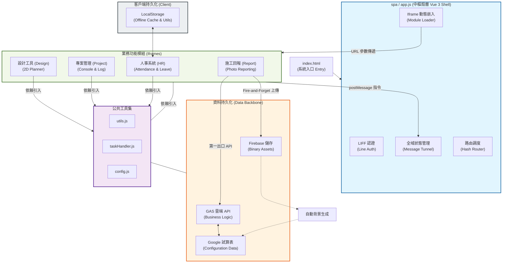

# CODING 專案：系統流程全景圖 (v2.2)

本文件以 Mermaid 流程圖形式展示 **CODING** 專案全量模組間的層級關係、通訊機制與後端整合流向。

## 1. 系統架構全景圖

## 🏗️ 核心承重牆模組 ( लोड-bearing Components)

| 模組 | 角色 | 核心技術點 | 依賴關係 |
| :--- | :--- | :--- | :--- |
| **`app.js`** | 系統心臟 | SPA 路由調度與 Iframe PostMessage 通訊協定 | 所有渲染元件 (Modules) |
| **`apiService.js`** | 通訊骨幹 | 非同步 Job 輪詢與寫入隊列管理 | GAS Web App |
| **`DependencyManager`** | 資料調度員 | 事件驅動的資料就緒偵測與元件重繪 | 全域 `state` (Message Tunnel) |
| **`reportV2.html`** | 數據入口 | Firebase/GAS 雙軌同步與圖片並行壓縮 | Firebase Auth (Fire-and-Forget) |

---
> [!IMPORTANT]
> **維護指令**: 任何修改涉及 `postMessage` 指令或 `config.js` 全域配置時，必須同步執行跨模組回歸測試。
