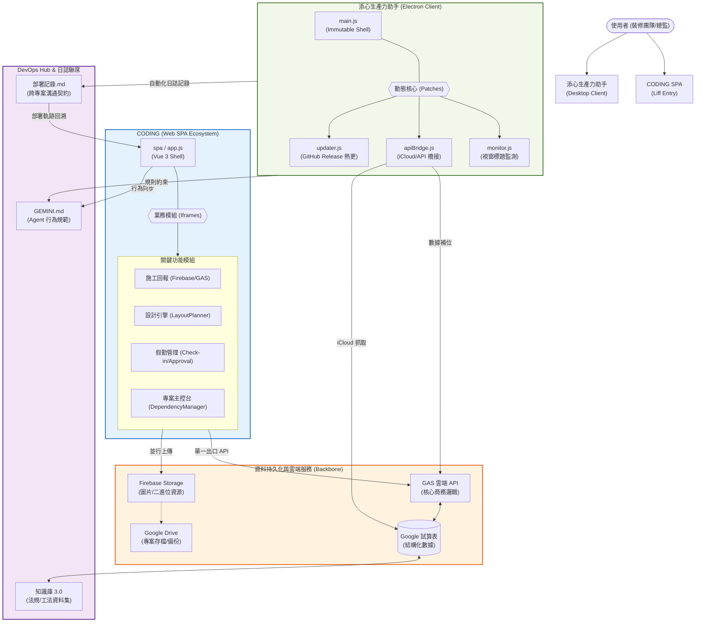

# 添心專案：全量系統全景圖 (v3.0 - 生態整合版)

> [!TIP]
> **核心規格書導航**:
> - [01_核心設計原則與規範](file:///c:/Users/a9999/Dropbox/CodeBackups/CODING/SPEC/01_GLOBAL_DESIGN_STANDARD.md)
> - [04_互動室內設計規劃工具 SPEC](file:///c:/Users/a9999/Dropbox/CodeBackups/CODING/SPEC/04_INTERIOR_DESIGN_TOOL_SPEC.md)
> - [08_專案主控台：核心功能與通訊協定 SPEC](file:///c:/Users/a9999/Dropbox/CodeBackups/CODING/SPEC/08_PROJECT_CONSOLE_CRUD_SPEC.md)
> - [全量部署/開發記錄檔](file:///c:/Users/a9999/Dropbox/CodeBackups/CODING/部署記錄_CODING.md)

本文件以 Mermaid 流程圖展示 **CODING (Web SPA)** 與 **添心生產力助手 (Electron Client)** 的雙軌協作架構、通訊機制與 DevOps 聯動流向。

## 1. 系統全域生態圖

## 🏗️ 核心架構矩陣 (Architectural Matrix)

| 系統 | 角色 | 核心承重牆 | 通訊協定 |
| :--- | :--- | :--- | :--- |
| **CODING (Web)** | 用戶端互動中心 | `app.js` (Router), `apiService.js` (Tunnel) | `postMessage` (Iframe), `Fetch` (GAS) |
| **助手 (Client)** | 專家監測與 DevOps | `main.js` (殼層), `monitor.js` (核心) | `IPC` (Main/Renderer), `HTTP` (Updater) |
| **Backend** | 數據大腦 | `WebApp.gs` (多路由處理器) | `RESTful API` (Structured Data) |
| **知識庫** | 法規與技術支援 | `知識庫_台灣室內裝修.md` | `Knowledge Retrieval` (Agent Context) |

---

## 🛠️ DevOps 聯動機制 (Cross-Project Integration)

1. **部署日誌中繼 (Log Sync)**:
   - 助手 (Client) 在執行 `upload.bat` 時，會自動更新 `部署記錄_添心生產力助手.md`。
   - CODING (Web) 的任何變動均以此日誌為「最終真相來源」，Agent 會根據此檔同步修改範圍。
2. **數據安全補位 (Data Guard)**:
   - 助手監視打卡狀態，並即時抓取 iCloud 提醒事項內容。
   - 透過 `apiBridge.js` 將數據補位至 CODING 的 GAS 系統中，確保跨設備數據一致。
3. **熱更新機制 (Hot Update)**:
   - 助手殼層 (`main.js`) 保持穩定，業務邏輯 (`monitor.js`) 透過 `patch.zip` 由 `updater.js` 動態拉取並替換，實現無感升級。

---
> [!IMPORTANT]
> **維護指令**: 任何涉及跨專案連動（如 API 參數變更）的修改，必須同步更新 `DevOps Hub` 中的部署記錄與相關專案的 `config.js`。
