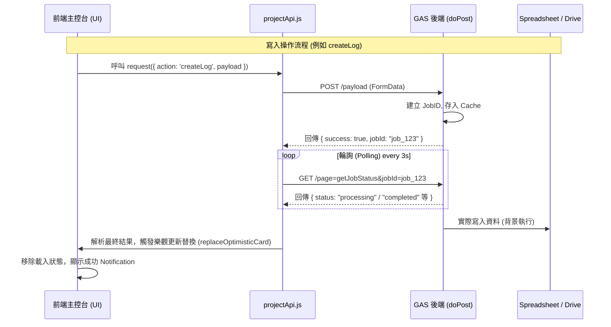

# 專案主控台：核心功能與通訊協定全解析 (SPEC)

## 1. 核心功能矩陣 (Feature Matrix)

除了基礎的資料讀寫，主控台整合了以下關鍵業務模組：

### A. 任務交辦與溝通中心 (Task Sender & Comms)
- **多向交辦**: 支持發送給特定員工或「全體發送」。
- **動作要求**: 可設定 `ReplyText` (文字回覆) 或 `ConfirmCompletion` (完成回報)。
- **預警系統**: 具備 `Overdue` (逾期) 自動判定與 `Unread` (未讀) 視覺提示。
- **互動卡片**: 直接在通訊串流中進行回覆或標示已讀。

### B. 工程資訊 360 面板 (Project Info Panel)
- **動態團隊**: 根據排程自動提取工種與負責人資訊。
- **現場指南**: 整合入門、停車、保證金等現場營運細節。
- **快速通訊**: 整合撥號連結 (`tel:`) 與 Google Maps 導航。
- **資訊複製**: 一鍵複製「案場簡報」供外部轉發。

### D. SocialFeed 互動層規格 (Social Interaction Layer)
為了實現「FB 式專案溝通平台」，SocialFeed 模組具備以下深度規範：

#### 1. 身分識別與頭像 (Identity & Avatar)
- **頭像聯集 (Avatar Join)**: 
    - **來源**: `getCheckinSpreadsheet() / 員工資料 / pictureUrl`。
    - **緩存策略**: 前端獲取後存入 `sessionStorage`，減少重複查詢。
    - **降級方案**: 若無圖片連結，CSS 產成背景色 + 姓名首字 (如：`李`)。

#### 2. 留言系統生命週期 (Comment Lifecycle)
- **寫入流 (Write Flow)**: 
    1. [用戶] 點擊留言。
    2. [前端] **樂觀新增 (Optimistic Append)**：渲染一條半透明或帶有 Loading 動畫的留言。
    3. [後端] 調用 `SocialFeedLogic.gs / _manageSocialComment_`。
    4. [後端] 同步寫入 `SocialComments` 表並記錄 `CommentID` (UUID)。
    5. [前端] 接收成功回傳，移除 Loading 標籤，確定留言 ID。
- **讀取流 (Read Flow)**: 
    - **隨卡載入**: 日誌讀取時，透過 `SocialFeedLogic` 一次性回傳該案號的前 3 筆熱門留言。
    - **展開載入**: 點擊「顯示更多」後，按 `LogID` 撈取完整分頁留言。

#### 3. 媒體擴展支援 (Media in Comments)
- **留言附圖**: 複用主日誌的「分塊上傳」機制。
- **流程**: 先提交圖片 Job -> 獲取 ID -> 留言 JSON 帶入 ID -> 後端關聯。

#### 4. 權限與安全性 (Security & Permissions)
- **唯讀/寫入限制**: 僅當前專案成員或 BOSS 身份可留言。
- **管理權限**: 日誌發帖者與專案負責人可刪除該帖子下方的任何留言；普通用戶僅能刪除自己的留言。

#### 5. 異常處理協定 (Exception Protocol)
- **提交失敗**: 前端緩存未成功的留言，並提供「紅色驚嘆號」重試按鈕。
- **API 超時**: 超過 10 秒未響應則自動轉為非同步背景重試，並通知用戶「稍後完成發布」。

### E. SocialFeed 視覺規格 (Visual Design Standards)
- **Feed 佈局**: 單次加載 5 筆日誌，每筆卡片底部預覽 2 筆最新回應。
- **字體與間距**: 
    - 留言字體縮小 0.1rem 區分層級。
    - 頭像統一為 40x40px 圓形，邊框對齊專案負責人顏色。
- **微交互**: 發布按鈕在輸入框為空時自動禁用 (Disabled Status)。

### F. [NEW] 擴展工作表定義：`SocialComments`
| Header (Column) | Type | Sample Data |
| :--- | :--- | :--- |
| **CommentID** | String | `c_8a7d2f91` |
| **LogID** | String | `log_123456` |
| **UserID** | String | `U12345678...` |
| **UserName** | String | `王小明` |
| **CommentText** | String | `收到，明天會加強進度` |
| **Attachments** | CSV | `drive_img_url1,...` |
| **Timestamp** | Date | `2026-03-16 19:45:01` |

### G. 隨時撤退與解耦 (Zero-Infection Deployment)
- **路由隔離**: `WebApp.gs` 僅作為透明轉發，不包含 Social 邏輯。
- **檔案獨立**: 所有 Social 邏輯必須存在於 `SocialFeedLogic.gs` 與 `/social_feed/` 內。
    - **無限滾動 (Infinite Scroll)**: 使用 `IntersectionObserver` 進行日誌分頁加載。

### D. 自動化輔助 (Automated Assistance)
- **標題預測**: 提供常用工項標題下拉選單，減少打字。
- **工種 datalist**: 智慧推薦標準工項名稱。

---

## 2. CRUD 通訊協定 (原協議內容...)

專案主控台採用 **「讀寫分離」** 與 **「非同步任務佇列 (Async Job Queue)」** 架構。由於 Google Apps Script (GAS) 的執行時間限制與 Google Drive 上傳速度，所有寫入操作均需經過任務宣告與前端輪詢。

---

## 2. CRUD Action 矩陣

### A. 專案層級 (Project Level)
| 動作 | Action 名稱 | HTTP 模式 | 說明 |
| :--- | :--- | :--- | :--- |
| **Read** | `project` | `GET` | 取得單一專案的 Overview, Schedule, Logs 等全量資料。 |
| **Update** | `updateProjectStatus` | `POST` | 變更專案狀態（如：結案）。結案時會同步 Firebase `is_closed`；**完整結案流程、防呆、試算表手改對帳**見 **`12_報價單審核與主控台整合規格書.md` §9**。 |

### B. 排程管理 (Schedule Management)
| 動作 | Action 名稱 | HTTP 模式 | 說明 |
| :--- | :--- | :--- | :--- |
| **Create** | `createFromTemplate` | `POST` | 依據範本與開工日，批次產生整套排程任務。 |
| **Update/CRUD** | `updateSchedule` | `POST` | 採「全量覆蓋」模式。前端傳送整份 JSON，後端清空並重建該專案排程。 |

### C. 施工日誌 (Daily Logs)
| 動作 | Action 名稱 | HTTP 模式 | 說明 |
| :--- | :--- | :--- | :--- |
| **Create** | `createLog` | `POST` | 建立新日誌。若含照片，會自動降級為 `createUploadJob` 模式。 |
| **Update** | `updateLogText` | `POST` | 僅更新日誌文字描述。 |
| **Update** | `updateLogPhotosWithUploads`| `POST` | 處理照片的增刪。包含分塊上傳 (Chunk Upload) 機制。 |
| **Update** | `publish` | `POST` | 將「草稿」狀態變更為「已發布」。 |
| **Delete** | `deleteLog` | `POST` | 實體刪除日誌紀錄及關聯的照片連結。 |

---

## 3. 非同步任務 (Async Job) 流程圖

**後端日誌（已知殘留）**：若 GCP 出現 `[Project-Console][StalePolling]`，代表舊版快取前端誤用 POST 送狀態字串；後端已攔截，不影響寫入。輪詢**必須**使用 GET `page=getJobStatus`。

---

## 4. 資料分塊上傳機制 (Chunk Upload)

當日誌包含照片時，為了規避 GAS 的 Payload 大小限制，系統會：
1. **任務宣告**: 呼叫 `createUploadJob` 取得 `jobId`。
2. **切片傳輸**: 呼叫 `uploadJobDataChunk`，每 6 張照片為一個分塊，分批傳送 Base64 資料。
3. **後端彙整**: GAS 將檔案存入 Google Drive 後，將 FileID 彙整回 `ProjectLog` 工作表。

---

## 5. 樂觀更新策略 (Optimistic UI)

為了極致的流暢感，主控台在 `POST` 發出後立即執行：
- **Delete**: 直接移除 DOM 並更新 LocalStorage 快取。
- **Update Text**: 直接更新 DOM 文字，背景同步。
- **Create**: 產生 `temp-ID` 的卡片並加上 0.7 透明度，直到輪詢完成後透過 `replaceOptimisticCard` 替換為正式 ID 卡片。
