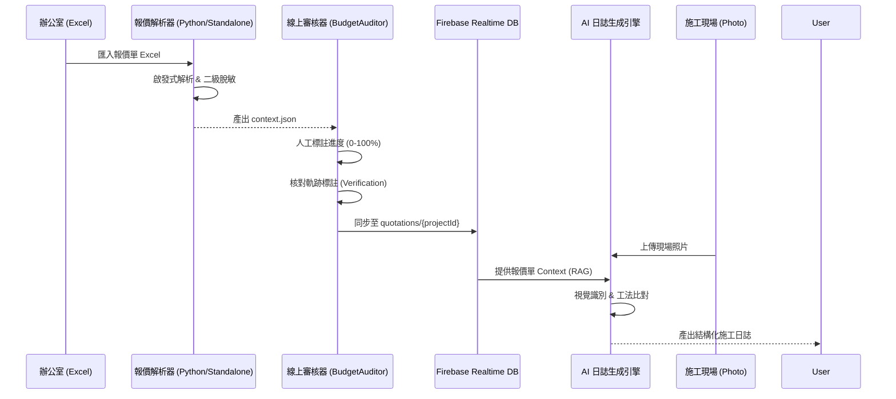

# AI 自動化施工日誌與全域參數通訊整合白皮書 (v3.0 詳盡進化版)

> 本文件為系統「承重牆」等級之開發規範。融合了底層 SPA 安全通訊協議與高階 AI 施工日誌業務，為後續開發提供單一事實來源。

---

## 1. 系統定位與架構全景

### 1.1 全系統交互流程圖 (System Flowchart)



### 1.2 核心層次
- **業務層 (AI Construction Log)**：利用 AI 技術簡化現場施工紀錄流程。透過自動解析報價單、關聯現場照片，並自動生成施工描述。
- **基建層 (Parameter Transmission)**：提供上述 AI 模組運行所需之安全、穩定、一致的全域上下文 (Context) 參數通訊環境。

---

## 2. 🧰 底層基建：全域參數通訊與狀態傳遞 (Infrastructure)

### 2.1 遞迴思考結論與進階建議 (Insights)
- **基礎穩定性 (Stability)**: 捨棄易洩漏 UID 的 URL 參數，建立「中央參數總線 (Central Bus)」。模組 Iframe 在 `DOMContentLoaded` 後，主動向 SPA 要求 `getInitialState`，走 PostMessage 協議。
- **安全性與進化 (Security)**: 引入 **HMAC 簽章傳遞**，並將參數區分為 `Environmental` (例如 ProjectID) 與 `Stateful` (切換狀態)，實現極細粒度的重繪控制。
- **Reactive Parameter Bus**: 改用異步訂閱模式。Iframe 訂閱 `parameterUpdate`，當切換專案時，模組靜默更新引數而無需重整頁面。

### 2.2 全域配置與模式驗證 (Schema & Config)
| 參數名稱 | 傳遞方式 | 類型 | 描述 |
| :--- | :--- | :--- | :--- |
| `p_token` | Header/Message | String | JWT 格式封裝的身份憑證。 |
| `ctx_pid` | PostMessage | String | 當前啟用的 Project ID (加密)。 |
| `app_ver` | Query String | String | 確保版控對齊，防止 Cache 衝突。 |

**參數模式驗證 (Zod-like Schema Validation)**:
所有進入模組的參數必須通過驗證以拒絕受污染數據：
```javascript
const ProjectContextSchema = {
  projectId: "String (Required)",
  uid: "String (Required)",
  permLevel: "Number (0-5)",
  isOffline: "Boolean",
};
```

### 2.3 代碼實作級規範 (Implementation)
建議於 `shared/js/bridge.js` 中實作以下封裝，作為通訊唯一依賴項：
```javascript
// SPA 殼層發送
const AppBridge = {
  send: (action, payload) => {
    const iframe = document.getElementById('module-iframe');
    const data = {
      action, payload,
      timestamp: Date.now(),
      signature: generateHmac(JSON.stringify(payload)) // 安全簽核
    };
    iframe.contentWindow.postMessage(data, window.location.origin);
  }
};

// 子模組接收與驗證
window.addEventListener('message', (event) => {
  if (event.origin !== window.location.origin) return;
  const { action, payload, signature } = event.data;
  
  if (!verifySignature(payload, signature)) {
    console.error('⚠️ 受污染的參數傳遞，拒絕執行！');
    return;
  }
  
  dispatchAction(action, payload);
});
```

### 2.4 系統韌性與錯誤回退 (Resilience & Degradation)
- **降級策略**: 若 PostMessage 總線失效，系統具備自動回退至 `localStorage` 的能力，並顯示「同步異常」燈號。
- **傳輸逾時**: 請求狀態變更超過 5,000ms 未響應，觸發 `Action_Abort` 回滾至上一個穩定狀態。
- **診斷工具**: 實作 `Parameter Inspector`，按下 `Ctrl+Shift+P` 彈出實時參數串流；每筆參數傳遞隱含 `trace_id` 並對接 `clientTrace` API。

---

## 3. 🤖 核心業務：AI 自動化施工日誌三階段 (Business Logic)

> ⚠️ 以下 AI 任務均需透過 `AppBridge` 取回 `ctx_pid` 與 `model_preference` 等必要安全參數才能啟動。

### 3.1 階段一：數據中樞與報價單解析 (Phase 1)
- **數據匯入**: 監聽專案中心產出的 `budget_export.json` (支援 JSON/CSV 相容)。
- **AI 解析邏輯**: 
  - **Step 1 (脫敏)**: 移除價格資訊，僅保留「工項描述與施作範圍」。
  - **Step 2 (映射)**: 產出包含 `tag_id`, `raw_desc`, `category`, `uom` 的標準化 JSON。
    ```json
    { "tag_id": "ITEM_PARQUET_WOOD", "raw_desc": "海島地板", "uom": "坪" }
    ```
  - **Prompt 策略**: 將施工口語轉換為系統標準標籤（Item Tags）。

#### 3.1.1 報價單上下文生成邏輯 (`_getBudgetContext_`)
為了讓 AI 能精確執行 RAG，必須將原始報價單 (Spreadsheet) 轉換為脫敏且結構化的 Context：
1. **讀取原始資料**：從 `專案預算表` 讀取 `工項名稱`、`規格說明`、`單位`。
2. **清洗與去噪**：
   - 移除所有「單價」、「總價」相關欄位。
   - 將重複或類似的工項進行 `unique` 處理。
3. **語義強化 (Semantic Enrichment)**：
   - **關鍵字提取**：針對 `規格說明` 自動提取關鍵動詞（例：平釘、批土、油漆）。
   - **分類標籤**：依據工項名稱自動補齊 `category_tag` (例：木作、油漆)，減少 AI 檢索時的範圍發散。
4. **產出標準實體**：
   ```json
   {
     "project_id": "P_2026_001",
     "items": [
       { 
         "id": "ITEM_001", 
         "zone": "1樓客廳",
         "name": "平釘天花板", 
         "spec": "日本麗仕矽酸鈣板", 
         "qty": "12.5",
         "unit": "坪",
         "tags": ["木作", "矽酸鈣板", "平釘"],
         "category_tag": "木作"
       }
     ]
   }
   ```
5. **注入 Prompt**：將此 JSON 陣列作為 `${budget_context}` 變數注入。

### 3.2 階段二：視覺化關聯與互動視圖 (Phase 2)
- **媒體串接**: 透過 `projectApi.js` 定時拉取備有 `timestamp` 與 `geolocation` 的 Firebase 照片，供時空驗證。
- **標註 UI (Labeling)**: 
  - 支援拖拽標註與批量貼上標籤。
  - **智慧建議**: 利用 CLIP 視覺模型自動識別內容特徵（如木作、油漆），預推標籤。
- **互動檢視器**: 點擊標籤實作關聯過濾，並支援「報價原文 v.s. 現場照片」分屏對照。

### 3.3 階段三：AI 生成與同步閉環 (Phase 3)
- **自動摘要引擎**: 結合「工項細節、標註描述、歷史脈絡」，應用 `Zero/Few-shot` 產出專業工法描述。
- **人機審核**: 提供編輯器供人工修正。修正後的內容執行差異比對，並回饋模型 (Feedback loop) 微調準確度。
- **同步閉環**: 將完成工項自動調用 `projectApi.js` 更新甘特圖，並產出專案週報發送群組。

---

## 4. 🛡️ 系統整合與安全性邊界規範
- **效能邊界**: AI 解析與生成運算應於 Web Worker 執行，避免阻塞 UI 主線程。
- **權限控制**: 僅限「專案負責人」與「設計總監」等級 (依據傳入的 `permLevel`) 具備修改 AI 原始日誌的權限。
- **防禦機制 (Guardrails)**: 針對高危任務（如拆除牆體），AI 必須加註強警語，並強制要求人工輸入確認碼方可入檔。

---

## 5. 🧠 AI 工程學與落地防禦機制 (AI Engineering & Guardrails)

本章節定義如何將 AI 的不可控性轉換為企業級的穩定輸出，建立「AI 防禦中介層 (AI Proxy Layer)」。

### 5.1 知識注入與邊界限縮 (RAG & Prompt Engineering)
AI 雖然強大，但需透過上下文限制來理解「添心設計」的專用術語：
- **動態知識庫注入 (RAG)**：在分析報價單前，系統自動夾帶 `添心工程標準術語表.json` 作為 Context。明確約束 AI 僅能使用清單內的術語分類工項，未知項目一律標記為 `UNKNOWN`。
- **設計師認知風格注入 (Cognitive Profile RAG)**：針對個別負責人，動態注入專屬 `designer_profile.json`。使 AI 產出草稿能直接套用該名設計總監的「工法歸類直覺」與「用詞偏好（例如偏好『藝術塗裝』而非『特殊漆』）」，達成高定製化語感。
- **Few-Shot Prompting (小樣本提示)**：於 Prompt 內置入至少 3 組正確範例（如：`輸入: "客廳天花板平釘" -> 輸出: ITEM_CEILING_FLAT`），收束 AI 的推理發散圈。

### 5.2 強制性結構化輸出 (Structured Output)
絕不允許 AI 回傳自然語言的分析結果。
- **JSON Schema 鎖定**：全面採用 AI API 的 `Structured Outputs` 或 `Function Calling` 功能，強制產出對應 Zod Schema 的 JSON。若結構校驗失敗，系統在底層自動退回重試，阻斷破圖資料進入 UI 狀態庫。

### 5.3 資料脫敏與 Token 極致最佳化 (Data Sanitization & Token Optimization)
- **資安與脫敏**：在上傳至 LLM 之前，利用正則表達式 (Regex) 拔除報價單中的「單價」、「總價」、「客戶姓名」與「案場地址」。
- **降噪與省流**：僅傳送「工種、數量、單位、規格」，除保護商業機密外，亦能大幅度降低 Token 消耗與 AI 產生幻覺 (Hallucination) 的機率。
- **動態知識 RAG 裁減 (Context Pruning)**：不再傳傳遞整份術語表或完整報價單。系統依據前端（如點擊工種標籤），單純萃取並傳送相關術語與對應工項，令 Context 縮減逾 90%。
- **語意快取層 (Semantic Caching)**：建立快取機制（如 Redis），當前工法或圖片特徵與歷史紀錄達 95% 相似且 Tag 一致時，系統調用快取並作微調，完全避免觸發 LLM 重複解析。
- **差異化增量分析 (Delta Analytics)**：專案週報彙總時，透過字串 Hash 差異比對，僅傳送「有進度變更的 Delta 數據」組合予 AI 進行總結。

### 5.4 視覺分析的預處理 (Vision Pre-processing)
針對 GPT-4o / Gemini 1.5 Pro 等視覺模型的成本控管：
- **關鍵幀抽樣與降維**：若單日有大量照片，前端需進行抽樣，並將圖片統一壓縮至 1024x1024 內。可搭配輕量 OpenCV 模組做邊緣檢測，確認圖片具備「主體特徵」後才發送給模型解析。

### 5.5 防幻覺校驗層 (Hallucination Validation)
- **白名單交集比對 (Intersection)**：AI 識別出的工法（例如：防火矽酸鈣板），必須與該專案的**原始報價單 JSON** 取交集。
- **異常阻斷**：若照片解析出報價單未列的項目，系統立刻攔截，並在介面標示 **「⚠️異常：報價單無此項目，請人工覆核」**。

### 5.6 人工介入設計 (Human-in-the-Loop)
確立 AI 為「草稿員」，專案經理為「總編輯」的協作典範。
- **UI 狀態隔離**：所有 AI 生成的日誌初始皆為 `Draft (草稿)` 狀態，並高亮標示 AI 提取的關鍵字。
- **一鍵採納與回饋**：提供一鍵「✅ 採納」或直接修改功能。人工修正的軌跡將作為 `Feedback Data` 存檔，形成未來微調 (Fine-tuning) 模型的養分。
- **動態退回與重製 (Manual Regeneration)**：提供「🔄 附帶指令重製」按鈕。若草稿品質不佳，PM 可直接輸入自然語言指令（如：「此處不要寫得太細微，以進度為主」），退回給 AI 夾帶該修正提示進行二次產出。

### 5.7 遞迴自癒演算機制 (Recursive Self-Healing Algorithm)
建立 **Actor-Critic (生成與批判)** 的閉環遞迴機制：
- **思維鏈與自省 (CoT & Reflection)**：強制 AI 在產出時率先提供 `_reasoning`（反思過程），若證據不足推論將嚴格標記為 `UNKNOWN`。
- **多輪次檢驗與重試 (Multi-turn Validation & Retry)**：後端不只依賴 Zod 進行被動 Schema 檢查，而是主動針對錯誤（如幻覺生成）即刻組合 Retry Prompt 並丟回 AI，最多做 3 次重試，絕不讓錯誤流出。
- **大小腦雙模型審查 (Dual-Agent Review)**：由輕盈便宜模型負責打底草稿，再視風險交由強壯大模型作最終 Critic 放行檢驗。

1. 知識注入與邊界限縮 (RAG & Prompt Engineering)
AI 雖然聰明，但不懂「添心設計」的專用術語與習慣。我們不能讓 AI 自由發揮，必須牽著它的手走：

動態知識庫注入 (RAG)：在把報價單丟給 AI 之前，系統會先偷偷塞入一份 添心工程標準術語表.json 作為 Context。告訴 AI：「請只使用這份清單內的標準術語來幫我分類工項，若遇到不認識的，請標記為 UNKNOWN，不准自己發明詞彙」。
Few-Shot Prompting (小樣本提示)：在 Prompt 中直接給 AI 3 個正確的範例（例如：輸入: "客廳天花板平釘" -> 輸出: ITEM_CEILING_FLAT），限制它的思考框架。
2. 強制性結構化輸出 (Structured Output Enforcement)
如果 AI 回傳一段自然語言「我認為這應該是木作工程...」，這對我們的系統來說等同於當機。

JSON Schema 鎖定：我們必定會使用 AI API 的 Function Calling 或 Structured Outputs 模式，強制 AI 只能吐出符合我們後端 Zod Schema 驗證的嚴格 JSON 格式。只要 JSON 結構破圖，系統直接在底層退回重試，絕不讓錯誤格式進入 UI。
3. 資料脱敏與防噪 (Data Sanitization)
絕對不能把整份報價單無腦丟給 AI：

把錢藏起來：傳給 AI 之前，我們在程式端就會先用正則表達式或過濾器，把「單價」、「總價」、「客戶姓名」、「案場詳細地址」全部拔除。
降低 Token 成本與噪音：只傳送「工種」、「數量」、「單位」、「規格說明」。這不僅保護商業機密，還能大幅降低呼叫 AI 的 Token 費用，同時減少 AI 被雜訊干擾而產生幻覺 (Hallucination)。
4. 視覺分析的預處理 (Vision Pre-processing)
當我們要把現場照片丟給 AI (如 GPT-4o 或 Gemini 1.5 Pro) 去分析工法時：

圖片抽樣與降維：一天如果拍了 50 張圖，全丟給 AI 會破產。系統應該在前端先篩選出「具備特徵的關鍵幀」，並將圖片壓縮至 1024x1024 以內，甚至先經過輕量級的 OpenCV 邊緣檢測，確認「有主體」才送給昂貴的 LLM 解析。
5. 防幻覺校驗層 (Hallucination Guardrails)
AI 非常會「一本正經地胡說八道」。

白名單比對機制：AI 解讀出來的結果（例如：AI 說圖中有使用「防火矽酸鈣板」），系統必須強制拿這個結果去與該專案的「原始報價單 JSON」做交集比對 (Intersection)。
如果報價單上根本沒有「矽酸鈣板」這個工項，系統會立刻攔截，並在介面上將這段 AI 生成的描述標記為「⚠️異常：報價單無此項目，請人工覆核」。
6. 人工介入設計 (Human-in-the-Loop)
最優雅的 AI 應用，是讓 AI 當「草稿員」，人類當「總編輯」。

UI 呈現方式：AI 自動生成的施工日誌，預設永遠是 Draft (草稿) 狀態。UI 上會高亮標示 AI 提取的關鍵字（如：泥作、抹縫、尺寸 30x60）。
一鍵採納與微調：專案經理只需看一眼，點擊「✅ 採納」或直接在框內修改。經理修改的內容，未來還可以做為 Feedback Data 存起來，讓下一次 AI 知道「老闆不喜歡這個詞，他習慣用另一個詞」。

7. 遞迴自癒演算機制 (Recursive Self-Healing Algorithm)
要讓 AI 不犯錯，單靠一次 Prompt 不夠，必須建立 Actor-Critic (生成與批判) 的閉環遞迴機制：

思維鏈與自省欄位 (CoT & Reflection)：強制 AI 在輸出 JSON 時，第一個欄位必須是 `_reasoning`（反思過程）。在分類工項前，AI 必須解釋為何符合白名單術語，若證據不足即標記 UNKNOWN。
多輪次檢驗與重試遞迴 (Validation & Retry)：如果發生幻覺（例如產出報價單未載之項目），後端不報錯，而是自動組合 Error Prompt（如「項目 X 不在清單內，請修正」）丟回 AI 重做，最多遞迴 3 次。
大小腦雙模型審查 (Dual-Agent Review)：由極速模型（如 Gemini 2.5 Flash）產出草稿，針對高風險項目交由強邏輯模型（如 Gemini 2.5 Pro）進行 Critic 抽驗核對，確保極高準確率與穩定度。

---

## 6. 📝 AI 指令工程範本 (Prompt Engineering Spec)

為了確保 AI 生成的日誌準確且符合「添心設計」語法，開發時應套用以下 Prompt 模型。

### 6.1 核心生成 Prompt (Generator Prompt)
**Role**: 你是添心設計的工務總編輯，負責將現場照片與報價單項目對齊，產出專業的施工日誌。

**Instruction**:
1. **RAG 限制**：僅能使用傳入的 `budget_context` (報價工項) 與 `terminology_list` (標準術語) 進行描述。
2. **禁止幻覺**：若照片內容在報價單查無對應工項，請在 `is_anomaly` 標記為 true。
3. **語感要求**：使用專業、簡潔的工法描述（例如：使用「平釘天花板斜角處理」而非「天花板邊緣斜斜的」）。

**Response Schema (JSON)**:
```json
{
  "_reasoning": "解釋為何將此照片歸類為此工項的思考過程",
  "category": "工種分類 (如: 木作, 泥作)",
  "item_id": "對應報價單中的 ID",
  "content": "正式的施工日誌描述內容",
  "is_anomaly": false,
  "confidence_score": 0.95
}
```

### 6.2 批判與修正 Prompt (Critic/Revision Prompt)
**Action**: 當 PM 點擊「重製」並給予指令時觸發。
**Context**: 包含前次的 `draft_content` 與 PM 的 `user_feedback`。
**Constraint**: 針對反饋內容進行精確修正，並保持其餘正確部分的穩定性。

---

## 7. 🚀 2026 最新 AI 模型選型與零成本運行方案 (Zero-Cost API Tier)
完全捨棄 1.5 版本，透由 Google AI Studio 對接最新的 2.5 世代模型。開發者無須綁定信用卡便能以「永久免費額度」支撐中小企業之日常需求：
1. **主力發動機 (Generator)：`gemini-2.5-flash`**
   - **免付費極限**：每分鐘 15 次 / 每日 1,000 次，支援 100 萬 Token Context 深度。
   - **系統應用**：以零成本負擔每天現場所有的照片辨識、RAG 術語匹配過濾以及日誌草稿快速產出。
2. **高階防禦盾 (Critic)：`gemini-2.5-pro`**
   - **免付費極限**：每分鐘 5 次 / 每日 100 次。
   - **系統應用**：為了節省珍貴的高階 Request 額度，系統僅在「模型幻覺過於嚴重 (退回超過2次)」或「人工點擊退回附帶複雜判斷指令」時，才喚醒此最強推理核心進行終極放行或除錯。

---

## 8. 🛠️ 自動化報價單預處理器整合計畫 (Excel-to-JSON Pipeline)

### 8.1 背景與目標
針對大型報價單 (如 5.4MB 的陳又嘉報價單)，Gemini 網頁版解析存在「截斷」與「抽樣」風險。為了落實 11_1 SPEC 要求的精確 RAG，我們需要一個穩定的程式化預處理管線。

### 8.2 核心方案
建立一個 Python 腳本 BudgetPreprocessor.py，作為開發者/後端的預處理工具。

### 8.3 核心解析演算法 (Heuristic Parser Engine)
為了適應非標準化 Excel 並徹底排除合約雜訊，預處理器須實作以下「啟發式」解析邏輯：

1. **啟發式動態錨點 (Dynamic Anchor Selection)**:
   - 遍歷所有 Sheet，自動在 Top 30 行內搜尋關鍵字 `品項`、`項目` 或 `內容`。
   - 以該單元格座標作為「數據矩陣原點」，自動定位 A=名稱, B=單位, E=規格備註。

2. **空間區域識別 (Zone & Location Tagging)**:
   - **判定規則**: 當 `品項名稱` 有值、`單位` 為空、且名稱包含特定關鍵字（如: 樓、廳、區、增減）時，標記為「區域標頭」。
   - **傳遞邏輯**: 該區域標頭將被儲存於 `currentZone` 狀態，並自動賦值給後續所有工項，直到遇到下一個標頭。

3. **雙層過濾清洗 (Deep Cleaning)**:
   - **分頁層**: 強制排除 `['參照', '傢俱', '窗簾', '壁紙', '工作表1', '條款']` 等非施工分頁。
   - **資料層**: 
     - 排除純數字序號（如序號 1, 2, 3）。
     - 排除合約元數據（包含「業主、定金、發票及免責聲明」）。
     - 排除高度敏感之預算金額與單價。

4. **語義強化分類**:
   - 根據品項名稱與規格全文，比對 20+ 項工程關鍵字（如「美耐板、矽酸鈣、插座、平釘、間照」）自動打上 `category_tag`。

### 8.4 標準輸出與環境解耦 (Standalone Architecture)
- **Standalone Web 版**: 採純 HTML/JS 靜態實作，利用 `SheetJS` 技術於瀏覽器本地解析 `ArrayBuffer`。
- **安全性**: 所有解析流程於客戶端本地完成，數據不經由網路上傳，確保最高資安權限。

#### 8.4.1 全案例 1:1 稽核系統 (Row-by-Row Audit View)
- **稽核原理**: UI 採雙側對照視圖。左側顯示 Excel 原文，右側顯示解析後的結構化資料。
- **全量讀取**: 即使是判定為「雜訊」或「排除」的行，亦會顯示於左側，並標記為 `row-skipped` 以供覆核。

#### 8.4.2 智慧行強制補全 (Smart Row Extraction)
- **➕ 補全邏輯**: 針對漏抓的追加項或增減項，點擊「➕」將啟動「鄰近索引探索」：
  - 自動從該行 Excel 原文中識別第一個非空欄位為 `name`。
  - 根據相對座標自動提取 `qty` 與 `unit`。
- **id 命名規則**: 強制補全項之 id 統一標記為 `MANUAL_${rowIndex}`，以供後續追蹤。

#### 8.4.3 無損狀態切換與還原 (Lossless Revert & Restore)
- **資料持久化**: 點擊 `🗑️` 刪除工項時，系統僅切換該行的 `type` 為 `raw` (隱藏狀態)，但保留其已解析的 `data` 物件於暫存區。
- **一鍵恢復**: 當使用者再次點擊該行的 `➕` 時，系統偵測到已有 `data`，則直接恢復之前的所有欄位，實現「無失誤」校對。

### 8.5 驗證計畫
#### 8.5.1 自動化測試
建立 test_conversion.py：
- 驗證 JSON 項目數量是否等於 Excel 有效行數。
- 驗證敏感欄位（單價/總價）是否為空。
- 驗證 project_id 與 items 結構。

#### 8.5.2 手動驗證
- 將產生之 JSON 貼入 Gemini，觀察 AI 生成施工日誌的準確度是否提升。
- 檢查 JSON 內容是否包含所有分頁的數據。

---

## 9. 🌐 線上審核與進度同步系統 (Online Audit & Sync)

本章節定義如何將解析後的 JSON 成果發布至網路環境，並實現「人機協同進度填寫」與「多版本增減項對照」。

### 9.1 案號聯動機制 (Project ID Linking)
- **參數名稱**: `ctx_project_no` (案號)。
- **聯動邏輯**: 使用者填入案號後，系統應主動透過 `AppBridge` 或 API 查詢該案場之「開工日期」、「業主簡稱」等基本資訊，並將其注入 JSON 的 `total_summary`。
- **一致性要求**: 案號必須作為所有導出檔案（JSON/HTML）的唯一 Root Key。

### 9.2 深度脫敏發布協議 (Public-Safe Protocol)
- **發布限制**: 欲上傳至網路供外部審閱（如業主端）之資料，必須強制通過「二級脫敏」。
- **脫敏內容**: 
    - 移除 `budget_cost`、`unit_price` 等敏感財物欄位。
    - 移除原本 `raw_line` 中的末尾金額項。
- **目標**: 確保在公網環境下僅流轉「施工技術與進度數據」。

### 9.3 線上交互審核器 (Interactive Auditor)
- **JSON 實體化**: 審核器直接操作由預處理器產出的 JSON 實體。
- **進度回填 (Progress Feedback)**:
    - 每個工項具備 `completion_percent` (0-100%)。
    - **狀態標籤 (Status Labels)**: 
        - 0%: `PENDING` (待命)
        - 1-99%: `IN_PROGRESS` (施工中)
        - 100%: `COMPLETED` (已完工)
- **交互記錄**: 所有的修改必須即時更新至記憶體中的 JSON，確保「下載即最新」。

### 9.4 支援「再解析」與增減項對照 (Re-parsing & Diff)
- **解析歷史鏈**: JSON 應紀錄 `original_hash` (原始報價單指紋)。
- **增減項處理**: 
    - 當上傳新版報價單時，系統應比對新舊 JSON 的 `item_id` 及其屬性。
    - **UI 標注 (Color Coding)**:
        - **[NEW]**: 現有 JSON 不存在之項 (綠色標記)。
        - **[VOID]**: 舊版存在但在新版消失之項 (灰色/刪改線標記)。
        - **[DIFF]**: 數量或規格有變動之項 (黃色標記)。
- **參數對齊**: 兩端（Standalone 解析端與 Online 審核端）必須共用同一套 `CategoryRules` 與 `SchemaSchema`，確保解析成果能無縫導入審核器。

---

### 9.5 標準解析 JSON 格式 (JSON Schema Definition)

所有解析成果與審核器通訊必須遵循以下嚴格格式。

#### 9.5.1 根物件 (Root Object)
```json
{
  "ctx_project_no": "A20240325", 
  "total_summary": {
    "project_name": "案場名稱",
    "client_name": "業主簡稱",
    "total_items": 124,
    "source_sheets": ["室內裝修"],
    "export_time": "2024-03-25 23:15:00",
    "overall_completion": 45.5,
    "original_hash": "sha256"
  },
  "items": []
}
```

#### 9.5.2 工項實體 (Item Entity)
每個 `items` 陣列中的物件應包含：
| 欄項 | 類型 | 描述 | 脫敏要求 |
| :--- | :--- | :--- | :--- |
| `id` | String | 唯一索引 (ITEM_001) | 無 |
| `zone` | String | 物理區域 (玄關) | 無 |
| `category_tag` | String | 工程分類 (系統櫃) | 無 |
| `name` | String | 工項名稱 | 無 |
| `spec` | String | 詳細規格描述 | 無 |
| `qty`, `unit` | Num/Str | 數量與單位 | 無 |
| `raw_line` | String | Excel 原文 | **強制切除價格** |
| `status` | String | `PENDING`, `COMPLETED` | 無 |
| `completion_percent`| Number | 0-100 進度 | 無 |
| `verification` | Object | 核對軌跡物件 (由使用者 Toggle 標註) | 無 |

##### 9.5.3 核對軌跡物件細節 (Verification Object)
當使用者在 UI 點擊「核對」按鈕時，系統執行 Toggle 邏輯：
- **`is_ok`** (Boolean): 原子化狀態位 (true/false)。
- **`verified_by`** (String): 紀錄執行核對的使用者姓名或 UID。
- **`verified_at`** (String): 紀錄核對時間點 (YYYY-MM-DD HH:mm)。

> [!TIP]
> **取消標註機制**: 若使用者再次點擊「已核對」項目，`is_ok` 將轉為 `false`，且相關 `verified_by/at` 欄位應清空，實現無痕取消與責任溯源。

---

## 10. ☁️ 雲端同步與案場數據管理 (Cloud Sync & Project Data)

本章節定義如何將解析後的 JSON 報價單與雲端資料庫 (Firebase) 及試算表 (GAS) 進行無縫對接。

### 10.1 Firebase 存儲架構 (Realtime DB Schema)
報價單數據應存放在獨立的 `quotations` 根索引下，以案號作為 Key：
- **路徑**: `quotations/{ctx_project_no}/`
- **內容**:
    - `context`: 存放完整的解析 JSON (含 `items`, `total_summary`)。
    - `last_updated`: 最後同步時間。
    - `sync_by`: 執行同步的使用者 UID。

### 10.2 Firebase Storage (文件存檔)
若需保存原始 Excel 或 PDF 備份，應存放於：
- **路徑**: `projects/{ctx_project_no}/budget_files/`

### 10.3 GAS 與 Google Sheets 連動 (Backend Sync)
當審核器點擊「同步至雲端」時，除了寫入 Firebase，亦可選擇觸發 GAS API：
- **Action**: `syncBudgetContext`
- **目的**: 
    1. 將工項進度寫入該案場的 **「施工總表」**。
    2. 自動建立 Google Drive 上的**專案目錄結構**。

---

> [!IMPORTANT]
> **雲端同步安全性**: 傳送至 Firebase 的資料必須確保已通過「二級脫敏 (移除價格)」，除非該帳號具備 `Admin` 權限。

> [!TIP]
> **無伺服器直連**: `BudgetAuditor`應支援直接使用 Firebase JavaScript SDK 進行寫入，無需經過中間後端伺服器。

---

> [!IMPORTANT]
> 系統開發必須確保「解析」與「展示」兩端的資料結構完全對稱。任何在審核器中標註的進度資料，都應能寫回 JSON 並被 AI 讀取為有效的施工上下文。

---

> [!IMPORTANT]
> **嚴格禁止欄位**: 嚴禁在 JSON 中出現 `price`, `cost`, `total_amount` 與任何足以推算單價之數值欄位。

> [!IMPORTANT]
> 此工具為「離線/半自動」工具，使用者只需執行一次腳本，即可獲得完美的 Context JSON 供 AI 使用。