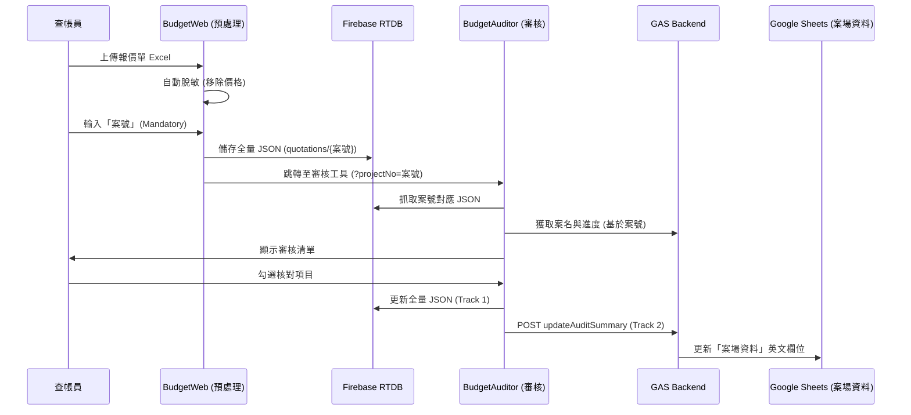

# 12. 報價單審核系統與主控台整合架構規格書 (Dual-Track Storage SPEC)

## 1. 系統定位與目標
本規格書定義了前端 **`BudgetAuditor` (報價單進度審核器)** 與後端 **`project-console` (專案主控台, Google Apps Script 生態)** 之間的資料串接與持久化儲存架構。

為解決複雜 JSON 解析對後端效能的衝擊，並發揮 Google Sheets 易於全局檢視的優勢，本系統將採行**「雙軌混合儲存制 (Dual-Track Storage Architecture)」**。

---

## 2. 核心架構：雙軌混合儲存制
當查帳員或工班在 `BudgetAuditor` 前端完成一鍵「標註完成」並點擊「同步至雲端」時，系統將平行發起以下兩項寫入任務：

### 2.1 軌道一：完整資料庫 (Firebase / Storage) - [細節防護層]
*   **儲存對象**：未經破壞、保留巢狀結構 (`total_summary` 與 `items` 清單) 的脫敏 `context.json` 檔案。
*   **傳輸方式**：透過 `BudgetAuditor` 實作的 `syncToFirebase()`，直接調用 Firebase REST API 或 Firebase Storage SDK 上傳檔案。
*   **儲存路徑設計**：
    `[Bucket]/budget_audits/{ctx_project_no}/latest.json`
*   **優勢**：當查帳員下一次開啟 Auditor 時，這份 JSON 能以毫秒級的速度原封不動地載入，完全不依賴 GAS 後端的解析。

### 2.2 軌道二：戰情摘要 (Google Sheets) - [全局管理層]
*   **儲存對象**：由原本的獨立索引表收斂至 Check-in 系統之 **`案場資料` (Sites Data)** 工作表。
*   **實作細節**：
    - 系統會自動檢查並在 `案場資料` 中追加以下欄位 (若不存在)：
        - `audit_items_total`: 總報價工項數。
        - `audit_items_verified`: 已核對之工項數。
        - `audit_percent`: 整體完成度百分比。
        - `audit_last_synced_by`: 最後執行同步的人員。
        - `audit_last_updated`: 最後更新時間戳。
*   **傳輸方式**：前端將資料透過 HTTPS `POST` 發送給 `project-console` 所部署的 `WebApp.js`。
*   **資料結構 (POST Payload)**：
    ```json
    {
      "action": "updateAuditSummary",
      "ctx_project_no": "A20260320",
      "project_name": "王公館裝修案",
      "total_items": 104,
      "verified_items": 77,
      "overall_completion": 74, // %
      "last_synced_by": "查帳員陳某",
      "last_updated": "2026/03/26 09:15:00"
    }
    ```
### 2.3 工具聯動路徑 (Connection Routing)
*   **路徑 A (預處理與儲存)**：`BudgetWeb` (Excel 解析) -> **Firebase** (`quotations/{projectId}`)。
*   **路徑 B (載入與審核)**：`BudgetAuditor` (載入 Firebase) -> **GAS Backend** -> **案場資料** (戰情摘要更新)。
*   **資料一致性**：兩者共享相同的 JSON 結構，主要透過 `projectId` 作為金鑰聯結。
*   **回報系統連動**：`reportV2.html` 使用相同的 Firebase 配置進行照片與日誌管理，確保數據生態系的一致。

### 2.4 資料流轉流程 (Data Flow Diagram)



---

## 3. 架構優勢與連動場景 (Use Cases)

### 3.1 跨系統極速查詢 (AI / LINE Chatbot)
在 LINE 群組或 AI Agent 需要回答「目前案場請款進度」時，後端無須發送 HTTP 請求去 Firebase 下載沉重的 JSON 並解析。
`project-console` 僅需讀取 `ProjectAudits_Index` 的記憶體快取 (Cache)，耗時 < 0.1 秒即可組成字串回應：「目前進度已達 74%，上次審核時間為今日上午。」

### 3.2 觸發與自動化 (Webhooks / Event-Driven)
當 `project-console` 接收到 `updateAuditSummary` 請求，並偵測到 `overall_completion === 100` 時，可作為流程自動化的扳機 (Trigger)。
例如：
- 自動觸發 LINE 訊息推播給業主中心，發送「完工點交邀請」。
- 自動聯動財務模組，生成「尾款請款單」待辦事項。
- 聯勤日誌系統 (`ProjectLog`) 自動寫入一筆系統發布的「全區完工審核通過」紀錄。

---

## 4. 開發實作查核清單 (Implementation Checklist)
- [ ] **Phase 1: 建立後端端點**
  - [ ] 於 `backend/project-console/WebApp.js` 中新增 `action: updateAuditSummary` 的路由支持。
  - [ ] 於 `ProjectLogic.js` 撰寫 `updateAuditSummary_` 商業邏輯，包含寫入 Spreadsheet 與重置 Cache (#1)。
- [ ] **Phase 2: 前端同步器實作**
  - [ ] 在 `BudgetAuditor_Standalone.html` 擴充 `syncToFirebase()` 行為。
  - [ ] 第一步向 Firebase Storage 推送 `.json` 檔案。
  - [ ] 第二步平行發送 fetch POST 至 `project-console` API (須實作網路失敗防抖/重試機制以確保摘要不遺漏)。
- [ ] **Phase 3: 驗證機制 (Security)**
  - [ ] 對接已有的 Token / HMAC 防護協議，確保從外部拋送摘要進來的要求是合法的授權行為。
