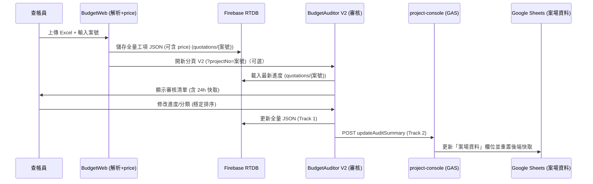

# 12. 報價單審核系統與主控台整合架構規格書 (Dual-Track Storage SPEC)

> **實作檔案（權威）**  
> - 驗收審核（主線）：`tools/BudgetAuditor_Standalone_V2.html`（Hub 路由 `#/budget-audit` 亦指向此檔）  
> - 報價解析／預處理：`tools/BudgetWeb_Standalone.html`  
> - 舊版單檔名 `BudgetAuditor_Standalone.html` 若仍存在於倉庫，**行為以本 SPEC ＋ 現行程式為準**；新功能以 V2 為準。

## 1. 系統定位與目標
本規格書定義了前端 **`BudgetAuditor` (報價單進度審核器)** 與後端 **`project-console` (專案主控台, Google Apps Script 生態)** 之間的資料串接與持久化儲存架構。

為解決複雜 JSON 解析對後端效能的衝擊，並發揮 Google Sheets 易於全局檢視的優勢，本系統將採行**「雙軌混合儲存制 (Dual-Track Storage Architecture)」**。

---

## 2. 核心架構：雙軌混合儲存制
當查帳員或工班在 `BudgetAuditor` 點擊「同步至雲端」時，系統將平行發起以下寫入任務：

### 2.1 軌道一：完整資料庫 (Firebase RTDB) - [細節防護層]
*   **儲存對象**：保留巢狀結構 (`total_summary` 與 `items`) 的 **完整工項清單 JSON**；可含**可選**欄位 `price`（單筆小計／總價欄之字串，由 `BudgetWeb` 從 Excel 帶出）。**對外系統**（如客戶端）讀取同一筆 Firebase 時仍須依產品規則**脫敏、不顯示金額**；內部驗收表則依 **權限等級** 控制畫面與匯出（見 **§6.5**）。
*   **傳輸方式**：透過 Firebase SDK `set()` 至對應案號路徑。
*   **儲存路徑設計**：`{FirebaseURL}/quotations/{projectNo}`
*   **底層資料結構 (JSON Example)**：
    ```json
    {
      "total_summary": {
        "siteName": "王公館裝修案",
        "projectNo": "770",
        "overall_completion": 74,
        "last_updated": "2026/03/26 17:40:00"
      },
      "items": [
        {
          "id": "ITEM_001",
          "name": "室內保護工程-地坪",
          "category_tag": "施工保護",
          "zone": "保護工程",
          "spec": "PP板+全室木板",
          "qty": "19",
          "unit": "坪",
          "price": "198000",
          "completion_percent": 100,
          "is_ui_done": true,
          "raw_line": "2 | 室內保護工程-地坪 | 坪 | 19 | 10450 | ...",
          "verification": {
            "is_ok": true,
            "verified_by": "測試新員工",
            "verified_at": "2026/3/26 下午4:10:31",
            "verified_uid": "U12345"
          },
          "status_logs": [
            { "ts": 1774512487892, "at": "...", "user": "...", "action": "進度: 0% → 50%" }
          ]
        }
      ]
    }
    ```
*   **欄位說明**：
    - `price`（可選）: 該行「總價／小計」欄之字串；可為空。舊資料或手動工項可無此鍵，**驗收表與匯出皆須向下相容**（無則不顯示單筆金額）。
    - `status_logs`（V2 慣用）: 紀錄該工項之**進度變更、審核完成、項目取消/恢復、單項分區移動**等；每筆含 `ts` / `at` / `user` / `action` 字串。舊資料若僅含 `audit_logs` 鍵，讀取端可視為等價用途之歷史欄位（**新寫入以 `status_logs` 為準**）。
    - `raw_line`: 保留解析時的原始 Excel 文字行，用於除錯與對照價格。
    - `verification`: 正式的完工簽核快取，包含人員名稱與 UID。
*   **優勢**：Auditor 開啟時以毫秒級速度透過 `projectNo` 載入，完全跳過後端解析。

### 2.2 軌道二：戰情摘要 (Google Sheets) - [全局管理層]
*   **儲存對象**：Check-in 系統之 **`案場資料` (Sites Data)** 工作表。 [已於 2026-03-26 實作後端串接]
*   **實作細節**：
    - 系統會比對 `案號` (ProjectNo) 並更新於 `案場資料` 工作表：
        - `audit_items_total`: 總報價工項數。
        - `audit_items_verified`: 已完成 (100%) 之工項數。
        - `audit_percent`: 整體完成度百分比。
        - `audit_last_synced_by`: 最後執行同步的人員名稱。
        - `audit_last_updated`: 最後同步時間戳 (YYYY/MM/DD HH:mm)。
*   **傳輸方式**：前端將資料透過 HTTPS `POST` 發送給 `project-console` 所部署的 `WebApp.js`。
*   **資料結構 (POST Payload)**： [一致性對接完成]
    ```json
    {
      "action": "updateAuditSummary",
      "案號": "770",
      "siteName": "王公館裝修案",
      "audit_items_total": 104,
      "audit_items_verified": 77,
      "audit_percent": 74,
      "userId": "U123456789...",
      "userName": "查帳員陳某"
    }
    ```
### 2.3 工具聯動路徑 (Connection Routing)
*   **路徑 A (預處理與儲存)**：`BudgetWeb_Standalone` (Excel 解析) -> **Firebase** (`quotations/{projectId}`)。下載的 Context JSON 與上傳至 Firebase 之工項皆含可選欄位 **`price`**；若再次同步雲端且同案號已有舊筆，解析結果 **無** `price` 時**沿用雲端舊值**（避免覆寫進度時一併洗掉金額）。
*   **路徑 A 末段（開驗收表）**：同步至 Firebase 成功且使用者同意開啟驗收表時，預設以 **`BudgetAuditor_Standalone_V2.html?projectNo=...`** 開新分頁（非舊版檔名）。
*   **路徑 B (載入與審核)**：`BudgetAuditor_Standalone_V2` (載入 Firebase) -> **GAS Backend** -> **案場資料** (戰情摘要更新)。
*   **資料一致性**：兩者共享相同的 JSON 結構，主要透過 `projectId` 作為金鑰聯結。
*   **回報系統連動**：`reportV2.html` 使用相同的 Firebase 配置進行照片與日誌管理，確保數據生態系的一致。
*   **Firebase／GAS 位址取得**：V2 驗收表**不**內建「雲端設定」表單；`databaseURL`／`gasURL`／（選用）Auth 參數以程式內 **預設** 併合 **`localStorage` 鍵 `fb_audit_config`**，與 `BudgetWeb_Standalone` 相同。

### 2.4 資料流轉流程 (Data Flow Diagram)



---

## 3. 架構優勢與連動場景 (Use Cases)

### 3.1 跨系統極速查詢 (AI / LINE Chatbot)
在 LINE 群組或 AI Agent 需要回答「目前案場請款進度」時，後端無須發送 HTTP 請求去 Firebase 下載沉重的 JSON 並解析。
`project-console` 僅需讀取 `ProjectAudits_Index` 的記憶體快取 (Cache)，耗時 < 0.1 秒即可組成字串回應：「目前進度已達 74%，上次審核時間為今日上午。」

### 3.2 觸發與自動化 (Webhooks / Event-Driven)
當 `project-console` 接收到 `updateAuditSummary` 請求，並偵測到 `overall_completion === 100` 時，可作為流程自動化的扳機 (Trigger)。
例如：
- 自動觸發 LINE 訊息推播給業主中心，發送「完工點交邀請」。
- 自動聯動財務模組，生成「尾款請款單」待辦事項。
- 聯勤日誌系統 (`ProjectLog`) 自動寫入一筆系統發布的「全區完工審核通過」紀錄。

---

## 4. 工程分類判定規則與自定義提案

### 4.1 現行判定邏輯 (Hard-coded Logic)
目前系統在 `BudgetWeb` 解析時，依序透過以下關鍵字進行自動歸類 (權重由上至下)：
1. **施工保護**: 保護、地坪保護、防塵、包覆
2. **拆除工程**: 拆除、打除、清運、廢棄物、搬運
3. **泥作工程**: 磁磚、大理石、砌牆、防水、泥作、填縫、打底、貼磚、磨石子、洗石子、抿石子、水泥砂漿
4. **油漆工程**: 批土、噴漆、乳膠漆、水泥漆、油漆、刷漆、水性漆、色漆、藝術漆、AB膠、木作修補、填縫 [v2.1 提升優先級]
5. **水電工程**: 插座、配線、開關、燈具、迴路、弱電、網路、tv、開關位移、強電、管路、接線、明管
6. **木作工程**: 天花板、隔間、門、層板、平釘、間照、矽酸鈣、隔間牆、電視牆、半腰牆、壁板、背板
7. **系統櫃體**: 櫃、櫥、衣、鞋、高櫃、矮櫃、抽屜
8. **地板工程**: 超耐磨、地板、卡扣、拼花、spc、塑膠地磚
9. **清潔工程**: 粗清、細清、吸塵

### 4.2 分區智慧整合 (Zone Pre-processing)
解析器在處理 Excel 時，具備以下分區智慧整合能力：
*   **連續重複合併**: 若 Excel 出現連續多列相同的分區名稱（常見於跨頁標題重複時），系統自動將其視為同一分區，避免 UI 出現冗餘區塊。
*   **無效分區過濾**: 若分區下不含任何有效工項（已被過濾掉價格列後為空），該分區自動從選單與列表中移除。
*   **跨工具傳遞**: `zone` 欄位會被編入 JSON 下載至 Firebase，供 `BudgetAuditor` 渲染分組使用。

### 4.3 建議預留分類 (未來擴充)
為更精確劃分報價單，建議未來可從「木作」或「其他」中抽離出：
*   **金屬玻璃**: 隔屏、玻璃、鋁窗、鐵件、不鏽鋼、黑鏡。
*   **石材工程**: 大理石、花崗岩、人造石 (非廚具類別時)。
*   **空調工程**: 冷氣、VRV、排水管、銅管。

---

## 5. 開發實作查核清單 (Implementation Checklist)
### 5.1 已完成項目 (穩定性與 UX)
- [x] **24 小時本地快取**: `BudgetAuditor` 自動暫存進度，重整不遺失。
- [x] **UX 穩定排序 (v2.1)**: 勾選完成時不立即跳動，同步雲端後才下移歸類。
- [x] **行動端浮動工具列**: 吸底精簡設計，捲動至頂端自動隱藏。
- [x] **全分類選單補全**: 支援手動將工項調整至十大分類中的任一項。
- [x] **單項移入群組（非整區更名）**: 僅變更該筆工項之 `zone`；支援視窗（既有群組下拉 + 自訂名稱，名稱優先）、進行中工項以拖曳手把放到群組標題列（見 **§6.7**）。
- [x] **工項列版面（資訊列／進度列）**: 狀態＋名稱＋數量單位置左；分類與移入群組靠右；施工進度與滑桿、百分比同一列（見 **§6.8**）。

### 5.2 待處理項目 (主控台整合)
- [ ] **Phase 1: 建立後端端點**
  - [ ] 於 `backend/project-console/WebApp.js` 中新增 `action: updateAuditSummary` 的路由支持。
  - [ ] 於 `ProjectLogic.js` 撰寫 `updateAuditSummary_` 商業邏輯。
- [ ] **Phase 2: 全局規則雲端化**
  - [ ] 將 `CATEGORY_RULES` 從 HTML 抽離，改從 Firebase `config` 讀取。
## 6. 驗收表核心功能詳註 (BudgetAuditor UX v2.2+)

### 6.1 視覺穩定排序 (Stable Grouping)
*   **標註即時反饋**: 當工項切換為 100% (完成) 時，工項圖案變更為核取狀態但**留在原位**，防止行動端操作時列表突然跳動造成誤導。
*   **同步結算位移**: 僅在點擊「☁️ 同步至雲端」成功後，或是重新整理頁面時，已完成工項才會一次性移入底部的 **「✅ 已完成項目」** 摺疊區。

### 6.2 24 小時本地快取 (Local Resilience)
*   **自動暫存**: 每次修改進度或分類，系統自動寫入 `localStorage`。
*   **斷網保護**: 若在無網路環境或非預期關閉瀏覽器，再次開啟同案號時將立即恢復未上傳之進度。
*   **自動清理**: 快取有效期為 24 小時，逾期或同步成功後自動重置。

### 6.3 智慧浮動工具列 (Smart Toolbar)
*   **精簡導引**: 僅保留最核心的「同步」按鈕，橢圓小尺寸設計，避免遮擋中央內容。
*   **動態隱藏**: 當滑動距離 < 120px (位於頁面最上方) 時自動淡出關閉，避免與標題欄按鈕衝突；滑離頂端後才顯示。

### 6.4 工項屬性動態管理 (Property Editor)
*   **即時分類**: 支援在驗收清單中直接修改工項 **`category_tag`**（工程分類），修改後立即同步至 Firebase，實現跨系統（如報表端）的即時分類更新。
*   **分區 `zone`（空間／群組標籤）**：與分類不同；單筆工項如何改群組（不影響同區其他列）見 **§6.7**，整區更名與整區合併見標題列動作與 **§6.6**。

### 6.5 權限與金額顯示（V2.1+）
*   **權限來源**：內部驗收表以 URL 參數 `permission`（Hub iframe 帶入）或 LIFF 開啟時之預設等級，判斷**畫面**與**匯出**是否含價；**不**在本文重述完整資安模型，見實作註解。
*   **單筆小計／總報價**：權限等級 **達 4 以上**可顯示工項 `price` 與表頭合計；**未達 4 級**不顯示單筆金額與總報價卡。
*   **匯出 JSON**：**權限 5** 顯示「匯出」鈕；匯出時若權限**未達 4 級**，匯出前會**刪除**各工項之 `price` 鍵。無 `price` 之舊資料**相容**（不影響進度、審核、分區）。

### 6.6 分區合併（合併至其他群組）
*   **用途**：將某一分區下**所有工項**之 `zone` 改為**目標分區**名稱，使清單歸併到同一摺疊群組下。
*   **實作要點**：可合併的目標清單須在執行時從**目前 `items`** 重算；**不可**在 HTML `onclick` 內塞入 `JSON.stringify` 產生之陣列（內容雙引號會**截斷屬性字串**，導致按鈕無效）。

### 6.7 分區更名 vs. 單項移入群組（釐清）
*   **群組更名（區塊標題鉛筆）**：變更的是「**該群組名稱下全部工項**」的 `zone`（批次改名）；用於整區一起改稱呼。
*   **單項移入群組**：只改**被選定的那一筆**工項的 `zone`；同群組內其他工項不受影響。
*   **視窗操作（資料夾＋圖示鈕）**：
    - **既有群組**：下拉選單由**全案** `items` 去重後之 `zone` 清單組成（含「未分類區域」等），開啟時預設不預選，避免誤按確認。
    - **或新群組名稱**：文字欄若**有填寫**，則以文字為準（可新建群組名，或與既有同名則併入該群組）；未填寫則以上方下拉所選為目標。
    - 與目前群組相同時不寫入，並以 Toast 提示。
*   **拖曳操作（僅「進行中」工項）**：
    - 工項列左側 **⋮⋮ 手把**（`grip-vertical`）可拖曳；**已完成**摺疊區內之工項**不**顯示手把、亦不提供群組標題為放置目標（避免與完成狀態邏輯混淆）。
    - 放置目標為各進行中群組之**標題列**（`data-budget-drop-zone` 存 `encodeURIComponent(zoneName)`）；放開後呼叫與視窗相同之單項指派邏輯。
*   **持久化**：成功後 `renderList`、`saveToCache`、`syncToFirebase`；並於該工項 `status_logs` 追加一筆（註明來自視窗或拖曳）。

### 6.8 工項列版面（資訊列／進度列）
*   **第一列（`.item-info-line`）**：
    - **左側**：狀態 chip → 工項名稱 → **數量＋單位**（緊接名稱，視覺整齊）→（權限許可時）單筆 `price` 標籤。
    - **右側**：工程分類下拉、移入群組鈕；以 `margin-left: auto` 靠右；窄螢幕允許換行。
*   **施工進度列**：「施工進度」標籤、**範圍滑桿**與裝飾用 **`progress-track` 填色**、**百分比**同一橫列（`.progress-row-inline`）；滑桿區域 `flex: 1` 可伸縮。

---

## 7. 技術細節與安全機制 (Technical Implementation)

### 7.1 價格欄位與脫敏分責 (Price Field vs. Client-Facing)
*   **預處理器 `BudgetWeb`**：將 Excel 中對應到「總價／複價／小計」欄之值寫入每筆工項的 **`price`** 字串，一併進下載與 `quotations/{案號}`；解析時仍可能依既有規則**略過**非工項列（如純表頭、條款、說明列）。
*   **內部驗收 V2**：可讀寫帶有 `price` 之 `context`；**顯示**依 **§6.5**。
*   **對外／客戶面**：讀同一路徑 Firebase 的頁面（如客戶端）仍須遵守產品 SPEC，**不**在 UI 顯示 `price`、`raw_line`、可辨識之報價細節，見 [13_PROJECT_CLIENT_PORTAL_THREADED_SPEC](./13_PROJECT_CLIENT_PORTAL_THREADED_SPEC.md)。

> **歷史註記**：本檔舊版曾寫「Firebase JSON 必不含價格」之敘述；**現況**以內部需求為先，**以工項帶出 `price` 為主**，權限與對外頁面則分責處理。

### 7.2 LIFF 身份識別流 (Identity Flow)
兩端工具均整合了 LIFF SDK，依序進行身份辨識：
1. **URL 優先**: 檢查 `?uid=` 與 `?userName=` 參數 (由主控台跳轉時使用)。
2. **LIFF 登入**: 呼叫 `liff.getProfile()` 取得登入者資訊。
3. **本地備案**: 若上述皆失敗 (例如本地預覽)，將從 `localStorage` 讀取上一次的身份或顯示為「訪客」。

### 7.3 異常與同步提示 (Error Handling)
*   **同步狀態**: 浮動按鈕執行同步時，系統會顯示 **「正在同步至雲端...」** 提示音或進度條。
*   **失敗回饋**: 若 Firebase 或 GAS 接口斷線，系統會保留本地快取，並在 UI 標註 **「⚠️ 尚有未上傳進度」**，引導使用者在恢復訊號後再次嘗試。

### 7.4 多裝置同步衝突 (Conflict Management)
當多名查帳員同時修改同一案場時，系統採取以下策略：
*   **Last Write Wins**: 以最後一個點擊「同步至雲端」的人員資料為準覆蓋 Firebase JSON。
*   **變更追蹤**: 建議未來引入 `revision_id` 或 `patch` 機制，目前則透過 `audit_last_synced_by` 紀錄最後修改者以供追查。

### 7.5 長頁面渲染優化 (Performance)
針對超過 300 項工項的大型案場：
*   **分區渲染**: `renderList` 目前採分區區塊化 HTML 拼接，可有效降低 DOM 頻繁操作負擔。
*   **延遲渲染**: 底部「已完成」區塊預設為隱藏且採 `display: none`，僅在使用者點擊後才由 CSS 解除，減輕初始渲染負擔。

---

## 8. 版本更新記錄 (Version Roadmap)

### v2.7 (2026-04-25) — 單項分區、拖曳、工項列版面
- **單項移入群組**：與「群組更名」整批改 `zone` 區隔；支援視窗（既有群組下拉＋自訂名稱，**名稱優先**）、進行中工項拖曳至群組標題列（見 **§6.7**）。
- **工項列 UI**：數量單位緊接項目名稱；分類與移入群組靠右；施工進度與滑桿、百分比同一列（見 **§6.8**）。
- **日誌**：單項分區異動寫入 `status_logs`（與進度／審核／取消共用陣列）。

### v2.6 (2026-04-25) — 驗收 V2、工項 `price`、彈窗修正
- **主線實作檔**：`BudgetAuditor_Standalone_V2.html`；`BudgetWeb` 同步雲端成功後之「開啟驗收表」預設為此檔。
- **BudgetWeb → Firebase／下載 JSON**：工項帶可選欄位 **`price`**；再次同步時若新解析無單筆金額則**保留**雲端舊 `price`。
- **V2 介面**：已移除**雲端設定**表單；`fb_audit_config` 與內建預設併用（見 **§2.3**）。
- **分組合併鈕**：目標分區清單改由程式內重算，避免內聯 JSON 導致按鈕失效（見 **§6.6**）。

### v2.5 (2026-03-27) - UI/UX 深度優化
- **現場紀錄 (Inline Editor)**: 移除 `prompt` 跳窗，實現點擊即編輯的流暢體驗。
- **空間優化**: 實作動態渲染，有紀錄時自動隱藏標題文字，最大限度留出場位。
- **日誌分離 (LOG Decoupling)**: 
  - `spec_logs`: 專屬施工/現場紀錄日誌。
  - `status_logs`: 專屬進度與狀態變更日誌。
- **項目取消機制**: 支援標記「項目取消」，自動設為 100% 並在 UI 灰底呈現。

### v3.0 (現正開發中) - 全域案場概覽 (Dashboard)
- **跨案場監控**: 建立 Dashboard，從 Firebase 即時聚合所有「未結案」的案場數據。
- **戰情卡片**: 每張案場卡片顯示案號、案名、總體進度百分比、未完工項數。
- **快速跳轉**: 點擊卡片直接進入該案場的詳細審核清單。
- **全域統計**: 頂部匯總目前執行中案場總數與今日活躍紀錄。

### v3.1 (2026-05-05) - 驗收頁結案按鈕（100% Gate）
- **結案入口**：`BudgetAuditor_Standalone_V2.html` 在案場標頭新增「結案」按鈕，流程對齊管理控制台。
- **啟用條件**：僅當所有工項 `completion_percent === 100` 且尚未結案，按鈕才可點擊；否則維持灰化狀態。
- **寫入欄位**：同步 Firebase 時帶入 `is_closed`、`closed_at`、`closed_by`，並保留於 `context` 供離線快取與回載。
- **概覽過濾一致性**：Dashboard 仍以 `is_closed` 過濾，因此結案後案場會自動從「使用中案場」移除。

### v3.2 (2026-05-23) - 統一結案（主控台／試算表／驗收表）
- 行為定義見 **§9**；後端 `applyProjectClosureToFirebase_`、API `get_site_project_status` / `reconcileProjectClosure`。

---

## 9. 統一結案規格（Project Closure Unified）

> **規格歸檔位置**：本節為**跨模組**結案行為之權威說明（驗收表 + 主控台 + Firebase + 試算表）。  
> 主控台 API 矩陣仍見 `08_PROJECT_CONSOLE_CRUD_SPEC.md` §2（僅摘要並連結本節）。

### 9.1 權威來源（單一真相）

| 層級 | 欄位 | 用途 |
|------|------|------|
| **試算表** `案場資料`.`專案狀態` | 如 `已結案` | 主控台、排程、Hub 列表等**公司級**案場生命週期 |
| **Firebase** `quotations/{案號}`.`is_closed`（及 `context.is_closed`） | 布林 + `closed_at` / `closed_by` | 驗收表 Dashboard、驗收頁結案鍵、工項 JSON 載入 |

**正式結案**以試算表 `專案狀態 = 已結案` 為準；Firebase 必須跟隨標記 `is_closed`，供驗收表 UI 一致。

### 9.2 結案入口與寫入順序

| 入口 | 第一步 | 第二步（自動） |
|------|--------|----------------|
| **管理控制台**「將此專案結案」 | `updateProjectStatus` → 試算表 | 後端 `applyProjectClosureToFirebase_`；內嵌驗收表 `postMessage` 補標記 |
| **驗收表**「結案」（須全工項 100%） | `syncToFirebase`（`is_closed`） | `updateProjectStatus` → 試算表 |
| **試算表手改** `專案狀態` → `已結案` | （無即時觸發器） | 下次 `get_site_project_status` / `reconcileProjectClosure` / 載入該案驗收表時對帳 Firebase |

### 9.3 防呆（必須遵守）

1. **冪等**：已 `is_closed` 或試算表已是 `已結案`，重複操作僅記錄、不重複破壞資料。
2. **不強制 100%**：主控台或試算表結案時，**不得**自動把 Firebase 工項 `completion_percent` 改為 100%（進度與結案狀態分離）。
3. **驗收表按鈕**：僅在「全工項 100% 且尚未結案」時可點；若試算表已結案，載入後視為已結案（按鈕顯示「已結案」、不可再點）。
4. **對帳節流**：後端 `reconcileProjectClosure` 每案號快取 1 小時（`closure_fb_sync_{案號}`），每請求最多處理 8 案，避免試算表大量手改時打爆 Firebase。
5. **缺 Firebase 資料**：僅寫入頂層 `is_closed` stub；不建立假工項清單。
6. **反向還原**：試算表改回非 `已結案` **不會**自動清除 Firebase `is_closed`（需另開需求）；避免誤改試算表導致驗收資料外露。
7. **後端 Firebase 寫入**：可選 Script Property `FIREBASE_RTDB_AUTH`；未設定時依專案 RTDB Rules，失敗時試算表仍以已結案為準，前端載入驗收表時會再嘗試 `syncToFirebase` 補寫。

### 9.4 API（project-console）

| 動作 | 模式 | 說明 |
|------|------|------|
| `updateProjectStatus` | POST | `projectId` + `status: 已結案`；更新試算表並觸發 Firebase 結案 PATCH |
| `get_site_project_status` | GET `page` + `projectNo` + `userId` | 回傳 `{ 專案狀態, isClosed }`；若已結案則觸發單案 Firebase 對帳 |
| `reconcileProjectClosure` | POST | 掃描試算表所有 `已結案`，批次對帳 Firebase（`maxBatch` 預設 8） |

### 9.5 驗收資料保存型式（結案後）

結案**不刪除**工項 JSON，僅加上結案旗標：

```json
{
  "is_closed": true,
  "closed_at": "2026/05/23 14:30:00",
  "closed_by": "王小明",
  "closure_source": "updateProjectStatus",
  "context": {
    "案號": "770",
    "is_closed": true,
    "items": [ "…完整工項與 verification／status_logs 保留…" ],
    "total_summary": { "overall_completion": 74 }
  }
}
```

- **雲端**：Firebase RTDB `quotations/{案號}`（見 §2.1）。
- **摘要**：試算表 `audit_*` 欄位仍由 `updateAuditSummary` 更新，與結案旗標獨立。
- **本機**：`localStorage` `audit_cache_{案號}` 含 `data.is_closed`，供離線顯示。
