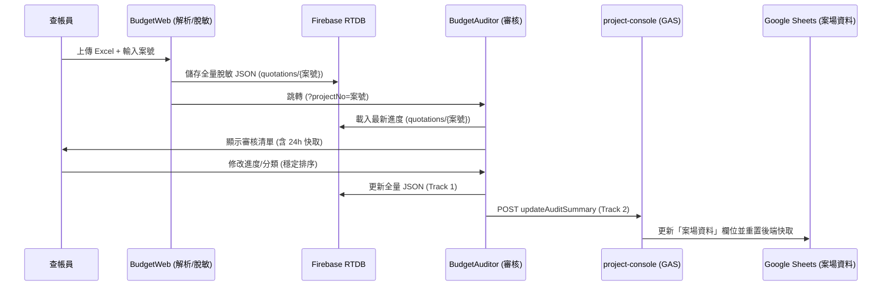

# 12. 報價單審核系統與主控台整合架構規格書 (Dual-Track Storage SPEC)

## 1. 系統定位與目標
本規格書定義了前端 **`BudgetAuditor` (報價單進度審核器)** 與後端 **`project-console` (專案主控台, Google Apps Script 生態)** 之間的資料串接與持久化儲存架構。

為解決複雜 JSON 解析對後端效能的衝擊，並發揮 Google Sheets 易於全局檢視的優勢，本系統將採行**「雙軌混合儲存制 (Dual-Track Storage Architecture)」**。

---

## 2. 核心架構：雙軌混合儲存制
當查帳員或工班在 `BudgetAuditor` 點擊「同步至雲端」時，系統將平行發起以下寫入任務：

### 2.1 軌道一：完整資料庫 (Firebase RTDB) - [細節防護層]
*   **儲存對象**：保留巢狀結構 (`total_summary` 與 `items`) 的脫敏 JSON 資料。
*   **傳輸方式**：透過 Firebase SDK `set()` 至對應案號路徑。
*   **儲存路徑設計**：`{FirebaseURL}/quotations/{projectNo}`
*   **底層資料結構 (JSON Example)**：
    ```json
    {
      "total_summary": {
        "siteName": "王公館裝修案",
        "projectNo": "770",
        "overall_completion": 74,
        "last_updated": "2026/03/26 17:40:00"
      },
      "items": [
        {
          "id": "ITEM_001",
          "name": "室內保護工程-地坪",
          "category_tag": "施工保護",
          "zone": "保護工程",
          "spec": "PP板+全室木板",
          "qty": "19",
          "unit": "坪",
          "completion_percent": 100,
          "is_ui_done": true,
          "raw_line": "2 | 室內保護工程-地坪 | 坪 | 19 | 10450 | ...",
          "verification": {
            "is_ok": true,
            "verified_by": "測試新員工",
            "verified_at": "2026/3/26 下午4:10:31",
            "verified_uid": "U12345"
          },
          "audit_logs": [
            { "ts": 1774512487892, "at": "...", "user": "...", "action": "標註完成" }
          ]
        }
      ]
    }
    ```
*   **欄位說明**：
    - `audit_logs`: 紀錄該工項的每一筆異動（進度調整、標註完成/取消），具備秒級追蹤能力。
    - `raw_line`: 保留解析時的原始 Excel 文字行，用於除錯與對照價格。
    - `verification`: 正式的完工簽核快取，包含人員名稱與 UID。
*   **優勢**：Auditor 開啟時以毫秒級速度透過 `projectNo` 載入，完全跳過後端解析。

### 2.2 軌道二：戰情摘要 (Google Sheets) - [全局管理層]
*   **儲存對象**：Check-in 系統之 **`案場資料` (Sites Data)** 工作表。 [已於 2026-03-26 實作後端串接]
*   **實作細節**：
    - 系統會比對 `案號` (ProjectNo) 並更新於 `案場資料` 工作表：
        - `audit_items_total`: 總報價工項數。
        - `audit_items_verified`: 已完成 (100%) 之工項數。
        - `audit_percent`: 整體完成度百分比。
        - `audit_last_synced_by`: 最後執行同步的人員名稱。
        - `audit_last_updated`: 最後同步時間戳 (YYYY/MM/DD HH:mm)。
*   **傳輸方式**：前端將資料透過 HTTPS `POST` 發送給 `project-console` 所部署的 `WebApp.js`。
*   **資料結構 (POST Payload)**： [一致性對接完成]
    ```json
    {
      "action": "updateAuditSummary",
      "案號": "770",
      "siteName": "王公館裝修案",
      "audit_items_total": 104,
      "audit_items_verified": 77,
      "audit_percent": 74,
      "userId": "U123456789...",
      "userName": "查帳員陳某"
    }
    ```
### 2.3 工具聯動路徑 (Connection Routing)
*   **路徑 A (預處理與儲存)**：`BudgetWeb` (Excel 解析) -> **Firebase** (`quotations/{projectId}`)。
*   **路徑 B (載入與審核)**：`BudgetAuditor` (載入 Firebase) -> **GAS Backend** -> **案場資料** (戰情摘要更新)。
*   **資料一致性**：兩者共享相同的 JSON 結構，主要透過 `projectId` 作為金鑰聯結。
*   **回報系統連動**：`reportV2.html` 使用相同的 Firebase 配置進行照片與日誌管理，確保數據生態系的一致。

### 2.4 資料流轉流程 (Data Flow Diagram)



---

## 3. 架構優勢與連動場景 (Use Cases)

### 3.1 跨系統極速查詢 (AI / LINE Chatbot)
在 LINE 群組或 AI Agent 需要回答「目前案場請款進度」時，後端無須發送 HTTP 請求去 Firebase 下載沉重的 JSON 並解析。
`project-console` 僅需讀取 `ProjectAudits_Index` 的記憶體快取 (Cache)，耗時 < 0.1 秒即可組成字串回應：「目前進度已達 74%，上次審核時間為今日上午。」

### 3.2 觸發與自動化 (Webhooks / Event-Driven)
當 `project-console` 接收到 `updateAuditSummary` 請求，並偵測到 `overall_completion === 100` 時，可作為流程自動化的扳機 (Trigger)。
例如：
- 自動觸發 LINE 訊息推播給業主中心，發送「完工點交邀請」。
- 自動聯動財務模組，生成「尾款請款單」待辦事項。
- 聯勤日誌系統 (`ProjectLog`) 自動寫入一筆系統發布的「全區完工審核通過」紀錄。

---

## 4. 工程分類判定規則與自定義提案

### 4.1 現行判定邏輯 (Hard-coded Logic)
目前系統在 `BudgetWeb` 解析時，依序透過以下關鍵字進行自動歸類 (權重由上至下)：
1. **施工保護**: 保護、地坪保護、防塵、包覆
2. **拆除工程**: 拆除、打除、清運、廢棄物、搬運
3. **泥作工程**: 磁磚、大理石、砌牆、防水、泥作、填縫、打底、貼磚、磨石子、洗石子、抿石子、水泥砂漿
4. **油漆工程**: 批土、噴漆、乳膠漆、水泥漆、油漆、刷漆、水性漆、色漆、藝術漆、AB膠、木作修補、填縫 [v2.1 提升優先級]
5. **水電工程**: 插座、配線、開關、燈具、迴路、弱電、網路、tv、開關位移、強電、管路、接線、明管
6. **木作工程**: 天花板、隔間、門、層板、平釘、間照、矽酸鈣、隔間牆、電視牆、半腰牆、壁板、背板
7. **系統櫃體**: 櫃、櫥、衣、鞋、高櫃、矮櫃、抽屜
8. **地板工程**: 超耐磨、地板、卡扣、拼花、spc、塑膠地磚
9. **清潔工程**: 粗清、細清、吸塵

### 4.2 分區智慧整合 (Zone Pre-processing)
解析器在處理 Excel 時，具備以下分區智慧整合能力：
*   **連續重複合併**: 若 Excel 出現連續多列相同的分區名稱（常見於跨頁標題重複時），系統自動將其視為同一分區，避免 UI 出現冗餘區塊。
*   **無效分區過濾**: 若分區下不含任何有效工項（已被過濾掉價格列後為空），該分區自動從選單與列表中移除。
*   **跨工具傳遞**: `zone` 欄位會被編入 JSON 下載至 Firebase，供 `BudgetAuditor` 渲染分組使用。

### 4.3 建議預留分類 (未來擴充)
為更精確劃分報價單，建議未來可從「木作」或「其他」中抽離出：
*   **金屬玻璃**: 隔屏、玻璃、鋁窗、鐵件、不鏽鋼、黑鏡。
*   **石材工程**: 大理石、花崗岩、人造石 (非廚具類別時)。
*   **空調工程**: 冷氣、VRV、排水管、銅管。

---

## 5. 開發實作查核清單 (Implementation Checklist)
### 5.1 已完成項目 (穩定性與 UX)
- [x] **24 小時本地快取**: `BudgetAuditor` 自動暫存進度，重整不遺失。
- [x] **UX 穩定排序 (v2.1)**: 勾選完成時不立即跳動，同步雲端後才下移歸類。
- [x] **行動端浮動工具列**: 吸底精簡設計，捲動至頂端自動隱藏。
- [x] **全分類選單補全**: 支援手動將工項調整至十大分類中的任一項。

### 5.2 待處理項目 (主控台整合)
- [ ] **Phase 1: 建立後端端點**
  - [ ] 於 `backend/project-console/WebApp.js` 中新增 `action: updateAuditSummary` 的路由支持。
  - [ ] 於 `ProjectLogic.js` 撰寫 `updateAuditSummary_` 商業邏輯。
- [ ] **Phase 2: 全局規則雲端化**
  - [ ] 將 `CATEGORY_RULES` 從 HTML 抽離，改從 Firebase `config` 讀取。
## 6. 驗收表核心功能詳註 (BudgetAuditor UX v2.2)

### 6.1 視覺穩定排序 (Stable Grouping)
*   **標註即時反饋**: 當工項切換為 100% (完成) 時，工項圖案變更為核取狀態但**留在原位**，防止行動端操作時列表突然跳動造成誤導。
*   **同步結算位移**: 僅在點擊「☁️ 同步至雲端」成功後，或是重新整理頁面時，已完成工項才會一次性移入底部的 **「✅ 已完成項目」** 摺疊區。

### 6.2 24 小時本地快取 (Local Resilience)
*   **自動暫存**: 每次修改進度或分類，系統自動寫入 `localStorage`。
*   **斷網保護**: 若在無網路環境或非預期關閉瀏覽器，再次開啟同案號時將立即恢復未上傳之進度。
*   **自動清理**: 快取有效期為 24 小時，逾期或同步成功後自動重置。

### 6.3 智慧浮動工具列 (Smart Toolbar)
*   **精簡導引**: 僅保留最核心的「同步」按鈕，橢圓小尺寸設計，避免遮擋中央內容。
*   **動態隱藏**: 當滑動距離 < 120px (位於頁面最上方) 時自動淡出關閉，避免與標題欄按鈕衝突；滑離頂端後才顯示。

### 6.4 工項屬性動態管理 (Property Editor)
*   **即時分類**: 支援在驗收清單中直接修改工項分類，修改後立即同步至 Firebase，實現跨系統（如報表端）的即時分類更新。

---

## 7. 技術細節與安全機制 (Technical Implementation)

### 7.1 強度資料脫敏 (Data Sanitization)
`BudgetWeb` 在解析 Excel 時，會針對以下關鍵字進行**嚴格過濾**，確保 `Firebase` 中的 JSON 不含敏感價格資訊：
*   **過濾字樣**: 價格、單價、總價、複價、成本、單價小計、合計、稅。
*   **處理行為**: 匹配成功之列將被略過，確保資料庫僅存放工項名稱、規格、數量及單位。

### 7.2 LIFF 身份識別流 (Identity Flow)
兩端工具均整合了 LIFF SDK，依序進行身份辨識：
1. **URL 優先**: 檢查 `?uid=` 與 `?userName=` 參數 (由主控台跳轉時使用)。
2. **LIFF 登入**: 呼叫 `liff.getProfile()` 取得登入者資訊。
3. **本地備案**: 若上述皆失敗 (例如本地預覽)，將從 `localStorage` 讀取上一次的身份或顯示為「訪客」。

### 7.3 異常與同步提示 (Error Handling)
*   **同步狀態**: 浮動按鈕執行同步時，系統會顯示 **「正在同步至雲端...」** 提示音或進度條。
*   **失敗回饋**: 若 Firebase 或 GAS 接口斷線，系統會保留本地快取，並在 UI 標註 **「⚠️ 尚有未上傳進度」**，引導使用者在恢復訊號後再次嘗試。

### 7.4 多裝置同步衝突 (Conflict Management)
當多名查帳員同時修改同一案場時，系統採取以下策略：
*   **Last Write Wins**: 以最後一個點擊「同步至雲端」的人員資料為準覆蓋 Firebase JSON。
*   **變更追蹤**: 建議未來引入 `revision_id` 或 `patch` 機制，目前則透過 `audit_last_synced_by` 紀錄最後修改者以供追查。

### 7.5 長頁面渲染優化 (Performance)
針對超過 300 項工項的大型案場：
*   **分區渲染**: `renderList` 目前採分區區塊化 HTML 拼接，可有效降低 DOM 頻繁操作負擔。
*   **延遲渲染**: 底部「已完成」區塊預設為隱藏且採 `display: none`，僅在使用者點擊後才由 CSS 解除，減輕初始渲染負擔。
