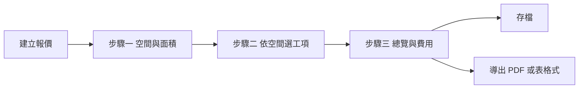

# 室內裝修快速報價系統 — 技術規格書

> **編號**：14  
> **版本**：2026-04-26 v0.8（§1.4.2a 兩層設定與本機儲存、管理員介面導覽；§1.4.5 延續）  
> **狀態**：草案；試作實作見 `tools/QuickRenovationQuote_v2.html`（其餘產品線實作另計）  
> **產品計劃書**：`CODING/tools/室內裝修快速報價系統_計劃書.md`

---

## 1. 模組定位與邊界

### 1.1 定位

本模組提供**清單式、現場友善**的裝修報價：由使用者設定空間與面積，從**工項價本（Price Book）**勾選與調整數量，計算金額並匯出文件，並可儲存／複製歷史報價。

另有一條產品線為**房型＋總坪數推估**：先依管理員可調參數分配陽台、浴廁、客廚、各臥坪數，再以長寬比推估平面尺寸，最後以**方案菜單**決定各常見項目之**數量規則**並拆項試算——見 **§1.4**（**非**整單統一乘「階段倍率」；「精簡／收納／造型」改為**多套菜單**，每品項各自規則）。

### 1.2 與 LayoutPlanner 的分工

| 維度 | LayoutPlanner（見 `04_INTERIOR_DESIGN_TOOL_SPEC.md`） | 本模組（快速報價） |
|------|--------------------------------------------------------|---------------------|
| 輸入主力 | 2D 圖面、物件幾何 | 空間列表、坪數／㎡、勾選工項 |
| 計價驅動 | 幾何（長寬高、面積、才） | 工項規則 × 使用者輸入數量 |
| 適用場景 | 需視覺化配置與細部尺寸 | 初估、項目式明細、價本標準化 |

兩者**不**在本階段共用同一套畫布狀態；若未來整合，僅透過「專案 id、空間名稱、面積、匯出之明細 JSON」等**明確介面**交換。

### 1.3 不在本 SPEC 範圍內（除非另開子章）

- 透視圖／平面圖自動算坪數。  
- 金流、合約電簽、發票。  
- 多租戶 SaaS 計費。

### 1.4 房型坪數推估報價器（參考用、認單價）

#### 1.4.1 目的與免責

客戶在短時間內選擇**房型模板**、輸入**總坪數（不含公設）**，系統依可設定之預判參數分配陽台、浴廁、客廳+廚房、各臥室坪數；客廚占「扣陽台與浴廁後餘額」之比例可在上下限內**隨機**取值；臥室間依主臥／次卧倍率分配。各區塊以**長方形長邊:短邊比**（可設定，預設與試作一致為 **6:4**）由坪數反推概略長寬（cm），並換算**台尺**（1 尺 ≈ 30.3 cm）供櫃體延尺類項目粗估（**非**竣工圖）。

產出為**參考報價**：強制免責——實務需與專業設計師討論細節；**需求決定總價**；本工具重在讓客戶先理解公司**單位價格**與級距。

#### 1.4.2 房型模板與「二房一廳一衛」

- **三房二廳**：3 臥、客廚、2 衛；浴廁坪數由設定列表取**前兩筆**（預設語意如 1 + 1.5 坪）。  
- **二房一廳一衛**：與「二房一廳」同一模板語意——**2 臥、客廚、1 衛**；浴廁坪數取列表**第一筆**（預設 1 坪）。分配演算法與三房相同，僅臥室數與浴廁扣減不同。  
- **四房二廳**：4 臥、客廚、2 衛；另可設定「第四臥相對次卧一」之倍率。

#### 1.4.2a 兩層設定、本機儲存與畫面區塊（試作 `QuickRenovationQuote_v2.html`）

產品上**刻意**把「**單價／工項表對價**」和「**數量怎麼算（計算條件）**」分開兩層，**不**併成同一張大表；理由：**同一價本**可搭配**多套**方案菜單（每套一組 `rules`），若單價寫在方案內則日後難以共用與改價。

| 層 | 在程式內的容器 | 主要內容 |
|----|----------------|----------|
| **A. 工項層** | 管理員的 **`itemDefs`** 陣列 | 內用 `id`、`label`（客戶品名）、`unit`、`price`、**`priceSheetTab`／`priceSheetItem`**（對雲端試算表用）、**`clientNote`（客戶可見備註，預設併陳於報價）** 等。 |
| **B. 方案層** | 管理員的 **`schemeMenus`** 陣列 | 每方案一筆：內用 `id`、`name`（客戶端顯示）、`rules`（**以品項 `id` 為鍵**的數量規則，見 §1.4.4）。 |

- **本機儲存（試作）**：整包狀態以瀏覽器 **`localStorage`** 寫入，**鍵名** **`qr_estimator_settings_v2`**。清除網站資料、換瀏覽器或換電腦不會帶出；**備份**請用頁面**「匯出 JSON」**。上線目標改伺服端，語意不變。  
- **畫面由上而下（管理員）**：`試算表 ID` 一列 → **其正下方** 橘底區「**各品項：單價、試算表對照、客戶可見備註**」＝ 編 **`itemDefs`** 與 gviz 讀價。→ **更下方** 標題「**方案菜單（數量怎麼算＝計算條件）**」（試作在該 `h3` 設 **`id="schemeMenuSection"`**）＝ 編 **`schemeMenus`** 與速寫／表單。  
- **跨區導航（試作）**：在 **A 區**品項一覽內，每筆有「**帶我過去**」可連到 **B 區**——系統會選定該品項並**捲動**至 `#schemeMenuSection`，方便在改完表對價後直接設定數量規則；**並非**兩層合併為單一表單。若產品日後要「**同畫一屏**」編兩層，需另開 UI 需求，非目前試作範圍。  

此節與 **§1.4.3～§1.4.7** 併讀；與程式不一致時以**程式**為準並回寫本節。

#### 1.4.3 方案菜單（非整單比例倍率）

「精簡／收納齊全／造型設計」在產品上定義為**多套可擴充的方案菜單**（`schemeMenus` 陣列），每一方案包含：

- `id`、`name`（客戶端顯示）。  
- `rules`：以**品項 id** 為鍵，值為**數量規則**物件（決定該品項數量，再乘單價得小計）。**不得**再以「全單統一乘同一倍率」取代各品項之細節設定（若需全單折扣，應另列獨立規則與欄位）。

管理員**優先**用表單（選方案、一覽表、帶入、套用；新增／複製／刪除方案），**不必**手寫 JSON；可再用「菜單速寫」以**直線**（`|`）分欄**貼上試算表或自己打字**，按鈕轉成 `rules` 並**寫入**與**方案 JSON／客戶端**讀的**同一份**整包設定（**鍵** **`qr_estimator_settings_v2`**，內容含 **`itemDefs` + `schemeMenus`** 等，見 **§1.4.2a**）；進階可展開方案 JSON 檢視。正式上線應改後端儲存與版控。

#### 1.4.4 數量規則 `type`（試作實作語意）

| `type` | 語意 | 主要參數 | 範例（業務描述） |
|--------|------|-----------|------------------|
| `ceil_ping_lk_beds` | 客廚與**所有臥室**之坪合計，再 **Math.ceil**；全室**變量**「坪」 | — | 木作平釘天花等 |
| `floor_ping_lk_beds` | 同合計邏輯、同 **ceil**（實作可拆兩筆、單價區分地材與天花） | — | 地板／地坪粗估 |
| `short_shaku_zone` | 指定 `zone` 的**長邊或短邊**轉整尺台尺（`edge: "short"` 預設、可 `long`） | `zone`, `edge?` | 冷氣包管延米 |
| `shaku_edge_scaled` | 上述邊的台尺 × `scale`（`edge` 常作牆面走向）；小數一位、下限 0.1 | `zone`, `edge`, `scale` | 電視牆、間照帶、主牆造型 |
| `short_shaku_scaled` | 同屬邊長×%（`edge` 預設 `short`） | `zone`, `scale`, `edge?` | 衣櫃：短邊×60% 等 |
| `short_shaku_full` | 一邊滿尺、不另乘%（`edge` 可選） | `zone`, `edge?` | 收納導向衣櫃滿牆寬度 |
| `avg_secondary_short_shaku_scaled` | 非主臥各間**短邊**台尺**平均** × `scale` | `scale` | 與「一列併算」的舊欄位 `wardrobe2` 相容；與**逐間次臥**擇一維護 |
| `fixed_shaku` | **定量**（`value`）；單位依品項（尺／坪／式） | `value` | 鞋櫃固定 3 尺、維修孔 1 式 |
| `floor_115` | **分空間地坪**；該空間實鋪坪 × 損耗（預設 **1.15**）再依設定**取整**（**整坪**或 **0.5 坪** 向上一檔） | 品項一鍵 `floor_p`；執行層**依列**帶入 `zone` | 舊版全室一筆 `floor_ping_lk_beds` 改為**客、主、各次臥各一筆** |
| `sum_ping_paints` | **面漆參考坪**；客廚＋各臥實鋪坪和再 **ceil** | — | 面漆用「有天花之坪」的粗估上線 |
| `sum_ac_shaku_paint` | 各空間冷氣包管邊一邊**短邊尺**之**加總** | — | 包管油漆延尺參考 |
| `mep_sockets_bed` | 插座／出線參考**點數**＝`底數`＋`每臥+客廚一區`×（1＋臥房數） | 設在**管理員參考**內非規則 JSON；計算在程式 | 底數 30＋每區 6 點 為試作預設 |
| `recess_15x` | 嵌燈概估＝`ceil( (客+臥坪和) × 1.5 )`盞 | — | 有天花之坪的筒燈粗估 |
| `trim_placeholder` / `touchup_from_settings` | 僅佔**數量=1**；**金額**改由設定（收邊＝**木作+系統有勾**品項小計×%；細清＝**固定額**）在報價合計中另算，品項**單價欄 0** | 見 §1.4.7 | 避免把收邊誤用延尺單價；細清一筆定額好懂 |
| **品項＝次臥且規則不帶 `zone`** | 同一 `rules.品項id` **逐間**套 `bed2`…，畫面與小計**各一列**；試作內用 `perSecondary: true` 的品項列 | 執行層帶入 `zone` | 次臥冷氣、衣櫃等**快速拆間** |
| **菜單設計** | 白話：**項目** × 定量**或**變量（邊與%） | 見上各 `type` | `tools/QuickRenovationQuote_v2.html` 試作；舊匯出檔若寫 `acbox`+`lk` 請改併上列欄位語意實作。 |

**小計**：`round(數量 × 該品項單價)`；單價為「元／坪」或「元／尺」等由品項定義，與 `PROJECT_DATA_DICTIONARY` 併網前須唯一化欄位名。

#### 1.4.5 產品要求與常見品項（試作內建 id，依空間分群）

**（一）報價分組（擁有者定稿，勿過度切碎）**  

- 報價單**以空間分區**為主，**不要**用過多、過碎的小群；客戶與內部對讀以「哪一區、做什麼」為優先。  
- **分區**固定為四類語意：  
  - **客餐廳**（`lk`）：客＋廚一區的常見木作／系統項。  
  - **主臥**（`master`）  
  - **次臥**：有**幾間**次臥就幾**個**分區（`perSecondary` 逐間列，每臥一組小標，如「次臥 · 次卧一」）  
  - **全室**：不屬單一房內的項目一併放此（如**平釘天花、地坪、面漆參考、水電參考、收邊、細清**等；其中天花板與地板為**全案尺度**併算者亦歸全室**語意**）。  
- **顯示與產生明細的順序**（試作）：**客餐廳 → 主臥 → 次臥（每臥一組，依臥序）→ 全室**；全室內**先**天花、**再**分空間地坪、**其餘**以 `displayRank` 定序。程式以 `getDisplayItemRows` 實作，與 `groupTitle` 一致。  

**（二）各區「菜單」內要涵蓋的工項名稱（人類讀的槽位，可日後以槽位 N 對內用 id 對照）**  

- **客餐廳**：鞋櫃、收納櫃（深 40cm 參考）、餐櫃（深 60cm 參考）、電視牆、沙發背牆、冷氣包管、窗簾盒、維修孔、電器櫃、高身櫃、間照。  
- **主臥**：冷氣包管、窗簾盒、衣櫃、衣櫃置頂、造型背牆或半腰背牆、間照、化粧桌／書桌。  
- **次臥**（**每臥一組、與主臥欄位對齊**）：上列**同一套** 7 類，規則 JSON **不**必按臥寫多份 `zone`（`perSecondary` 品項由執行層逐間帶入空間代碼）。  
- **全室**：**平釘天花**、**分空間地坪**（`floor_p` 一筆品項、多空間多列；坪數＝實鋪×損耗再取整）、**面漆／包管漆／水電／嵌燈參考／收邊／細清** 等，其中部分為**變量**、部分**定量**，見 §1.4.4。  

**（三）菜單（方案）設計原則**  

- **目的**：**單純化**——人類在腦中與在表冊上，盡量用**固定槽位**與**同一套參數槽**（**項目** × **定量或變量** × **% 數** × **該空間之長邊或短邊**等），**不要**讓每一品項一組獨佔參數名。內實作仍以**品項 `id` + 規則 `type` + 參數** 存；對照用白話寫在品項之 **`menuMatrix`**（給管理員、速寫、編排菜單時一眼懂）。  
- 若要以「**主臥_1、主臥_2…**」人類讀**編號**對內用 id 對照，屬**文件與內部表**上之編碼，**不**影響程式鍵名；內部維持 `ac_m`、`wardrobe_m` 等。  
- **用試算表尺度**：系統**先**依房型推估**各空間坪數、長寬、長短邊台尺**；**再**依**方案**決定**每一品項的數量規則**；最後**數量×單價** 得小計。不是整單乘一個階段倍率取代上列。  

**（四）單價、單位與雲端「添心設計標準計價表」**（與本機 `SPEC/~添心設計標準計價表.xlsx` 內容**一致**之前提）  

- 管理員在品項上可填 **`priceSheetTab`（工作頁名稱）** 與 **`priceSheetItem`（該分頁 A 欄之品項全名）**；**讀入 gviz 時**自該分頁讀取 **A＝品項、B＝單位、C＝單價** 之列，更新該筆內建品項之 `unit` 與 `price`。  
- **比對**（試作）：**正規化空白後**先**全字相等**；再**雙向包含**（**模糊一筆**）——擁有者可接受此鬆度，但表上**字串仍應**與設定**盡量一致**，以利辨識與審單。  
- **試作預設對照**（`QuickRenovationQuote_v2.html` 內建 `DEFAULTS.itemDefs`）：已依常見分頁名稱預填 `priceSheetTab`／`priceSheetItem`（例：`木作工程`、`系統櫃體`、`地板工程`、`油漆工程`、`水電工程`）；**表上 A 欄實際文字若不同**，請在管理員畫面逐筆改「表頁名、表內品項」後再按讀入。鞋櫃／收納櫃預設對「深40×高240」、衣櫃對「深60」之**客戶可見備註**已寫入 `clientNote`，可再與計價表逐字對齊。  
- **與畫面顯示分離**：`priceSheetItem` 為**對表**用、**不**等於**客戶**在報價上看到的**品名**（`label`）；`label` 可寫**簡、好讀**；**表內品名**變更頻率通常**低**（**單價**則**常**隨表更新，故以表為準的讀入最省力）。  
- 另保留一條**捷徑**：在「**可選的 gid／分頁**」一頁上，**A＝內用品項 `id`、B＝單價** 之小表，專治**內用 id 對價**；兩者**可並用**。  

**（五）客戶報價文件**  

- 品項上可存 **`clientNote`（客戶可見備註）**；**產生報價小表**時**預設併陳**於**項目／品名**旁（下或副行），**符合**一般對外報價單**習慣**；不另隱藏於「內用」區。未填可留空。  
- 試作若未填 `clientNote`，歷史相容上步驟三**可能**以 `hint` 暫代顯示參考——**產出格式以實作為準**；**擁有者要求**是 **clientNote 為主、預設給客戶看**。

**（六）內建品項列舉（實作細節仍見程式）**  

- **全室**：平釘天花。  
- **分空間地坪**（`floor_p`，品項一鍵多列）：客廚、主臥、每間次臥**各一筆**；**坪數**＝該空間鋪設坪 ×1.15（可改損耗）＋**取整**。  
- **客餐廳（`lk`）**：同（二）之列表；實作 id 以 `tools/QuickRenovationQuote_v2.html` 內建為準。  
- **主臥**：同（二）。  
- **次卧**（`perSecondary` 逐間列）：上列 7 類一組，菜單 JSON 同一規則鍵可**套多間**。  
- 上列**顯示名、單價、單位、表內對照、客戶備註**在管理員介面可改；`rules` 內**定量／變量＋%＋長邊或短邊**見 §1.4.4。

#### 1.4.6 管理員與安全

- 設定頁僅內部使用；正式試作以 **localStorage** 儲存，**主鍵** **`qr_estimator_settings_v2`**（內有 **`itemDefs`、`schemeMenus`** 等，見 **§1.4.2a**）；**開發中**原型可**暫關** PIN 以利調菜單。  
- 上線：菜單與坪數推估參數改**伺服端**、驗證可選 PIN／帳密，審計與權限依 `§2` 擴充（非本原型必備）。

#### 1.4.7 試作 schema 4 擴充（`schemaVersion: 4`）

- **遷移／重置**：`localStorage` 若**無** `perFloor` 的 `floor_p` 品項、或**無**收邊列（`trim_molding`＋`lineKind: 'trim'`），則在載入時**整批還原**內建品項＋內建三方案，避免與舊 JSON 混用。匯入舊檔可手動**只還原單價**或**只還原方案**按鈕。  
- **分區小標**（`groupTitle`）：步驟三工項掛鉤、步驟四明細**依小標**拆多張小表（可讀性）。  
- **收邊＋細清**：**木作+系統參考小計**＝有勾、且品項有 `cabWood: true` 的明細**小計加總**；**收邊**＝該和 × `trimMoldingRate`；**細清**＝`touchupLump` 一筆；兩行在合計內不與 0 元欄衝突。  
- **Google 單價 gviz 讀入**：產品語意與表格欄位**詳 §1.4.5（四）**；表須可匿名讀。讀取失敗有提示；可勾選**開頁自動**更新單價。  
- **表單編菜單**：可選**方案＋品項＋規則型**再「套用至方案」；內容同步**方案 JSON 文字方塊**並存檔。  
- **兩軌儲存**：`localStorage` 鍵 **`qr_estimator_settings_v2`** 內有 `mepPerZone`（水電參考）等；畫面欄位「每臥+客廳」沿用表單 id 語意、與儲存鍵**對照寫在程式**；舊鍵 `mepPerRoom` 會自動併到 `mepPerZone`。  
- **導航**：`#schemeMenuSection` 為方案菜單（計算條件）之捲動錨點；與品項層之「**帶我過去**」鈕連動，見 **§1.4.2a**。

**實作檔**：`tools/QuickRenovationQuote_v2.html`（規則鍵名以頁內 JSON 為準；併入主產品前須回寫 `PROJECT_DATA_DICTIONARY.md` 與 §4 組態對齊）。

---

## 2. 角色與權限（MVP 建議）

| 角色 | 能力 |
|------|------|
| 編輯者 | 建立／修改／刪除（軟刪除可選）自己的報價；匯出 |
| 價本管理員 | 維護工項分類與價本版本（可与編輯者合併為同一角色於 MVP） |
| 唯讀 | 僅檢視指定報價（Phase 2，與 LIFF／Token 一併設計） |

實作時身分來源應與現有 SPA／LIFF 一致，**欄位名稱**以 `PROJECT_DATA_DICTIONARY.md` 為準；本檔僅列**語意層**需求。

---

## 3. 核心使用者流程

### 3.1 與市售教學一致的三步驟（產品主軸）

1. **步驟一 — 空間與面積**：選擇或新增空間類型、輸入坪數或長寬尺寸；系統協助**坪／㎡**換算（換算係數為組態常數，與字典一致）。  
2. **步驟二 — 依空間選工項**：分類 → 子類（如拆除、天花、地坪、櫃體）→ 勾選與填量；可標記**加購**、**特殊工法**（文字或價本列）；必要時工項預設單價可依**空間類型**解析（區域計價）。  
3. **步驟三 — 總覽、費用與匯出**：檢視明細與小計；輸入或確認**設計費**、**工程服務費**（比例或固定額）、**稅率**；可於本步**增刪明細行**（含自訂行）後再**存檔**／**導出**。

### 3.2 流程圖（邏輯等價）

- **複製報價**：以新 `quoteId`（或同等主鍵）複製主檔與明細，標示來源報價。  
- **價本版本**：明細列應**快照**當下單價與名稱，避免日後改價本影響歷史報價解讀（實作策略：寫入 `lineItem.unitPriceSnapshot` 等，正式 key 入字典）。

### 3.3 參考型 UI 線索（非強制像素級）

| 步驟 | 參考佈局 | 說明 |
|------|----------|------|
| 一 | 平板網格＋圖卡 | 空間類型以圖示輔助辨識，輔以「加入專案」；適合觸控熱區 |
| 二 | 卡片或摺疊分類 | 每空間一工作區，避免跨空間誤加項目 |
| 三 | 表格式總覽＋費用區塊 | 明細表下方或側欄為設計費／工程費／稅／總額；主按鈕**存檔**、**導出**並列 |

---

## 4. 必要參數與組態界定（開發前須凍結語意）

本節為**參數意義、預設、合法範圍**之唯一正文；計劃書僅列類別並指向本節。實作時 JSON／API key 必須與 `PROJECT_DATA_DICTIONARY.md` **逐欄對齊**（本節 `參數語意` 為人類可讀名，字典內為正式欄位名）。

### 4.1 參數分層

| 層級 | 說明 | 儲存位置（概念） |
|------|------|------------------|
| **A. 公司／環境組態** | 全公司預設；少數欄位允許報價覆寫 | 設定檔、後端 `OrgSettings` 或同等 |
| **B. 單筆報價（Quote）** | 該次報價實際使用之費率、模式、開關 | `Quote` 快照，寫入時即固定供歷史重現 |
| **C. 價本常數** | 換算係數、列舉值、上限 | 程式常數或價本版本附帶 metadata |

### 4.2 面積與單位（層級 A 為主，B 可覆寫顯示偏好）

| 參數語意 | 說明 | 建議預設 | 合法範圍／約束 |
|----------|------|----------|----------------|
| `pingToSquareMeter` | 1 坪換算為㎡之係數 | `3.305785124`（或公司採用之法定／慣用值） | 必須 **> 0**；變更須**版本註記**（舊報價不重算面積，除非產品明定） |
| `defaultAreaInputUnit` | 新建空間時預設輸入單位 | `PING` 或 `SQM`（擇一與市場習慣） | 列舉 `PING` \| `SQM` |
| `areaDecimalPlaces` | 面積換算後顯示／寫入小數位數 | `2` | 整數 0–4（超過需產品核准） |
| `areaRoundingMode` | 換算與面積欄捨入 | `HALF_UP`（四捨五入） | 列舉；須與**對外報價單**慣例一致 |
| `showDualUnitInUI` | 輸入單位之外是否並列顯示另一單位 | `true` | 布林 |

**長×寬換算面積**（若啟用 FR-02a）：須再界定 `dimensionUnit`（cm／m）、是否允許非矩形空間僅手輸面積、以及 `length`×`width` 寫入後是否鎖定與手改坪數衝突時**誰優先**（建議：**最後一次使用者編輯**覆蓋）。

### 4.3 金額捨入（層級 A，影響全模組）

| 參數語意 | 說明 | 建議預設 | 合法範圍／約束 |
|----------|------|----------|----------------|
| `currencyMinorUnit` | 最小幣別單位 | 新台幣 `1`（元，整數） | 若改為角分需全表改寫 |
| `lineAmountRoundingMode` | 每一明細行小計捨入 | `HALF_UP` 至整數元 | 列舉 |
| `subtotalRoundingMode` | `constructionSubtotal` 是否再次捨入 | `NONE`（由行加總自然形成）或與行一致 | 必須在 UI 註明「先捨再行加總」或「先加總再捨」**擇一寫死** |
| `feeAndTaxRoundingMode` | 設計費、工程服務費、稅額各欄捨入 | `HALF_UP` 整數元 | 與會計對齊 |

### 4.4 總價堆疊（層級 A 預設 + 層級 B 每報價快照）

以下為**語意**；`Quote` 上必須保存當次選擇，以利重開舊報價與匯出一致。

| 參數語意 | 說明 | 建議預設 | 合法範圍／約束 |
|----------|------|----------|----------------|
| `designFeeMode` | 設計費計算方式 | `PERCENT_OF_BASIS` | `FIXED_AMOUNT` \| `PERCENT_OF_BASIS` |
| `designFeeBasis` | 百分比時之基礎 | `CONSTRUCTION_SUBTOTAL` | 列舉；MVP 禁止含「已含設計費之滾動基礎」造成循環 |
| `designFeeRate` | 百分比時之率 | `0` | 0–1（或小數 0–100 擇一**全專案統一表示法**） |
| `designFeeFixed` | 固定金額時之值 | `0` | ≥ 0 |
| `serviceFeeMode` | 工程服務費計算方式 | `PERCENT_OF_BASIS` | 同 `designFeeMode` |
| `serviceFeeBasis` | 百分比基礎 | `CONSTRUCTION_SUBTOTAL` | 預設與設計費**同一基礎**、兩費**互不納入對方基礎**（避免循環） |
| `serviceFeeRate` | 百分比時之率 | `0` | 同 `designFeeRate` 表示法 |
| `serviceFeeFixed` | 固定金額時之值 | `0` | ≥ 0 |
| `taxEnabled` | 是否計算稅額 | `true` | 布林 |
| `taxRate` | 稅率 | `0.05`（範例） | ≥ 0；實際稅法依公司會計 |
| `taxBasisMode` | 課稅基礎 | `CONSTRUCTION_PLUS_DESIGN_PLUS_SERVICE` | 列舉；MVP 預設為「工程小計 + 設計費 + 工程服務費」；若改為僅工程或自訂，須列在字典並驗收加案例 |
| `includeCustomLinesInConstructionSubtotal` | **自訂行**是否納入 `constructionSubtotal` | `true` | 布林；`false` 時自訂行僅展示／列印，不進入工程小計與後續費率基礎（慎用） |
| `includeAddonLinesInConstructionSubtotal` | **加購**標籤行是否納入工程小計 | `true` | 布林；若與會計「加購另計」習慣衝突可改 `false` 並於匯出註明 |
| `includeSpecialCraftLinesInConstructionSubtotal` | **特殊工法**標籤行是否納入工程小計 | `true` | 布林 |
| `grandTotalFormula` | 總額組成（唯讀規則，可存 enum） | `SUBTOTAL_PLUS_FEES_PLUS_TAX` | 與 §5 FR-06d 一致；變更屬重大版號 |

### 4.5 價本、明細與報價邊界（層級 A + 價本 C）

| 參數語意 | 說明 | 建議預設 | 合法範圍／約束 |
|----------|------|----------|----------------|
| `maxSpacesPerQuote` | 單一報價最多空間筆數 | `30` | ≥ 1 |
| `maxLinesPerQuote` | 單一報價最多明細列數 | `500` | ≥ 1；與 NFR 一致 |
| `catalogSnapshotRequired` | 定稿時是否強制寫入價本版本 id | MVP 可 `false`，上線前建議 `true` | 布林 |
| `lineDiscountKind` | 行折扣表現 | `PERCENT_ONLY` 或 `AMOUNT_ONLY` 或 `USER_CHOICE_PER_LINE` | 與 FR-05 一致；全專案擇一 |
| `allowDeleteCatalogLinesInStep3` | 步驟三是否允許刪除價本來源列 | `true` | 影響稽核；若 `false` 僅允許數量改 0 |

### 4.6 匯出與對外顯示（層級 A）

| 參數語意 | 說明 | 建議預設 |
|----------|------|----------|
| `defaultExportFormat` | 首次導出格式 | `PDF` 或 `XLSX`（擇一） |
| `exportFileNamePattern` | 檔名樣板 | 例如 `{date}_{quoteShortId}`（正式 pattern 入字典） |
| `quoteDocumentLocale` | 數字／日期格式 | `zh-TW` |

### 4.7 實作併入順序（強制）

1. 凍結本節各參數之**語意與預設**（產品簽核）。  
2. 將對應欄位**唯一命名**寫入 `PROJECT_DATA_DICTIONARY.md`。  
3. 再寫 API／前端狀態；**禁止**程式內另起別名。

---

## 5. 功能需求（FR）

| ID | 需求 | 優先級 |
|----|------|--------|
| FR-01 | 建立／編輯報價主檔：標題、客戶稱呼或案名、有效日期、備註 | P0 |
| FR-02 | 多筆「空間」：名稱、面積數值、面積單位（坪／㎡）；**顯示雙單位或一鍵換算**（係數可設定） | P0 |
| FR-02a | 空間面積除手輸坪數外，支援**長×寬**（或類似）換算面積後寫入該空間 | P1 |
| FR-03 | 工項庫：**至少二層分類**（大類／子類）＋搜尋；每項含名稱、單位、預設單價、計價類型；可標籤**加購**、**特殊工法** | P0 |
| FR-03a | **區域計價**：同一 `CatalogItem` 可依空間類型（如廚房／浴室）對應不同預設單價（價本表或覆寫表） | P1 |
| FR-04 | 將工項加入**指定空間**（MVP 建議不先做「全案共用區」，避免爭議） | P0 |
| FR-05 | 明細行：數量、單價（可覆寫）、折扣％或折讓金額（擇一）、行備註、自動行小計 | P0 |
| FR-05a | 步驟三可**新增／刪除**明細行（含**自訂行**：手填名稱與金額，或數量×單價） | P0 |
| FR-06 | **工程明細小計** `constructionSubtotal`：為所有計價明細行之合計（定義見 §6.3） | P0 |
| FR-06a | **設計費**：支援固定金額，或依某**基礎金額**（預設＝`constructionSubtotal`，可設定含／不含某類行）之百分比 | P0 |
| FR-06b | **工程服務費**（或同類名稱）：同上，固定或百分比，**基礎金額與設計費是否堆疊**為組態（預設：與設計費分開算、均只對 `constructionSubtotal` 取百分比，避免循環） | P0 |
| FR-06c | **稅**：稅率可設定（例如 5%）；**課稅基礎**為組態（預設：對「`constructionSubtotal` + 設計費 + 工程服務費」課稅，與常見折頁一致；若公司法務要求未稅報價則關閉） | P0 |
| FR-06d | **報價總額**＝ `constructionSubtotal` + 設計費 + 工程服務費 + 稅額（若為含稅顯示則 UI 標示清楚） | P0 |
| FR-07 | 列表：分頁或無限捲動、依日期／關鍵字篩選 | P0 |
| FR-08 | **存檔**（草稿／定稿狀態）與**導出**：PDF 與／或 CSV／xlsx 相容格式 | P0 擇一導出格式、P1 補齊 |
| FR-09 | 價本批次匯入（CSV） | P2 |
| FR-10 | 與專案主控 `projectId` 關聯（可選外鍵） | P2 |
| FR-11 | 三步驟**導覽**（步驟條或精靈）：限制未完成前序步驟時不可略過（可「返回上一步」） | P0 |

**預設計價堆疊順序（實作必須白話註解在程式內）**：先算各行 → `constructionSubtotal` → 依設定算設計費、工程服務費 → 依課稅基礎算稅 → 總額。若與貴司會計習慣不同，以**組態**調整課稅基礎與百分比基礎，不寫死第二套公式在 UI。

---

## 6. 資料模型（語意草案）

實作前須將下列概念**對應成**字典內唯一欄位名；下表為開發溝通用名詞。

### 6.1 實體

- **Quote（報價主檔）**：識別碼、建立者、時間戳、狀態（draft／final）、客戶顯示名、專案關聯（可空）；以及設計費／工程服務費／稅之**輸入值與組態**（率、固定額、課稅基礎選項，正式欄位見 §6.3 併入字典）。  
- **QuoteSpace（報價內空間）**：所屬報價、排序、名稱、面積、單位。  
- **QuoteLine（明細行）**：所屬報價、所屬空間（可空＝全案）、工項來源 id、快照名稱、單位、數量、單價、折扣、小計、排序；可含類型旗標（一般／加購／特殊工法／自訂行）。  
- **CatalogItem（價本工項）**：大類、子類、名稱、單位、預設單價、計價類型、標籤（加購、特殊工法）、啟用／停用；可選**依空間類型之單價覆寫**（另表或 JSON，正式 key 入字典）。  
- **CatalogVersion（選用）**：價本版本號，便於稽核「當時用哪一版」。

### 6.2 計價類型（列舉建議）

- `FIXED`：固定式，行小計 = 數量 × 單價。  
- `PER_PING`：每坪，行小計 = 數量 × 單價 × 該空間面積（數量可視為係數或倍數，產品需二選一並寫死規則）。  
- `PER_METER`：每米（延米），數量由使用者輸入。

**規則**：同一報價內，若混用類型，UI 必須顯示該行計價說明，避免誤解。

### 6.3 總價欄位（語意，須入字典後實作）

以下為計算用語意，正式欄位名以 `PROJECT_DATA_DICTIONARY.md` 為準：

- `constructionSubtotal`：所有列入「工程明細」之 `QuoteLine` 行小計之和；是否含**自訂／加購／特殊工法**各類行，依 **§4.4** 之三個 `include*InConstructionSubtotal` 組態與行上標籤共同決定。  
- `designFee`：固定或 `designFeeRate` × `designFeeBasis`。  
- `serviceFee`：固定或 `serviceFeeRate` × `serviceFeeBasis`。  
- `taxRate`、`taxAmount`、`grandTotal`：依 §5 FR-06c／06d 與 **§4.4** 之組態計算。

---

## 7. 匯出規格（摘要）

- **PDF**：至少含封面資訊（報價名稱、日期、公司資訊）、空間分段表、明細表、**設計費／工程服務費／稅／總額**區塊、備註頁。  
- **表格式**：欄位順序固定，便於匯入審核或 Excel；欄名與字典一致；總價區塊可另工作表或尾段列。  
- **檔名**：建議含日期與報價短碼，避免覆蓋客戶本機檔案。

---

## 8. 非功能需求（NFR）

| 項目 | 目標 |
|------|------|
| 裝置 | 平板直／橫幅可用；手機單欄；主要互動區熱區 ≥ 44px |
| 效能 | 單報價 ≤ 500 明細行時，編輯與合計操作流暢（本地計算為主） |
| 安全 | 報價讀寫需與現有身分驗證一致；敏感欄位不寫入前端 log |
| 稽核 | 定稿後明細變更應留版本或「解鎖再改」流程（P2） |

---

## 9. 前端整合建議（CODING）

- **路由**：若走主 SPA，於 `spa/app.js` 新增 hash 與 iframe 路徑，並更新 `FILE_DOCUMENTATION.md`。  
- **獨立頁**：可先放 `modules/InteriorDesigned/` 或獨立 HTML 原型，與 SPA 並存。  
- **樣式**：與現有 Tailwind／內裝模組視覺對齊，降低使用者學習成本。

---

## 10. 後端與儲存（選型留白）

可採與專案主控相同之 GAS／Firebase／試算表後端之一；**API 契約**在選型確定後以單獨小節或 `backend` 目錄 SPEC 補齊。原則：

- 寫入與讀取路徑需可對應到「報價主鍵」。  
- 離線佇列若沿用施工回報模式，需另評估衝突合併策略（本模組 MVP 可不要求離線）。

---

## 11. 測試與驗收（MVP）

1. 新建報價 → 兩空間 → 各加 3 筆工項 → `constructionSubtotal` 與手算一致。  
2. 設定設計費 10%、工程服務費 5%（均對 `constructionSubtotal`）與稅率 5%（對三者合計）→ **總額**與手算一致。  
3. 步驟三**新增自訂行**後刪除一筆價本行 → 小計與總額正確。  
4. 改單價覆寫 → 總金額即時正確。  
5. 複製報價 → 修改一筆 → 原報價不變。  
6. 匯出檔用試算表開啟，編碼與欄位正確，且含費用／稅區塊。  
7. 價本停用某工項後，舊報價仍顯示快照名稱與價格。  
8. 坪數輸入與㎡換算與設定係數一致（允許四捨五入規則寫死在 SPEC 子句或字典）。

---

## 12. 相關文件

- [室內裝修快速報價系統_計劃書.md](../tools/室內裝修快速報價系統_計劃書.md)  
- [QuickRenovationQuote_v2.html](../tools/QuickRenovationQuote_v2.html)：**主線試作**—房型坪數推估、常見品項、**多套方案菜單**、管理員設定（`localStorage` 鍵 **`qr_estimator_settings_v2`**）；見 §1.4（**§1.4.2a** 兩層與導航）。  
- [QuickRenovationQuote_v1.html](../tools/QuickRenovationQuote_v1.html)：試算表 gviz 逐項勾選之**旁支試作**，保留參考。  
- [04_INTERIOR_DESIGN_TOOL_SPEC.md](./04_INTERIOR_DESIGN_TOOL_SPEC.md)（LayoutPlanner）  
- [12_BUDGET_AUDITOR_AND_CONSOLE_INTEGRATION_SPEC.md](./12_BUDGET_AUDITOR_AND_CONSOLE_INTEGRATION_SPEC.md)  
- [PROJECT_DATA_DICTIONARY.md](./PROJECT_DATA_DICTIONARY.md)  
- [FILE_DOCUMENTATION.md](./FILE_DOCUMENTATION.md)

---

> [!IMPORTANT]  
> **開發實作開始前**，必須將本檔涉及之持久化欄位**全部**納入 `PROJECT_DATA_DICTIONARY.md`，禁止前後端各自發明同義不同名的欄位。
