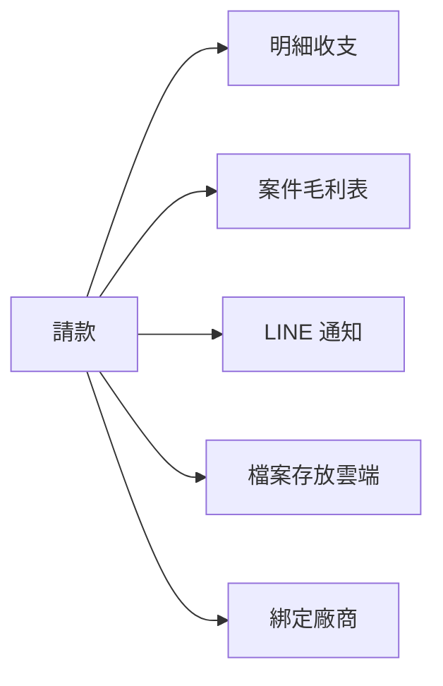

# 會計系統模組規格書 (v1.8 - 雲端靜態頁版)

本規格書定義「添心會計系統」之核心模組與資料流向。**決策（2026-06-18）**：放棄本機 Electron／SQLite 路線，改以 **雲端 Google Sheets 主檔 + CODING 靜態頁（info.tanxin.space）+ accounting-gas** 為唯一實作路徑。

**架構圖（白話）**：[會計系統架構圖.md](會計系統架構圖.md) — 誰進來、兩條錢的路、資料放哪；圖下附程式對照表。

**v1.29 更新（2026-08-21）**：廠商名冊／待匯款從主控台辨識存摺時，沿用已登入員工身分（不必再走廠商 LINE 登入）。

**v1.28 更新（2026-08-20）**：待付款稅別三模式——未稅兩種在填完金額／送出時會把 5% 加進合計；已含稅不加。合計旁顯示未稅＋稅。

**v1.27 更新（2026-08-18）**：待付款與存檔拆開——請款獨立一頁；存檔併入「單據與存檔」（與 LINE 快審同一條）。舊連結 `vendor_docs`／`mode=archive` 轉到單據頁「手動存檔」。

**v1.26 更新（2026-08-12）**：請款「LINE 通知」定案＝**僅匯款推播**（不另增送審／退回推播，節流）；匯款文案**拿掉出帳末五碼**（私人帳戶轉帳時會誤導）。

**v1.25 更新（2026-08-12）**：補「請款必連五件事」規格（明細收支、案件毛利、LINE 通知、檔案雲端、綁定廠商）— 對齊手寫架構圖；見 §2.2.1。

**v1.24 更新（2026-08-12）**：廠商名冊編輯時可看該廠近 12 個月請款／匯款紀錄；可新增請款（帶入廠商）、待匯款可編輯／刪除（≥4）。後端 `vendor_payment_status` 支援員工以 `filter.vendor_id` 代查（≥3）。

**v1.23 更新（2026-08-10）**：待付款稅金改版計劃定案（表頭三模式：已含稅／逐筆加 5%／整張分攤）→ [`23_待付款稅金三模式計劃.md`](23_待付款稅金三模式計劃.md)（**待實作**；現行仍為 v1.22 兩勾）。

**v1.22 更新（2026-08-09）**：待付款／請款審核分攤列拆成兩個勾——**含稅**只標記不改金額；**未稅加 5%** 才把金額 ×1.05。

**v1.21 更新（2026-08-02）**：快審 UX／速度——廢棄確認、標錯說明、待認領五類先選廠商、請款 pending 約 45 分；清單小縮圖＋快取先顯；責任建議見 [`未來開發事項.md`](未來開發事項.md) §1。

**v1.20 更新（2026-08-02）**：LINE 單據快審主路徑——傳圖／PDF 存廠商夾＋快審五類；請款導待付款帶附件；不做自動建請款。見 §2.1.2、[`未來開發事項.md`](未來開發事項.md) §1。

**v1.19 更新（2026-08-02）**：案件毛利列表重做——預設剛結案（180 天內）置頂、進行中其次、舊結案收合；總覽加「專案狀態／結案日」寫回（開詳情或缺欄一次補齊），列表不每次 join 案場；進頁／開案先顯示再更新；失敗可一鍵複製回報。同日補：LINE 傳圖→廠商夾＋快審效能順序見 [`未來開發事項.md`](未來開發事項.md) §1（傳圖當下不做 OCR／自動建請款）。

**v1.18 更新（2026-07-27）**：廠商名冊新增「別名／發票公司名」；請款辨識（群組核對卡、網頁匯款請款）依主名稱或別名對到名冊後代入廠商與帳戶。

**v1.17 更新（2026-07-25）**：開某一案詳情（`margin_get_detail`）時，依**該案目前明細**即時重算收入／支出／毛利，回給前端顯示，並寫回總覽該列（含最後更新）。只掃該案號列，不整表。前端上方摘要與三角核對改用重算結果。

**v1.16 更新（2026-07-25）**：總覽「分頁名稱」自我修正——開列表、重算合計、開詳情／寫入時，若仍指舊獨立頁（如 `778_…`）或錯的合併名，會改成實際使用的 `明細_X00全部`／`明細_X00`。無定時自動重算；前端無「重算總覽」按鈕，按「重新載入」列表即可觸發名稱校正。

**v1.15 更新（2026-07-25）**：釐清舊「一案子一分頁」（如 `778_…`）為歷史殘留、不再新建；日常讀寫以 `明細_X00全部` 為準。總覽「分頁名稱」應指合併明細分頁；若仍見獨立名＝尚未被現行程式覆寫。兩邊都有列時讀取會併入舊頁未重複列（避免半套遷移只看到一邊）。

**v1.14 更新（2026-07-25）**：案件毛利新增／改／刪成功後回整包詳情；前端有整包即刷新、不再重抓開詳情。

**v1.13 更新（2026-07-20）**：案件毛利明細改 **`明細_X00全部`**（例 726→明細_700全部）；頁面精簡——收支總結置頂縮小、工期唯讀、拿掉施工工資與家具標記；手動新增只寫毛利不寫收支明細。

**v1.12 更新（2026-07-20）**：廠商名冊新增「預設扣匯費」；新建請款／待匯款依廠商帶入，單筆仍可改。

**v1.11 更新（2026-07-20）**：待匯款**扣匯費**勾選分岔——有勾＝中信少匯、入帳／毛利不加匯費；沒勾＝公司幫出、入帳＋$30 並加在金額最大案；不另開 `vpfee_`、不另標「匯費」。欄位 `remit_fee_apply`。

**v1.10 更新（2026-07-18）**：主檔收斂——收款帳戶／費用分類廢棄；**廠商 LINE 改存廠商欄位**（舊「廠商LINE綁定」可刪）；**收支狀態輔助可刪**（狀態只看請款申請）；訂編案號暫留表不開頁。

**v1.11 更新（2026-07-25）**：訂編案號對照**程式停用**（不讀寫、不換號、不重建）；收款／分類／狀態輔助確認不重建；毛利總覽「訂編」停填；請款頁拿掉訂編欄。廠商檔案索引仍給存檔寫入（可隱藏、勿刪）。

**v1.9 更新（2026-07-12）**：HUB 僅保留單一「**會計系統**」入口（≥2，置於打卡後）；日常款項（收支登錄、待付款、追加減與收款、款項進度）整合於 `index.html` 選單；bootstrap **24h SWR**（見 SPEC 18）。設計師客戶財務頁門檻改 **≥2**。**使用教學**（`modules/help/`）：收支登錄收入／支出分開說明；示意圖由 `tools/generate-help-mockups.py` 產出 SVG。

**v1.10 更新（2026-07-24）**：修正會計選單進門誤用財務門檻。`AccountingApi.initSession` 改為依呼叫端傳入的 `minPermission` 檢查（預設仍 ≥4 供財務頁）；選單 `index.html` 以 `minPermission: 0` 進門後再依 ≥2／≥4 分區顯示。`AccountingBoot` 會把門檻傳進登入驗證，避免權限 2 被擋成「需 ≥4」。

**v1.8 更新（2026-07-11）**：對齊現行權限門檻（財務頁 ≥4、核准 ≥5、收支登錄 ≥2、請款／款項進度在職員工或廠商）；**薪資已上線**（`payroll_review`／`payroll_finance`），不再標「尚未實作」。

**v1.4 更新（2026-06-19）**：對齊程式現況（收支審核、LINE 綁定、附件查詢、主檔快取）；補列 **案件毛利（Phase 2d）**、**薪資（Phase 2e）** 規劃與權限門檻。

**v1.5 更新（2026-06-19）**：案件毛利改為 **獨立試算表、一案子一分頁、分頁內逐筆記錄各類費用**（取代舊版「單一總表一行摘要」）。

**v1.7 更新（2026-06-20）**：主檔快取 TTL 改 3 天 + SWR；新增 [`18_會計與主檔快取策略.md`](18_會計與主檔快取策略.md) 集中記載快取原則與各處設定。

**v1.6 更新（2026-06-19）**：Phase 2d 案件毛利 **程式已實作**；薪資政策定案（僅權限 ≥4、永久保存、試算表即資料）。

---

## 1. 系統架構

### 1.1 運行平台

| 元件 | 說明 |
|------|------|
| **前端** | `CODING/modules/accounting/*.html` 靜態頁，發布至 `https://info.tanxin.space` |
| **後端** | `backend/accounting-gas`（GAS Web App） |
| **主檔** | Google Sheets（`115年X月` 收支試算表 + Phase 2 多檔主檔試算表） |
| **入口** | LINE 官方帳號、HUB 主控台、一般瀏覽器（開發期 bypass） |

### 1.2 資料流向

- **日常收支**：LINE／靜態表單 → `accounting-gas` → 雲端試算表

- **廠商／請款／審核狀態**：靜態頁 CRUD → `accounting-gas` → 主檔試算表（收款帳戶／費用分類 2026-07-18 已廢棄）

- **主檔快取**：進入 `index.html` 時 `accounting_bootstrap` 一次載入，子頁讀 `sessionStorage`（詳見 [`18_會計與主檔快取策略.md`](18_會計與主檔快取策略.md)）

- **群組記帳（過渡）**：`project-console` 進出款項群組路徑仍保留，轉發 `ledger_ingest`

### 1.3 專案數據關聯

- 案號、員工資料：透過 GAS API 唯讀查詢（CheckinSystem／專案主檔），不另建本機快取

- 機密帳務隔離：以試算表權限與 GAS 權限門檻控管，不靠本機 DB

---

## 2. 核心功能（雲端實作範圍）

### 2.1 收支登錄 ✅ 已實作（僅 HUB 入口）

- **入口**：主控台 HUB **「會計系統」**卡片（權限 ≥2）→ `#/accounting` 選單；收支登錄亦可 `#/accounting-ingest` 深連結。**HUB 不重複放收支登錄／請款等子卡片**。
- 靜態頁 `accounting_ingest.html`：連續記帳、帶入 LINE pending 照片
- **HUB 快取代入**：讀取主控台已載入的員工／案場，提供快選
- HUB 與 `#/accounting` 皆載入 `index.html` SPA 殼層；收支登錄以 `?route=accounting_ingest.html` 內嵌
- API：`accounting_form_submit`、`accounting_pending_photos`
- LINE 群組／官方帳號記帳仍可用

### 2.1.1 廠商存檔（併入單據與存檔）✅ 已實作（行政以上）

- **入口**：會計選單「日常款項」→ **單據與存檔** → 切「手動存檔」（`quick_review.html?tab=archive`）；HUB `#/accounting/vendor-docs` 或 `#/accounting/quick-review`
- **用途**：報價單、合約、型錄等檔案上傳至廠商 Drive 資料夾，並寫入試算表「廠商檔案索引」；與 LINE 待審單據同一頁
- **與待付款分開**：請款只走「待付款請款」；舊頁 `payment_request.html?mode=archive` 會轉到本頁
- **權限**：行政以上（`permission >= 2`）；不可修改廠商主檔
- **API**：`vendor_doc_submit`、`vendor_doc_list`、`vendor_doc_ocr_analyze`（選用）、`vendor_doc_deactivate`（財務刪除檔案）；entity=`vendor_document`
- **規格（含檔名規則）**：
  - 前端／白話：[`22_廠商檔案上傳與檔名規則.md`](22_廠商檔案上傳與檔名規則.md) **§2**（存檔／待付款同一規則：`11507_案號…`）
  - 後端 API： `backend/accounting-gas/SPEC/VENDOR_DOCUMENT_SPEC.md` **§2**；請款見 `VENDOR_PAYMENT_REQUEST_SPEC` §5.0
  - 欄位契約：[`專案全域資料字典.md`](專案全域資料字典.md) §8.1

### 2.1.2 LINE 單據快審（同一頁「待審單據」）✅ 主路徑已實作（2026-08-02｜行政以上）

- **入口**：會計選單「日常款項」→ **單據與存檔**（`quick_review.html`，預設待審）；HUB `#/accounting/quick-review`
- **用途**：LINE 傳圖／PDF 對到廠商後**立刻**存進廠商夾並進快審清單；人工標五類：**廢棄／請款／報價／出貨／其他**。對不到→待認領。
- **權限**：行政以上（`permission >= 2`）
- **責任建議（文件｜不排程）**：≥2 財務／行政日常審；待認領同批優先；每個工作日上下午各掃一次「待處理」；標錯切「已分類」重標；廢棄須確認。見 [`未來開發事項.md`](未來開發事項.md) §1。
- **請款類**：導向既有「待付款申請」並帶 Drive 附件（`pending` token，約 45 分）；**不**自動建請款單
- **待認領**：五類（含報價／出貨／其他／廢棄）皆須先選廠商，與請款一致
- **不做**：傳圖當下 OCR／自動建請款；AI 建議分類（背景補標）→ **本輪未做**，見 [`未來開發事項.md`](未來開發事項.md) §1
- **API**：`quick_review_list`、`quick_review_classify`；entity=`vendor_quick_review`（分頁「廠商單據快審」）
- **欄位**：[`專案全域資料字典.md`](專案全域資料字典.md) §8.1.1

### 2.2 廠商主檔 ✅ 已實作（靜態頁）

| 功能 | 頁面 | entity |
|------|------|--------|
| 廠商主檔 CRUD | `vendors.html` | `vendor` |
| 廠商 LINE 身份綁定 | `vendors.html`（同一頁，不多開） | `vendor_line_binding` |
| 廠商請款／匯款紀錄（名冊內） | `vendors.html` 編輯區 | `vendor_payment_status` 代查 + 待匯款 update／delete |
| 廠商款項進度 | `vendor_status.html` | （請款狀態彙總；廠商自查） |
| ~~收款帳戶 CRUD~~ | ~~`payees.html`~~ | **已廢棄（2026-07-18）**：匯入點寫收支即可；直連轉址選單 |

- 主檔進入時 `AccountingCache.load`；廠商子頁讀快取，寫入後局部 patch

- 廠商 LINE 綁定：搜尋 **`會計LINE聯絡人`**（`line_contact_search`）；一廠商可綁多筆 UID／GID；**未來**另可搜官方「顧客列表」（見 `VENDOR_LINE_BINDING_SPEC.md` §6）

- **名冊內款項紀錄（v1.24）**：編輯某廠時載入近 12 個月請款／匯款；「新增請款」開 `payment_request.html?vendor_id=`；待匯款可改金額／案號／摘要／匯費／備註或刪除（需 ≥4）；已匯款唯讀；待審可連到審核頁

- 權限：主管以上（`permission >= 3`）；款項編輯／刪除另需財務 ≥4

- 詳細欄位：`backend/accounting-gas/SPEC/ACCOUNTING_MASTER_DATA_SPEC.md`、`VENDOR_LINE_BINDING_SPEC.md`

### 2.2.1 請款必連五件事（架構約束）✅ 現行已對齊

> 來源：2026-08-12 手寫架構圖。**請款不是孤立單據**，必須能連到下列五件事；缺一則流程不完整。

| 白話（圖上） | 意思 | 何時發生 | 現行狀態 |
|--------------|------|----------|----------|
| **明細收支** | 錢真的付出後，要出現在月分頁收支明細 | **標記已匯款**時才寫入（核准時不寫） | ✅ |
| **案件毛利表** | 有案號／分攤的支出要進該案毛利 | 寫收支後依案號／分攤進毛利 | ✅ |
| **LINE 通知** | 通知廠商「款已匯出」 | **僅標記已匯款**時推播（不另增送審／退回，節流額度） | ✅ |
| **檔案存放雲端** | 發票／請款單照片進 Drive，並可查 | 送單上傳 → 廠商資料夾＋單據附件索引 | ✅ |
| **綁定廠商** | 每一筆請款都要對到名冊上的廠商 | 建單必選／帶入 `vendor_id`；名冊可回看該廠紀錄 | ✅ |

**程式對照表**

| 白話（圖上寫的） | 程式對照（開發用） |
|------------------|-------------------|
| 請款 | `vendor_payment_request`；頁面 `payment_request.html`／審核 `ledger_review.html`／待匯 `vendor_payment_finance.html` |
| 明細收支 | `vendor_payment_mark_paid` → 寫 `LEDGER_SPREADSHEET_ID` 月分頁 |
| 案件毛利表 | 寫收支後毛利連動（`MARGIN_SPREADSHEET_ID`／`project_margin.html`） |
| LINE 通知 | **僅** `mark_paid` 匯款推播；文案：廠商名／實匯金額／入帳日（**無**出帳末五碼） |
| 檔案存放雲端 | Drive 廠商夾 + `attachment` 附件索引；`attachments.html` 可查 |
| 綁定廠商 | 欄位 `vendor_id`／`vendor_name`；名冊 `vendors.html` 代查款項紀錄 |

細則見 `backend/accounting-gas/SPEC/VENDOR_PAYMENT_REQUEST_SPEC.md` §0、[會計系統架構圖.md](會計系統架構圖.md) §請款五連動。

### 2.3 款項審核／匯款狀態 ✅ 已實作（靜態頁）

- 靜態頁 `ledger_review.html`：**請款審核**（廠商／員工待付款申請）；篩選待審／匯款狀態，核准、退回；分攤列含稅規則與 `payment_request.html` 相同：
  - **現行（v1.28）**：表頭稅別三模式——**已含稅**只標不改金額；**未稅・逐筆加 5%** 各正數列 ×1.05；**未稅・整張加稅分攤** 稅金依比例併入。未稅模式金額欄填未稅，填完／送出會加成。詳見 [`23_待付款稅金三模式計劃.md`](23_待付款稅金三模式計劃.md)

- 狀態欄位在 **「廠商請款申請」**：`review_status`、`payment_status`、**`remit_fee_apply`**（`是`／`否`）；另於 `vendor_payment_finance.html`（待匯款）、`vendor_status.html`（款項進度）操作／查看

- **匯費（2026-07-20）**：待匯款可勾「扣匯費 $30」  
  - **有勾**：中信實匯少 $30；收支＝請款全額；分攤／毛利**不加**匯費  
  - **沒勾**：公司幫出；收支＝全額＋$30；毛利把 $30 加在**金額最大**那案（直接加金額，不另開列、不標「匯費」）  
  - **廠商預設**：廠商名冊 `remit_fee_default`；新建請款自動帶入（待匯款仍可改）  
  - 詳見 accounting-gas `PAYMENT_REQUEST_UNIFIED_SPEC` §匯費

- **不做／可刪**「收支狀態輔助」分頁；狀態只看請款申請欄位與審核／待匯款／款項進度

- 權限：財務以上（`permission >= 4`）；核准相關 ≥5 依各 action

### 2.4 單據附件查詢 ✅ 已實作（靜態頁）

- 靜態頁 `attachments.html`：主要用**案號**、**廠商名**（可同時或擇一）查 **單據附件索引**；進階可再用 `ingest_id`／請款單編號／關鍵字

- 索引列含 denormalize 欄 `project_no`、`vendor_name`、`vendor_id`（寫入時帶入）；舊列缺欄時 list 會用請款單／分攤補強

- 與 `ledger_review.html` 互相連結

- 權限：主管以上（`permission >= 3`）

### 2.5 雲端 OCR（Phase 1.5）✅ 後端已有

- `accounting-gas/OcrInvoice.js`：LINE 傳圖後雲端 Gemini 辨識，寫入試算表備註

- 靜態頁上傳 OCR：廠商名冊／待匯款辨識存摺（主控台員工 ≥3 或廠商 LINE）

- **與未來 LINE 傳圖流程（2026-08-02）**：傳圖當下**不做** OCR 讀金額／自動建請款；先存廠商夾＋進快審，AI 若做則背景補標。詳見 [`未來開發事項.md`](未來開發事項.md) §1。

### 2.6 案件毛利 ✅ 已實作（Phase 2d；待 GAS 部署驗收）

> **決策（2026-06-19）**：用 **新的獨立試算表** 專門記案件毛利；分頁內逐筆收入／支出。  
> **分頁命名（2026-07-20）**：依案號百位併入 **`明細_X00全部`**（例 726→`明細_700全部`）；列首欄為案號。不再新建 `752_客戶名`。  
> **舊獨立分頁（2026-07-25）**：如 `778_…`、`791_怡雅` 是改制前「一案子一分頁」殘留，與 `明細_700全部` 可並存；程式**不會再新建**此類分頁。建議人工確認後把列併進合併分頁，獨立頁可隱藏（不必急刪）。  
> **讀取（2026-07-25）**：詳情只回**該案號**列，不整頁混載同百位其他案；合併分頁為主，舊獨立頁僅備援／補尚未重複的列。
> **費用類別**：固定選單（木工、水電、材料…）＋ **可自由打字**。  
> `DATA_MASTER_PLAN.md` §7.4 舊版「單一總表一行摘要」**作廢**。  
> **頁面（2026-07-20／07-25／08-02）**：收支總結置頂縮小（三角核對為主、其餘檢查摺疊）；工期僅顯示（開始日空白時後備＝保護／木作／油漆／系統工程第一則已發布施工紀錄）；無施工工資／家具標記區塊；手動新增支出只寫毛利。**列表（2026-08-02）**：剛結案（已結案且結案日 180 天內，新→舊）→進行中→舊結案收合（含結案日空白）；搜尋含舊結案；列主看案號／客戶／毛利，次看店別／狀態文字；不顯示分頁名稱；本機快取先畫再背景更新；開案先詳情殼再補齊；失敗可再試＋複製回報。

| 項目 | 決定 |

|------|------|

| **誰能看／改** | 權限 **≥ 4**（財務／老闆） |

| **試算表** | **案件毛利明細**（`MARGIN_SPREADSHEET_ID`） |

| **前端** | `project_margin.html` |

| **後端** | `master/MarginModule.js`；記帳後 `LedgerPostIngest` 自動寫入 |

| **API** | `margin_list_overview`、`margin_list_lines`、`margin_add_line`、`margin_update_line`；擴充見下 |

| **記帳連動** | 收入／支出表單 **有填案號** 才寫入；支出區塊欄位 `project_no_b` |

**擴充（2026-07-04，SPEC 21）**

| API | 說明 |
|-----|------|
| `margin_get_detail` | 詳情：meta、工期、驗收表總額、廠商勾選、收支總結檢查、施工工資；**開案時依該案明細重算收／支／毛利並寫回總覽該列**；**順便寫回專案狀態／結案日** |
| `margin_list_overview` | 總覽列表（只讀總覽表，含專案狀態／結案日）；**不**每次 join 整份案場；可選 `backfill_missing_status` |
| `margin_backfill_overview_status` | 缺「專案狀態」的列一次對案場補齊 |
| `margin_add_line` / `margin_update_line` / `margin_delete_line` | 成功時回與 get_detail 同形整包（收入審核路徑可附詳情；否則僅訊息） |
| `margin_save_contract_amount` | 儲存案件總額（專用鍵，不自動存） |
| `margin_save_duration` | 主管覆寫工期 |
| `margin_recalc_base_cost` | 重算基本費用（含階梯清潔費） |
| `margin_save_vendors` | 儲存本案勾選廠商 |
| `margin_save_bonus_allocations` | 多位負責人獎金比例（加總 100%） |
| `margin_apply_bonus` | 結案後產生獎金草稿 |
| `margin_save_labor_wages` / `margin_recalc_labor_wages` | 施工工資四列（廠商帶入為主） |

驗收表讀取經 **project-console** `margin_quotation_summary` 轉接，accounting-gas 不直連 Firebase。

#### 試算表長相（總覽＋明細_X00全部）

**分頁 `總覽`**（所有案子目錄，一列一案）

| 欄位 | 說明 |

|------|------|

| 案號 | 對應 project-console |

| 訂編 | |

| 客戶名 | |

| 店別 | 台南／高雄… |

| 分頁名稱 | **指向該案明細實際應讀的分頁**（現行應為 `明細_700全部`）。開列表／開詳情／寫入／重算合計時會自動改成正確合併名；若仍見 `778_客戶名`＝尚未被現行程式覆寫（部署前殘留）。**前端列表不顯示此欄** |

| 收入合計 | 該案在明細分頁「收入」列加總；**開詳情時會依明細重算並寫回**（與下方明細一致） |

| 支出合計 | 該案在明細分頁「支出」列加總；開詳情時一併重算寫回 |

| 毛利 | 收入 − 支出（開詳情時一併重算寫回） |

| 最後更新 | 該案總覽數字最近一次重算／寫入時間（開詳情會更新） |

| 專案狀態 | 自案場鏡像；開詳情寫回；列表分區用（已結案／進行中） |

| 結案日 | 自案場鏡像；開詳情寫回；剛結案＝已結案且結案日在 180 天內；結案日空白視為舊結案收合 |

#### 列表與載入行為（2026-08-02）

| 行為 | 說明 |
|------|------|
| 預設分區 | 剛結案（180 天內，結案日新→舊）→進行中→舊結案收合（可展開）；不做店別篩選 |
| 搜尋 | 案號／客戶本機篩選，含舊結案 |
| 進頁 | 有本機快取立刻可點＋「更新中」；無快取骨架；逾約 3–5 秒標還在載；失敗人話＋再載＋複製回報 |
| 開案 | 立刻詳情殼（案名＋列表毛利摘要）→再補齊；逾約 3–5 秒標「詳情更新中」；失敗摘要留下＋再試＋複製回報 |
| 複製回報 | 時間、頁面「案件毛利」、動作、案號／客戶、人話錯誤（可選短技術摘要） |

**明細分頁**（命名：`明細_X00全部`，多案共用；列首欄＝案號）

| 欄位 | 說明 |

|------|------|

| 案號 | |

| 日期 | |

| 收支 | 收入／支出 |

| 費用類別 | 固定選單＋可自由輸入（`margin_expense_categories`） |

| 項目名稱 | |

| 金額 | |

| 來源 | `自動`（來自記帳 ingest）／`手動` |

| ingest_id | 自動列才有；可連到單據附件 |

| 備註 | |

**自動寫入規則**：記帳時若帶案號 → 在該案分頁追加一列（`來源=自動`）；若分頁不存在則建立並在 `總覽` 加一行。**手動列** 不被自動覆蓋或刪除。

**驗收標準（上線前）**：某案分頁每筆加總 = 收支流水帳該案加總；權限 3 以外看不到。

### 2.7 薪資 ✅ 已上線（Phase 2e）

> **政策定案（2026-06-19）**；**實作現況（2026-07-11）**

| 項目 | 決定／現況 |

|------|------|

| **誰能看／做** | **財務 ≥4**：薪轉／發放（`payroll_finance.html`）；**主管 ≥5**：出勤薪資審核（`payroll_review.html`）。一般員工不能看別人薪水 |

| **保存** | **一直留**；資料太多時 **人工開新試算表** 接續 |

| **匯出** | 資料本來就在 Google 試算表，**不需另做 Excel 匯出功能** |

| **前端** | `payroll_review.html`、`payroll_finance.html`（已上線；無單一 `payroll.html`） |

| **後端** | `PayrollSettlementModule.js`、`PayrollPayslipModule.js` 等 |

---

## 3. 資料持久化（雲端）

### 3.1 收支明細（`115年X月` 試算表）

欄位：`LedgerID`, `Timestamp`, `案號`, `收支類別`, `科目`, `項目名稱`, `金額`, `稅額`, `付款狀態`, `收款人/付款對象`, `經辦人UserID`, `PhotoLinks`, `備註`

G 備註保留 `[ingest:uuid]`；附件 URL 逐步遷至 **單據附件索引** 表。

### 3.2 Phase 2 主檔試算表（會計主檔 + 多檔）

**會計主檔**（`MASTER_SPREADSHEET_ID`）：

| 分頁 | entity | 用途 | 狀態 |

|------|--------|------|------|

| 廠商 | `vendor` | 廠商主檔 | ✅ CRUD |

| 廠商LINE綁定 | `vendor_line_binding` | （舊）多 LINE | **可刪**；改存廠商 `line_ids_*` |

| 收款帳戶 | `payee` | （舊）匯款名冊 | **廢棄 2026-07-18**；API 禁寫 |

| 收支狀態輔助 | `ledger_status` | （舊）審核輔助 | **可刪**；狀態以請款申請為準 |

| 費用分類 | `category` | （舊）科目表 | **不要 2026-07-18**；用程式列舉；API 禁寫 |

| 訂編案號對照 | `order_project_map` | 訂編 ↔ 案號 | **停用 2026-07-25**：程式不讀寫、不換號、不重建；分頁可隱藏／封存 |

**其他 Phase 2 試算表**（bootstrap 時建立 Properties，詳見 `DATA_MASTER_PLAN.md`）：

| 試算表 | entity | 用途 | 狀態 |

|--------|--------|------|------|

| 廠商互動紀錄 | `comm_log` | LINE 訊息原文 | ✅ 後端寫入 |

| 單據附件索引 | `attachment` | Drive 路徑、案號、廠商、ingest_id | ✅ 查詢頁 |

| 案件毛利明細 | `project_margin` | **總覽＋明細_X00全部**（多案共用，列首案號）；舊一案子一分頁僅歷史殘留 | ✅ 程式有 |

| 薪資請款申請 | `payroll_request` | 會計主檔分頁；審核／待匯／薪轉 | ✅ 已上線 |

| 會計操作稽核 | — | 全系統 audit | ✅ `AuditLog.js` |

### 3.3 稽核

- **會計操作稽核** 試算表：`LogID`, `Timestamp`, `UserID`, `UserName`, `ActionType`, `TargetSheet`, `Payload`

- GAS `SheetCrud` 寫入前自動記錄；薪資相關僅寫摘要

---

## 4. 雲端靜態頁（info.tanxin.space）

路徑：`modules/accounting/` · API：`shared/js/accounting_api.js`、`accounting_cache.js` → **accounting-gas** Web App

| 頁面 | 用途 | 權限 | 狀態 |

|------|------|------|------|

| `index.html` | 會計系統選單；進入時 bootstrap（24h SWR） | 日常款項 ≥2；財務管理 ≥4 | ✅ |

| `accounting_ingest.html` | LINE／瀏覽器收支登錄 | ≥ 2 | ✅ |

| `payment_request.html` | 待付款請款（匯款請款送審） | 在職員工或廠商 | ✅ |

| `quick_review.html` | 單據與存檔（LINE 待審＋手動存檔） | ≥ 2 | ✅ 主路徑 |

| `vendors.html` | 廠商主檔 + LINE 綁定 + 該廠請款／匯款紀錄 | ≥ 3（紀錄編輯／刪除 ≥4） | ✅ |

| `payees.html` | （舊）收款帳戶 | — | **廢棄**：轉址選單 |

| `vendor_status.html` | 廠商款項進度（自服；含審核／匯款階段） | 廠商／在職員工 | ✅ |

| `ledger_review.html` | 請款審核（狀態主畫面之一） | ≥ 4 | ✅ |

| `attachments.html` | 單據附件索引查詢 | ≥ 3 | ✅ |

| `project_margin.html` | 案件毛利 | ≥ 3 | ✅ |

| `payroll_review.html` | 薪資審核（出勤→薪） | ≥ 5 | ✅ |

| `payroll_finance.html` | 薪資發放／薪轉 | ≥ 4 | ✅ |

| `vendor_payment_approve.html` | （舊）廠商請款審核 | — | **轉址** `ledger_review.html` |

| `vendor_payment_finance.html` | 待匯款／產中信 TXT／標記已匯款 | ≥ 4 | ✅ |

| `vendor_docs.html`／`payment_request_compose.html` | （舊） | — | **轉址** `payment_request.html` |

### 4.1 HUB 會計系統入口

- **做法**：HUB 單一「會計系統」卡片（≥2）→ `#/accounting` 載入選單；收支登錄深連結仍可用 `#/accounting-ingest`

- **快取來源**：`CheckinSystem` 員工表 + `project-console` 案場表，主控台啟動時寫入 `localStorage`（`spa_hub_employees`、`spa_hub_projects`）

- **表單行為**：快選案場 → 自動帶入客戶名、訂編、店別；申請人預設為本人；支援 `?案號=752` 深連結

- **LINE 單獨開啟**：若無快取仍可手動填寫；可先開一次 HUB 建立快取

### 4.2 登入（開發 vs 正式）

| 階段 | 做法 |

|------|------|

| **開發測試（現行）** | GAS `ACCOUNTING_AUTH_BYPASS=true`；靜態頁 `initSession()` 略過 LIFF，瀏覽器可直接開 |

| **正式上線** | `ACCOUNTING_AUTH_BYPASS=false`；表單須在 LINE 內開啟並驗證 `id_token`；LIFF Endpoint 指向上方靜態 URL |

詳細 API 與 Properties 見 `backend/accounting-gas/SPEC/LINE_OA_SPEC.md`、`DATA_MASTER_PLAN.md`。

---

## 5. 路線圖

| 代號 | 內容 | 狀態 |

|------|------|------|

| **A** | 發布靜態頁；GAS 執行 `runPhase2BootstrapOnce`；設定 `CHECKIN_SPREADSHEET_ID` | ⏳ 進行中 |

| **B** | 本機 Electron + SQLite + 轉帳批次檔 + 本機 OCR + Database Portal | ❌ **不做** |

| **C** | 款項審核／匯款狀態（`ledger_review.html` + `ledger_status`） | ✅ 程式完成；待發布驗收 |

| **2d** | 案件毛利：新試算表、752_客戶名分頁、記帳自動寫入、`project_margin.html` | ✅ 程式完成；待部署驗收 |

| **2e** | 薪資：`payroll_review`（≥5）、`payroll_finance`（≥4） | ✅ 已上線 |

| **2f** | Rich Menu、審核／匯款 Push 通知 | ⏳ 未開始 |

| **2g** | 零用金請款（`petty_reimbursement`） | ❌ 取消不做（規格另存 accounting-gas `PETTY_REIMBURSEMENT_SPEC`，僅留檔） |

**Phase 2 分段原則**（見 `DATA_MASTER_PLAN.md` §12）：一段做完再下一段；每段結束測一次 LINE 記帳回歸。

| 階段 | 摘要 | 狀態 |

|------|------|------|

| 2a 地基 | 試算表 + Properties、AuthBridge、SheetCrud、AuditLog | ✅ 程式有；bootstrap 待手動 |

| 2b 廠商 | 廠商 CRUD、互動紀錄、ingest 後處理 | ✅ |

| 2c 廠商查款 | 附件索引、`vendor_status`、`ledger_review` | ✅ 程式有 |

| 2d 毛利 | 新試算表；752_客戶名分頁；記帳 → 該案分頁追加費用列 | ✅ 程式有 |

| 2e 薪資 | 審核 ≥5、發放 ≥4 | ✅ 已上線 |

| 2f 進階 | Push、Rich Menu | ⏳ 未開始 |

---

## 6. 已放棄項目（僅留紀錄，不實作）

以下原 v1.2「本機雙軌」規格 **全部不做**：

- 添心生產力助手 Electron 會計視窗、`modules/accounting/index.html` 本機載入

- 本機 SQLite（`data/accounting.db`、`better-sqlite3`）

- 本機網銀批次匯款檔匯出、本機 LINE Push、本機 QR Code

- 本機 Gemini 直連 OCR（改由雲端 `OcrInvoice.js` 或日後靜態頁上傳）

- Tabulator 本機 Database Portal

- Dropbox 本機 DB 備份

- TanxinTools Python 桌面版會計系統（不再接入 CODING）

---

*版本：v1.6｜2026-06-19*

