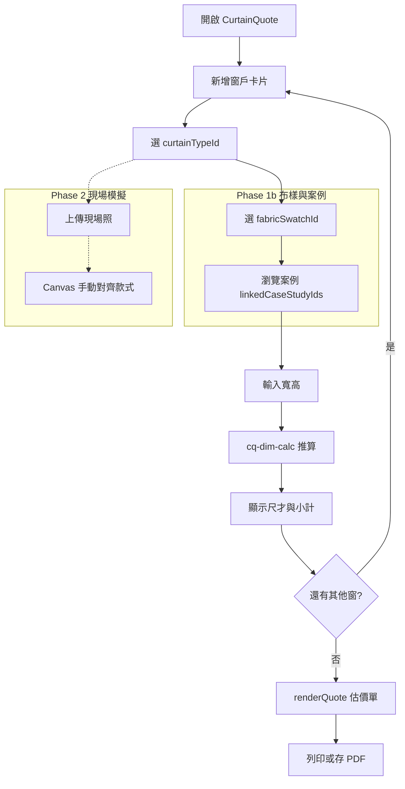

# 窗簾自助估價系統 — 技術規格書

> **編號**：16  
> **版本**：2026-06-18 v0.3（草案）  
> **狀態**：草案；試作實作目標見 `tools/CurtainQuote.html`（尚未建立）  
> **關聯**：`[14_室內裝修快速報價系統規格書.md](./14_室內裝修快速報價系統規格書.md)`、`[專案全域資料字典.md](./專案全域資料字典.md)` §7、`[04_互動式室內設計規劃工具規格書.md](./04_互動式室內設計規劃工具規格書.md)`

---

## 0. 產品背景與商業目標

### 0.1 為什麼要做

添心除裝修工程外，亦販售**窗簾布、軌道與安裝**等軟裝。業主在現場或線上常需快速了解「這幾扇窗大概多少錢」，但現有 CODING 工具僅有木作**窗簾盒**（尺）估價，見快速報價試作 `curtain_lk` / `curtain_m` / `curtain_sec`，**不含**布簾／軌道／電動等品項。

本模組補上**客戶可自助操作**的窗簾估價：一頁輸入多扇窗、選種類、量寬高，系統推算布料才數與軌道尺數，產出估價單。**現場照片與款式模擬**列第二階段，不阻擋第一版上線。

### 0.2 使用對象與時機

本模組採**同一套頁面、雙軌操作模式**（見 §5.4）：外部客戶看簡化版；內部人員開啟「人員模式」後多了案號、覆寫單價、內部備註等，不必維護兩套程式。


| 對象         | 時機          | 能力                                |
| ---------- | ----------- | --------------------------------- |
| **業主（客戶）** | 現場量窗、選款前試算  | 選大類→種類、量寬高、看白話說明、估價單、列印／存 PDF     |
| **設計師／業務** | 陪客戶現場、或事後對價 | 人員模式：綁案號、複製多窗、匯入客戶 JSON、內部備註、單價覆寫 |
| **價本管理員**  | 維護品項與規則     | 管理員頁：種類、材質檔、尺寸級距表、倍率、加購、對雲端表      |


**對外入口**：獨立 URL 或官網／LINE 連結，**不需登入**。  
**對內入口**：SPA `#/curtain-quote` 或同頁 `?mode=staff`（權限 ≥ 5 或 PIN，實作時對齊員工 `權限`）。

首版客戶端不強制填聯絡方式；僅在「傳給設計師」時出現姓名／電話欄。

### 0.3 商業風險與假設

- **工項與單價維護**：窗簾試算表分頁尚在整理；MVP **先手動價本**，定稿後再接 Google gviz（語意同 SPEC/14 §1.4.5（四））。
- **法律與合約免責**：產出為「估價參考」；寬高由客戶自填；實際以現場複尺、選料、窗型為準。估價單**強制**顯示免責區塊。
- **現場網路**：預設有 4G／Wi‑Fi；MVP 以 `localStorage` 暫存草稿，不要求離線完整功能。
- **與窗簾盒區隔**：本模組計價對象為**窗簾布／軌道／安裝／電動**；木作**窗簾盒**仍歸快速報價（SPEC/14），兩者 id 前綴不得混用。

---

## 1. 模組定位與邊界

### 1.1 定位

提供**清單式、客戶友善**的窗簾估價：使用者依「窗」為單位選種類、輸入開口寬高，系統依可設定規則推算**軌道台尺**、**布料才數**與加購項，計算金額並匯出估價單。

### 1.2 與其他模組的分工


| 維度   | LayoutPlanner（SPEC/04） | 快速報價 QR v2（SPEC/14） | **本模組（窗簾估價）**     |
| ---- | ---------------------- | ------------------- | ----------------- |
| 輸入主力 | 2D 圖面、物件幾何             | 房型坪數、分區工項勾選         | **每窗**種類 + 寬高（cm） |
| 計價驅動 | 幾何面積／才                 | 坪數規則 × 品項單價         | **才／尺公式** × 窗簾價本  |
| 窗簾相關 | 無專用品項                  | 僅**窗簾盒**（尺）         | **布簾、軌道、安裝、電動**   |
| 適用場景 | 平面配置與細部尺寸              | 全案裝修初估              | 窗簾專案、客戶自助試算       |


三者**不**共用畫布或房型推估狀態；若未來整合，僅透過**案號、匯出 JSON、明細列**等明確介面交換。

### 1.3 不在本 SPEC 範圍內（除非另開子章）

- 金流、合約電簽、發票開立。  
- 透視圖 AI 自動量窗（可列未來 Phase 3+）。  
- 多租戶 SaaS 計費。  
- 木作窗簾盒施工估價（見 SPEC/14）。

### 1.4 實務單位與常數

與添心設計助理及 LayoutPlanner 對齊：


| 常數             | 值        | 用途                |
| -------------- | -------- | ----------------- |
| `SHAKU_CM`     | **30.3** | 1 台尺（cm）；軌道長度換算   |
| `CAI_SIDE_CM`  | **30.3** | 1 才邊長（cm）；才數面積換算  |
| `CAI_PER_PING` | **36**   | 1 坪 ≈ 36 才（參考顯示用） |


**進位規則（預設，管理員可於規則層覆寫）**：

- 台尺：`Math.max(1, Math.ceil(軌道長_cm / SHAKU_CM))`  
- 才數：`Math.max(1, Math.ceil(布寬_cm × 布高_cm / (CAI_SIDE_CM × CAI_SIDE_CM)))`  
- 金額小計：`Math.round(數量 × 單價)`（整數元）

---

## 2. 窗簾種類與計價語意

### 2.1 產品分類（客戶選擇第一步）

客戶先選**大類**（降低選項焦慮），再選**具體種類**。內部價本仍以 `curtainTypeId` 為鍵。


| `curtainCategoryId` | 客戶顯示   | 包含種類（§2.2）    |
| ------------------- | ------ | ------------- |
| `cat_soft`          | 布簾／紗簾類 | 布簾、紗簾、穿透簾、蛇行簾 |
| `cat_shade`         | 捲簾／調光類 | 捲簾、調光簾、羅馬簾    |
| `cat_structured`    | 百葉／蜂巢類 | 蜂巢簾、百葉簾       |


每種類在價本可設 `**customerHint`**（一句白話，例：「調光簾可調節進光，適合客廳」）與 `**measureHint**`（量法提示，例：「量窗洞內緣寬高」）。

### 2.2 支援種類（`curtainTypeId`）

管理員可擴充。**顯示名**給客戶；**id** 與快速報價 `curtain_*`（窗簾盒）分離。軟質類用 `fabric_*`、結構簾用 `blind_*` 前綴。

#### （一）軟質布簾類


| `curtainTypeId`      | 客戶顯示名   | 主計價     | 預設規則摘要                                     |
| -------------------- | ------- | ------- | ------------------------------------------ |
| `fabric_drape`       | 布簾      | 才 + 軌道尺 | 褶倍率 2.0；子選 `blackoutLevel`（全遮光／半遮光／裝飾）換價本檔 |
| `fabric_sheer`       | 紗簾      | 才 + 軌道尺 | 褶倍率 2.0；採光隱私用                              |
| `fabric_sheer_light` | **穿透簾** | 才 + 軌道尺 | 與紗簾同公式；**材質檔單價不同**（透光不透人、偏功能性布料）           |
| `fabric_wave`        | 蛇行簾     | 才 + 軌道尺 | 褶倍率 1.5–1.8；需蛇行軌                           |


#### （二）捲收／調光類


| `curtainTypeId` | 客戶顯示名   | 主計價     | 預設規則摘要                               |
| --------------- | ------- | ------- | ------------------------------------ |
| `fabric_roller` | 捲簾      | 才 或 式   | `cai_only` 倍率 1.0；或廠商 `size_bracket` |
| `blind_dimming` | **調光簾** | 才 或 級距式 | 斑馬／日夜簾；面積才或依寬高級距表（§3.7）              |
| `fabric_roman`  | 羅馬簾     | 才 或 式   | 同捲簾                                  |


#### （三）結構簾類


| `curtainTypeId`  | 客戶顯示名   | 主計價     | 預設規則摘要                       |
| ---------------- | ------- | ------- | ---------------------------- |
| `blind_cellular` | **蜂巢簾** | 才 或 級距式 | 面積才（寬×高）；中空結構常見廠商級距報價        |
| `blind_venetian` | **百葉簾** | 才 或 式   | 木／塑鋼／鋁；`cai_only` 或級距；框內安裝多見 |


#### （四）加購（非獨立窗種類）


| id                   | 客戶顯示   | 計價  | 說明                                  |
| -------------------- | ------ | --- | ----------------------------------- |
| `addon_motor`        | 電動     | 式／窗 | 適用捲簾、調光簾、蜂巢簾、百葉簾等                   |
| `addon_double_layer` | 布＋紗雙層  | —   | 第二層才數列                              |
| `addon_double_track` | 雙軌     | 式／窗 | 布紗分軌                                |
| `addon_high_ceiling` | 超高安裝   | 式／窗 | 高度超過 `highCeilingThresholdCm` 時建議勾選 |
| `addon_bay_window`   | 凸窗／L 型 | 式／組 | `windowShape` 為 `bay`／`l_shape` 時   |


**安裝費**：每種類可設 `installLumpPerWindow`（元／窗）。

### 2.3 材質檔（`fabricGradeId`，選填）

布簾／穿透簾／紗簾等可再選**材質系列**（管理員維護），影響單價、不影響才數公式：


| 欄位                  | 說明                            |
| ------------------- | ----------------------------- |
| `fabricGradeId`     | 如 `grade_std`、`grade_premium` |
| `label`             | 客戶可見（例：標準布、進口布）               |
| `fabricPricePerCai` | 覆寫該材質才價（若設）                   |
| `swatchImageUrl`    | Phase 2 模擬用色卡圖                |


客戶端可只顯示 2–3 檔材質系列，避免選項過多；人員模式可顯示完整價本檔名。  
**具體花色**改由 §2.5 **布樣庫**承載（一個材質系列下可有多款布樣）。

### 2.5 布樣庫（`fabricSwatches[]`，客戶可選）

客戶在選定種類（與選填材質系列）後，進入**布樣選擇**：以縮圖網格挑花色，選中後寫入該窗 `fabricSwatchId`，並：

- **更新單價**（布樣可覆寫 `fabricPricePerCai`）  
- **供模擬貼圖**（`swatchTextureUrl` 疊於現場照或案例照）  
- **印在估價單**（布樣名稱＋色號，避免只寫「布簾」）


| 欄位                  | 說明                     |
| ------------------- | ---------------------- |
| `fabricSwatchId`    | 如 `swatch_lin_01`      |
| `label`             | 客戶可見（例：亞麻米灰）           |
| `vendorCode`        | 廠商色號；人員模式顯示            |
| `curtainTypeIds`    | 適用種類（空陣列＝該大類全適用）       |
| `fabricGradeId`     | 所屬材質系列（可選）             |
| `fabricPricePerCai` | 才價；覆寫材質系列價             |
| `swatchImageUrl`    | 色卡縮圖（必填，客戶選樣用）         |
| `swatchTextureUrl`  | 模擬用大圖／可平鋪紋理（Phase 2）   |
| `colorHex`          | 無紋理時模擬 fallback        |
| `tags`              | 標籤：`nordic`、`kids`…供篩選 |
| `visibleToClient`   | 是否對外上架                 |
| `sortOrder`         | 排序                     |


**客戶 UX**：

1. 種類選定後顯示「**選布樣**」區：預設篩選該 `curtainTypeId` 可用布樣。
2. 可切換「只看標準價／進口價」等材質系列 Tab（對應 `fabricGradeId`）。
3. 點縮圖即選中；估價單與 JSON 帶 `fabricSwatchId`＋`label`。
4. 未選布樣時：用材質系列均價或該種類預設才價，估價單註明「花色現場確認」。

**人員 UX**：可搜尋 `vendorCode`、顯示停售布樣、替客戶代選。

### 2.6 案例照片庫（`caseStudies[]`，可連結參考）

供客戶在選款時看**完工實例**，建立信任、減少「想像不出來」。與 §8 現場照模擬互補：案例庫是**公司精選作品集**；現場照是**客戶自己家**。


| 欄位                | 說明                        |
| ----------------- | ------------------------- |
| `caseStudyId`     | 如 `case_lk_wave_01`       |
| `title`           | 例：信義區客廳｜蛇行簾＋穿透簾           |
| `roomLabel`       | 空間標籤（客廳、主臥…）              |
| `curtainTypeIds`  | 此案使用的種類（可多）               |
| `fabricSwatchIds` | 此案使用的布樣（可多；可「一鍵套用」）       |
| `thumbnailUrl`    | 列表縮圖                      |
| `imageUrls`       | 多張案例圖（lightbox 輪播）        |
| `summary`         | 一句說明（坪數、風格、遮光需求等，選填）      |
| `sourceUrl`       | 外連（官網部落格、IG、Firebase CDN） |
| `案號`              | 內部關聯（人員可見；客戶端可隱藏）         |
| `visibleToClient` | 是否對外顯示                    |
| `sortOrder`       | 排序；可設 `featured` 精選       |


**客戶 UX**：

1. 選種類或布樣時，側欄／下方出現「**類似案例**」（依 `curtainTypeId`／`fabricSwatchId` 篩選）。
2. 點案例 → 大圖輪播；若有綁 `fabricSwatchIds`，顯示「**套用此案例布樣**」按鈕。
3. 估價單選填區塊「**參考案例**」：列出客戶瀏覽過或勾選的案例縮圖＋標題（列印可選）。
4. 圖片一律走 **HTTPS URL**（官網媒體、Firebase Storage）；管理員頁填連結即可，不必上傳二進位到價本 JSON。

**內容來源（建議）**：

- 官網 `tanxin.space` 窗簾／窗簾盒相關文章與媒體庫  
- 案場完工照（經客戶同意且已模糊化地址）  
- 廠商型錄連結（僅參考、標註「圖為廠商示意」）

### 2.7 與雲端「添心設計標準計價表」

- 目標工作表名稱：`**窗簾`**（或管理員自訂 `priceSheetTab`）。  
- 現況：`BudgetWeb_Standalone.html` 與 SPEC/11 **刻意排除**分頁名含「窗簾」之工作表；待分頁定稿後，本模組 Phase 2 啟用 gviz 讀價，並評估是否解除排除。  
- 讀取格式（與 SPEC/14 一致）：**A＝品項、B＝單位、C＝單價**；比對鍵為 `priceSheetItem`。  
- MVP：**不依賴**雲端表；管理員頁手動維護 `typeDefs` + `addonDefs`。

---

## 3. 尺寸推算規則

### 3.1 客戶輸入（每窗）


| 欄位   | 變數名                  | 格式              | 必填  | 說明                                                     |
| ---- | -------------------- | --------------- | --- | ------------------------------------------------------ |
| 窗戶識別 | `curtainWindowId`    | `String`        | 是   | 前端產生 UUID 或 `win-1`                                    |
| 空間名稱 | `roomLabel`          | `String`        | 是   | 如「主臥」「客廳」；可下拉 + 自填                                     |
| 窗簾種類 | `curtainTypeId`      | `String`        | 是   | 見 §2.1                                                 |
| 開口寬  | `openingWidthCm`     | `Number`        | 是   | 客戶量「窗洞／需掛簾」寬度（cm）                                      |
| 開口高  | `openingHeightCm`    | `Number`        | 是   | 客戶量高度（cm）                                              |
| 品牌／型號 | `brandModel`       | `String`        | 否   | 色號、布款；估價單必印，不計價                                       |
| 布料單價 | `fabricPricePerMa` 或 `fabricPricePerCai` | `Number` | 是 | **每窗輸入**；布簾類為**元／碼**（§3.3.1），硬質簾為**元／才**（§3.3.2） |
| 開法   | `openStyle`          | `String`        | 否   | `single`／`double`；布簾類；不計價                                 |
| 收法   | `pullDirection`      | `String`        | 否   | `left`／`right`／`both`；不計價                               |
| 層數   | `layerCount`         | `String`        | 否   | `single`／`double`；不計價                                    |
| 軌道型式 | `trackType`        | `String`        | 否   | `straight`／`curved`；不計價                                  |
| 安裝方式 | `mountType`          | `String`        | 否   | `ceiling`（頂裝）／`inside`（框內）／`wall`（壁裝）；預設依種類            |
| 落地類型 | `dropType`           | `String`        | 否   | `floor`（落地）／`sill`（窗台）；預設 `floor`                      |
| 窗型   | `windowShape`        | `String`        | 否   | `standard`／`bay`（凸窗）／`l_shape`／`floor_to_ceiling`（落地窗） |
| 材質檔  | `fabricGradeId`      | `String`        | 否   | 材質系列（§2.3）                                             |
| 布樣   | `fabricSwatchId`     | `String`        | 否   | 具體花色（§2.5）；影響單價與估價單品名                                  |
| 參考案例 | `linkedCaseStudyIds` | `Array<String>` | 否   | 客戶勾選或瀏覽後連結之 `caseStudyId`                              |
| 遮光等級 | `blackoutLevel`      | `String`        | 否   | `full`／`semi`／`decor`；僅 `fabric_drape`                 |
| 備註   | `clientNote`         | `String`        | 否   | 客戶可見；可併入估價單                                            |
| 內部備註 | `internalNote`       | `String`        | 否   | **僅人員模式**；不印客戶估價單                                      |
| 單價覆寫 | `staffPriceOverride` | `Number`        | 否   | **僅人員模式**；覆寫該窗小計前之單價係數或固定調整（實作二選一）                     |


**合理區間（防呆，可組態）**：

- `openingWidthCm`：30–600  
- `openingHeightCm`：30–350

超出時警告但仍允許送出（特殊窗型）；估價單標示「客戶自填尺寸」。

### 3.2 管理員可調參數（`dimRules`，每種類一組）


| 參數鍵                      | 預設              | 說明                                                          |
| ------------------------ | --------------- | ----------------------------------------------------------- |
| `trackExtendEachSideCm`  | 15              | 軌道左右各延伸（cm）                                                 |
| `fullnessRatio`          | 2.0             | 布簾／紗簾褶倍率（布寬 = 開口寬 × 倍率）                                     |
| `topAllowanceCm`         | 15              | 布高上方余量                                                      |
| `bottomAllowanceFloorCm` | 10              | 落地時下方拖曳（cm）                                                 |
| `bottomAllowanceSillCm`  | 0               | 窗台時下方余量                                                     |
| `pricingMode`            | `fabric_panel_ma` | `cai_and_track`／`fabric_panel_ma`／`cai_only`／`lump_per_window`／`size_bracket` |
| `highCeilingThresholdCm` | 280             | 超過建議勾 `addon_high_ceiling`                                  |
| `sizeBracketTableId`     | —               | `pricingMode === size_bracket` 時指向 §3.7 級距表                 |


**各類預設 `pricingMode` 建議**：


| 種類            | 預設 `pricingMode`                       |
| ------------- | -------------------------------------- |
| 布簾、紗簾、穿透簾、蛇行簾 | `fabric_panel_ma`（§3.3.1 試算表） |
| 捲簾、羅馬簾        | `cai_only` 或 `size_bracket`            |
| 調光簾、蜂巢簾、百葉簾   | `size_bracket` 或 `cai_only`（總監依廠商慣例定稿） |


### 3.3 推算公式（`cai_and_track` 模式 — 簡化才數版，硬質簾以外備用）

```
軌道長_cm = openingWidthCm + 2 × trackExtendEachSideCm
軌道台尺 = max(1, ceil(軌道長_cm / SHAKU_CM))

布寬_cm = openingWidthCm × fullnessRatio
布高_cm = openingHeightCm + topAllowanceCm + (dropType === 'floor' ? bottomAllowanceFloorCm : bottomAllowanceSillCm)
布料才數 = max(1, ceil(布寬_cm × 布高_cm / (CAI_SIDE_CM × CAI_SIDE_CM)))
```

> **實作優先序**：布簾／紗簾／穿透簾／蛇行簾以 **§3.3.1 試算表公式** 為準（`pricingMode: fabric_panel_ma`）；捲簾等硬質簾見 §3.3.2。

### 3.3.1 布簾類試算表公式（`fabric_panel_ma`，對齊 `窗簾試算表_20250104編修.xlsx`）

來源：試算表「工作表1」布簾列（窗寬 210 × 窗高 229 驗證總價 $6,100）。

**輸入**

| 變數 | 說明 | 預設 |
|------|------|------|
| `openingWidthCm` | 窗寬（cm） | 客戶輸入 |
| `openingHeightCm` | 窗高（cm） | 客戶輸入 |
| `fullnessRatio` | 布幅倍率 | 布簾／紗簾／穿透簾 **2.0**；蛇行簾 **3.0** |
| `fabricRollWidthCm` | 幅寬（一幅布寬） | **150** |
| `fabricPricePerMa` | 布料單價（**元／碼**） | **每窗輸入**（試算表範例 860） |
| `fabricMaFactor` | 布料係數 | 布簾／紗簾／穿透簾 **0.55**；蛇行簾 **0.65** |
| `trackPricePerShaku` | 軌道單價 | **40 元／尺** |
| `sewingPerPanel` | 車工（每幅） | **200 元／幅** |

**步驟 1 — 幅數**

```
需求布寬_cm = openingWidthCm × fullnessRatio
幅數 = ceil(需求布寬_cm / fabricRollWidthCm)
若 需求布寬_cm 可被 fabricRollWidthCm 整除，幅數再加 1
```

試算表 Excel：`ROUNDUP((窗寬×倍率)/150,0)+IF(MOD(窗寬×倍率,150)=0,1,0)`

**步驟 2 — 布錢（元／碼計價）**

```
有效布高碼 = (openingHeightCm + 30 + 15) / 90
布錢 = floor(幅數 × 有效布高碼 × fabricPricePerMa × fabricMaFactor)
```

試算表 Excel：`INT(幅數×(窗高+30+15)/90×單價/碼×0.55)`

**步驟 3 — 軌道**

```
軌道台尺 = ceil(openingWidthCm / 30)    ← 試算表以 30cm 為一尺，非 30.3
軌道費 = 軌道台尺 × trackPricePerShaku   （預設 40 元／尺）
```

試算表 Excel：`ROUNDUP(窗寬/30,0)×40`

**步驟 4 — 車工**

```
車工費 = 幅數 × sewingPerPanel   （預設 200 元／幅）
```

試算表 Excel：`幅數×200`

**步驟 5 — 安裝費（客戶報價用，試算表）**

```
若 窗寬 < 150cm：安裝費 = 400 + 400
否則：安裝費 = 400 + 50×ceil((窗寬−150)/30) + 400
```

試算表 Excel：`IF(窗寬<150,400,400+50×ROUNDUP((窗寬−150)/30,0))+400`  
（與師傅請款單 §3.3.3 分開；估價單可並列或擇一）

**該窗小計**

```
lineTotal = 布錢 + 軌道費 + 車工費 + 安裝費（+ 彎軌安裝加價，若勾選）
```

**驗算範例（布簾）**

| 項目 | 計算 | 金額 |
|------|------|------|
| 幅數 | ceil(420/150)=3 | 3 幅 |
| 布錢 | 3×(229+45)/90×860×0.55 | $4,320 |
| 軌道 | ceil(210/30)×40 | $280 |
| 車工 | 3×200 | $600 |
| 安裝 | 400+50×2+400 | $900 |
| **合計** | | **$6,100** |

### 3.3.2 硬質簾（`cai_only` — 捲簾／調光簾等）

```
布寬_cm = openingWidthCm
布高_cm = openingHeightCm + topAllowanceCm + bottomAllowance（依 dropType）
布料才數 = 同上才數公式
```

**每窗一式（`lump_per_window`）**：

- 數量固定 1，單位「式」；才數／尺數僅供參考顯示，不計入該品項金額（或隱藏）。

### 3.7 尺寸級距計價（`size_bracket`）

調光簾、蜂巢簾、百葉簾等廠商常報**寬高級距一口價**，不依才數乘單價。管理員維護 `sizeBracketTables[]`：


| 欄位              | 說明                                              |
| --------------- | ----------------------------------------------- |
| `id`            | 表 id，如 `bracket_dimming_std`                    |
| `curtainTypeId` | 綁定種類                                            |
| `fabricGradeId` | 可選；材質分級距                                        |
| `rows[]`        | `maxWidthCm`、`maxHeightCm`、`lumpPricePerWindow` |


**查表邏輯**：依 `openingWidthCm`、`openingHeightCm` 找**同時滿足**寬≤maxWidth 且 高≤maxHeight 的**最小適用列**；找不到則 fallback 到 `cai_only` 或標「需人工報價」（`requiresManualQuote: true`）。

估價單須註明「依級距表估算」或「超出表列範圍，請聯繫設計師」。

### 3.8 窗型與安裝加價


| `windowShape`      | 客戶說明    | 計價影響                           |
| ------------------ | ------- | ------------------------------ |
| `standard`         | 一般窗     | 無                              |
| `bay`              | 凸窗／連續多面 | 建議 `addon_bay_window` 或人員覆寫    |
| `l_shape`          | L 型窗    | 同上                             |
| `floor_to_ceiling` | 落地窗     | 高度防呆放寬；建議 `addon_high_ceiling` |


### 3.9 雙層（布＋紗）

勾選 `addon_double_layer` 時，同一窗產生**兩列明細**（或合併顯示兩小計）：

1. 布簾層：依 `fabric_drape` 規則與布簾單價。
2. 紗簾層：依 `fabric_sheer` 規則與紗簾單價（可獨立 `fullnessRatio`）。

軌道：預設**一軌雙層**仍計一筆軌道尺數；若價本區分雙軌，加購 `addon_double_track`（式／窗）。

### 3.10 電動加購

勾選後：`addon_motor` 數量 = 1（每窗），單位「式」，金額 = `addonDefs.addon_motor.price`。

### 3.11 推算結果（程式寫入，唯讀展示）


| 欄位     | 變數名                                                | 說明                                       |
| ------ | -------------------------------------------------- | ---------------------------------------- |
| 軌道台尺   | `computedTrackShaku`                               | 推算後台尺                                    |
| 布料才數   | `computedFabricCai`                                | 推算後才數（雙層時可有 `computedFabricCaiSheer`）    |
| 軌道長參考  | `computedTrackLengthCm`                            | 顯示用                                      |
| 布料寬高參考 | `computedFabricWidthCm` / `computedFabricHeightCm` | 顯示用                                      |
| 級距命中   | `pricingTierKey`                                   | `size_bracket` 時命中之列 id                  |
| 需人工報價  | `requiresManualQuote`                              | `true` 時客戶端不顯示金額                         |
| 該窗小計   | `lineTotal`                                        | 含布料、軌道、安裝、加購；人員 `staffPriceOverride` 後為準 |


客戶頁**展開區**必須顯示推算依據（白話範例）：

- 布簾類：「軌道約 5 尺、布料約 12 才」
- 調光簾／蜂巢簾（級距）：「依 M 級距（寬 180×高 220 以內）」
- 需人工報價：不顯示金額，改顯示聯繫方式

---

## 4. 價本與兩層設定

沿用 SPEC/14 §1.4.2a 語意：**單價層**與**計算規則層**分開。

### 4.1 單價層（`typeDefs`）

每筆窗簾種類或材質檔：


| 欄位                                 | 說明                           |
| ---------------------------------- | ---------------------------- |
| `id`                               | 與 `curtainTypeId` 或材質檔 id 對應 |
| `label`                            | 客戶可見品名                       |
| `fabricPricePerCai`                | 布料單價（元／才）；`lump` 模式可為 0      |
| `trackPricePerShaku`               | 軌道單價（元／尺）                    |
| `lumpPricePerWindow`               | 每窗一式單價（元／式）                  |
| `installLumpPerWindow`             | 安裝費（元／窗）                     |
| `unitFabric`                       | 預設 `才`                       |
| `unitTrack`                        | 預設 `尺`                       |
| `priceSheetTab` / `priceSheetItem` | Phase 2 gviz 對照              |
| `customerHint`                     | 客戶選種類時一句說明                   |
| `measureHint`                      | 量寬高示意文案                      |
| `curtainCategoryId`                | 所屬大類（§2.1）                   |
| `visibleToClient`                  | 是否對外顯示（隱藏停售品項）               |
| `clientNote`                       | 估價單預設併陳備註                    |


### 4.2 級距表層（`sizeBracketTables`）

見 §3.7；管理員頁以試算表風格編輯列（寬上限、高上限、一口價）。可匯出 CSV 與廠商報價單對照。

### 4.3 材質檔層（`fabricGrades`）

見 §2.3；`fabricGradeId`、`label`、`fabricPricePerCai`、`swatchImageUrl`。

### 4.4 規則層（`dimRules`）

以 `curtainTypeId` 為鍵，值為 §3.2 參數物件。管理員頁可「套用預設模板」後微調。

### 4.5 加購層（`addonDefs`）

`addon_motor`、`addon_double_layer`、`addon_double_track` 等：id、label、price、unit、clientNote。

### 4.6 本機儲存（試作）


| 鍵名                       | 內容                                            |
| ------------------------ | --------------------------------------------- |
| `cq_curtain_settings_v1` | 整包：…、`fabricSwatches`、`caseStudies`、…         |
| `cq_curtain_draft_v1`    | 草稿：`quoteMode`、`windows[]`、選填聯絡人、`案號`（人員）、時間戳 |


備份：管理員頁「匯出 JSON」／「匯入 JSON」。上線目標改伺服端，鍵名語意不變。

---

## 5. 使用者流程

### 5.1 客戶主流程（Phase 1）

1. **開啟頁面** → 簡短說明與免責；可展開「怎麼量」。
2. **＋ 新增一窗** → 空間名稱 → **大類 → 種類**（可選材質檔）。
3. **輸入寬、高（cm）** → 即時顯示推算尺／才與小計。
4. 重複 2–3 直至所有窗戶輸入完畢。
5. **底部估價單**：明細、合計、免責 → **列印**或瀏覽器存 PDF。
6. （選填）匯出 JSON 或填聯絡方式供設計師聯繫。

### 5.2 管理員流程

1. 維護大類、種類、材質檔、級距表、倍率、加購。
2. 設定免責文案、價本版本日期；標記 `visibleToClient`。
3. 匯出／匯入設定 JSON。
4. （Phase 2）gviz 讀入「窗簾」分頁更新單價。

### 5.3 內部人員流程（`quoteMode: staff`）

1. 開啟人員模式（SPA 登入或 `?mode=staff` + 權限）。
2. 可填 `**案號`** 綁定案場；從案場帶入地址顯示於估價單抬頭（唯讀）。
3. **批次操作**：複製窗戶、複製到多個空間、整批套用同種類。
4. **匯入客戶 JSON**（客戶傳來的草稿）→ 微調後重出正式估價單。
5. `**internalNote`**、`**staffPriceOverride**`；列印時可選「客戶版／含內部備註版」。
6. 匯出 JSON／列印後，Phase 3+ 可寫入 Firebase 或傳 LINE 給客戶。

### 5.4 雙軌介面差異（同一 HTML）


| 能力    | 客戶模式 `client`                      | 人員模式 `staff`               |
| ----- | ---------------------------------- | -------------------------- |
| 選種類   | 三步：大類→種類→（選填）材質檔                   | 可下拉直選 id；顯示停售品             |
| 布樣    | 縮圖網格選 `fabricSwatchId`             | 可搜色號；可代選停售布樣               |
| 案例    | 瀏覽／釘選 `linkedCaseStudyIds`；可套用案例布樣 | 可綁案號案例；顯示未上架案例             |
| 量寬高   | 圖示教學 + `measureHint`               | 同左；可輸入複尺後尺寸                |
| 窗型／加購 | 簡化（常見項）                            | 全開；凸窗、超高預設提示               |
| 估價單   | 僅 `clientNote`                     | 可含 `internalNote` 欄（第二版列印） |
| 案號    | 不顯示                                | 可填可帶                       |
| 單價    | 唯讀                                 | 可覆寫                        |
| 匯入匯出  | 匯出 JSON 自留                         | 匯入客戶檔 + 匯出                 |


### 5.5 客戶教育（降低量錯）

- 頂部常駐「**怎麼量**」摺疊：圖示標寬（窗洞內緣）、高（地面至軌道安裝線）。  
- 輸入時旁顯示「約幾尺、幾才」換算，減少對單位陌生。  
- 第一扇窗完成後顯示「已估 N 扇，還可繼續新增」進度提示。

### 5.6 流程圖




---

## 6. 畫面與實作檔案

### 6.1 客戶頁 `tools/CurtainQuote.html`


| 區塊        | 行為                                                        |
| --------- | --------------------------------------------------------- |
| 頂部        | 標題、免責、價本版本；客戶：「怎麼量」；人員：案號列                                |
| 窗戶清單      | 「＋ 新增一窗」「複製此窗」「複製到…」（人員）                                  |
| 每卡        | 大類→種類→材質系列→**布樣網格**；**類似案例**區；寬高；加購；推算結果                  |
| 底部 sticky | 估價明細表、合計、列印鈕                                              |
| 樣式        | 手機優先；按鈕 min-height ≥ 44px；沿用 QR v2 human-comfortable 類名慣例 |


### 6.2 管理員頁 `tools/CurtainQuote_admin.html`

- 編輯 `typeDefs`、`fabricGrades`、`**fabricSwatches`**、`**caseStudies**`、`dimRules`、`sizeBracketTables`、`addonDefs`。  
- 布樣：上傳或貼 **圖片 URL**、綁定種類／才價、排序與上下架。  
- 案例：縮圖＋多圖 URL、綁定種類／布樣、外連 `sourceUrl`、精選標記。  
- 試算表 ID + gviz（Phase 2）。  
- 匯出／匯入 `cq_curtain_settings_v1`。

### 6.3 JS 模組 `tools/curtain-quote/`


| 檔案                    | 職責                                              |
| --------------------- | ----------------------------------------------- |
| `cq-config-state.js`  | 預設價本、載入／儲存 localStorage                         |
| `cq-dim-calc.js`      | §3 公式；輸入驗證                                      |
| `cq-run.js`           | DOM、多窗 CRUD、即時重算                                |
| `cq-quote-render.js`  | 估價單 HTML、`window.print`                         |
| `cq-persist.js`       | 草稿讀寫                                            |
| `cq-swatch-picker.js` | 布樣網格、篩選、選中狀態                                    |
| `cq-case-gallery.js`  | 案例列表、lightbox、套用布樣                              |
| `cq-photo-sim.js`     | **Phase 2**；現場照 Canvas 疊圖（用 `swatchTextureUrl`） |


### 6.4 SPA 整合

- `spa/app.js`：`#/curtain-quote` → iframe `tools/CurtainQuote.html`  
- `spa/Dashboard.js`：入口卡片（實作時同步更新）  
- 亦可獨立 URL 嵌入官網或 LINE 圖文選單（不需改 SPA）

---

## 7. 估價單輸出

### 7.1 明細列（每窗至少一列；雙層、加購可拆多列）


| 欄（顯示） | 資料來源                                        |
| ----- | ------------------------------------------- |
| 空間    | `roomLabel`                                 |
| 品項    | `typeDefs.label` + **布樣 `label`**／色號 + 加購說明 |
| 參考案例  | `linkedCaseStudyIds` → 案例標題縮圖（選填列印）         |
| 開口尺寸  | `openingWidthCm × openingHeightCm` cm       |
| 推算尺寸  | 軌道 n 尺、布料 m 才（參考）                           |
| 數量    | 才／尺／式                                       |
| 單價    | 價本                                          |
| 小計    | `lineTotal`                                 |


### 7.2 合計與免責

- **合計**：各窗 `lineTotal` 加總；是否含稅由 `taxMode` 組態（`excluded`／`included_5`），預設**未稅**，估價單註明。  
- **免責**（預設文案，管理員可改）：  
  - 本估價依客戶自填寬高與系統推算，僅供參考。  
  - 實際費用以現場複尺、窗型、選料與安裝難度為準。  
  - 需求與細節請與添心設計師確認後始得報價定案。

### 7.3 輸出管道


| 管道                         | Phase | 說明                               |
| -------------------------- | ----- | -------------------------------- |
| 網頁即時表                      | 1     | 必做                               |
| 列印／存 PDF                   | 1     | `@media print`、`.no-print`       |
| 匯出 JSON                    | 1     | 檔名建議 `curtain-quote-{date}.json` |
| Firebase `quotations/{案號}` | 3+    | 對齊 BudgetWeb schema，選做           |
| LINE／Email 分享              | 3+    | 需後端，選做                           |


---

## 8. 布樣選擇、案例照片與現場模擬

本章涵蓋三層視覺輔助，由淺到深；**布樣選擇**與**案例連結**應儘早與 Phase 1 估價同頁上線（至少文字＋縮圖），現場 Canvas 模擬可稍後。


| 層級  | 功能         | 主要資料                     | 預定 Phase     |
| --- | ---------- | ------------------------ | ------------ |
| 1   | **布樣選擇**   | `fabricSwatches[]`       | **1b**（估價同頁） |
| 2   | **案例照片連結** | `caseStudies[]`          | **1b**       |
| 3   | **現場照模擬**  | `photoLocalRef` + Canvas | **2**        |


### 8.1 布樣選擇（Phase 1b，與估價同頁）

**目標**：客戶選完種類後能點選真實色卡縮圖，單價與估價單品名跟著變。

1. 載入 `fabricSwatches` 中 `visibleToClient` 且適用當前 `curtainTypeId` 的項目。
2. 網格顯示 `swatchImageUrl`＋`label`；選中框線＋勾選。
3. 寫入 `fabricSwatchId`；重算 `lineTotal`（才數不變、才價變）。
4. 調光簾／蜂巢簾／百葉簾若用級距表：布樣可只影響**展示名稱**與模擬色，價格仍走級距（或管理員為特定布樣設獨立級距表 id）。
5. 估價單品名範例：「布簾｜亞麻米灰（色號 LX-102）」。

**管理員**：首批至少每大類 3–5 款布樣縮圖，避免空網格。

### 8.2 案例照片連結（Phase 1b）

**目標**：客戶不用離開估價頁就能看「別人家怎麼做」。

1. 種類／布樣變更時，載入符合的 `caseStudies`（`featured` 優先）。
2. 橫向滑動卡片：`thumbnailUrl`＋`title`；點擊全螢幕 lightbox 輪播 `imageUrls`。
3. **連結案例**：客戶可「釘選」到該窗 `linkedCaseStudyIds`（供估價單與傳給設計師）。
4. **套用案例布樣**：若案例含 `fabricSwatchIds`，一鍵寫入該窗 `fabricSwatchId` 並重算。
5. `sourceUrl` 可選「在官網看更多」外開新分頁。
6. 圖片載入失敗：顯示占位圖＋標題，不阻擋估價。

**與官網整合**：案例 `sourceUrl` 可指向 `tanxin.space` 窗簾相關文章；圖片 URL 建議用官網 CDN 或 Firebase，避免 hotlink 失效。

### 8.3 現場照片與款式模擬（Phase 2）

**目標**：上傳**自己家**照片，疊上已選**布樣紋理**預覽效果。

1. 每窗可選填 `photoLocalRef`（本機；預設不上傳雲端）。
2. Canvas 顯示現場照；以 `swatchTextureUrl` 或 `colorHex` 疊於窗區；**拖曳／縮放**對齊。
3. 已選 `fabricSwatchId` 時自動帶入對應紋理；未選則用色票 picker。
4. 可選「與案例對照」：並排顯示 `caseStudy` 大圖與現場模擬（僅畫面，不影響計價）。
5. 列印估價單時可勾選「附模擬截圖」或「附參考案例縮圖」。

### 8.4 刻意不做（Phase 2 範圍外）

- Gemini／Vision **自動抓窗框**（列 Phase 3+ 評估）。  
- 模擬圖對外承諾「完工樣貌」；文案定位為**款式參考**。

### 8.5 照片隱私與版權

- **現場照**：預設僅本機；客戶主動「傳給設計師」時才上傳。  
- **案例照**：僅放已授權之完工照；管理員負責 `visibleToClient` 與是否標註案號。  
- 壓縮參考：`browser-image-compression`（與 `reportV3.html` 一致）。

---

## 9. 角色與權限


| 角色    | 能力                                         |
| ----- | ------------------------------------------ |
| 訪客／客戶 | 使用 `CurtainQuote.html`、草稿本機暫存、列印           |
| 價本管理員 | `CurtainQuote_admin.html`；正式環境應 PIN／權限 ≥ 8 |
| 設計師   | 客戶頁 + 匯入客戶 JSON、關聯案號（Phase 3+）             |


身分來源與現有 SPA／員工 `權限` 對齊時，欄位名以 `專案全域資料字典.md` 為準。

---

| 價本管理員 | `CurtainQuote_admin.html`；PIN／權限 ≥ 8 |
| 設計師／業務 | 人員模式客戶頁；匯入 JSON、案號、覆寫（權限 ≥ 5，數值可調） |

---

## 13. 仍待補齊／分階段項目（自查清單）

以下為 v0.2 盤點後**尚未寫入計價公式、但產品應知**的缺口；實作與價本定稿時逐項勾除。

### 13.1 產品與價本


| 缺口                       | 建議處理                           | 優先  |
| ------------------------ | ------------------------------ | --- |
| 調光簾／蜂巢簾／百葉簾**廠商級距表**實際數字 | 管理員頁建表；與試算表「窗簾」分頁對齊            | P0  |
| 穿透簾 vs 紗簾**材質檔**分價       | `fabricGrades` 分開維護            | P0  |
| 百葉材質（木／塑鋼／鋁）分價           | `fabricGradeId` 或獨立 `typeDefs` | P1  |
| 軌道種類（普通／蛇行／電動軌）分價        | 加購或 `trackGradeId`             | P1  |
| 保固與交期**說明文案**            | 估價單 footer，管理員可編               | P2  |


### 13.2 內部營運


| 缺口                       | 建議處理                                     | 優先  |
| ------------------------ | ---------------------------------------- | --- |
| 估價歷史與**版次**（誰改了什麼）       | Phase 3 Firebase + `AuditLog` 或本機匯出檔名含日期 | P1  |
| 客戶草稿**回傳管道**（LINE／Email） | Phase 4；MVP 用 JSON 檔傳                    | P2  |
| 與**案場主控台**帶案號、地址         | 人員模式讀 SPA `userProfile`／案場快取             | P1  |
| **毛利率**顯示（成本價本）          | 人員模式選用；成本欄不給客戶                           | P3  |
| 廠商下單格式匯出                 | 未來對接窗簾工廠 CSV                             | P3  |


### 13.3 客戶體驗


| 缺口                   | 建議處理          | 優先  |
| -------------------- | ------------- | --- |
| 量法**示意圖**（靜態 SVG）    | Phase 1 必做    | P0  |
| 官網／LINE **固定連結**與 QR | 部署時一併提供       | P1  |
| 分享後**繼續編輯**（雲端草稿 id） | Phase 4       | P2  |
| 多語系                  | 不在 MVP        | —   |
| 無障礙（螢幕報讀）            | 基本 label；進階後續 | P3  |


### 13.4 技術與整合


| 缺口                                | 建議處理                                           | 優先  |
| --------------------------------- | ---------------------------------------------- | --- |
| 解除 BudgetWeb「窗簾」分頁排除              | 表定稿後與 SPEC/11 同步改                              | P1  |
| `PROJECT_DATA_DICTIONARY` §7 持續對齊 | 每次加欄先改字典                                       | 持續  |
| 與快速報價**整案合併**估價單                  | 未來 JSON 交換；不共用 UI                              | P3  |
| 照片模擬貼圖庫                           | **併入 `fabricSwatches.swatchTextureUrl`**（§2.5） | P1b |
| 官網案例圖**批次匯入**                     | 管理員從媒體 URL 貼上或 CSV                             | P2  |


### 13.5 法務與信任


| 缺口              | 建議處理                        | 優先  |
| --------------- | --------------------------- | --- |
| 客戶自填尺寸之**免責**   | 已有；列印必出                     | P0  |
| 級距表過期與**價本版本日** | 估價單印 `priceBookVersionDate` | P0  |
| 個資（電話）**蒐集告知**  | 「傳給設計師」勾選時顯示一句              | P1  |


---

## 14. 分階段交付（更新）


| Phase     | 內容                           | 驗收要點               |
| --------- | ---------------------------- | ------------------ |
| **0**     | SPEC v0.3 + 字典；種類與級距樣本       | 含四種新簾＋布樣／案例欄位      |
| **1**     | 多窗估價 + 人員模式 + 級距表 + 列印 + 量法圖 | 6 種類試算正確           |
| **1b**    | **布樣選擇** + **案例照片庫**（與估價同頁）  | 選布樣改價；案例可釘選／一鍵套用布樣 |
| **2**     | 現場照 Canvas 模擬（用已選布樣紋理）       | 同頁預覽；可併入列印         |
| **3**     | gviz 讀價；SPA／官網入口             | 單價與表同步             |
| **4**（選做） | Firebase、案號、LINE 分享          | 業務接案               |


---

## 15. 驗收清單

### Phase 1

1. 至少各測一窗：**布簾、穿透簾、調光簾（級距）、蜂巢簾（級距）、百葉簾**。
2. 客戶模式：無案號、無內部備註；人員模式可綁案號並覆寫小計。
3. 級距表外尺寸顯示「需人工報價」，不顯示錯誤金額。
4. 關閉分頁再開，草稿仍在；人員匯入客戶 JSON 成功。
5. 手機列印 PDF 完整；與窗簾盒 id 無混淆。

### Phase 1b（布樣與案例）

1. 選布樣後估價單品名含布樣名／色號，金額隨才價變動。
2. 未選布樣仍可估價，並註明「花色現場確認」。
3. 案例庫依種類篩選；lightbox 可輪播；可釘選至 `linkedCaseStudyIds`。
4. 「套用此案例布樣」可寫入 `fabricSwatchId` 並重算。
5. 管理員可上下架布樣／案例（`visibleToClient`）。

---

## 16. 修訂紀錄


| 日期         | 版本   | 摘要                                                        |
| ---------- | ---- | --------------------------------------------------------- |
| 2026-06-18 | v0.4 | §3.3.1 布簾試算表公式（碼價、幅數、車工、軌道40/尺）；每窗布料單價 |
| 2026-06-18 | v0.2 | 四種窗簾、雙軌介面、級距計價、§13 缺口清單                                   |
| 2026-06-18 | v0.1 | 初稿                                                        |


---

**實作檔**（建立後須與本節對齊）：`tools/CurtainQuote.html`、`tools/CurtainQuote_admin.html`、`tools/curtain-quote/*.js`。與程式不一致時，**以程式為準**並回寫本 SPEC。