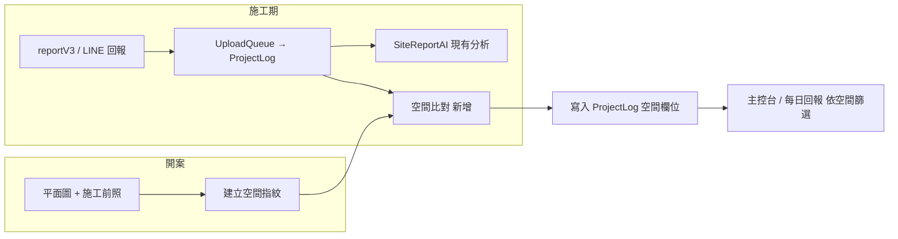
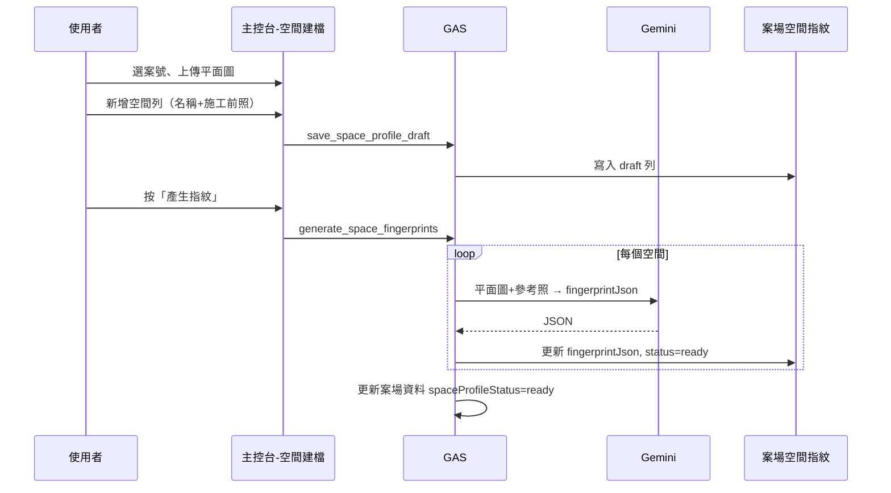

# 施工照空間視覺定位 — 開發規格書（v0.1 草稿）

> **狀態**：v0.1 規格草稿（2026-06-24）  
> **來源**：`添心系統擴充與 AI 導入開發備忘錄.md` §1  
> **相關**：`SITE_REPORT_AI_SPEC.md`（施工回報 AI）、`施工回報_系統完整_SPEC.md`、`專案全域資料字典.md`、`gemini-usage-policy` skill

---

## 一句話

**開案時**為每個空間建立 AI「視覺指紋」；**施工期**每張回報照自動比對指紋，標出最可能空間與信心分數；低信心時讓人點選修正。

---

## 要解決什麼

| 痛點 | 解法 |
|------|------|
| 照片全堆時間軸，難找「主臥那批」 | 每張照帶 `roomLabel`（自動或人工） |
| 師傅懶打空間名 | AI 從畫面判斷，人只處理不確定的 |
| 開案後格局就固定 | 用窗、樑、管線等**不會變的錨點**比對，不靠油漆顏色 |

**本階段不做**：3D 建模、精準量測、自動改驗收進度、發給客戶。

---

## 與現有系統的關係



| 已有 | 本功能怎麼接 |
|------|----------------|
| `ProjectLog` + `PhotoLinks` | 每張照多一筆空間判定結果 |
| `SiteReportAI.js` | **第二階段**併入同一背景 job；或 v0.1 獨立 `runSpaceMatch_` |
| `案場資料` Sheet | 加狀態欄「空間指紋是否就緒」 |
| Gemini 2.5 + UsageLog | 依 `gemini-usage-policy`；指紋建立與比對皆 `thinkingBudget: 0` |

---

## 分階段交付

### Phase 0 — 規格與 prompt 驗證（不動上線）

- 用 1 個真實案：平面圖 + 每空間 1 張施工前照 + 5 張施工照
- 手動跑 prompt，記錄準確率與常錯情境（雙臥、走廊、只拍局部）
- 產出固定 JSON schema（見下文）

### Phase 1 — MVP（建議先做）

1. 後端：開案建檔 API + `案場空間指紋` Sheet
2. 後端：回報照片寫入後背景比對（可與 SiteReportAI 分開排程）
3. 前端：主控台「空間建檔」簡頁 + 日誌卡顯示空間標籤 + 人工改標
4. **不做**：依空間重排整個工作區（留給備忘錄 §2）

### Phase 2 — 體驗與準度

- 累積高信心施工照 → 自動加入該空間參考照庫
- 主控台「依空間」篩選 / 摺疊時間軸
- 與 SiteReportAI 合併一次 Gemini 呼叫（省 token）
- Files API 大圖（見備忘錄 §6）

---

## 資料模型

> **規則**：新增欄位須同步更新 `專案全域資料字典.md`（§8、§9）。

### §8 案場空間指紋（新 Sheet：`案場空間指紋`）

一列 = 一個空間的一份指紋。

| Sheets 標題 | API 變數名 | 格式 | 說明 |
|-------------|-----------|------|------|
| FingerprintID | `FingerprintID` | String | ULID |
| 案號 | `案號` | String | 與 `ProjectLog.ProjectName` 同義（數字案號字串） |
| roomLabel | `roomLabel` | String | 空間名稱，如：客廳、主臥、次臥、玄關 |
| sortOrder | `sortOrder` | Number | 平面圖或 UI 排序 |
| status | `status` | String | `draft`／`ready`／`archived` |
| floorPlanImageUrl | `floorPlanImageUrl` | String | 該案平面圖 URL（可每列重複或僅首列） |
| referencePhotoUrls | `referencePhotoUrls` | String | 施工前參考照，半形逗號 CSV |
| fingerprintJson | `fingerprintJson` | String | AI 產出之指紋 JSON（見 §8.1） |
| fingerprintVersion | `fingerprintVersion` | String | schema 版號，如 `spf_v1` |
| CreatedAt | `CreatedAt` | Date | |
| UpdatedAt | `UpdatedAt` | Date | |
| CreatedBy | `CreatedBy` | String | LINE UID 或姓名 |

#### §8.1 `fingerprintJson` 結構（`spf_v1`）

```json
{
  "schema": "spf_v1",
  "roomLabel": "主臥",
  "anchors": [
    { "type": "window", "position": "南牆中央", "shape": "橫長窗", "notes": "單扇推拉" },
    { "type": "beam", "position": "門口上方", "notes": "外露樑 約 30cm" },
    { "type": "pipe", "position": "西牆角落", "notes": "排水管包覆前可見" }
  ],
  "layout": {
    "approxShape": "長方形",
    "doorCount": 1,
    "adjacentSpaces": ["走廊", "主浴"],
    "distinctiveNotes": "床頭牆有冷氣排水孔"
  },
  "visualCues": [
    "地坪舊磁磚米白色方塊",
    "天花板平頂無間接照明槽"
  ],
  "confidenceNotes": "與次臥主要差異：窗戶較大、西側有冷氣孔"
}
```

**建立指紋時輸入**：`roomLabel` + 平面圖（全案共用）+ 該空間 1～3 張施工前照。  
**禁止**在指紋裡寫施作後才會出現的工項（封板完成、油漆色號）當主要錨點。

### §9 ProjectLog 擴充欄位

| Sheets 標題 | API 變數名 | 格式 | 說明 |
|-------------|-----------|------|------|
| SpaceMatchJson | `SpaceMatchJson` | String | 本則回報每張照的空間判定（見 §9.1） |
| SpaceMatchAt | `SpaceMatchAt` | Date | 比對完成時間 |
| SpaceMatchModel | `SpaceMatchModel` | String | Gemini 模型 |
| SpaceMatchTokenUsage | `SpaceMatchTokenUsage` | Number | token 合計 |

#### §9.1 `SpaceMatchJson` 結構（`spm_v1`）

`photos` 順序對齊 `PhotoLinks` 逗號分割後的順序（與 SiteReportAI 分段規則一致）。

```json
{
  "schema": "spm_v1",
  "photos": [
    {
      "photoIndex": 1,
      "photoUrl": "https://...",
      "topMatch": { "roomLabel": "客廳", "confidence": 0.82 },
      "alternatives": [
        { "roomLabel": "餐廳", "confidence": 0.12 }
      ],
      "matchMethod": "ai",
      "humanOverride": null
    }
  ],
  "needsHumanReview": false
}
```

- `confidence`：0～1；**≥ 0.75** 自動採用；**0.45～0.74** 標黃「待確認」；**< 0.45** 標紅「請選空間」
- `humanOverride`：人工改標後寫 `{ "roomLabel": "主臥", "by": "姓名", "at": "ISO8601" }`

### 案場資料 擴充（狀態用）

| Sheets 標題 | API 變數名 | 格式 | 說明 |
|-------------|-----------|------|------|
| 空間指紋狀態 | `spaceProfileStatus` | String | `none`／`draft`／`ready` |
| 空間指紋更新時間 | `spaceProfileUpdatedAt` | Date | |

---

## 流程

### A. 開案建檔（設計／工務主管）



**進入條件**：案號已存在於 `案場資料`。  
**最少資料**：≥1 個空間、每空間 ≥1 張參考照、1 張平面圖。  
**同名空間**：`roomLabel` 同案內不可重複；雙臥用「主臥」「次臥」。

### B. 施工期比對（自動）

觸發點：**與 SiteReportAI 相同** — `processUploadQueue` 寫入 `ProjectLog` 且照片齊備後。

1. 讀該案 `status=ready` 的指紋列；若無 → `SpaceMatchJson` 寫 `{ "schema":"spm_v1", "skipped": true, "reason": "no_profile" }`，不 call AI
2. 每張施工照 + 全案指紋摘要（不必每指紋都送原圖；v0.1 可送 top 3 錨點文字 + 各空間 1 張縮圖）
3. 寫入 `SpaceMatchJson`、`SpaceMatchAt`
4. 若任一張 `confidence < 0.75` → `needsHumanReview: true`（不另推 LINE；主控台顯示）

### C. 人工改標

- **誰可以**：與「標記 AI 已人工看過」相同權限（設計／主管）
- **動作**：日誌卡每張照旁下拉選 `roomLabel` → API `override_photo_space`
- **副作用（Phase 2）**：高信心且多次一致的施工照，可選「加入參考照庫」

---

## API（GAS `WebApp` action）

| action | 方法 | 說明 |
|--------|------|------|
| `get_space_profiles` | GET | `案號` → 指紋列表 + 狀態 |
| `save_space_profile_draft` | POST | 新增/更新空間列（不含 AI） |
| `generate_space_fingerprints` | POST | 對 draft 列跑 AI；可單筆 `fingerprintId` |
| `run_space_match` | POST | 內部用；`logId` 觸發比對（佇列亦呼叫） |
| `override_photo_space` | POST | `logId`, `photoIndex`, `roomLabel` |

回傳格式沿用既有 `{ success, data?, error? }`。

---

## 畫面（前端）

### 1. 主控台 —「空間建檔」分頁（`managementconsole.html` 新 view）

| 區塊 | 內容 |
|------|------|
| 頂部 | 案號選擇器；狀態徽章（未建檔／草稿／就緒） |
| 平面圖 | 上傳一張；預覽 |
| 空間列表 | 表格式：空間名稱、參考照縮圖、指紋狀態、操作（編輯／重產） |
| 底部 | 「新增空間」「產生全部指紋」 |

**手機**：列表改卡片；上傳走既有極速傳輸或相機元件。

### 2. 施工日誌卡（既有 logs 視圖擴充）

- 每張縮圖角標：`roomLabel`（綠=高信心、黃=待確認、灰=人工改過）
- 點擊可改空間（下拉）
- 篩選列新增「依空間」多選（Phase 1 可只做顯示，Phase 2 做篩選）

### 3. 每日回報（`daily_report_main.js`）

- 可選：在日誌列顯示主要空間標籤（取該則回報照片眾數）

**reportV3 / LINE**：v0.1 **不要求**師傅先選空間；全自動比對。

---

## AI Prompt 要點

### 建立指紋（`generate_space_fingerprints`）

- **模型**：`gemini-2.5-flash`（`GEMINI_OCR_MODEL` 可覆寫）
- **thinkingBudget**：`0`
- **輸入順序**：固定 system 規則文字 → 平面圖 → 該空間參考照（cache 友善）
- **輸出**：僅 JSON，符合 `spf_v1`；缺欄位填 `null`，不編造

### 比對照片（`run_space_match`）

- **輸入**：待比對照片 + 該案所有 `fingerprintJson` 精簡版（錨點列表）
- **規則**：優先結構錨點；局部照允許 `confidence` 偏低；禁止僅憑「有木作」判斷空間
- **輸出**：`spm_v1`；`alternatives` 最多 2 個

### 錯誤處理

- Gemini 失敗：不重試超過 1 次；寫入 `skipped` + `lastError`（不含 key）
- 記錄 `Gemini使用紀錄`（與 SiteReportAI 相同）

---

## 後端模組建議

| 檔案 | 職責 |
|------|------|
| `SpaceProfile.js` | 指紋 CRUD、Sheet 讀寫 |
| `SpaceMatchAI.js` | prompt、Gemini 呼叫、JSON 驗證 |
| `WebApp.js` | 註冊 action |
| `FirebaseHandler.js` / 佇列 | `processUploadQueue` 尾端呼叫 `runSpaceMatch_` |

**Feature flag**（Script Property）：`SPACE_MATCH_ENABLED=1`（預設關，測案後開）

---

## 驗收標準（Phase 1）

| # | 條件 |
|---|------|
| 1 | 指定測試案可完成建檔，≥3 空間，狀態 `ready` |
| 2 | 施工回報 5 張照，≥70% 自動標對空間（測試案人工對照） |
| 3 | 低信心照可於主控台改標，`humanOverride` 有寫入 |
| 4 | 無指紋的案，回報照常；僅跳過比對，不報錯 |
| 5 | Token 有 log；未 commit API key |

---

## 風險與對策

| 風險 | 對策 |
|------|------|
| 雙臥難分 | 開案強制不同 `roomLabel` + 各 2 張參考照；比對低信心走人工 |
| 裝修後外觀大變 | 指紋以錨點為主；Phase 2 用施工照回饋參考庫 |
| Token 成本 | 比對與 SiteReportAI 合併；指紋僅開案一次 |
| 平面圖與現場不符 | 建檔時允許「僅照片建指紋」；平面圖改選填 |

---

## 附錄：與備忘錄其他章節的銜接

| 章節 | 銜接 |
|------|------|
| §2 專案工作區 | 空間標籤為 §2「依空間維度」的資料基礎 |
| §3 進度分析 | SiteReportAI 可讀 `SpaceMatchJson` 輔助「客廳封板」類敘述 |
| §6 Files API | 單案空間多、原圖大時，指紋建立改用 `fileUri` |

---

## 變更紀錄

| 日期 | 版本 | 說明 |
|------|------|------|
| 2026-06-24 | v0.1 | 初稿：欄位、流程、畫面、API、分階段 |
