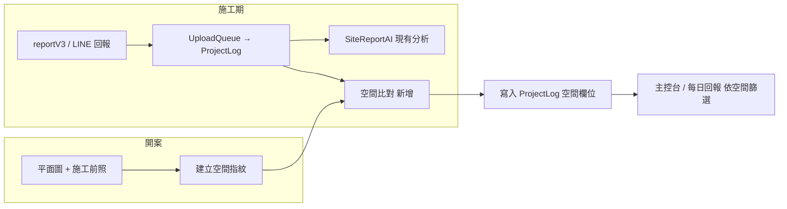
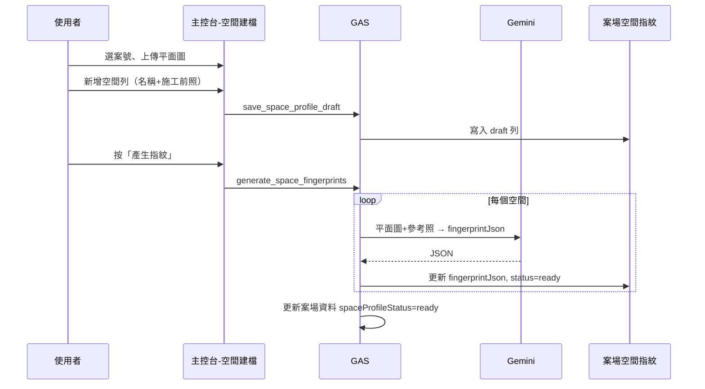

# 施工照空間視覺定位 — 開發規格書（v0.2 草稿）

> **狀態**：**暫緩實作**（2026-06-26）— 實驗室可測 prompt；正式 MVP（Sheet／主控台／佇列）**尚未開工**  
> **來源**：`添心系統擴充與 AI 導入開發備忘錄.md` §1  
> **相關**：`SITE_REPORT_AI_SPEC.md`、`施工回報_系統完整_SPEC.md`、`專案全域資料字典.md`、`gemini-usage-policy` skill  
> **測試工具**：`CODING/tools/space-ai-lab/` → 後端 `accounting-gas/AiVisionLab.js`（action：`ai_lab_ping`／`ai_lab_analyze`）

---

## 一句話

**開案時**為每個空間建立 AI「視覺指紋」；**施工期**每張回報照自動比對指紋，標出最可能空間與信心分數；低信心時讓人點選修正。

---

## 要解決什麼

| 痛點 | 解法 |
|------|------|
| 照片全堆時間軸，難找「主臥那批」 | 每張照帶 `roomLabel`（自動或人工） |
| 師傅懶打空間名 | AI 從畫面判斷，人只處理不確定的 |
| 開案後格局就固定 | 用窗、樑、管線等**不會變的錨點**比對，不靠油漆顏色 |

**本階段不做**：3D 建模、精準量測、自動改驗收進度、發給客戶。

---

## 與現有系統的關係



| 已有 | 本功能怎麼接 |
|------|----------------|
| `ProjectLog` + `PhotoLinks` | 每張照多一筆空間判定結果 |
| `SiteReportAI.js` | **第二階段**併入同一背景 job；或 v0.1 獨立 `runSpaceMatch_` |
| `案場資料` Sheet | 加狀態欄「空間指紋是否就緒」 |
| Gemini 2.5 + UsageLog | 依 `gemini-usage-policy`；指紋建立與比對皆 `thinkingBudget: 0` |

---

## 分階段交付

### Phase 0 — 規格與 prompt 驗證（**進行中／暫緩**）

- [x] 規格初稿、JSON schema（`spf_v1`／`spm_v1`）
- [x] 實驗室網頁 + `AiVisionLab.js` 可跑三模式（指紋／比對／施工回報）
- [x] 案號 **776** 真實測試（2F客廳、4F主卧 指紋；3 張施工照比對）
- [ ] **未達標**：同批 3 張皆為客廳施工照，photo 2、3 誤判為 4F主卧（confidence 0.8）
- [ ] 準度改善方案驗證後，再決定是否進 Phase 1

**Phase 0 結論（2026-06-26）**：指紋建立品質可接受；**空間比對現行做法不足**，不宜直接上線。日後有想法再從本規格 §「實測與難點」與 §「待辦 backlog」接續。

### Phase 1 — MVP（**暫緩，待 Phase 0 過關**）

1. 後端：開案建檔 API + `案場空間指紋` Sheet
2. 後端：回報照片寫入後背景比對（可與 SiteReportAI 分開排程）
3. 前端：主控台「空間建檔」簡頁 + 日誌卡顯示空間標籤 + 人工改標
4. **不做**：依空間重排整個工作區（留給備忘錄 §2）

### Phase 2 — 體驗與準度（**暫緩**）

- 累積高信心施工照 → 自動加入該空間參考照庫
- 主控台「依空間」篩選 / 摺疊時間軸
- 與 SiteReportAI 合併一次 Gemini 呼叫（省 token）
- Files API 大圖（見備忘錄 §6）

---

## 實測與難點（776 案，2026-06-26）

### 測試紀錄摘要

| 步驟 | 結果 |
|------|------|
| 指紋 `2F客廳` | 成功；錨點含右側大窗、樑、樓梯扶手、門洞等 |
| 指紋 `4F主卧` | 成功；錨點含兩扇門、兩種窗、樑等 |
| 空間比對 3 張施工照 | photo 1 → 2F客廳 0.85 ✓；photo 2、3 → 4F主卧 0.8 ✗（實際皆為客廳） |

Gemini 紀錄 feature：`ai_lab_space_fingerprint`／`ai_lab_space_match`；模型 `gemini-2.5-flash`；key tier `free`。

### 為何人眼容易、AI 現況偏難？

| 人怎麼認 | 現行實驗室怎麼比 | 落差 |
|----------|------------------|------|
| **空間幾何地圖**：樑、門、窗、插座的**相對位置與比例** | 比對時 mostly **文字指紋 JSON**，未再送各空間參考照 | 等於讀兩篇說明書猜一張局部照 |
| **整案記憶**：「這批都是客廳」 | 每張照**獨立**出題，無「同批一致性」 | 第 2、3 張無法被第 1 張拉高信心 |
| **差異特徵**：2F 有樓梯、主臥有雙門＋衛浴門 | 施工照常只拍天花／封板，**門窗插座未入鏡** | 可用錨點變少，只剩「磁磚＋米白牆＋樑」等弱特徵 |
| 插座高度、數量、與門窗距離 | `spf_v1` 的 `anchors` 為自由文字，**未強制結構化比例** | 模型難做穩定「對照表」比對 |
| 跨樓層（2F vs 4F） | 指紋與照片**皆無樓層幾何約束** | 外觀相似時易飄到另一樓層房名 |

**結論**：判定空間**不是不可能**，但比最初假設的「開案指紋＋文字比對」**難一個量級**。可靠做法需接近人眼邏輯：**圖對圖、結構化錨點、批次一致、不確定要降分＋列候選**。

### 現行實驗室已知限制（`AiVisionLab.js`）

1. **比對僅送**：system prompt + 指紋 JSON 字串 + 施工照（**無**各空間 reference 縮圖）。
2. **指紋 prompt** 未強制輸出插座／門窗的**方位＋數量＋相對關係**。
3. **比對 prompt** 未要求：不確定必填 `alternatives`、禁止虛高 confidence、同批照應傾向同一 `roomLabel`。
4. 指紋建立偶爾仍包 ```json markdown```（解析有 strip，但浪費 token）。

Prompt 實作位置：`backend/accounting-gas/AiVisionLab.js` → `buildAiLabFingerprint*`／`buildAiLabMatch*`。

---

## 待辦 backlog（日後接續時優先序）

> 有新想法時追加本節；開工前再從這裡挑項進 Phase 0 重測。

| 優先 | 項目 | 說明 |
|------|------|------|
| P0 | **比對改圖對圖** | 每空間帶 1～2 張 reference 縮圖 + 施工照；不只 JSON 文字 |
| P0 | **`spf_v2` 結構化錨點** | 門／窗／插座／樑：`wall`（北南東西或入口為0）、`count`、`approxRatioToWall`、`heightBand`（高／中／低） |
| P0 | **比對約束 prompt** | 強制 `alternatives`；confidence &lt; 0.75 設 `needsHumanReview`；禁止僅憑地坪色／牆色 |
| P1 | **同批一致性** | 同一則回報／實驗室同次上傳：眾數空間拉高、離群降分 |
| P1 | **平面圖幾何** | 開案標註空間在平面圖上的相對位置，比對時作軟約束（非精準量測） |
| P1 | **累積參考庫** | 高信心且人工確認的施工照加入該空間第二參考 |
| P2 | 與 SiteReportAI 合併呼叫 | 省 token；`SpaceMatchJson` 餵給施工回報 prompt |
| P2 | 正式 MVP（原 Phase 1） | Sheet、主控台、佇列、`SPACE_MATCH_ENABLED` |

### 建議下一輪驗收（取代原 Phase 1 第 2 項，過關再開工）

- 測試案（可先沿用 776）：**同空間 5 張**施工照（含局部天花照），**≥ 4 張** topMatch 正確且 confidence ≥ 0.75。
- **雙空間易混案**（如 2F客廳 vs 4F主卧）：錯判時 confidence **不得** ≥ 0.75，且 `alternatives` 非空。

---

> **規則**：新增欄位須同步更新 `專案全域資料字典.md`（§8、§9）。

### §8 案場空間指紋（新 Sheet：`案場空間指紋`）

一列 = 一個空間的一份指紋。

| Sheets 標題 | API 變數名 | 格式 | 說明 |
|-------------|-----------|------|------|
| FingerprintID | `FingerprintID` | String | ULID |
| 案號 | `案號` | String | 與 `ProjectLog.ProjectName` 同義（數字案號字串） |
| roomLabel | `roomLabel` | String | 空間名稱，如：客廳、主臥、次臥、玄關 |
| sortOrder | `sortOrder` | Number | 平面圖或 UI 排序 |
| status | `status` | String | `draft`／`ready`／`archived` |
| floorPlanImageUrl | `floorPlanImageUrl` | String | 該案平面圖 URL（可每列重複或僅首列） |
| referencePhotoUrls | `referencePhotoUrls` | String | 施工前參考照，半形逗號 CSV |
| fingerprintJson | `fingerprintJson` | String | AI 產出之指紋 JSON（見 §8.1） |
| fingerprintVersion | `fingerprintVersion` | String | schema 版號，如 `spf_v1` |
| CreatedAt | `CreatedAt` | Date | |
| UpdatedAt | `UpdatedAt` | Date | |
| CreatedBy | `CreatedBy` | String | LINE UID 或姓名 |

#### §8.1 `fingerprintJson` 結構（`spf_v1`）

```json
{
  "schema": "spf_v1",
  "roomLabel": "主臥",
  "anchors": [
    { "type": "window", "position": "南牆中央", "shape": "橫長窗", "notes": "單扇推拉" },
    { "type": "beam", "position": "門口上方", "notes": "外露樑 約 30cm" },
    { "type": "pipe", "position": "西牆角落", "notes": "排水管包覆前可見" }
  ],
  "layout": {
    "approxShape": "長方形",
    "doorCount": 1,
    "adjacentSpaces": ["走廊", "主浴"],
    "distinctiveNotes": "床頭牆有冷氣排水孔"
  },
  "visualCues": [
    "地坪舊磁磚米白色方塊",
    "天花板平頂無間接照明槽"
  ],
  "confidenceNotes": "與次臥主要差異：窗戶較大、西側有冷氣孔"
}
```

**建立指紋時輸入**：`roomLabel` + 平面圖（全案共用）+ 該空間 1～3 張施工前照。  
**禁止**在指紋裡寫施作後才會出現的工項（封板完成、油漆色號）當主要錨點。

### §9 ProjectLog 擴充欄位

| Sheets 標題 | API 變數名 | 格式 | 說明 |
|-------------|-----------|------|------|
| SpaceMatchJson | `SpaceMatchJson` | String | 本則回報每張照的空間判定（見 §9.1） |
| SpaceMatchAt | `SpaceMatchAt` | Date | 比對完成時間 |
| SpaceMatchModel | `SpaceMatchModel` | String | Gemini 模型 |
| SpaceMatchTokenUsage | `SpaceMatchTokenUsage` | Number | token 合計 |

#### §9.1 `SpaceMatchJson` 結構（`spm_v1`）

`photos` 順序對齊 `PhotoLinks` 逗號分割後的順序（與 SiteReportAI 分段規則一致）。

```json
{
  "schema": "spm_v1",
  "photos": [
    {
      "photoIndex": 1,
      "photoUrl": "https://...",
      "topMatch": { "roomLabel": "客廳", "confidence": 0.82 },
      "alternatives": [
        { "roomLabel": "餐廳", "confidence": 0.12 }
      ],
      "matchMethod": "ai",
      "humanOverride": null
    }
  ],
  "needsHumanReview": false
}
```

- `confidence`：0～1；**≥ 0.75** 自動採用；**0.45～0.74** 標黃「待確認」；**< 0.45** 標紅「請選空間」
- `humanOverride`：人工改標後寫 `{ "roomLabel": "主臥", "by": "姓名", "at": "ISO8601" }`

### 案場資料 擴充（狀態用）

| Sheets 標題 | API 變數名 | 格式 | 說明 |
|-------------|-----------|------|------|
| 空間指紋狀態 | `spaceProfileStatus` | String | `none`／`draft`／`ready` |
| 空間指紋更新時間 | `spaceProfileUpdatedAt` | Date | |

---

## 流程

### A. 開案建檔（設計／工務主管）



**進入條件**：案號已存在於 `案場資料`。  
**最少資料**：≥1 個空間、每空間 ≥1 張參考照、1 張平面圖。  
**同名空間**：`roomLabel` 同案內不可重複；雙臥用「主臥」「次臥」。

### B. 施工期比對（自動）

觸發點：**與 SiteReportAI 相同** — `processUploadQueue` 寫入 `ProjectLog` 且照片齊備後。

1. 讀該案 `status=ready` 的指紋列；若無 → `SpaceMatchJson` 寫 `{ "schema":"spm_v1", "skipped": true, "reason": "no_profile" }`，不 call AI
2. ~~v0.1 草案：僅指紋文字摘要~~ → **v0.2 共識**：須改為 **指紋 JSON + 各空間至少 1 張參考縮圖 + 施工照**（見 backlog P0）
3. 寫入 `SpaceMatchJson`、`SpaceMatchAt`
4. 若任一張 `confidence < 0.75` → `needsHumanReview: true`（不另推 LINE；主控台顯示）
5. **（待實作）** 同則回報多張照做眾數一致（backlog P1）

### C. 人工改標

- **誰可以**：與「標記 AI 已人工看過」相同權限（設計／主管）
- **動作**：日誌卡每張照旁下拉選 `roomLabel` → API `override_photo_space`
- **副作用（Phase 2）**：高信心且多次一致的施工照，可選「加入參考照庫」

---

## API（GAS `WebApp` action）

### 正式 MVP（尚未實作）

| action | 方法 | 說明 |
|--------|------|------|
| `get_space_profiles` | GET | `案號` → 指紋列表 + 狀態 |
| `save_space_profile_draft` | POST | 新增/更新空間列（不含 AI） |
| `generate_space_fingerprints` | POST | 對 draft 列跑 AI；可單筆 `fingerprintId` |
| `run_space_match` | POST | 內部用；`logId` 觸發比對（佇列亦呼叫） |
| `override_photo_space` | POST | `logId`, `photoIndex`, `roomLabel` |

### 實驗室（已部署 accounting-gas）

| action | 說明 |
|--------|------|
| `ai_lab_ping` | 連線與 Gemini 設定檢查 |
| `ai_lab_analyze` | `mode`: `space_fingerprint`／`space_match`／`site_report` |

回傳格式沿用既有 `{ success, data?, error? }`。

---

## 畫面（前端）

### 1. 主控台 —「空間建檔」分頁（`managementconsole.html` 新 view）

| 區塊 | 內容 |
|------|------|
| 頂部 | 案號選擇器；狀態徽章（未建檔／草稿／就緒） |
| 平面圖 | 上傳一張；預覽 |
| 空間列表 | 表格式：空間名稱、參考照縮圖、指紋狀態、操作（編輯／重產） |
| 底部 | 「新增空間」「產生全部指紋」 |

**手機**：列表改卡片；上傳走既有極速傳輸或相機元件。

### 2. 施工日誌卡（既有 logs 視圖擴充）

- 每張縮圖角標：`roomLabel`（綠=高信心、黃=待確認、灰=人工改過）
- 點擊可改空間（下拉）
- 篩選列新增「依空間」多選（Phase 1 可只做顯示，Phase 2 做篩選）

### 3. 每日回報（`daily_report_main.js`）

- 可選：在日誌列顯示主要空間標籤（取該則回報照片眾數）

**reportV3 / LINE**：v0.1 **不要求**師傅先選空間；全自動比對。

---

## AI Prompt 要點

### 建立指紋（`generate_space_fingerprints`）

- **模型**：`gemini-2.5-flash`（`GEMINI_OCR_MODEL` 可覆寫）
- **thinkingBudget**：`0`
- **輸入順序**：固定 system 規則文字 → 平面圖 → 該空間參考照（cache 友善）
- **輸出**：僅 JSON，符合 `spf_v1`；缺欄位填 `null`，不編造

### 比對照片（`run_space_match`／`ai_lab` `space_match`）

- **輸入（v0.2 目標）**：待比對照片 + 各空間 `fingerprintJson` **+ 各空間 reference 縮圖**
- **輸入（實驗室現況）**：僅 JSON 指紋 + 施工照 ← **已知不足，見 §實測與難點**
- **規則**：優先結構錨點（窗、樑、門洞、**插座位置與數量**）；局部照允許 `confidence` 偏低；禁止僅憑「有木作／磁磚色」判斷
- **輸出**：`spm_v1`；`alternatives` 最多 2 個；不確定不得虛高 confidence

### 錯誤處理

- Gemini 失敗：不重試超過 1 次；寫入 `skipped` + `lastError`（不含 key）
- 記錄 `Gemini使用紀錄`（與 SiteReportAI 相同）

---

## 後端模組建議

| 檔案 | 職責 | 狀態 |
|------|------|------|
| `AiVisionLab.js` | 實驗室 prompt、三模式 analyze | **已實作** |
| `SpaceProfile.js` | 指紋 CRUD、Sheet 讀寫 | 未實作 |
| `SpaceMatchAI.js` | 正式版比對（含圖對圖） | 未實作 |
| `WebApp.js` | 註冊 action | 實驗室 action 已掛載 |
| `FirebaseHandler.js` / 佇列 | `processUploadQueue` 尾端呼叫 | 未實作 |

**Feature flag**（Script Property）：`SPACE_MATCH_ENABLED=1`（預設關，測案後開）

---

## 驗收標準

### Phase 1（暫緩，原標準保留參考）

| # | 條件 |
|---|------|
| 1 | 指定測試案可完成建檔，≥3 空間，狀態 `ready` |
| 2 | 施工回報 5 張照，≥70% 自動標對空間（測試案人工對照） |
| 3 | 低信心照可於主控台改標，`humanOverride` 有寫入 |
| 4 | 無指紋的案，回報照常；僅跳過比對，不報錯 |
| 5 | Token 有 log；未 commit API key |

### Phase 0 重測（接續時以 §待辦 backlog 為準）

見 §「建議下一輪驗收」。

---

## 風險與對策

| 風險 | 對策 |
|------|------|
| 雙臥／跨樓層易混 | 結構化錨點 + 圖對圖；開案各 2 張參考照；低信心人工 |
| 施工照只拍局部 | 不強求單張高分；同批眾數；標黃待確認 |
| 文字指紋相似度高 | **勿僅靠 JSON 比對**（776 已驗證）；改圖對圖 |
| 裝修後外觀大變 | 指紋以錨點為主；Phase 2 參考庫回饋 |
| Token 成本 | 比對與 SiteReportAI 合併；指紋僅開案一次 |
| 平面圖與現場不符 | 建檔允許「僅照片建指紋」；平面圖選填 |
| AI 過度自信 | 強制 alternatives；錯判時 confidence 上限策略（待 prompt 實驗） |

---

## 附錄：與備忘錄其他章節的銜接

| 章節 | 銜接 |
|------|------|
| §2 專案工作區 | 空間標籤為 §2「依空間維度」的資料基礎 |
| §3 進度分析 | SiteReportAI 可讀 `SpaceMatchJson` 輔助「客廳封板」類敘述 |
| §6 Files API | 單案空間多、原圖大時，指紋建立改用 `fileUri` |

---

## 變更紀錄

| 日期 | 版本 | 說明 |
|------|------|------|
| 2026-06-24 | v0.1 | 初稿：欄位、流程、畫面、API、分階段 |
| 2026-06-24 | v0.1+ | 測試網頁 `CODING/tools/space-ai-lab/`；後端 `accounting-gas/AiVisionLab.js` |
| 2026-06-26 | v0.2 | 776 實測結論、人眼 vs AI 難點、backlog、**暫緩 Phase 1**；比對須圖對圖＋結構化錨點 |
