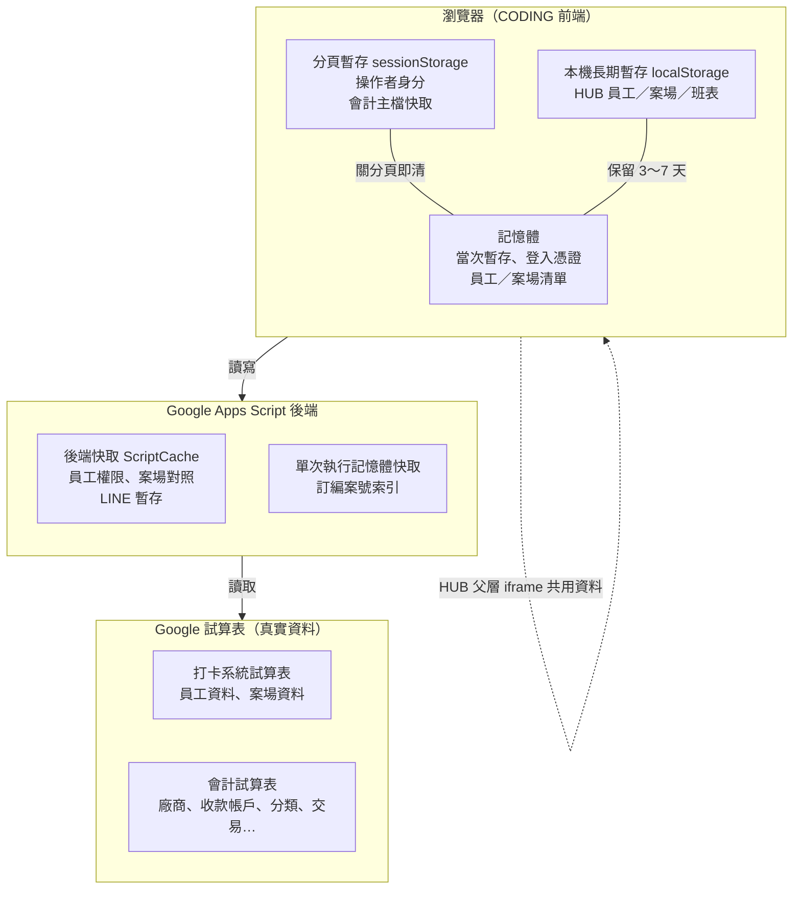
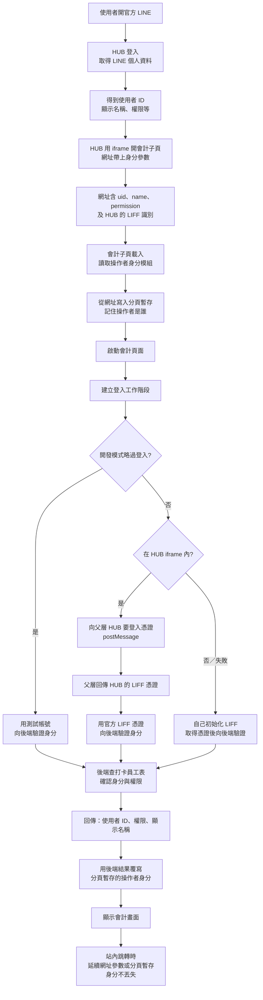
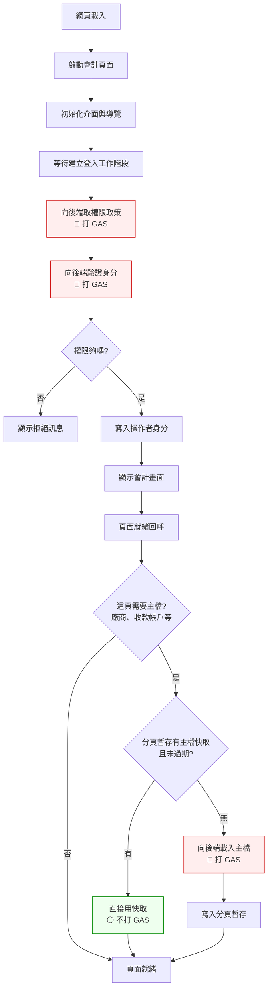
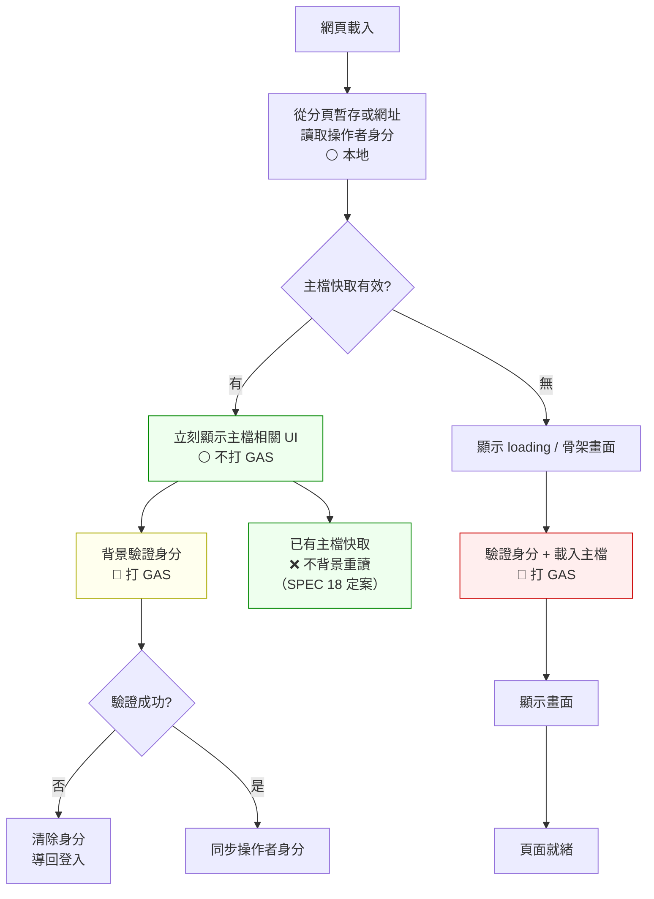
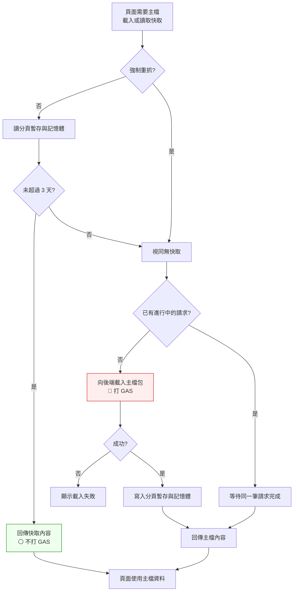
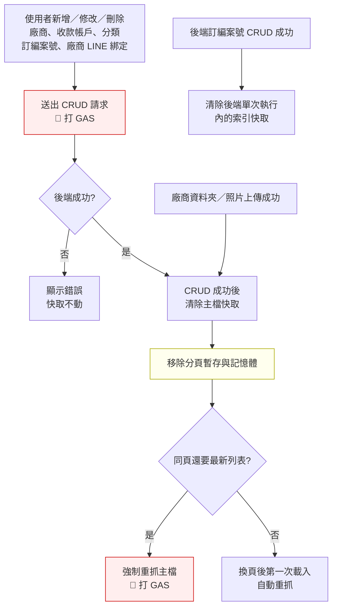
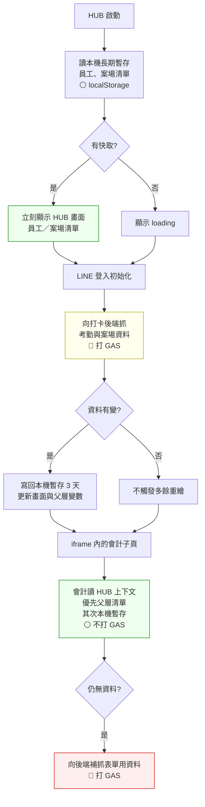

# 會計快取與身分傳承流程圖

**版本**：v1.2（2026-07-03）  
**關聯**：[18_會計與主檔快取策略.md](18_會計與主檔快取策略.md)、[19_HUB與會計全域身分傳承.md](19_HUB與會計全域身分傳承.md)

> 本文件用流程圖整理 SPEC 18（快取怎麼存）與 SPEC 19（身分怎麼傳）的實際行為，方便開發與維運對照。細節規格仍以 18、19 為準。圖中盡量用白話；程式名稱見文末「函式／模組對照表」。

---

## 1. 整體架構圖

| 層級 | 典型儲存位置 | 保留多久 | 用途 |
|------|--------------|----------|------|
| 記憶體 | 當次分頁變數 | 分頁開著／LIFF 效期內 | API 去重、登入憑證（**不寫入本機長期暫存**） |
| 分頁暫存 | `tanxin_operator_v1`、會計主檔快取 | 關分頁前／**3 天** | 操作者是誰、bootstrap 主檔 |
| 本機長期暫存 | HUB 員工、案場、班表 | **3～7 天** | HUB 跨模組共用 |
| 後端快取 | 員工權限、案場 map 等 | **6 小時**（平台上限） | 減少試算表讀取 |
| 試算表 | — | 即時 | 唯一真實來源 |

---

## 2. HUB → 會計身分傳承流程

從官方 LINE 進 HUB，再開會計子頁時，身分怎麼帶過去。

**重點**

- 員工唯一鍵：打卡系統「員工資料」的 **官方 LINE 使用者 ID**。
- HUB iframe 會帶 uid、permission、hub_liff_id；子頁若網址參數不見，仍從分頁暫存讀操作者身分。
- **核准權限以後端查表為準**；網址上的 permission 僅供開發略過或過渡顯示。

---

## 3. 會計頁面開啟流程（現行 vs 目標）

### 3.1 現行路徑（多數頁面）

使用者必須等後端驗完身分，才看得到畫面；主檔也常更晚才載入。

**現況**：使用者必須等 **登入工作階段（政策 + 身分驗證）** 完成才看到畫面；主檔 bootstrap 多在頁面就緒 **之後** 才載入，需要廠商／收款帳戶列表的頁面會更慢。

### 3.2 目標路徑（有快取就先顯示）

**目標差異**

| 項目 | 現行 | 目標 |
|------|------|------|
| 首次可互動 | 等身分驗證完成 | 有主檔快取 → **先顯示** |
| 身分驗證 | 擋住畫面 | 背景執行；失敗再清 session |
| 主檔載入 | 頁面就緒後才載 | 進頁先查快取；沒有才向後端要 |
| 背景重讀主檔 | 部分頁會背景預載 | **不做**（靠 CRUD 後清除保證正確） |

---

## 4. 主檔快取讀寫流程

對應 SPEC 18 §6.1。廠商、收款帳戶、分類等「主檔」怎麼快取、什麼時候打後端。

**主檔內容**：廠商、廠商 LINE 綁定、收款帳戶、分類、訂編案號對照、帳本狀態、列舉值。  
**快取 key**：依操作者使用者 ID 分開存（`tanxin_accounting_bootstrap_v1:{userId}`）。

---

## 5. 新增／修改／刪除後快取失效流程

使用者改動主檔資料後，快取怎麼清、什麼時候重抓。

**原則**：凡會改到 bootstrap 主檔的資料，CRUD 成功後一律 **整包清除** 快取（不只改局部欄位）。  
**不清 bootstrap 快取**：帳本狀態、廠商付款、毛利等交易資料（各頁用即時 API 查）。

---

## 6. HUB 員工／案場「先顯示舊資料、背景更新」流程

會計表單透過 HUB 上下文讀員工、案場；HUB 端採 **先顯示快取、背景再更新**（與主檔 bootstrap 策略不同）。

**班表**（依年月分 key，TTL **7 天**）同樣先顯示快取，背景再更新當月班表。

---

## 7. 哪些操作「必須」打後端 vs 可快取

| 操作 | 可快取？ | 儲存／保留多久 | 備註 |
|------|----------|----------------|------|
| **登入驗證** | ❌ 每次進頁需驗 | 後端 6 小時 | 前端仍應呼叫；後端快取減少試算表讀取 |
| **權限政策** | ⚠️ 可短暫記憶體 | — | 現行每次建立工作階段都會打 |
| **主檔 bootstrap** | ✅ | 分頁暫存 3 天 | 有快取且未 CRUD 清除 → 不打 API |
| **HUB 員工／案場** | ✅ 先顯示再更新 | 本機暫存 3 天 | iframe 內讀父層或本機暫存 |
| **HUB 當月班表** | ✅ 先顯示再更新 | 本機暫存 7 天 | 會計較少直接用 |
| **操作者身分** | ✅ 分頁內 | 關分頁前 | 網址參數為初次寫入來源 |
| **CRUD 寫入** | ❌ | — | 成功後清除主檔快取 |
| **收支／請款／毛利列表** | ❌ | — | 交易資料即時查 |
| **考勤／打卡當日** | ❌ | — | 高頻變動 |
| **薪資／個人出勤** | ❌ 或不進本機長期暫存 | — | 敏感資料 |
| **LIFF 登入憑證** | 僅記憶體 | LIFF 效期內 | **不寫本機長期暫存** |

---

## 8. 為何沒用好快取會覺得慢

1. **身分驗證擋住畫面**：多數頁面在顯示 UI 前，必須完成「權限政策 + 身分驗證」兩次後端往返（冷啟動常 **2～5 秒**）。
2. **主檔載入太晚**：廠商、收款帳戶等常在頁面就緒後才載；若分頁暫存沒快取，使用者已看到外殼仍要等後端讀多張試算表（最長約 120 秒）。
3. **重複載入主檔**：若進頁沒先查快取、或 CRUD 清除後沒強制重抓，可能每次進頁都打 API。
4. **沒讀 HUB 父層快取**：收支登錄若不走 HUB 上下文，會多打一次表單補抓 API。
5. **主檔不做背景重讀是刻意的**：正確性靠 CRUD 後清除；不應每次進頁背景重抓（那會讓「有快取仍慢」）。

**改善方向（對照 §3.2）**：有主檔快取時先顯示畫面；身分驗證改背景執行；進頁先查快取，命中就略過 API；HUB iframe 內優先讀父層員工／案場清單。

---

## 9. 相關程式路徑

| 層 | 路徑 | 白話說明 |
|----|------|----------|
| 啟動收斂 | `shared/js/accounting_boot.js` | 會計頁面統一啟動入口 |
| 主檔快取 | `shared/js/accounting_cache.js` | 讀寫 bootstrap 快取 |
| API／工作階段 | `shared/js/accounting_api.js` | 呼叫後端、建立登入工作階段 |
| 操作者身分 | `shared/js/operator_context.js` | 記住「現在是誰在操作」 |
| HUB 表單上下文 | `shared/js/accounting_context.js` | 會計表單讀 HUB 員工／案場 |
| HUB 先顯示再更新 | `spa/app.js` | HUB 本機快取與背景更新 |
| 靜態頁 | `modules/accounting/*.html` | 各會計功能頁 |

---

## 10. 函式／模組對照表

圖中白話描述對應的程式名稱，供開發查閱。

| 白話描述 | 模組／函式／API |
|----------|----------------|
| 啟動會計頁面 | `AccountingBoot.run()` — `accounting_boot.js` |
| 初始化介面與導覽 | `AccountingUi.init()`、`AccountingNav.init()` |
| 建立登入工作階段 | `AccountingApi.initSession()` — `accounting_api.js` |
| 向後端取權限政策 | `accounting_policy`（GAS action） |
| 向後端驗證身分 | `accounting_auth_me`（GAS action） |
| 後端查打卡員工表確認身分 | `resolveAccountingAuth_`（GAS） |
| 從網址寫入操作者身分 | `OperatorContext.mergeFromUrl()` — `operator_context.js` |
| 讀取分頁暫存的操作者身分 | `OperatorContext.read()` |
| 用後端結果覆寫操作者身分 | `OperatorContext.applySession()` |
| 清除操作者身分 | `OperatorContext.clear()` |
| 站內跳轉延續身分參數 | `accounting_nav` 的 `hubQueryString()` |
| 讀主檔快取（不強制重抓） | `AccountingCache.get()` — `accounting_cache.js` |
| 載入主檔（含快取邏輯） | `AccountingCache.load(session, force?)` |
| CRUD 成功後清除主檔快取 | `AccountingCache.afterCrudSuccess()`、`AccountingCache.clear()` |
| 向後端載入主檔包 | `AccountingApi.bootstrap()` → `accounting_bootstrap` |
| 送出 CRUD 請求 | `AccountingApi.crudCreate()`、`crudUpdate()` |
| 廠商資料夾／照片上傳 | `vendorEnsureFolder`、`vendorUploadPhotos` |
| 頁面就緒回呼 | `onReady(session)` |
| 顯示會計畫面 | `showApp()` |
| HUB 登入取得個人資料 | `liff.init()` + `liff.getProfile()` |
| 向父層要 LIFF 憑證 | `postMessage` → `request_hub_liff_token` |
| 自己取 LIFF 憑證 | `liff.init()` + `liff.getIDToken()` |
| 開發模式略過登入 | `authBypass`、`dev_bypass`、`dev_user_id` |
| 會計讀 HUB 員工／案場 | `AccountingContext` — `accounting_context.js` |
| 向後端補抓表單用資料 | `accounting_form_context`（GAS action） |
| HUB 讀本機員工／案場快取 | `loadCache()` — `spa/app.js` |
| HUB 背景抓考勤與案場 | `fetchAttendanceData()`、`fetchHubProjectsData()` |
| HUB 寫回本機快取 | `saveCache(..., 3 天)` |
| 父層共用員工／案場變數 | `window.spaAllEmployees`、`window.spaAllProjects` |
| 後端員工權限快取 | ScriptCache `acct_emp_{userId}` |
| 後端案場 map 快取 | ScriptCache `margin_site_map_v1` |
| 後端訂編案號索引快取 | `buildOrderProjectMetaIndex_._cache` |
| 後端 CRUD 後清索引 | `afterSheetCrudMutate_(entity)` |
| 操作者身分分頁暫存 key | `tanxin_operator_v1` |
| 主檔快取分頁暫存 key | `tanxin_accounting_bootstrap_v1:{userId}` |
| HUB 員工本機暫存 key | `spa_hub_employees` |
| HUB 案場本機暫存 key | `spa_hub_projects` |
| HUB 班表本機暫存 key | `spa_hub_schedule_{YYYY}_{MM}` |
| 記憶體暫存 | `AccountingCache._mem`、`id_token` |
| HUB iframe 開會計子頁 | `spa/app.js` 附加 query：`uid`、`name`、`permission`、`hub_liff_id` |

---

## 11. 變更紀錄

| 日期 | 變更 |
|------|------|
| 2026-07-03 | 列表快取單人模式：TTL 3 天、SWR 24 小時；多人時改回 90 秒／30 秒 |
| 2026-07-03 | v1.2：P0 政策／身分 session 快取 + 背景驗證；P1 列表快取（`AccountingListCache`）；bootstrap CRUD 改 patch；審核頁 `AccountingActionQueue` 取代全頁鎖按鈕 |
| 2026-07-03 | v1.1：流程圖與內文改寫為白話；圖中移除函式名；新增 §10 函式／模組對照表 |
| 2026-07-03 | v1.0：初版流程圖；整合 SPEC 18、19 與現行程式對照 |
