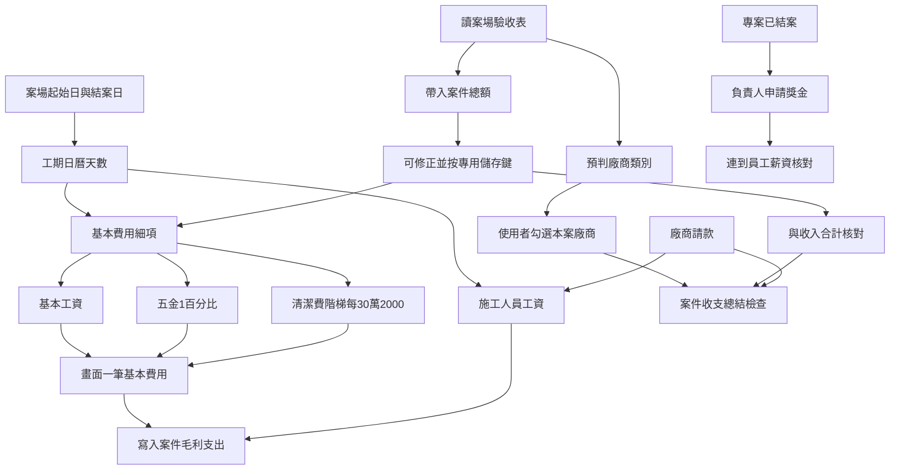
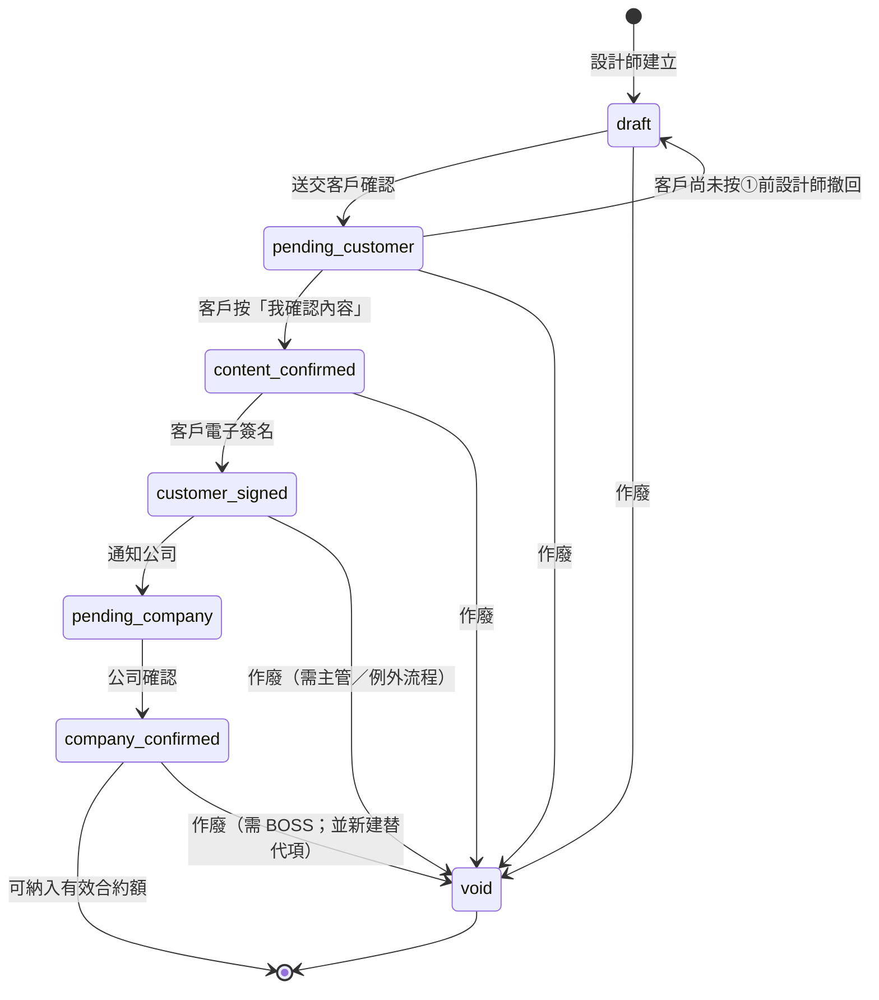
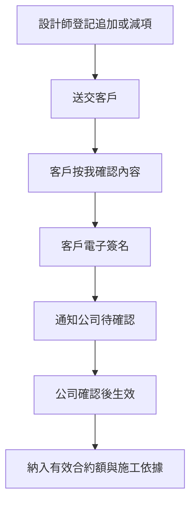
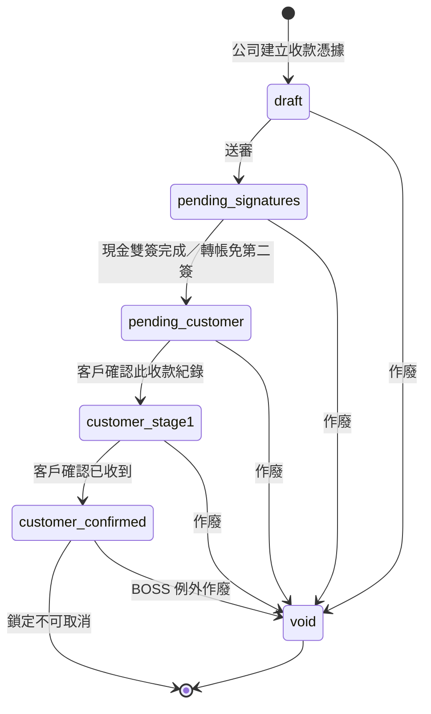
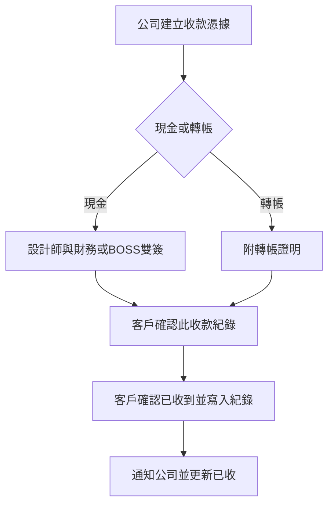

# 案件毛利擴充與薪資連動

## 白話目標

案件毛利表要能：依驗收表預判廠商、帶入案件總額（可修正）與收入核對、勾選本案廠商、自動算「基本費用」（基本工資＋五金 1%＋清潔費，畫面低調一筆、後台看細項）與施工人員工資，並用「廠商是否都請完款」等當收支總結條件。結案後負責人可從毛利連到薪資申請獎金；權限 5 主管可看每位員工薪資試算；薪資核對「送出」只能在該期最後一天下班時間之後。

## 現況（程式已有）

| 能力             | 現況                                                                                                                                                                                                                                                                                             |
| -------------- | ---------------------------------------------------------------------------------------------------------------------------------------------------------------------------------------------------------------------------------------------------------------------------------------------- |
| 案件毛利列表／明細／手動加列 | `[project_margin.html](d:\Dropbox\CodeBackups\CODING\modules\accounting\project_margin.html)` + `[MarginModule.js](d:\Dropbox\CodeBackups\backend\accounting-gas\master\MarginModule.js)`                                                                                                      |
| 廠商請款寫入毛利       | 匯款後依分攤寫支出列（已有）                                                                                                                                                                                                                                                                                 |
| 案場驗收表工項／單價     | Firebase `quotations/{案號}`；驗收表加總 `items[].price`（見 `[BudgetAuditor_Standalone_V2.html](d:\Dropbox\CodeBackups\CODING\tools\BudgetAuditor_Standalone_V2.html)` `refreshPriceDisplay`）；對照邏輯在 `[SiteReportAcceptance.js](d:\Dropbox\CodeBackups\backend\project-console\SiteReportAcceptance.js)` |
| 案場工期／負責人       | `[ProjectLogic.js](d:\Dropbox\CodeBackups\backend\project-console\ProjectLogic.js)` 排程算「專案起始日／預計完工日」；結案寫入「結案日」與狀態「已結案」 |
| 薪資核對送審         | `[Logic_PayrollReview.js](d:\Dropbox\CodeBackups\backend\CheckinSystem\Logic_PayrollReview.js)` + `[payroll_review_panel.js](d:\Dropbox\CodeBackups\CODING\modules\attendance\payroll_review_panel.js)`；**目前無「最後一天下班後才能送」硬閘**                                                                  |
| 主管看他人薪資試算      | 個人頁只鎖本人；會計審核頁只看已送審單                                                                                                                                                                                                                                                                            |

## 已定規則

- **基本工資**：工期日曆天數（含假日）÷ 30 × 35,000（按比例）。
- **工期結束日**：按下「將此專案結案」當天；異常時主管可在毛利表改開始／結束日。
- **案件總額**：從驗收表工項單價加總帶入；可修正，**修正後必須按專用「儲存」鍵才寫入**（不自動存）。
- **總額 vs 收入**：用案件總額與毛利收入合計核對是否一致（收支總結條件之一）。
- **基本費用**（併入同一筆低調支出，後台可拆細項）：
  - 基本工資：`天數 / 30 × 35000`
  - 五金費用：`案件總額 × 1%`
  - 清潔費：`2000 × (floor(案件總額 / 300000) + 1)`（每滿 30 萬一階 2,000，**階梯式**非比例）
  - 畫面只顯示一筆「基本費用」合計，不強調細項；後台／權限足夠者可展開看三項明細。
- **施工人員工資**（工務／木作／系統／油漆）：可從該案廠商請款帶入，或手動填日薪／月薪；金額＝施工天數 ×（日薪，或 月薪÷20）。
- **廠商全部請款**：本案勾選的廠商，其請款單皆已匯款，才算收支總結條件之一通過。

## 實作範圍

### A. 案場結案日 + 毛利讀案場

**後端 project-console**

- 結案時寫入「結案日」（當天 Asia/Taipei）；若案場資料尚無欄位則新增。
- 提供給會計讀取的案場摘要 API（或會計 GAS 直接開同一試算表讀）：案號、專案起始日、結案日、專案狀態、負責人員（`專案負責人`）、工務等。

**會計 MarginModule**

- 毛利詳情回傳工期：預設開始＝排程／案場「專案起始日」；結束＝結案日（未結案則暫用今天，僅試算、標「未結案」）。
- 儲存主管覆寫的 `工期開始`／`工期結束`（建議放在該案分頁上方 meta 區或總覽擴欄，來源標記 `manual`／`auto`）。

### B. 案件毛利：總額、基本費用、廠商、工資、收支總結

**檔案主戰場**

- 後端：`[MarginModule.js](d:\Dropbox\CodeBackups\backend\accounting-gas\master\MarginModule.js)`（新 action）
- 前端：`[project_margin.html](d:\Dropbox\CodeBackups\CODING\modules\accounting\project_margin.html)`、`[accounting_api.js](d:\Dropbox\CodeBackups\CODING\shared\js\accounting_api.js)`
- SPEC：`[15_會計系統模組規格書.md](d:\Dropbox\CodeBackups\CODING\SPEC\15_會計系統模組規格書.md)`、`[DATA_MASTER_PLAN.md](d:\Dropbox\CodeBackups\backend\accounting-gas\SPEC\DATA_MASTER_PLAN.md)`

**B0. 驗收表案件總額（核對收入）**

- **讀取路徑**：accounting-gas **不直連 Firebase**；經 project-console `GET page=margin_quotation_summary`（secret 與 `invalidate_site_caches` 相同）取得 `contract_amount_auto`、`work_types`、`has_price_data`。
- 加總邏輯與驗收表相同：清掉 `items[].price` 非數字字元後加總。
- 存兩欄：
  - `contract_amount_auto`：每次從驗收表重讀的原始總額
  - `contract_amount`：實際採用總額（預設＝auto；使用者修正後以手動為準）
- **修正必須按專用「儲存總額」鍵**才呼叫 API 寫入；輸入框改動未存時標「未儲存」，離開不自動存。
- 另提供「重新從驗收表帶入」：覆寫 auto，若尚未手動鎖定則同步到 `contract_amount`；若已手動修正則只更新 auto 並提示「與驗收表差異」，不擅自蓋掉手動值（或詢問是否採用驗收表）。
- 收支總結：比較 `contract_amount` 與毛利「收入合計」；差額顯示（例：差 12,000），通過條件可設為差額為 0 或在容許誤差內（預設差額＝0 才綠燈）。

**B1. 驗收表 → 預判廠商 slot → 使用者選定**

- 讀驗收表工項經 project-console `margin_quotation_summary` 取得 `work_types` 與 **`detected_slots`**（依工項 `work_type`／`category_tag` 對照 slot 定義；工項名稱僅在結構性分類名稱時作備援）。
- **Slot 定義**（`MasterEnums.margin_vendor_slots`）：每 slot 含 `key`、`label`、廠商篩選（`trade_categories`、`cost_types`）、偵測規則（`detect.work_types`／`category_tags`／`keywords`；`item_patterns` 僅用於結構性工項名稱備援）。
- **木作特殊規則**：驗收表偵測到木作工項（`work_type`＝木作工程，或工項名稱含天花板／隔間／包管等結構分類）時，`detected_slots` 必含 `building_material`（建材）與 `wood_hardware`（木作五金）兩 slot。
- **金屬加工**：鋁門窗、鋁框推拉門、鐵件等皆歸 `metal` slot；偵測以 `work_type`／`category_tag` 為主。
- **系統櫃**：高櫃、低櫃、衣櫃、鞋櫃、電視櫃等櫃體工項歸 `system_cabinet` slot。
- **key 遷移**：舊版 `wood_material` 讀取時自動遷移為 `building_material`。
- **只顯示偵測到的 slot**；Phase 2 前端可手動新增 slot（後端已支援 `vendor_slots_manual`）。
- **Phase 2 前端**（`project_margin.html`）：每 slot 一列標籤＋廠商下拉＋「+」可加同 slot 多家；底部「新增大項目」選未顯示 slot；手動 slot 可「移除」；慣用廠商 hint「慣用：案號 XXX」；儲存送 `vendor_slots`＋`vendor_slots_manual`（仍相容舊 `selected_vendors` 勾選 fallback）；手動新增 slot 下拉候選來自 API `all_slot_candidates`。
- **同 slot 可選多家廠商**（`vendor_slots[key]` 為陣列）；每家可標 `is_primary`。
- **預設廠商**：若該 slot 尚無儲存值，帶入其他案件同 slot 最近一筆 `is_primary` 廠商（`default_vendor`）。
- **儲存格式**（毛利 meta `vendor_slots`）：`{ slot_key: [{ vendor_id, name, is_primary }] }`；舊版 `selected_vendors[]` 讀取時自動遷移。
- API 詳情回傳 `vendor_slot_defs`、`vendor_slots_ui`、`all_slot_candidates`；儲存 action 接受 `vendor_slots`（仍相容 `selected_vendors`）。
- 收支總結「全部請款」： flatten 各 slot 內所有廠商後檢查請款狀態；詳情回傳 `vendor_slot_payment_status[]`；前端「案件收支總結」依 slot 顯示（例：建材：已匯款；系統櫃：尚無請款）。

#### 工種、工項與毛利大項目對照

**工種**（廠商主檔 `trade_category`，共 16 項，來源 `MasterEnums.vendor_trade_categories`）：

| 工種 | 說明 |
|------|------|
| 木作外包廠商 | 木作現場施工工班（連工帶料／純點工）；舊名「木工」讀取時自動遷移 |
| 建材 | 木作／天花／隔間等材料商（通常 `純材料商`） |
| 地板 | 木地板、SPC 等 |
| 系統櫃/安裝師傅 | 系統櫃體與安裝；舊名「系統櫃」自動遷移 |
| 五金 | 滑軌、鉸鏈等 |
| 廚衛 | 廚具、衛浴設備 |
| 水電 | 配管配線 |
| 泥作 | 砌磚、粉刷、防水等 |
| 油漆 | 批土、噴漆、清水模等 |
| 石材/人造石 | 檯面、吧台等；舊名「石材」自動遷移 |
| 玻璃 | 強化玻璃、鏡面等 |
| 金屬加工 | 鐵件、鋁門窗、推拉門等 |
| 空調 | 冷氣工程 |
| 清潔/拆除 | 收尾清潔或拆除配合；舊名「清潔」自動遷移 |
| 家具 | 訂製／採購家具 |
| 其他 | 窗簾等未列工種 |

**工項**（驗收表 `work_type`／`category_tag`，用於預判毛利 slot；非廠商工種下拉）：

| 工項 work_type（代表） | 預判毛利大項目 slot |
|----------------------|---------------------|
| 保護工程 | 施工保護 |
| 拆除工程 | 拆除工程 |
| 泥作工程 | 泥作工程 |
| 水電工程 | 水電工程 |
| 木作工程 | 建材、木作五金、木作工班（三 slot 同時） |
| 系統櫃／系統櫃體／櫥櫃工程 | 系統櫃 |
| 油漆工程 | 油漆工程 |
| 廚具設備／廚衛工程 | 廚具設備 |
| 地板工程 | 地板工程 |
| 石材工程 | 石材工程 |
| 玻璃工程 | 玻璃工程 |
| 金屬加工／金屬工程／鐵件工程／鋁門窗／門窗工程 | 金屬加工 |
| 空調工程／冷氣工程 | 空調工程 |
| 窗簾工程 | 窗簾工程 |
| 清潔工程 | 清潔工程 |

**毛利大項目**（`margin_vendor_slots`：本案廠商勾選區塊；`key` 為程式鍵、`label` 為畫面標籤）：

| slot key | 畫面標籤 | 對應工種（廠商篩選） | cost_type 篩選 |
|----------|----------|----------------------|----------------|
| `protection` | 施工保護 | （不限工種） | — |
| `demolition` | 拆除工程 | （不限工種） | 連工帶料、純點工 |
| `masonry` | 泥作工程 | 泥作 | — |
| `plumbing_electrical` | 水電工程 | 水電 | — |
| `building_material` | 建材 | 建材 | 純材料商 |
| `wood_hardware` | 木作五金 | 五金 | — |
| `wood_labor` | 木作工班 | 木作外包廠商 | 連工帶料、純點工 |
| `system_cabinet` | 系統櫃 | 系統櫃/安裝師傅 | — |
| `paint` | 油漆工程 | 油漆 | — |
| `kitchen` | 廚具設備 | 廚衛 | — |
| `floor` | 地板工程 | 地板 | — |
| `stone` | 石材工程 | 石材/人造石 | — |
| `glass` | 玻璃工程 | 玻璃 | — |
| `metal` | 金屬加工 | 金屬加工 | — |
| `hvac` | 空調工程 | 空調 | — |
| `curtain` | 窗簾工程 | 其他 | — |
| `cleaning` | 清潔工程 | 清潔/拆除 | — |

- 木作驗收工項會同時預判 `building_material`、`wood_hardware`、`wood_labor`；建材商與工班分開勾選。
- 施工人員工資「木作」角色對應工種 `木作外包廠商`（見 B3 `MARGIN_LABOR_ROLE_CATEGORIES_`）。
- 毛利明細「費用類別」選單（`margin_expense_categories`）含上述工種及「材料、人工、交通、基本費用、收入、其他」；舊費用類別「木工」顯示時請改選「木作外包廠商」。

**B2. 基本費用（畫面低調一筆，後台看細項）**

以**採用中的案件總額** `contract_amount` 與工期天數計算：

| 細項         | 公式                                                              |
| ---------- | --------------------------------------------------------------- |
| 基本工資       | `round(工期天數 / 30 * 35000)`（天數＝結束−開始＋1，含假日）                      |
| 五金費用       | `round(contract_amount * 0.01)`                                 |
| 清潔費        | `2000 × (floor(contract_amount / 300000) + 1)`（每滿 30 萬一階 2,000，階梯式） |
| **基本費用合計** | 上三項相加                                                           |

寫入規則：

- 毛利明細**只寫一筆**支出：費用類別「基本費用」、來源 `系統`、固定備註鍵（例 `[sys:base_cost]`）去重覆寫。
- **後台細項**存在該列備註 JSON，或同案 meta（`base_wage`／`hardware_fee`／`cleaning_fee`）；API `margin_list_lines`／詳情對權限 ≥4 回傳 `base_cost_breakdown`。
- **前端**：一般列表與費用明細只顯示「基本費用」一個金額，不拆三行、不特別強調（字級／樣式與其他支出列相同）。詳情可加低調「詳情」展開（僅後台／財務），顯示三項數字供對帳。
- 工期、總額變更並儲存後重算並覆寫該系統列（不碰其他手動列）。

**B3. 施工人員工資（工務／木作／系統／油漆）**

- UI：四列，各可選「從廠商請款帶入」或「自填日薪／月薪」。
- 帶入：彙總該案已分攤到毛利、且類別對應的廠商請款金額（可編輯覆寫）。
- 自填：`天數 × 日薪` 或 `天數 × (月薪 / 20)`。
- 各寫一筆系統支出列（可覆寫重算）；手動覆寫金額時標記 `manual` 不再被自動蓋掉（與現有 manual 慣例一致）。

**B4. 案件收支總結檢查清單**

詳情頁顯示條件狀態（通過／未通過），至少包含：

1. 已勾選廠商是否「全部請款完成」（該廠商＋該案相關請款 `payment_status=已匯款`；無請款列則標「尚無請款」）；UI 依大項目 slot 列出，**未選廠商的 slot 不顯示**；有請款者顯示**匯款日＋金額**（多筆跨月以頓號串列）。
2. 基本費用列已計算；checklist 展開**工資／五金／清潔／合計**細項。
3. **案件總額與收入合計是否一致**（顯示兩邊金額與差額）。
4. 專案是否已結案（獎金申請前置）；**僅案場「專案狀態」= 已結案**才算通過；未結案時標籤為「專案尚未結案」並顯示目前狀態。

「全部請款」「總額＝收入」為判斷依據，不強制鎖死其他操作，但總結區塊要清楚標紅／綠。

**本案廠商 UI**：寬螢幕（≥640px）slot 區塊雙欄 grid；窄螢幕單欄。

### C. 毛利 ↔ 員工薪資（獎金）

- 案場「專案負責人」欄位可為 **逗號分隔多個 LINE UID**（亦相容姓名）；`parseResponsibleUids_` 解析後對員工資料。
- **多位負責人**：毛利詳情可設定 `bonus_allocations`（`userId`、`name`、`ratio`），API `margin_save_bonus_allocations` 驗證比例加總 **100%**。
- **預設**：未儲存時，若負責人 >1 人則 UI 顯示均分比例（可改後按儲存）；套用獎金前若仍無設定則後端均分。
- **套用**：`margin_apply_bonus` 以 `suggested_amount × ratio / 100` 計算各人金額，寫入該案 meta `bonus_draft`（待薪資審核併入）；專案須已結案。
- 對不到員工時允許手動選人（後續 UI）。

### D. 權限 5 看員工薪資表＋預期支付額

- Checkin：`payroll_review` 新增 `mode=admin_preview`（或擴充 `context`）：`permission >= 5` 可傳 `targetUserId`，回傳與本人相同的試算（出勤快照、預估實發）。
- 前端：個人出勤頁或會計入口加「員工薪資預覽」（僅 ≥5）：選員工 → 選期別 → 顯示預期支付額（唯讀，不可代送審）。
- 稽核：寫 `view_detail`／`payroll`（金額可遮罩，與既有薪資稽核規則一致）。

### E. 薪資核對送出時間閘（最後一天下班後）

- **後端硬閘**（必做）：`_submitPayrollReview_` 檢查現在時間（Asia/Taipei）是否 ≥ `periodEnd` 當日該員工 `shiftEnd`（員工資料下班時間；無則預設 17:30）。未到則拒絕並回訊息。
- **前端**：送出鍵 disabled，提示「須於 {日期} {下班時間} 之後才能送出」；到點後可重新載入解鎖（或前端每分鐘檢查）。
- 進行中期別（本月尚未結束）維持不可送。

## 建議實作順序

1. **E**（小、獨立、立刻有感）— 送出時間閘
2. **A + B0 + B2** — 結案日、工期、案件總額、基本費用（含五金／清潔細項）
3. **B1 + B4** — 廠商勾選、全部請款與總額vs收入檢查
4. **B3** — 施工人員工資
5. **C + D** — 獎金連動、主管預覽

## 規格與紀錄

- 更新 `CODING/SPEC/15_會計系統模組規格書.md` §2.6、`17_個人薪資出勤頁計劃書.md`（送出閘、主管預覽）
- 更新 `accounting-gas/SPEC/DATA_MASTER_PLAN.md`（毛利 meta、案件總額、基本費用細項、廠商選用表）
- 大改後寫 `LOG/YYYY-MM-DD_LOG.md`（CODING + accounting-gas + CheckinSystem）
- 部署走 deploy-runbook（SPEC → LOG → 備份 → 部署）

## 風險與假設

- 驗收表在 Firebase；部分匯出可能剝除 `price` 欄——若雲端無單價則總額為 0，需提示「驗收表無價格資料，請手動填總額並儲存」。
- 會計 GAS **經 project-console 轉接 API** 讀驗收表（`margin_quotation_summary`），不在 accounting-gas 直連 Firebase。
- **專案負責人**欄位存 **LINE UID**（可多個、逗號分隔），非姓名字串；對員工以 `userId`／`userName` 比對。獎金申請需支援多人與自訂比例。
- 基本費用與施工工資的「系統列」用固定備註鍵去重（`[sys:base_cost]`、`[sys:labor:角色]`），避免重算產生重複支出。
- 清潔費採 **階梯式**（每滿 30 萬 +2,000），非按比例；公式見 B2。
- 其他可選營運攤提（交通、保險、耗材等）見計畫「建議可再納入的營運費用」；**預設不實作**，待主管選定後再加進基本費用細項。

## 建議可再納入的營運費用（待主管確認）

以下是裝修／設計公司常見、且「稍加」在案場支出裡較合理的項目。原則：**能對應到現場、金額小、可公式化、不重複已有廠商請款**。

| 項目            | 為何合理               | 建議算法（範例，待定）                          | 建議                |
| ------------- | ------------------ | ------------------------------------ | ----------------- |
| **交通／油資分攤**   | 工務往返、材料跑腿是固定營運成本   | 工期天數 × 固定日額（例 200～500），或總額 0.3%～0.5% | 優先考慮              |
| **工安／責任險攤提**  | 每案都有風險成本，不宜只算在公司總帳 | 總額 0.2%～0.5%，或每案固定下限                 | 優先考慮              |
| **現場耗材／保護材**  | 膠布、保護膜、垃圾袋等常被忽略    | 總額 0.3%～0.5%，或每案固定額                  | 可考慮（勿與五金 1% 重複定義） |
| **行政／帳務協調**   | 請款、對帳、排程協調的後勤成本    | 總額 0.5%～1%（管理費性質）                    | 可考慮，但對外勿強調        |
| **臨時水電／場地雜支** | 施工期水電、清潔用水等        | 每案固定額或總額 0.1%～0.2%                   | 次要                |
| **工具／設備折舊**   | 電動工具、梯具損耗          | 總額 0.1%～0.3%                         | 次要                |

**不建議硬攤進案場的：**

- 辦公室租金、總部人事（與單案關聯弱，宜留在公司總帳）
- 行銷廣告、業務交際（難公平分攤到每案）
- 已由廠商請款涵蓋的項目（避免雙重計入）

**目前計畫已納入的基本費用**（工資＋五金 1%＋清潔）已涵蓋「現場人力固定成本＋小五金＋收尾清潔」三塊；若再加，建議最多再加 **交通** 與 **工安險** 兩項，合計仍維持畫面一筆「基本費用」、後台看細項。

---

## B5 Phase A — 追加減與收款收據（實作）

> **本節狀態**：Phase A 已實作並部署（2026-07-05）；Phase B **部分完成**（毛利摘要、綁定同步顧客列表、綁定 UX 警告）。

### B5 Phase B（部分，2026-07-05）

| 項目 | 狀態 | 說明 |
|------|------|------|
| 毛利頁摘要 | ✅ | `margin_get_detail` 回傳 `customer_finance_summary`；`project_margin.html` 顯示有效合約／追加減淨額／已收／未收 |
| 綁定同步顧客列表 | ✅ | `client_portal_bind` 成功後，若 UID 在顧客列表且案號欄尚無本案，以「、」追加（支援多案） |
| 綁定 UX | ✅ | 已綁定列表顯示顧客列表名稱；顧客列表有案號但未 ClientPortalAccess 綁定時顯示黃色警告 |
| LINE push deep link | 待辦 | Phase B 剩餘 |
| 追加減 PDF 匯出 | 待辦 | Phase B 剩餘 |
| `has_furniture_order` | 待辦 | Phase B 剩餘 |
| 收支一鍵 ingest | 待辦 | Phase B 剩餘 |
| B4 三角核對 UI | 待辦 | Phase B 剩餘 |

**API 補充**：

- `margin_get_detail` → `customer_finance_summary`：`contract_amount`、`adjustments_net`、`effective_contract`、`receipts_confirmed_total`、`outstanding`
- `margin_customer_finance_detail` → `unbound_customer_warnings[]`：`customer_line_user_id`、`customer_name`、`project_codes`
- `client_portal_bind` → `customer_list_sync`：`updated`、`project_codes`

### B5.1 背景與目標

簽約後客戶常口頭追加／減項，或宣稱已付現金／轉帳但公司無紀錄，易造成收入漏記與雙方記憶不一致（近期有客戶記錯、萬元以上損失案例）。目標：

1. **每一筆**簽約後追加減與客戶付款，都有案內可追溯紀錄、憑證與**客戶雙階段確認**。
2. 客戶可透過 **LINE LIFF** 查閱自家案件、完成確認／簽名；公司端有**設計師內部頁**登記與追蹤。
3. 與案件毛利 **有效合約額、已收、未收** 對帳，納入收支總結檢查（Phase B 毛利摘要整合）。

### B5.2 產品決策（已拍板）

| 主題 | 決定 |
|------|------|
| **客戶可見範圍** | 僅能看 **綁定到自己 LINE 身分** 之案件；同一客戶多案 → 以 **案號 `project_no`** 篩選／切換 |
| **追加減編輯規則** | **`draft_only`**：客戶完成「確認內容」前可編輯；**確認後不可改**，僅能 **作廢** 並 **新建一筆** |
| **追加減客戶確認** | **兩階段**：①「我確認內容」→ ②電子簽名；中斷重開 → **從①重跑**（不可跳過簽名） |
| **追加減公司端** | 客戶兩階段皆完成 → **通知公司** → **公司確認後** 始得依追加減施工／結算 |
| **收款階段** | **每案自訂**收款階段名稱（非固定訂金／尾款） |
| **收款方式** | **轉帳**、**現金**（本期不做支票） |
| **現金收款覆核** | 須 **設計師 + 財務（權限 3.5）或 BOSS（權限 5）** 雙人簽核 |
| **收款客戶確認** | **兩階段**：①「確認此收款紀錄」→ ②「我確認已收到此收款紀錄」（附謹慎提示）；**最終階段完成後不可取消** |
| **客戶入口** | **LIFF 瀏覽** + **LINE 推播連結** 進確認流程（推播 Phase B；瀏覽 Phase A） |
| **內部入口** | **設計師分層列表頁**（CRUD）；**毛利頁** `project_margin.html` **僅摘要**（有效合約、已收、未收） |
| **結案案件** | 內部列表 **預設隱藏已結案**；可切換顯示 |
| **通知** | **ReplyQueue** LINE 通知 + 系統 **待辦清單**；客戶確認後公司端須 **明顯待辦** |
| **家具** | 每案 **選填** `has_furniture_order`（Phase B）；有家具訂單者另走家具訂編流程，不與裝修收款混表 |
| **正式追加文件** | 客戶簽名完成 = **電子紀錄**；Phase B 可 **匯出 PDF** 作正式追加協議 |

### B5.3 角色與權限矩陣

| 動作 | 客戶（LINE 綁定） | 設計師（≥3） | 財務（3.5） | BOSS（5） |
|------|-------------------|--------------|-------------|-----------|
| 瀏覽自家案件追加減／收款 | ✅ 僅綁定案 | — | — | — |
| 新增／編輯追加減（草稿） | — | ✅ | ✅ | ✅ |
| 作廢追加減、新建替代項 | — | ✅ | ✅ | ✅ |
| 追加減客戶確認①② | ✅ | — | — | — |
| 追加減公司確認（客戶簽完後） | — | ✅ | ✅ | ✅ |
| 建立收款憑據（公司開立） | — | ✅ | ✅ | ✅ |
| 現金收款：設計師簽核 | — | ✅ | — | — |
| 現金收款：財務／BOSS 第二簽 | — | — | ✅ | ✅ |
| 收款客戶確認①② | ✅ | — | — | — |
| 作廢收款（客戶最終確認前） | — | ✅ | ✅ | ✅ |
| 作廢收款（客戶最終確認後） | — | — | — | ✅（例外更正） |
| 內部列表：看全部案件 | — | ✅ 負責／相關案 | ✅ | ✅ |
| 毛利頁：看摘要 | — | ✅ | ✅ | ✅ |
| 匯出追加減 PDF | — | — | ✅ | ✅ |

> **客戶身分驗證**：沿用 `ClientPortalAccess` 綁定（見 [13_客戶端唯讀施工進度規格書](./13_客戶端唯讀施工進度規格書.md)）；API 以 LINE `userId` 查綁定，**不得**依案號 alone 讀取。

### B5.4 資料模型（建議）

#### 主檔工作表（Phase A 起）

| 實體 | 工作表／儲存 | 主鍵 | 主要欄位 |
|------|--------------|------|----------|
| **追加減** `contract_adjustment` | accounting-gas 新工作表 `ContractAdjustments` | `adjustment_id` | `project_no`、`item_no`（項次，同案自動編號）、`item_name`（項目）、`unit`（單位）、`quantity`（數量）、`total_price`（總價；**正數＝追加、負數＝減項**）、`type`／`item_desc`／`amount`（相容舊列，由 `total_price` 同步）、`status`、…（其餘同前） |
| **收款收據** `customer_receipt` | 新工作表 `CustomerReceipts` | `receipt_id` | `project_no`、`receipt_no`（唯一）、`stage_label`、`received_at`、`amount`、`method`（轉帳／現金）、`transfer_proof_urls[]`、`note`、`status`、`created_by`、`designer_signed_at`、`designer_signed_by`、`finance_signed_at`、`finance_signed_by`、`customer_stage1_confirmed_at`、`customer_stage2_confirmed_at`、`ingest_id`（寫入收支時）、`voided_at` |
| **稽核事件** `audit_events` | 新工作表 `CustomerFinanceAudit` 或共用 `AuditLog` | `event_id` | `entity_type`（adjustment／receipt）、`entity_id`、`project_no`、`action`、`actor_type`（customer／employee／system）、`actor_user_id`、`actor_name`、`occurred_at`、`payload_json`（按鈕文案、IP、裝置摘要等）、`before_status`、`after_status` |
| **待辦** `todo_items` | 既有 Hub／會計待辦表擴充 | `todo_id` | `type`（adj_customer_signed／adj_company_confirm／receipt_customer_confirm／receipt_cash_sign 等）、`project_no`、`entity_id`、`assignee_role`、`status`、`created_at`、`resolved_at` |

#### 毛利 meta 摘要欄（Phase B 同步；Phase A 可即時計算）

| 欄位 | 說明 |
|------|------|
| `adjustments_net` | Σ有效追加 − Σ有效減項（不含作廢） |
| `effective_contract` | `contract_amount + adjustments_net` |
| `receipts_confirmed_total` | 客戶 **第二階段確認完成** 之收款合計 |
| `outstanding` | `effective_contract − receipts_confirmed_total`（與毛利收入合計交叉核對見 B5.13） |
| `has_furniture_order` | 布林，Phase B；影響 UI 提示，不共用收款表 |

#### 收據編號規則

- 格式建議：`R{yyyyMMddHHmmss}{3位亂數}` 或同等 **時間戳 + 序號**，由後端產生。
- **全域唯一**；寫入前查重，碰撞則重試。
- 客戶畫面與 PDF 皆顯示此編號。

#### 關聯

- 收款可選填 `covers_adjustment_ids[]`（一筆收款對多筆追加尾款）；**非必填**。
- 作廢追加減不刪列，保留稽核；新建項可填 `replaces_adjustment_id`。

### B5.5 追加減 — 狀態機

| 狀態 | 白話 | 可編輯內容？ | 計入 `adjustments_net`？ |
|------|------|--------------|-------------------------|
| `draft` | 草稿 | ✅ | ❌ |
| `pending_customer` | 等客戶確認 | ❌（須作廢重建） | ❌ |
| `content_confirmed` | 客戶已確認內容、待簽名 | ❌ | ❌ |
| `customer_signed` | 客戶已簽名、等公司 | ❌ | ❌ |
| `pending_company` | 同 `customer_signed`（通知已發） | ❌ | ❌ |
| `company_confirmed` | 公司確認，正式生效 | ❌ | ✅ |
| `void` | 作廢 | — | ❌ |

**中斷重開規則**：客戶再次開啟 LIFF／推播連結時，若狀態為 `pending_customer` 或 `content_confirmed`，**一律從「我確認內容」重新開始**（清除未完成的簽名暫存；若已 `content_confirmed` 但未簽名，仍顯示①再進②）。

#### 追加減流程（白話）

| 白話（圖上） | 程式對照（開發用） |
|--------------|-------------------|
| 設計師登記追加或減項 | `margin_adjustment_create`；`ContractAdjustments` 列；`created_by` |
| 送交客戶 | `margin_adjustment_submit` → `status=pending_customer` |
| 客戶按我確認內容 | `margin_adjustment_customer_confirm_content`；寫 `audit_events` |
| 客戶電子簽名 | `margin_adjustment_customer_sign`；`customer_sign_blob_ref` |
| 通知公司待確認 | `addMessageToReplyQueue` + `todo_items` type=`adj_company_confirm` |
| 公司確認後生效 | `margin_adjustment_company_confirm` → `company_confirmed` |
| 納入有效合約額 | 重算 `effective_contract`；收支總結檢查 |

### B5.6 收款收據 — 狀態機

| 狀態 | 白話 | 客戶可見？ | 計入已收？ |
|------|------|-----------|-----------|
| `draft` | 草稿 | ❌ | ❌ |
| `pending_signatures` | 等現金雙簽（轉帳可略過） | ❌ | ❌ |
| `pending_customer` | 等客戶第一階段 | ✅ | ❌ |
| `customer_stage1` | 客戶已按①、待② | ✅ | ❌ |
| `customer_confirmed` | 客戶兩階段皆完成 | ✅ | ✅ |
| `void` | 作廢 | 標示作廢 | ❌ |

**轉帳**：上傳轉帳證明後，設計師建立即可進 `pending_customer`（無雙簽）。**現金**：須 `designer_signed_at` + `finance_signed_at`（或 BOSS 代財務簽）才進 `pending_customer`。

**客戶第二階段文案**（固定提示）：「確認後此收款紀錄將寫入您的案件紀錄，請再次核對金額、日期與階段名稱。款項相關請務必謹慎確認。」

#### 收款流程（白話）

| 白話（圖上） | 程式對照（開發用） |
|--------------|-------------------|
| 公司建立收款憑據 | `margin_receipt_create`；產生 `receipt_no` |
| 設計師與財務或BOSS雙簽 | `margin_receipt_sign_designer`／`margin_receipt_sign_finance` |
| 附轉帳證明 | `transfer_proof_urls`；Drive 上傳 |
| 客戶確認此收款紀錄 | `margin_receipt_customer_confirm_stage1` |
| 客戶確認已收到 | `margin_receipt_customer_confirm_stage2`（**不可逆**） |
| 通知公司 | ReplyQueue + `todo_items` |
| 更新已收 | 重算 `receipts_confirmed_total`；可選 `ingest_id` 寫收支 |

### B5.7 客戶端（LINE LIFF）

**頁面**：新頁 `customer-finance-portal.html`（路徑與部署同 [13](./13_客戶端唯讀施工進度規格書.md)：`https://info.tanxin.space`）。

**LIFF 設定**：客戶專用 LIFF ID 與 LINE Developers Endpoint URL 見 `modules/accounting/customer-finance-portal.html` 頁內 `CUSTOMER_FINANCE_LIFF_ID`（與員工會計 `policy.liffId` 分開）。

| 功能 | Phase | 說明 |
|------|-------|------|
| LIFF 登入、綁定驗證 | A | 沿用 `liff.init` + 後端驗 LINE token；查 `ClientPortalAccess` |
| 案號列表／切換 | A | 同一 `CustomerLineUserId` 多案 → 下拉或列表選 `project_no` |
| 追加減列表（唯讀＋待確認操作） | A | 表格欄：項次／項目／單位／數量／總價／備註；待確認項顯示①②按鈕 |
| 收款列表（唯讀＋待確認操作） | A | 顯示階段、金額、日期、收據編號；待確認項顯示①② |
| 電子簽名板 | A | Canvas／觸控簽名 → 上傳 blob ref |
| LINE 推播 deep link | B | `liff.state` 或 query 帶 `project_no` + `entity` + `id` 直達確認步驟 |

**資安**：DTO 白名單；不暴露內部備註、簽核人員全名（可顯示「公司財務」）；不允許客戶改金額。

### B5.8 設計師內部頁

**頁面**：`designer-customer-finance.html`（會計或專案模組下，LIFF 或內部 session）。

| 層級 | 內容 |
|------|------|
| **列表總覽** | 依設計師可見案號列出：待客戶確認追加減數、待公司確認數、待簽核現金收款、未收餘額摘要 |
| **篩選** | 預設 **隱藏已結案**；toggle「顯示已結案」 |
| **案件詳情** | 追加減 CRUD（受狀態限制）、收款 CRUD、上傳憑證、送交客戶、公司確認按鈕 |
| **分層導覽** | 列表 → 案號 → 分頁（追加減／收款／稽核時間軸） |

設計師在內部頁可見 **完整內容**（含草稿、簽核紀錄、稽核）；與毛利頁摘要互補，**CRUD 不在 `project_margin.html` 做**。

### B5.9 毛利頁整合（`project_margin.html`）

| 項目 | Phase | 顯示 |
|------|-------|------|
| 有效合約額 `effective_contract` | B | 案件總額 ± 追加減淨額 |
| 已收確認 `receipts_confirmed_total` | B | 客戶已二階段確認之收款合計 |
| 未收 `outstanding` | B | 有效合約 − 已收確認 |
| 連結 | A | 「管理追加減與收款」→ 內部設計師頁 |
| CRUD | — | **不在毛利頁**；僅摘要 + 連結 |

### B5.10 通知與待辦

| 事件 | ReplyQueue（LINE） | 系統待辦 |
|------|-------------------|----------|
| 追加減送交客戶 | 可選：提醒客戶開 LIFF（Phase B push） | — |
| 客戶完成追加減簽名 | **必發**：監控主群／負責設計師 | `adj_company_confirm` **高亮** |
| 公司確認追加減 | 可選通知客戶 | 結案待辦 |
| 收款憑據送交客戶 | Phase B push 連結 | — |
| 客戶完成收款② | **必發** | 財務對帳待辦 |
| 現金待財務簽 | — | `receipt_cash_sign` |

**ReplyQueue 實作對照**：`project-console/line_reply.js` 之 `ReplyQueue` 工作表、`addMessageToReplyQueue`；併入監控主群回覆（同 [SITE_REPORT_AI_SPEC](../backend/project-console/SPEC/SITE_REPORT_AI_SPEC.md) 模式）。

**待辦清單**：Hub 或會計首頁「待辦」區塊；客戶確認類需 **明顯標示**（案號、類型、一鍵進內部詳情）。

### B5.11 家具訂單（選配，Phase B）

- 毛利 meta `has_furniture_order`：主管或設計師勾選。
- 有家具者：UI 提示「本案含家具訂單」；家具訂編（6 碼）**不與** `CustomerReceipts` 混用；對帳時毛利摘要可註記分開追蹤。
- 無家具者：不顯示家具相關欄位。

### B5.12 稽核紀錄

每一個確認按鈕、簽名、簽核、作廢、狀態變更皆寫入 `audit_events`：

- `occurred_at`（Asia/Taipei）
- `actor_type` + `actor_user_id`
- `action`（例：`customer_confirm_content`、`customer_sign`、`customer_receipt_stage2`）
- `before_status` → `after_status`
- 選填：`payload_json`（按鈕 label、user agent）

**收款第二階段完成後**：該筆 `customer_receipt` **不可由客戶撤回**；僅 BOSS 可例外作廢並留痕。

### B5.13 與毛利／收入核對整合

#### 公式

| 名詞 | 公式 |
|------|------|
| 追加減淨額 | `adjustments_net` = Σ（`company_confirmed` 追加）− Σ（`company_confirmed` 減項） |
| 有效合約額 | `effective_contract` = `contract_amount` + `adjustments_net` |
| 已收確認 | `receipts_confirmed_total` = Σ（`customer_confirmed` 收款 `amount`） |
| 未收 | `outstanding` = `effective_contract` − `receipts_confirmed_total` |

#### 收支總結新增檢查（Phase B 起顯示於 B4 區塊）

1. **有效合約已含追加減**（或標「尚無追加減」）。
2. **`receipts_confirmed_total` 與毛利「收入合計」一致性**：理想為 `receipts_confirmed_total` = 毛利收入合計（每筆確認收款應有對應收入列或 `ingest_id`）；顯示差額。
3. **`outstanding` 與應收一致**：`effective_contract` − 已收 = 未收，與客戶約定付款計畫對照（黃燈提示，不鎖操作）。
4. 每筆 **轉帳收款** 有證明或主管豁免；**現金** 有雙簽紀錄。

#### 與 B0 案件總額關係

- `contract_amount` 仍為驗收表帶入之 **簽約基準**；追加減 **不修改** `contract_amount` 欄，僅透過 `adjustments_net` 疊加。
- B4 檢查「案件總額 vs 收入」擴充為：**有效合約 vs 已收＋未收** 與 **收入合計** 三角核對。

### B5.14 既有基礎設施對照（簡述）

| 能力 | 現有位置 | B5 沿用方式 |
|------|----------|-------------|
| 客戶 LIFF 綁定 | [13_客戶端唯讀施工進度規格書](./13_客戶端唯讀施工進度規格書.md)；`ClientPortalAccess`；`client-construction-progress.html` | 同綁定表；新 LIFF Endpoint 或同頁擴充分頁 |
| 客戶 LINE 驗證 | `client-progress-main.js`；project-console WebApp | 新 API action 驗 token + 綁定 |
| 員工 LIFF／會計 auth | `accounting-gas/core/AuthBridge.js`；`accounting_api.js` | 設計師內部頁用 `resolveAccountingAuth_` |
| LINE 推播佇列 | `project-console/line_reply.js` → `ReplyQueue` | 客戶確認、待公司確認事件 |
| 案件毛利 | `MarginModule.js`；`project_margin.html` | Phase B 摘要欄；B0 `contract_amount` 不替代 |
| 收支寫入 | accounting-gas ingest | 收款 `customer_confirmed` 後可寫 `ingest_id` |
| 部署網域 | `https://info.tanxin.space` | 與其他 LIFF 模組相同 |

### B5.15 分階段實作

| 階段 | 範圍 | 產出 |
|------|------|------|
| **Phase A** | 後端 CRUD（`ContractAdjustments`、`CustomerReceipts`、`CustomerFinanceAudit`）；狀態機；客戶 LIFF 頁（瀏覽＋兩階段確認＋簽名）；設計師內部列表＋詳情 CRUD；ReplyQueue + 待辦；稽核時間軸 | 可端到端跑通追加減與收款確認 |
| **Phase B** | LINE push deep link；`project_margin.html` 摘要（有效合約／已收／未收）**✅ 部分**；綁定同步顧客列表 **✅**；追加減 PDF 匯出；`has_furniture_order`；收支一鍵 ingest；B4 三角核對 UI | 與毛利、財務完整閉環 |

**Phase A 開工前提**：本 SPEC 定稿；LIFF Endpoint 於 LINE Developers 登記；`ClientPortalAccess` 綁定流程可沿用。

**不在本期**：客戶自行登記收款、驗收表工項自動對帳追加減、支票、與廠商請款共用表。