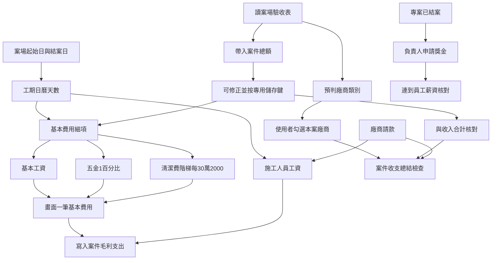

# 案件毛利擴充與薪資連動

## 白話目標

案件毛利表要能：依驗收表預判廠商、帶入案件總額（可修正）與收入核對、勾選本案廠商、自動算「基本費用」（基本工資＋五金 1%＋清潔費，畫面低調一筆、後台看細項）與施工人員工資，並用「廠商是否都請完款」等當收支總結條件。結案後負責人可從毛利連到薪資申請獎金；權限 5 主管可看每位員工薪資試算；薪資核對「送出」只能在該期最後一天下班時間之後。

## 現況（程式已有）

| 能力             | 現況                                                                                                                                                                                                                                                                                             |
| -------------- | ---------------------------------------------------------------------------------------------------------------------------------------------------------------------------------------------------------------------------------------------------------------------------------------------- |
| 案件毛利列表／明細／手動加列 | `[project_margin.html](d:\Dropbox\CodeBackups\CODING\modules\accounting\project_margin.html)` + `[MarginModule.js](d:\Dropbox\CodeBackups\backend\accounting-gas\master\MarginModule.js)`                                                                                                      |
| 廠商請款寫入毛利       | 匯款後依分攤寫支出列（已有）                                                                                                                                                                                                                                                                                 |
| 案場驗收表工項／單價     | Firebase `quotations/{案號}`；驗收表加總 `items[].price`（見 `[BudgetAuditor_Standalone_V2.html](d:\Dropbox\CodeBackups\CODING\tools\BudgetAuditor_Standalone_V2.html)` `refreshPriceDisplay`）；對照邏輯在 `[SiteReportAcceptance.js](d:\Dropbox\CodeBackups\backend\project-console\SiteReportAcceptance.js)` |
| 案場工期／負責人       | `[ProjectLogic.js](d:\Dropbox\CodeBackups\backend\project-console\ProjectLogic.js)` 排程算「專案起始日／預計完工日」；結案寫入「結案日」與狀態「已結案」 |
| 薪資核對送審         | `[Logic_PayrollReview.js](d:\Dropbox\CodeBackups\backend\CheckinSystem\Logic_PayrollReview.js)` + `[payroll_review_panel.js](d:\Dropbox\CodeBackups\CODING\modules\attendance\payroll_review_panel.js)`；**目前無「最後一天下班後才能送」硬閘**                                                                  |
| 主管看他人薪資試算      | 個人頁只鎖本人；會計審核頁只看已送審單                                                                                                                                                                                                                                                                            |

## 已定規則

- **基本工資**：工期日曆天數（含假日）÷ 30 × 35,000（按比例）。
- **工期結束日**：按下「將此專案結案」當天；異常時主管可在毛利表改開始／結束日。
- **案件總額**：從驗收表工項單價加總帶入；可修正，**修正後必須按專用「儲存」鍵才寫入**（不自動存）。
- **總額 vs 收入**：用案件總額與毛利收入合計核對是否一致（收支總結條件之一）。
- **基本費用**（併入同一筆低調支出，後台可拆細項）：
  - 基本工資：`天數 / 30 × 35000`
  - 五金費用：`案件總額 × 1%`
  - 清潔費：`2000 × (floor(案件總額 / 300000) + 1)`（每滿 30 萬一階 2,000，**階梯式**非比例）
  - 畫面只顯示一筆「基本費用」合計，不強調細項；後台／權限足夠者可展開看三項明細。
- **施工人員工資**（工務／木作／系統／油漆）：可從該案廠商請款帶入，或手動填日薪／月薪；金額＝施工天數 ×（日薪，或 月薪÷20）。
- **廠商全部請款**：本案勾選的廠商，其請款單皆已匯款，才算收支總結條件之一通過。

## 實作範圍

### A. 案場結案日 + 毛利讀案場

**後端 project-console**

- 結案時寫入「結案日」（當天 Asia/Taipei）；若案場資料尚無欄位則新增。
- 提供給會計讀取的案場摘要 API（或會計 GAS 直接開同一試算表讀）：案號、專案起始日、結案日、專案狀態、負責人員（`專案負責人`）、工務等。

**會計 MarginModule**

- 毛利詳情回傳工期：預設開始＝排程／案場「專案起始日」；結束＝結案日（未結案則暫用今天，僅試算、標「未結案」）。
- 儲存主管覆寫的 `工期開始`／`工期結束`（建議放在該案分頁上方 meta 區或總覽擴欄，來源標記 `manual`／`auto`）。

### B. 案件毛利：總額、基本費用、廠商、工資、收支總結

**檔案主戰場**

- 後端：`[MarginModule.js](d:\Dropbox\CodeBackups\backend\accounting-gas\master\MarginModule.js)`（新 action）
- 前端：`[project_margin.html](d:\Dropbox\CodeBackups\CODING\modules\accounting\project_margin.html)`、`[accounting_api.js](d:\Dropbox\CodeBackups\CODING\shared\js\accounting_api.js)`
- SPEC：`[15_會計系統模組規格書.md](d:\Dropbox\CodeBackups\CODING\SPEC\15_會計系統模組規格書.md)`、`[DATA_MASTER_PLAN.md](d:\Dropbox\CodeBackups\backend\accounting-gas\SPEC\DATA_MASTER_PLAN.md)`

**B0. 驗收表案件總額（核對收入）**

- **讀取路徑**：accounting-gas **不直連 Firebase**；經 project-console `GET page=margin_quotation_summary`（secret 與 `invalidate_site_caches` 相同）取得 `contract_amount_auto`、`work_types`、`has_price_data`。
- 加總邏輯與驗收表相同：清掉 `items[].price` 非數字字元後加總。
- 存兩欄：
  - `contract_amount_auto`：每次從驗收表重讀的原始總額
  - `contract_amount`：實際採用總額（預設＝auto；使用者修正後以手動為準）
- **修正必須按專用「儲存總額」鍵**才呼叫 API 寫入；輸入框改動未存時標「未儲存」，離開不自動存。
- 另提供「重新從驗收表帶入」：覆寫 auto，若尚未手動鎖定則同步到 `contract_amount`；若已手動修正則只更新 auto 並提示「與驗收表差異」，不擅自蓋掉手動值（或詢問是否採用驗收表）。
- 收支總結：比較 `contract_amount` 與毛利「收入合計」；差額顯示（例：差 12,000），通過條件可設為差額為 0 或在容許誤差內（預設差額＝0 才綠燈）。

**B1. 驗收表 → 預判廠商 → 使用者勾選**

- 讀驗收表工種預判廠商：經 project-console `margin_quotation_summary` 取得 `work_types`，對應廠商主檔 `trade_category`。
- 工項分類（木作工程、系統櫃體、油漆工程…）對應廠商主檔「行業類別」（木工、系統櫃、油漆…），列出候選廠商。
- 使用者勾選「本案用到的廠商」並存檔（建議新分頁或主檔 entity：`margin_project_vendors`：案號、vendor_id、類別、是否選用、更新者／時間）。
- 預判只是預勾，使用者可增刪。

**B2. 基本費用（畫面低調一筆，後台看細項）**

以**採用中的案件總額** `contract_amount` 與工期天數計算：

| 細項         | 公式                                                              |
| ---------- | --------------------------------------------------------------- |
| 基本工資       | `round(工期天數 / 30 * 35000)`（天數＝結束−開始＋1，含假日）                      |
| 五金費用       | `round(contract_amount * 0.01)`                                 |
| 清潔費        | `2000 × (floor(contract_amount / 300000) + 1)`（每滿 30 萬一階 2,000，階梯式） |
| **基本費用合計** | 上三項相加                                                           |

寫入規則：

- 毛利明細**只寫一筆**支出：費用類別「基本費用」、來源 `系統`、固定備註鍵（例 `[sys:base_cost]`）去重覆寫。
- **後台細項**存在該列備註 JSON，或同案 meta（`base_wage`／`hardware_fee`／`cleaning_fee`）；API `margin_list_lines`／詳情對權限 ≥4 回傳 `base_cost_breakdown`。
- **前端**：一般列表與費用明細只顯示「基本費用」一個金額，不拆三行、不特別強調（字級／樣式與其他支出列相同）。詳情可加低調「詳情」展開（僅後台／財務），顯示三項數字供對帳。
- 工期、總額變更並儲存後重算並覆寫該系統列（不碰其他手動列）。

**B3. 施工人員工資（工務／木作／系統／油漆）**

- UI：四列，各可選「從廠商請款帶入」或「自填日薪／月薪」。
- 帶入：彙總該案已分攤到毛利、且類別對應的廠商請款金額（可編輯覆寫）。
- 自填：`天數 × 日薪` 或 `天數 × (月薪 / 20)`。
- 各寫一筆系統支出列（可覆寫重算）；手動覆寫金額時標記 `manual` 不再被自動蓋掉（與現有 manual 慣例一致）。

**B4. 案件收支總結檢查清單**

詳情頁顯示條件狀態（通過／未通過），至少包含：

1. 已勾選廠商是否「全部請款完成」（該廠商＋該案相關請款 `payment_status=已匯款`；無請款列則標「尚無請款」）。
2. 基本費用列已計算。
3. **案件總額與收入合計是否一致**（顯示兩邊金額與差額）。
4. 專案是否已結案（獎金申請前置）。

「全部請款」「總額＝收入」為判斷依據，不強制鎖死其他操作，但總結區塊要清楚標紅／綠。

### C. 毛利 ↔ 員工薪資（獎金）

- 案場「專案負責人」欄位可為 **逗號分隔多個 LINE UID**（亦相容姓名）；`parseResponsibleUids_` 解析後對員工資料。
- **多位負責人**：毛利詳情可設定 `bonus_allocations`（`userId`、`name`、`ratio`），API `margin_save_bonus_allocations` 驗證比例加總 **100%**。
- **預設**：未儲存時，若負責人 >1 人則 UI 顯示均分比例（可改後按儲存）；套用獎金前若仍無設定則後端均分。
- **套用**：`margin_apply_bonus` 以 `suggested_amount × ratio / 100` 計算各人金額，寫入該案 meta `bonus_draft`（待薪資審核併入）；專案須已結案。
- 對不到員工時允許手動選人（後續 UI）。

### D. 權限 5 看員工薪資表＋預期支付額

- Checkin：`payroll_review` 新增 `mode=admin_preview`（或擴充 `context`）：`permission >= 5` 可傳 `targetUserId`，回傳與本人相同的試算（出勤快照、預估實發）。
- 前端：個人出勤頁或會計入口加「員工薪資預覽」（僅 ≥5）：選員工 → 選期別 → 顯示預期支付額（唯讀，不可代送審）。
- 稽核：寫 `view_detail`／`payroll`（金額可遮罩，與既有薪資稽核規則一致）。

### E. 薪資核對送出時間閘（最後一天下班後）

- **後端硬閘**（必做）：`_submitPayrollReview_` 檢查現在時間（Asia/Taipei）是否 ≥ `periodEnd` 當日該員工 `shiftEnd`（員工資料下班時間；無則預設 17:30）。未到則拒絕並回訊息。
- **前端**：送出鍵 disabled，提示「須於 {日期} {下班時間} 之後才能送出」；到點後可重新載入解鎖（或前端每分鐘檢查）。
- 進行中期別（本月尚未結束）維持不可送。

## 建議實作順序

1. **E**（小、獨立、立刻有感）— 送出時間閘
2. **A + B0 + B2** — 結案日、工期、案件總額、基本費用（含五金／清潔細項）
3. **B1 + B4** — 廠商勾選、全部請款與總額vs收入檢查
4. **B3** — 施工人員工資
5. **C + D** — 獎金連動、主管預覽

## 規格與紀錄

- 更新 `CODING/SPEC/15_會計系統模組規格書.md` §2.6、`17_個人薪資出勤頁計劃書.md`（送出閘、主管預覽）
- 更新 `accounting-gas/SPEC/DATA_MASTER_PLAN.md`（毛利 meta、案件總額、基本費用細項、廠商選用表）
- 大改後寫 `LOG/YYYY-MM-DD_LOG.md`（CODING + accounting-gas + CheckinSystem）
- 部署走 deploy-runbook（SPEC → LOG → 備份 → 部署）

## 風險與假設

- 驗收表在 Firebase；部分匯出可能剝除 `price` 欄——若雲端無單價則總額為 0，需提示「驗收表無價格資料，請手動填總額並儲存」。
- 會計 GAS **經 project-console 轉接 API** 讀驗收表（`margin_quotation_summary`），不在 accounting-gas 直連 Firebase。
- **專案負責人**欄位存 **LINE UID**（可多個、逗號分隔），非姓名字串；對員工以 `userId`／`userName` 比對。獎金申請需支援多人與自訂比例。
- 基本費用與施工工資的「系統列」用固定備註鍵去重（`[sys:base_cost]`、`[sys:labor:角色]`），避免重算產生重複支出。
- 清潔費採 **階梯式**（每滿 30 萬 +2,000），非按比例；公式見 B2。
- 其他可選營運攤提（交通、保險、耗材等）見計畫「建議可再納入的營運費用」；**預設不實作**，待主管選定後再加進基本費用細項。

## 建議可再納入的營運費用（待主管確認）

以下是裝修／設計公司常見、且「稍加」在案場支出裡較合理的項目。原則：**能對應到現場、金額小、可公式化、不重複已有廠商請款**。

| 項目            | 為何合理               | 建議算法（範例，待定）                          | 建議                |
| ------------- | ------------------ | ------------------------------------ | ----------------- |
| **交通／油資分攤**   | 工務往返、材料跑腿是固定營運成本   | 工期天數 × 固定日額（例 200～500），或總額 0.3%～0.5% | 優先考慮              |
| **工安／責任險攤提**  | 每案都有風險成本，不宜只算在公司總帳 | 總額 0.2%～0.5%，或每案固定下限                 | 優先考慮              |
| **現場耗材／保護材**  | 膠布、保護膜、垃圾袋等常被忽略    | 總額 0.3%～0.5%，或每案固定額                  | 可考慮（勿與五金 1% 重複定義） |
| **行政／帳務協調**   | 請款、對帳、排程協調的後勤成本    | 總額 0.5%～1%（管理費性質）                    | 可考慮，但對外勿強調        |
| **臨時水電／場地雜支** | 施工期水電、清潔用水等        | 每案固定額或總額 0.1%～0.2%                   | 次要                |
| **工具／設備折舊**   | 電動工具、梯具損耗          | 總額 0.1%～0.3%                         | 次要                |

**不建議硬攤進案場的：**

- 辦公室租金、總部人事（與單案關聯弱，宜留在公司總帳）
- 行銷廣告、業務交際（難公平分攤到每案）
- 已由廠商請款涵蓋的項目（避免雙重計入）

**目前計畫已納入的基本費用**（工資＋五金 1%＋清潔）已涵蓋「現場人力固定成本＋小五金＋收尾清潔」三塊；若再加，建議最多再加 **交通** 與 **工安險** 兩項，合計仍維持畫面一筆「基本費用」、後台看細項。