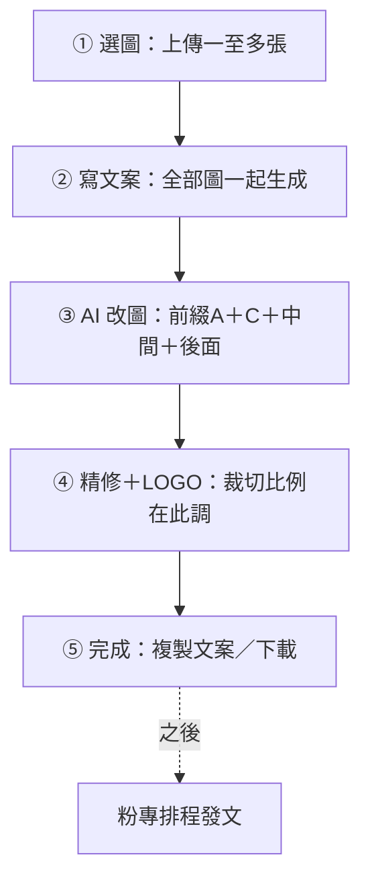

# FB 發文工作室 — 開發規格書（Phase 1）

> **狀態**：Phase 1 已上線；本輪改成分步驟精靈（wizard）＋前綴 A／C（無尺寸）＋多圖／文案版本／精修  
> **正式網址**：https://info.tanxin.space/tools/fb-post-studio/  
> **前端**：`CODING/tools/fb-post-studio/`  
> **後端**：`backend/accounting-gas/FbPostStudio.js`（經 `WebApp.js` 路由）  
> **粉專**：https://www.facebook.com/TainanTanXin  
> **Phase 2**：Meta Graph 排程發文（本規格僅預留，不實作）

---

## 一句話

上傳一至多張完工／空間照 → 分五步精靈完成：選圖 → AI 產活潑繁中 FB 文案 → 組合標籤 AI 改圖 → Canvas 精修與疊真實 LOGO → 複製文案／下載 JPG，人工貼到粉專。

---

## 流程（白話）



### 程式對照表

| 白話（圖上） | 程式對照 |
|---|---|
| ① 選圖 | 前端壓縮 ≤4MB／張，上限 `MAX_IMAGES` → `state.images`；精靈 `setWizardStep(1)` |
| ② 把全部圖一起交給後端寫文案 | `action: fb_post_generate` + `photos[]` → `handleFbPostGenerate_`／`collectFbPostPhotos_` |
| 本機存一版文案紀錄 | `localStorage` `COPY_HISTORY_KEY`，保留最近約 40 筆 |
| ③ 對選中圖或批次逐張改圖 | 前端迴圈呼叫 `fb_post_edit_image`（單張輸入） |
| 組合標籤改圖指令 | `EDIT_TAGS`：`prefixA`→`prefixC`→`middle`→`suffix`→自由文字 → `composeInstruction()` |
| 原圖與改圖對照／採用 | 每圖 `versions`＋「採用此圖」→ 自動進步驟 4 |
| ④ 亮度銳化濾鏡旋轉裁切疊 LOGO | Canvas 精修層（真實 PNG／SVG；比例用裁切 chips） |
| ⑤ 複製文案／下載單張或全部 | Clipboard + `canvas.toBlob` |
| 粉專排程發文 | Phase 2（未實作） |
| 健康檢查 | `action: fb_post_ping` |

---

## API

認證與 AiVisionLab 相同：`resolveAiLabAuth_`（權限 ≥ 3，或 ingest secret）。  
圖片正規化：`normalizeAiLabPhotoInput_`。

| action | 說明 | 模型 |
|--------|------|------|
| `fb_post_ping` | 健康檢查、是否已設 Gemini | — |
| `fb_post_generate` | 一至多張原圖 → FB 文案 JSON | `gemini-2.5-flash` |
| `fb_post_edit_image` | **單張**原圖＋指令 → 改圖 base64（前端可迴圈批次） | `gemini-3.1-flash-image` |

### `fb_post_generate` 請求／回應

**請求（重點欄位）**

- `photos`：`[{ data_base64, mime_type }, …]`（建議；最多 10）
- 或相容舊版單圖：`photo`：`{ data_base64, mime_type }`
- `post_type`：`完工案例` / `設計分享` / `促銷` / `日常`
- `tone`：語氣字串（預設「活潑親切」）
- `extra_notes`：補充說明（選填）

**回應 `data`**

```json
{
  "headline": "短標題（可含適度 emoji）",
  "body": "繁中正文，適度穿插 emoji",
  "hashtags": ["#添心設計", "#台南室內設計"],
  "cta": "歡迎私訊了解",
  "image_notes": "發文時建議搭配的畫面說明"
}
```

另回 `photo_count`。Usage log：`feature=fb_post_generate`。

### `fb_post_edit_image` 請求／回應

**請求**

- `photo`：原圖或上一輪結果（**單張**）
- `instruction`：改圖指令（必填；可由前端標籤組合）
- `aspect_ratio`（選填）：`1:1` / `4:5` / `16:9`（API 參數；畫面裁切在步驟 4）
- `model`（選填）：預設 `gemini-3.1-flash-image`

**generationConfig**

- `responseModalities: ["TEXT","IMAGE"]`
- 可選 `imageConfig.aspectRatio`、解析度預設 1K

**回應**

```json
{
  "success": true,
  "image": { "mimeType": "image/png", "dataBase64": "..." },
  "note": "模型附註文字（若有）",
  "usage": { "prompt_token_count": 0, "candidates_token_count": 0, "total_token_count": 0 }
}
```

Usage log：`feature=fb_post_edit`。

---

## Prompt 守則（後端寫死）

1. 依提供照片編修，保留空間結構／主要家具／鏡頭角度，只改使用者指定項目。
2. 禁止擅自加入不存在的品牌字樣（LOGO 由 Canvas 後加）。
3. 禁止虛構客戶身分／地址等隱私資訊。
4. 文案：添心設計、台南、繁體中文、**活潑親切**、適度 emoji（勿整篇貼滿）、適合粉專口吻。
5. 多圖文案：綜合全部附圖寫一篇，可呼應多空間／多角度。

---

## 前端 UI：五步精靈

每步有「上一步／下一步」與頂部步驟指示（1／5…）。未上傳圖時無法進步驟 2+；未選中圖時無法進步驟 3–4（會提示）。

1. **選圖**：拖放／多選；上限 `MAX_IMAGES`（預設 10）；圖庫縮圖列常駐於後續步驟  
2. **寫文案**：類型、語氣（預設活潑親切）、補充 →「用全部圖生成文案」→ 可編輯；本機版本歷史（約 40 筆）  
3. **AI 改圖**：前綴 A（鏡頭／構圖）＋前綴 C（用途／情境）＋中間效果＋後面約束＋自由文字；即時預覽；單張或批次；版本回退；採用此圖 → 自動進步驟 4  
4. **精修＋LOGO**：亮度／對比／飽和／銳化／旋轉／暗角／色溫；濾鏡；**裁切比例（1:1／4:5／16:9）在此調**；疊真實 LOGO  
5. **完成**：複製貼文、開粉專、下載目前／全部 JPG  

設定／連線摺疊在頁底。

### 改圖標籤重點（`config.EDIT_TAGS`）

| 區 | 範例 |
|----|------|
| 前綴 A 鏡頭／構圖 | 保持原鏡頭、稍微靠近主體、拉開看全貌、主體偏左／偏右、略微俯視感、平視自然、對準細節（**不含** 1:1／4:5／16:9） |
| 前綴 C 用途／情境 | 完工主圖、細節特寫、氛圍圖、對比前後、促銷主視覺、作品集展示、粉專動態感 |
| 中間 | 空間美化、商業攝影感、去雜物、去人物／隱私、背景淨化、光線提升、色溫偏暖／偏冷、材質更清晰、完工展示感、生活情境感 |
| 後面 | 保留真實空間結構、不要亂加文字／LOGO、不要改變家具配置、自然不過度、適合 FB 發文 |

合成順序：前綴 A → 前綴 C → 中間 → 後面 → 自由文字。

預設 LOGO：`assets/logo.png`（無真實檔時用透明 placeholder，見 `assets/README.md`）。

---

## 驗收（Phase 1 + 本輪強化）

1. 五步精靈可切換；無圖時下一步有提示  
2. 上傳多張 → 生成繁中活潑文案（含適度 emoji／hashtags）；版本列表可還原  
3. 前綴僅 A／C，預覽指令**無**尺寸類標籤；精修可裁切比例  
4. 對選中圖改圖；可批次逐張（注意 GAS 時限）；可迭代  
5. 採用圖 → 精修 → 疊 LOGO → 完成頁下載  
6. 文案／改圖皆有 usage log；未授權回失敗訊息  

---

## 風險與限制

| 項目 | 說明 |
|------|------|
| 改圖成本 | Image 模型按張計費；批次＝張數 |
| GAS 時限 | 批次改圖前端逐張＋間隔；張數多可能逾時，宜分批 |
| GAS 回應體積 | 前端先壓輸入；多圖文案 base64 總量需注意 |
| 真實性 | 完工案例避免過度造假；發文前人工確認 |
| LOGO | 一律 Canvas 疊真實 PNG／SVG；瀏覽器不讀 `.ai` |
| Phase 2 | 需 Meta `pages_manage_posts` 等審核 |

---

## 檔案清單

| 路徑 | 用途 |
|------|------|
| `CODING/tools/fb-post-studio/index.html` | 五步精靈 UI |
| `CODING/tools/fb-post-studio/studio.js` | 前端邏輯（精靈＋標籤組合） |
| `CODING/tools/fb-post-studio/config.js` | GAS URL、多圖上限、標籤 A／C、濾鏡 |
| `CODING/tools/fb-post-studio/assets/` | LOGO 與匯出說明 |
| `backend/accounting-gas/FbPostStudio.js` | 後端（多圖文案＋prompt） |
| `backend/accounting-gas/WebApp.js` | 註冊 3 個 action |
