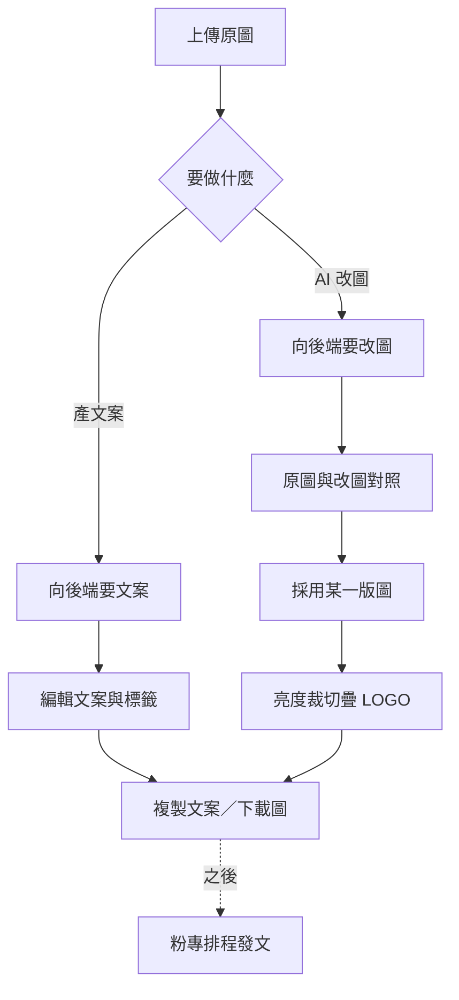

# FB 發文工作室 — 開發規格書（Phase 1）

> **狀態**：Phase 1 已上線（人工發文：文案＋AI 改圖＋Canvas 精修）  
> **正式網址**：https://info.tanxin.space/tools/fb-post-studio/  
> **前端**：`CODING/tools/fb-post-studio/`  
> **後端**：`backend/accounting-gas/FbPostStudio.js`（經 `WebApp.js` 路由）  
> **粉專**：https://www.facebook.com/TainanTanXin  
> **Phase 2**：Meta Graph 排程發文（本規格僅預留，不實作）

---

## 一句話

上傳完工／空間照 → AI 產繁中 FB 文案 → AI 依原圖改圖（可多輪）→ Canvas 裁切／調色／疊真實 LOGO → 複製文案、下載 JPG，人工貼到粉專。

---

## 流程（白話）



### 程式對照表

| 白話（圖上） | 程式對照 |
|---|---|
| 上傳原圖 | 前端壓縮 ≤4MB → `data_base64` |
| 向後端要文案 | `action: fb_post_generate` → `handleFbPostGenerate_` |
| 向後端要改圖 | `action: fb_post_edit_image` → `handleFbPostEditImage_` |
| 編輯文案與標籤 | `studio.js` 可編輯欄位 + 一鍵複製 |
| 原圖與改圖對照／採用 | `state.versions` +「採用此圖」 |
| 亮度裁切疊 LOGO | Canvas 精修層（真實 PNG，非 AI 畫字） |
| 複製文案／下載圖 | Clipboard + `canvas.toBlob('image/jpeg')` |
| 粉專排程發文 | Phase 2（未實作） |
| 健康檢查 | `action: fb_post_ping` |

---

## API

認證與 AiVisionLab 相同：`resolveAiLabAuth_`（權限 ≥ 3，或 ingest secret）。  
圖片正規化：`normalizeAiLabPhotoInput_`。

| action | 說明 | 模型 |
|--------|------|------|
| `fb_post_ping` | 健康檢查、是否已設 Gemini | — |
| `fb_post_generate` | 原圖 → FB 文案 JSON | `gemini-2.5-flash` |
| `fb_post_edit_image` | 原圖＋指令 → 改圖 base64 | `gemini-3.1-flash-image` |

### `fb_post_generate` 請求／回應

**請求（重點欄位）**

- `photo`：`{ data_base64, mime_type }`
- `post_type`：`完工案例` / `設計分享` / `促銷` / `日常`
- `tone`：語氣字串（選填）
- `extra_notes`：補充說明（選填）

**回應 `data`**

```json
{
  "headline": "短標題",
  "body": "繁中正文",
  "hashtags": ["#添心設計", "#台南室內設計"],
  "cta": "歡迎私訊了解",
  "image_notes": "發文時建議搭配的畫面說明"
}
```

### `fb_post_edit_image` 請求／回應

**請求**

- `photo`：原圖或上一輪結果
- `instruction`：改圖指令（必填）
- `aspect_ratio`（選填）：`1:1` / `4:5` / `16:9`
- `model`（選填）：預設 `gemini-3.1-flash-image`

**generationConfig**

- `responseModalities: ["TEXT","IMAGE"]`
- 可選 `imageConfig.aspectRatio`、解析度預設 1K

**回應**

```json
{
  "success": true,
  "image": { "mimeType": "image/png", "dataBase64": "..." },
  "note": "模型附註文字（若有）",
  "usage": { "prompt_token_count": 0, "candidates_token_count": 0, "total_token_count": 0 }
}
```

Usage log：`feature=fb_post_generate` / `fb_post_edit`。

---

## Prompt 守則（後端寫死）

1. 依提供照片編修，保留空間結構／主要家具／鏡頭角度，只改使用者指定項目。
2. 禁止擅自加入不存在的品牌字樣（LOGO 由 Canvas 後加）。
3. 禁止虛構客戶身分／地址等隱私資訊。
4. 文案：添心設計、台南、繁體中文、適合粉專口吻。

---

## 前端 UI 區塊

1. **上傳**：拖放／選檔；壓縮 ≤4MB  
2. **文案**：類型、語氣、補充 → 生成 → 可編輯 → 一鍵複製  
3. **AI 改圖**：快捷預設（空間美化、商業攝影感、去人物／隱私、背景淨化、構圖建議）＋自由指令；多輪迭代；對照；版本回退；採用此圖  
4. **手動精修**：亮度／對比／飽和度；裁切 1:1／4:5／16:9；LOGO 位置／大小／透明度；下載 JPG  
5. **草稿**：localStorage（文案＋精修參數；圖以目前採用版為主）

預設 LOGO：`assets/logo.png`（無真實檔時用透明 placeholder，見 `assets/README.md`）。另支援自訂 LOGO 上傳。

---

## 驗收（Phase 1）

1. 上傳完工照 → 生成繁中文案（含 hashtags）  
2. 「空間美化」或自填指令 → 回傳 AI 改圖，可與原圖對照  
3. 可在改圖結果上再下一輪（迭代）  
4. 採用圖 → 裁切 1:1 → 疊 LOGO → 下載 JPG  
5. 複製文案可貼粉專  
6. 文案／改圖皆有 usage log；未授權回失敗訊息（權限不足）

---

## 風險與限制

| 項目 | 說明 |
|------|------|
| 改圖成本 | Image 模型按張計費；UI 顯示「將消耗 1 次改圖」 |
| GAS 回應體積 | 前端先壓輸入；大圖 base64 可能接近上限 |
| 真實性 | 完工案例避免過度造假；發文前人工確認 |
| LOGO | 一律 Canvas 疊真實 PNG／SVG，不讓 AI 畫品牌字 |
| Phase 2 | 需 Meta `pages_manage_posts` 等審核 |

---

## 檔案清單

| 路徑 | 用途 |
|------|------|
| `CODING/tools/fb-post-studio/index.html` | UI |
| `CODING/tools/fb-post-studio/studio.js` | 前端邏輯 |
| `CODING/tools/fb-post-studio/config.js` | GAS URL、預設指令 |
| `CODING/tools/fb-post-studio/assets/` | LOGO |
| `backend/accounting-gas/FbPostStudio.js` | 後端 |
| `backend/accounting-gas/WebApp.js` | 註冊 3 個 action |
