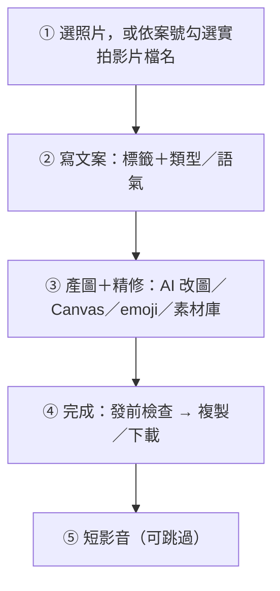

# FB 發文工作室 — 開發規格書（Phase 1＋強化）

> **狀態**：Phase 1 已上線；本輪收斂實拍短影音為「網頁送單 → 本機助手處理」
> **產品決策**：網頁不剪實拍影片，也不從雲端把整支影片下載進瀏覽器；影片清單只帶檔名與路徑
> **正式網址**：https://info.tanxin.space/tools/fb-post-studio/  
> **前端**：`CODING/tools/fb-post-studio/`  
> **後端**：`backend/accounting-gas/FbPostStudio.js`（經 `WebApp.js` 路由；Dropbox 清單／取檔由 **project-console** 實作再轉呼）  
> **粉專**：https://www.facebook.com/TainanTanXin  
> **短影音專章**：[`22_FB_REEL_STUDIO_SPEC.md`](22_FB_REEL_STUDIO_SPEC.md)  
> **Phase 2**：Meta Graph 排程發文（本規格僅預留，不實作）

---

## 開發分期（Dropbox 匯入／影音）

| 階段 | 做什麼 | 狀態 |
|------|--------|------|
| **Phase 0** | 後端 list API：依案號找 Dropbox「完工照」資料夾，列出照片與實拍影片 | **已完成** |
| **Phase A** | 照片可由後端依 path 取圖；實拍影片禁止走這條路 | **照片保留** |
| **Phase B** | 步驟①案號 → 列清單 → 勾選；照片匯入圖庫，影片只記錄檔名／Dropbox 相對路徑 | **本輪收斂** |
| **本機助手** | 步驟⑥下載 JSON 工單 → 放入固定 queue → 本機助手讀已同步影片並產生試看 | **本輪** |

資料夾慣例：專案夾下名稱含「**完工照**」且**不含**「美照」（例：案號 `734` 下常見 `1160722完工照`）。照片與實拍影片放**同一**完工照資料夾。

---

## 一句話

照片可做文案、改圖、精修與圖轉短影音；實拍影片則只在網頁選檔與下載工單，交由 `TanxinTools/short-video-workflow/` 本機助手讀 Dropbox 同步檔處理。

---

## 流程（白話）


```mermaid
flowchart TB
  S1["① 選照片，或依案號勾選實拍影片檔名"] --> S2["② 寫文案：標籤＋類型／語氣"]
  S2 --> S3["③ 產圖＋精修：AI 改圖／Canvas／emoji／素材庫"]
  S3 --> S4["④ 完成：發前檢查 → 複製／下載"]
  S4 --> S5["⑤ 短影音（可跳過）"]
```

### 程式對照表

| 白話（圖上） | 程式對照 |
|---|---|
| ① 選圖（本機上傳） | 前端壓縮 ≤4MB／張，上限 `MAX_IMAGES` → `state.images`；精靈 `setWizardStep(1)` |
| ① 依案號選照片或實拍影片 | `list_project_completion_media`；照片可附縮圖並匯入 `state.images`，影片查詢固定 `include_preview=false`，只把 `name/path` 放入 `state.siteVideos` |
| ① 取得檔案內容 | `fetch_project_completion_media` 與 CORS 備援只用於照片；實拍影片不得呼叫取檔代理 |
| ⑥ 實拍影片送單 | `makeWorkOrder()` 產生 JSON；`handleDownloadWorkOrder()` 下載；可貼 `local_path`，案場影片使用 `dropbox_relative` |
| 本機助手收單 | `TanxinTools/short-video-workflow/Watch-Queue.ps1` 監看 `queue/`，呼叫 `New-ShortPreview.ps1`，並把四態與結果寫回工單 |
| ⑥ 照片合成短影音 | 原有 `reel.js` 保留；只處理照片，不接實拍影片 |
| ② 文案標籤＋類型／語氣 | `COPY_TAGS` 多選 → `composeCopyTagsPayload()`；與 `post_type`／`tone`／`extra_notes` 一併送出 |
| ② 把全部圖一起交給後端寫文案 | `action: fb_post_generate` + `photos[]` + `copy_tags[]` → `handleFbPostGenerate_` |
| 本機存一版文案紀錄（含標籤） | `localStorage` `COPY_HISTORY_KEY`；欄位含 `copyTags`／`copyTagLabels`／`copyTagIds` |
| ③ 產圖＋精修（合併原步驟 3／4） | AI 改圖標籤＋批次一致（可附 `reference_photo`）；採用後 Canvas 精修；內建 emoji／**素材庫**可拖曳疊到畫布；LOGO 一鍵全上；圖庫可拖曳調序 |
| ④ 完成：發前檢查 | `evaluatePreflight`／`renderPreflight`：LOGO、文案長度、個資勾選、圖可下載 |
| ⑤ 短影音（可跳過） | 照片合成見 SPEC 22；實拍影片工單見 SPEC 22 §工單 |
| 粉專排程發文 | Phase 2（未實作） |
| 健康檢查 | `action: fb_post_ping` |

---

## API

認證與 AiVisionLab 相同：`resolveAiLabAuth_`（權限 ≥ 3，或 ingest secret）。  
圖片正規化：`normalizeAiLabPhotoInput_`。

| action | 說明 | 模型／實作位置 |
|--------|------|----------------|
| `fb_post_ping` | 健康檢查、是否已設 Gemini | accounting-gas |
| `fb_post_generate` | 一至多張原圖 → FB 文案 JSON（可含文案標籤） | `gemini-2.5-flash` |
| `fb_post_edit_image` | **單張**原圖＋指令 → 改圖 base64（前端可迴圈批次） | `gemini-3.1-flash-image` |
| `list_project_completion_media` | 依案號列出 Dropbox「完工照」內照片／影片（Phase 0） | accounting-gas **轉呼** project-console |
| `fetch_project_completion_media` | 依 Dropbox `path` 取照片 → base64；FB 發文工作室不得用它抓實拍影片 | accounting-gas **轉呼** project-console |

### `list_project_completion_media`（Phase 0）

**呼叫端點（給前端）**：accounting-gas Web App，`action: list_project_completion_media`（同其他 `fb_post_*`）。  
**實際讀 Dropbox**：project-console `page=list_project_completion_media`（內部 secret；勿給瀏覽器直接拿 secret）。

**請求（重點欄位）**

- `project_code`（或 `projectNo`）：案號，必填（測試慣例可用 `734`）
- `media_type`（選填）：`image`｜`video`｜`all`（預設 `all`）
- `limit`（選填）：單次回傳筆數上限（後端會封頂，避免 GAS 逾時）
- `cursor`（選填）：上一頁回傳的游標，用於續列
- `include_preview`（選填）：照片可為 `true`；實拍影片前端固定送 `false`，只列目錄，不拉預覽或整檔

**尋找規則**

1. 在 Dropbox 設計圖根目錄**只找**案號對應專案夾（**不**因查詢而新建空夾）
2. 專案夾下子資料夾：名稱含「完工照」且**不含**「美照」（例：`1160722完工照`）
3. 於該資料夾遞迴列檔；依副檔名判 `kind`：`image`｜`video`｜`other`

**回應 `data`（示意）**

```json
{
  "project_code": "734",
  "project_folder": "/添心設計/設計圖/…",
  "completion_folders": ["/…/1160722完工照"],
  "media_type": "all",
  "items": [
    {
      "name": "客廳.jpg",
      "path": "/添心設計/設計圖/…/客廳.jpg",
      "ext": "jpg",
      "kind": "image",
      "size": 123456,
      "preview_url": null
    }
  ],
  "count": 1,
  "truncated": false,
  "next_cursor": null
}
```

### `fetch_project_completion_media`（Phase A，照片限定）

**呼叫端點（給前端）**：accounting-gas Web App，`action: fetch_project_completion_media`。  
**實際下載**：project-console `page=fetch_project_completion_media`（內部 secret）。FB 發文工作室只用於照片；影片即使 API 技術上可回傳，也不是本產品流程。

**請求**

- `path`：Dropbox 絕對路徑（必填；通常來自 list 回傳的 `items[].path`）
- `project_code`（強烈建議）：案號；有則驗證 path 必須落在該案「完工照」夾下
- `allow_link_fallback`（選填）：超過體積上限時改回傳暫存連結（預設 true）

**體積上限（原始位元組）**

- 照片約 8MB；影片約 12MB（超過則 `delivery=link`＋`temp_url`，或失敗訊息）

**回應 `data`（示意）**

```json
{
  "name": "客廳.jpg",
  "path": "/添心設計/設計圖/…/客廳.jpg",
  "ext": "jpg",
  "kind": "image",
  "mime_type": "image/jpeg",
  "size": 123456,
  "delivery": "base64",
  "data_base64": "...",
  "temp_url": null,
  "truncated": false
}
```

`delivery=link` 時：`data_base64` 為 null，附 `temp_url` 與人話 `message`（例如照片超過體積上限）。實拍影片不使用本段流程。

### `fb_post_generate` 請求／回應

**請求（重點欄位）**

- `photos`：`[{ data_base64, mime_type }, …]`（建議；最多 10）
- 或相容舊版單圖：`photo`：`{ data_base64, mime_type }`
- `post_type`：`完工案例` / `設計分享` / `促銷` / `日常`
- `tone`：語氣字串（預設「活潑親切」）
- `extra_notes`：補充說明（選填）
- `copy_tags`：字串陣列（選填；前綴／中間／後面標籤的 `text` 合成結果）

**回應 `data`**

```json
{
  "headline": "短標題（可含適度 emoji）",
  "body": "繁中正文，適度穿插 emoji",
  "hashtags": ["#添心設計", "#台南室內設計"],
  "cta": "歡迎私訊了解",
  "image_notes": "發文時建議搭配的畫面說明"
}
```

另回 `photo_count`。Usage log：`feature=fb_post_generate`。

### `fb_post_edit_image` 請求／回應

**請求**

- `photo`：原圖或上一輪結果（**單張**）
- `instruction`：改圖指令（必填；可由前端標籤組合）
- `reference_photo`（選填）：風格參考圖（批次一致時前端以第一張已採用圖附上）
- `aspect_ratio`（選填）：`1:1` / `4:5` / `16:9`（API 參數；畫面裁切在精修 Canvas）
- `model`（選填）：預設 `gemini-3.1-flash-image`

**generationConfig**

- `responseModalities: ["TEXT","IMAGE"]`
- 可選 `imageConfig.aspectRatio`、解析度預設 1K

**回應**

```json
{
  "success": true,
  "image": { "mimeType": "image/png", "dataBase64": "..." },
  "note": "模型附註文字（若有）",
  "usage": { "prompt_token_count": 0, "candidates_token_count": 0, "total_token_count": 0 }
}
```

Usage log：`feature=fb_post_edit`。

---

## Prompt 守則（後端寫死）

1. 依提供照片編修，保留空間結構／主要家具／鏡頭角度，只改使用者指定項目。
2. 禁止擅自加入不存在的品牌字樣（LOGO 由 Canvas 後加）。
3. 禁止虛構客戶身分／地址等隱私資訊。
4. 文案：添心設計、台南、繁體中文、**活潑親切**、適度 emoji（勿整篇貼滿）、適合粉專口吻。
5. 多圖文案：綜合全部附圖寫一篇，可呼應多空間／多角度。
6. 若有 `copy_tags`：落實標籤（CTA／hashtag 數量／語氣微調）；與「語氣」欄衝突時以標籤細項為準、整體仍親切。

---

## 前端 UI：六步精靈

每步有「上一步／下一步」與頂部步驟指示。未上傳圖時無法進步驟 2+；未選中圖時無法進步驟 3–4（會提示）。第 6 步可跳過。

1. **選圖**：拖放／多選；**或**案號載入雲端完工照／影片 → 勾選 → 匯入；圖庫可**拖曳／↑↓ 調序**（短影音依序）；上限 `MAX_IMAGES`（預設 10）  
2. **寫文案**：類型、語氣、**文案標籤**、補充 → 生成 → 本機版本歷史  
3. **產圖＋精修**（合併原步驟 3／4）：AI 改圖（單張／批次；可整組一致＋參考圖）→ 採用 → Canvas 精修、LOGO、**emoji／素材庫疊圖**（每圖獨立 `emojiOverlays`）  
4. **完成**：**發前檢查** → 複製／下載（含烘焙 emoji／素材）  
5. **短影音（可選）**：照片合成或實拍工單；見 SPEC 22

設定／連線摺疊在頁底。

### 發前檢查（步驟 5）

| 項 | 自動／勾選 | 說明 |
|----|------------|------|
| LOGO／貼圖 | 自動偵測疊圖；或勾「本次不加」 | 從步驟 4 進來未疊圖會輕提示 |
| 文案長度 | 自動 | 過空擋下；偏短／偏長給 FB 友善字數提醒（理想約 80～600 字） |
| 個資 | 人工勾選 | 提醒門牌、真人臉、全名／電話／地址（不做 AI 偵測） |
| 圖可下載 | 自動 | 選中圖有採用／改圖／原圖即可 |
| CTA | — | 全部通過或勾「仍要複製／下載」後，複製／下載改為主要按鈕樣式並解除閘門 |

### 轉檔／轉片失敗引導

| 情境 | 畫面行為 |
|------|----------|
| `.ai` 轉透明 PNG 失敗 | 顯示步驟：Illustrator 匯出透明 PNG → 「改傳透明 PNG」按鈕 |
| 照片合成 CDN／ffmpeg 失敗 | 自動降級 WebM＋說明可重試 MP4；進度條／階段文字避免以為當掉 |
| 實拍影片送單失敗 | 顯示缺案號／缺路徑／無影片等人話；按鈕處理中時停用，成功後提示把 JSON 放進 queue |

### 文案標籤重點（`config.COPY_TAGS`）

合成順序：前綴 → 中間 → 後面（再與類型／語氣／補充一併送後端）。

| 區 | 範例 |
|----|------|
| 前綴 | 開場鉤子、完工喜悅、溫馨日常、專業諮詢感、促銷限時、故事敘事 |
| 中間 | 空間亮點、材質工法、生活場景、前後對比、客戶感受（勿洩漏真實個資）、實用收納、採光氛圍 |
| 後面 | CTA 加 LINE、CTA 私訊粉專、邀請預約丈量、hashtag 偏多／精簡、語氣更口語／更專業、適度 emoji |

### 改圖標籤重點（`config.EDIT_TAGS`）

| 區 | 範例 |
|----|------|
| 前綴 A 鏡頭／構圖 | 保持原鏡頭、稍微靠近主體、拉開看全貌、主體偏左／偏右、略微俯視感、平視自然、對準細節（**不含** 1:1／4:5／16:9） |
| 前綴 C 用途／情境 | 完工主圖、細節特寫、氛圍圖、對比前後、促銷主視覺、作品集展示、粉專動態感 |
| 中間 | 空間美化、商業攝影感、去雜物、去人物／隱私、背景淨化、光線提升、色溫偏暖／偏冷、材質更清晰、完工展示感、生活情境感 |
| 後面 | 保留真實空間結構、不要亂加文字／LOGO、不要改變家具配置、自然不過度、適合 FB 發文 |

合成順序：前綴 A → 前綴 C → 中間 → 後面 → 自由文字。

### 貼圖素材庫（MVP）

- 上傳 `.ai`／PNG／SVG／PDF → 盡力轉透明 PNG（PDF 相容 AI 用 pdf.js；失敗提示改 PNG）
- 本機 IndexedDB（退 localStorage）；分類標籤；上限 `STICKER_MAX`（預設 40）；可持續新增
- **疊到精修畫布**：與內建 emoji 相同（拖曳或點一下；可調大小／位置；下載 JPG 會烘焙）
- 仍可另載入為 LOGO（`logo-enabled`）

預設 LOGO：`assets/logo.png`（無真實檔時用透明 placeholder，見 `assets/README.md`）。

---

## 驗收

1. **五步**精靈可切換；第 5 步可跳過；無圖時下一步有提示  
2. 文案標籤可多選、預覽；生成時帶 `copy_tags`；本機歷史可還原標籤  
3. 上傳多張 → 生成繁中活潑文案（含適度 emoji／hashtags）  
4. 前綴僅 A／C，預覽指令**無**尺寸類標籤；精修可裁切比例；圖庫可調序  
5. 貼圖庫可上傳、疊到畫布（失敗有「改傳透明 PNG」）；內建 emoji 可拖曳疊圖  
6. 步驟 4 發前檢查：LOGO／文案／個資／可下載；未通過時複製／下載會擋並提示  
7. 照片短影音：BGM 曲庫／AI 氛圍／上傳＋試播；有進度階段；wasm 失敗降級 WebM（見 SPEC 22）
8. 文案／改圖皆有 usage log；未授權回失敗訊息  
9. 步驟①案場匯入：填案號→載入→勾選→匯入；照片走取圖代理進圖庫；載入顯示已等待秒數（逾 15 秒提示可能需 1～2 分鐘）；匯入並行（最多 3 張）並顯示進度；重開頁後載入同案號可還原上次勾選；本機上傳仍可用；假資料可測介面；正式站預設關假資料  
10. 文案草稿：產文案／匯入照片後自動存草稿（含案號、上次匯入路徑）；有草稿或版本紀錄時可無圖進入步驟②；步驟切換被擋時不強制捲到頁頂  
11. 影片：類型選「影片」只列檔名／路徑，可勾選加入工單；Network 不得出現影片取檔代理或整支影片下載
12. 步驟⑥可貼本機完整路徑、填選填 `segs`、下載 JSON；有空／處理中／錯誤／成功四態且按鈕防連點
13. `Watch-Queue.ps1 -Once` 可把 pending 改 processing，完成後改 completed；失敗改 failed 並寫原因；輸出仍在原影片旁 `短影音試看`

---

## 風險與限制

| 項目 | 說明 |
|------|------|
| 改圖成本 | Image 模型按張計費；批次＝張數 |
| GAS 時限 | 批次改圖前端逐張＋間隔；張數多可能逾時，宜分批 |
| GAS 回應體積 | 只有照片走取檔 base64；實拍影片不經 GAS／瀏覽器傳輸 |
| 真實性 | 完工案例避免過度造假；發文前人工確認 |
| LOGO／.ai | 複雜 AI 無法保證；以 PNG 為準 |
| 照片短影音記憶體 | 限制張數／時長；CDN 被擋則 WebM |
| Phase 2 | 需 Meta `pages_manage_posts` 等審核 |
| Dropbox list | GAS 逾時／檔案極多時需 `limit`／`cursor`；找專案夾時不可誤建空夾 |
| 照片案場匯入 CORS | 照片主路徑為後端代理 base64；公開 CORS 代理僅備援；影片不使用 |
| 實拍影片 | 網頁只送單；瀏覽器不預覽、不下載、不剪片。本機必須先完成 Dropbox 同步 |
| 本機路徑 | 瀏覽器不會透露選檔完整路徑，使用者需貼上完整路徑；助手只讀原檔 |

---

## 檔案清單

| 路徑 | 用途 |
|------|------|
| `CODING/tools/fb-post-studio/index.html` | 六步精靈 UI |
| `CODING/tools/fb-post-studio/studio.js` | 前端邏輯 |
| `CODING/tools/fb-post-studio/config.js` | GAS URL、`COPY_TAGS`、`EDIT_TAGS`、`REEL` |
| `CODING/tools/fb-post-studio/stickers.js` | 貼圖轉換＋本機庫 |
| `CODING/tools/fb-post-studio/reel.js` | 短影音合成 |
| `CODING/tools/fb-post-studio/assets/` | LOGO 與 CDN／轉換說明 |
| `backend/accounting-gas/FbPostStudio.js` | 後端（多圖文案＋`copy_tags`；list 轉呼） |
| `backend/accounting-gas/WebApp.js` | 註冊 `fb_post_*`＋`list_project_completion_media` |
| `backend/project-console/dropbox_api.js` | Dropbox；`findProjectFolder_`（找-only） |
| `backend/project-console/CompletionMediaList.js` | 依案號列完工照／影片；依 path 取媒體 base64 |
| `backend/project-console/WebApp.js` | `page=list_project_completion_media`／`fetch_project_completion_media` |
| `CODING/SPEC/22_FB_REEL_STUDIO_SPEC.md` | 短影音專章 |
| `TanxinTools/short-video-workflow/Watch-Queue.ps1` | 本機監看 JSON 工單、執行試看流程、回寫狀態 |
| `TanxinTools/short-video-workflow/README.md` | 送單到拿檔的白話操作 |
