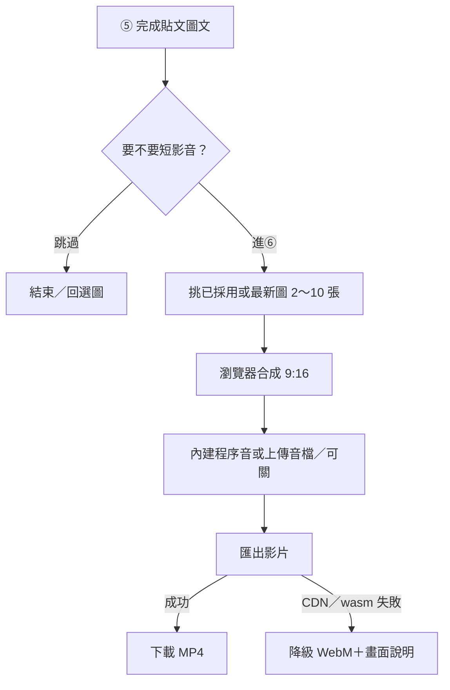

# FB 短影音工作室 — S1 規格（可選第 6 步）

> **狀態**：S1 MVP（瀏覽器端合成）  
> **掛載**：`CODING/tools/fb-post-studio/` 精靈第 6 步（可跳過）  
> **詳見**：[`21_FB_POST_STUDIO_SPEC.md`](21_FB_POST_STUDIO_SPEC.md)  
> **不進 git**：ffmpeg.wasm／core 體積大，**一律 CDN 載入**（見 `config.REEL` 與 `assets/README.md`）

---

## 一句話

把已採用／精修的完工照（2～10 張）在瀏覽器組成 **9:16** 短影音：淡入淡出＋輕微 Ken Burns＋可關音樂／上傳音檔 → 匯出 MP4（失敗則降級 WebM），文案可複製當影片說明。

---

## 流程（白話）

進度階段（畫面）：**載入引擎 → 拼片／渲染 → 編碼 → 完成**（降級時顯示「改走 WebM」）。

### 程式對照表

| 白話（圖上） | 程式對照 |
|---|---|
| ⑤ 完成後可進短影音 | 精靈 `setWizardStep(6)`；`WIZARD_MAX=6` |
| 跳過 | `#btn-reel-skip` → 回步驟 1 |
| 挑已採用或最新圖 | `getReelSourcePhotos()`：`adopted` → `currentEdit` → 最新 version → `original` |
| 瀏覽器合成 9:16 | `reel.js` → `FbPostReel.composeReel`；畫布 720×1280 |
| 淡入淡出／Ken Burns | `renderFrames`／MediaRecorder 路徑的 cover＋zoom／pan |
| 內建程序音 | `synthesizeBgm`（soft／warm／bright）；無二進位音檔進 git |
| 上傳音檔／關音樂 | `#input-reel-audio`、`#reel-music-off` |
| 匯出 MP4 | `@ffmpeg/ffmpeg` UMD＋core CDN → `libx264` |
| 降級 WebM | `encodeWithMediaRecorder`＋畫面 `#reel-fallback-note` |
| 進度條／階段 | `#reel-progress-bar`、`#reel-stage`；`onProgress` → `mapReelProgress` |
| 複製影片說明 | `#btn-reel-copy-caption` → 現有文案剪貼簿 |

---

## 限制（務必遵守）

| 項目 | 值／說明 |
|------|----------|
| 張數 | 2～10 |
| 每張秒數 | 約 1.2～4（預設 2.4） |
| 總長 | ≤ 約 28 秒（避免記憶體爆） |
| 解析度 | 720×1280（9:16） |
| wasm | CDN（unpkg）；失敗必須有人話降級說明 |
| 後端 | **不需** GAS；純前端 |

---

## 驗收（S1）

1. 五步完成後可進第 6 步，也可跳過  
2. ≥2 張來源圖可啟動合成；不足有錯誤提示  
3. 可關音樂；可複製文案  
4. 環境允許時匯出 MP4；CDN／wasm 失敗時 WebM＋說明，**不白屏報錯**  
5. 合成中可見進度條／階段文字（載入引擎／拼片／編碼／完成），避免誤以為當掉  

---

## 檔案

| 路徑 | 用途 |
|------|------|
| `tools/fb-post-studio/reel.js` | 合成／CDN ffmpeg／降級 |
| `tools/fb-post-studio/config.js` → `REEL` | 尺寸、CDN URL、BGM 預設 |
| `tools/fb-post-studio/index.html` | 步驟 6 UI |
| `tools/fb-post-studio/assets/README.md` | CDN／不進 git 說明 |
