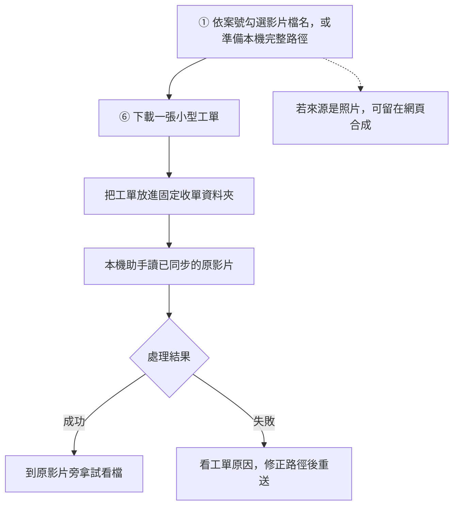

# FB 短影音工作室 — 送單＋本機助手規格（可選第 6 步）

> **狀態**：實拍短影音已收斂為「網頁送單 → 本機助手處理」；照片合成 S1 保留
> **掛載**：`CODING/tools/fb-post-studio/` 精靈第 6 步（可跳過）  
> **詳見**：[`21_FB_POST_STUDIO_SPEC.md`](21_FB_POST_STUDIO_SPEC.md)  
> **本機工作流**：`TanxinTools/short-video-workflow/`

---

## 一句話

實拍影片不進瀏覽器：網頁只列檔名／路徑並下載 JSON 工單，本機助手讀 Dropbox 已同步影片、產生試看檔並回寫狀態。已採用照片仍可在瀏覽器合成 9:16 短影音。

---

## 流程（白話）


```mermaid
flowchart TB
  Start["① 依案號勾選影片檔名，或準備本機完整路徑"] --> Order["⑥ 下載一張小型工單"]
  Order --> Move["把工單放進固定收單資料夾"]
  Move --> Helper["本機助手讀已同步的原影片"]
  Helper --> Result{"處理結果"}
  Result -->|成功| Done["到原影片旁拿試看檔"]
  Result -->|失敗| Fix["看工單原因，修正路徑後重送"]
  Start -.-> Photo["若來源是照片，可留在網頁合成"]
```

實拍工單四態：**pending 等待 → processing 處理中 → completed 完成／failed 失敗**。照片合成仍顯示「載入引擎 → 拼片／渲染 → 編碼 → 完成」。

### 程式對照表

| 白話（圖上） | 程式對照 |
|---|---|
| 依案號勾選影片檔名 | `list_project_completion_media` 使用 `media_type=video`、`include_preview=false`；只存 `name/path` |
| 準備本機完整路徑 | `#input-local-video` 只顯示檔名；`#local-video-paths` 收完整路徑；不讀影片內容 |
| 下載一張小型工單 | `makeWorkOrder()`；`#btn-download-work-order`；按下後立即 disabled 防連點 |
| 把工單放進固定收單資料夾 | `TanxinTools/short-video-workflow/queue/` |
| 本機助手讀原影片 | `Watch-Queue.ps1` 解析 `local_path`／`dropbox_relative`，再呼叫 `New-ShortPreview.ps1` |
| 成功拿試看檔 | 工單 `status=completed`、`results[].output_dir`；預設為原影片旁 `短影音試看/` |
| 失敗後修正重送 | 工單 `status=failed`、`results[].message` |
| 照片留在網頁合成 | `getReelSourcePhotos()` → `reel.js` → `FbPostReel.composeReel`；MP4 失敗降級 WebM |

---

## 工單格式

```json
{
  "schema_version": 1,
  "job_id": "fb-reel-20260725150000-ab12",
  "case_id": "734",
  "videos": [
    {
      "filename": "xxx.mov",
      "source_type": "dropbox_relative",
      "path": "添心設計/設計圖/734 案場/1160722完工照/xxx.mov"
    }
  ],
  "segs": "0.8:5.2,16:6",
  "created_at": "2026-07-25T07:00:00.000Z",
  "status": "pending"
}
```

`segs` 可為空；助手會使用 `0:25`。一張工單可有多支影片。

---

## 限制（務必遵守）

| 項目 | 值／說明 |
|------|----------|
| 實拍影片傳輸 | 不經 GAS 取檔、不經瀏覽器預覽／下載；list API 只列目錄 |
| 案場來源 | 工單存 Dropbox 相對路徑；本機預設接到 `D:\Dropbox\` |
| 本機來源 | 瀏覽器不能取得完整路徑，使用者需貼完整路徑 |
| 原檔安全 | 助手只讀，不搬移、不改名、不覆寫 |
| 照片合成 | 2～10 張、720×1280、總長約 ≤28 秒；ffmpeg.wasm 仍走 CDN |

---

## 驗收

1. 沒有照片也可直接進第 6 步，貼本機完整路徑送單；第 6 步仍可跳過
2. 案號影片只列檔名／路徑；不呼叫 `fetch_project_completion_media`，不建立影片 object URL
3. 無影片是空態；建立中是處理中；缺路徑是錯誤；下載後是成功；送單按鈕防連點
4. JSON 含案號、來源類型、路徑、選填 `segs`、建立時間與 `pending`
5. `Watch-Queue.ps1 -Once` 能處理工單並回寫 processing／completed／failed 與結果資料夾
6. 照片合成、音樂（曲庫／AI 氛圍／上傳＋試播）、文案複製與 MP4→WebM 降級仍可用

---

## 檔案

| 路徑 | 用途 |
|------|------|
| `tools/fb-post-studio/reel.js` | 合成／CDN ffmpeg／降級 |
| `tools/fb-post-studio/config.js` → `REEL` | 尺寸、CDN URL、BGM 曲庫（`assets/bgm/`）、AI 氛圍作曲 |
| `tools/fb-post-studio/index.html` | 步驟 6 UI |
| `tools/fb-post-studio/studio.js` | 影片清單只記路徑、產生與下載工單 |
| `tools/fb-post-studio/assets/README.md` | CDN／不進 git 說明 |
| `TanxinTools/short-video-workflow/Watch-Queue.ps1` | 本機收單、呼叫既有試看腳本、回寫狀態 |
| `TanxinTools/short-video-workflow/New-ShortPreview.ps1` | 產生試看影片、字幕與語音稿 |
| `TanxinTools/short-video-workflow/README.md` | 使用者白話操作 |
