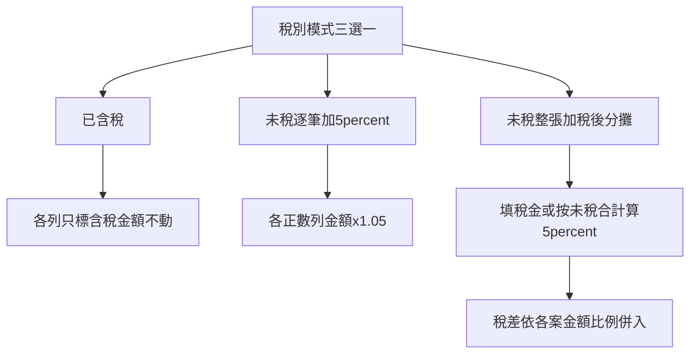

# 待付款稅金三模式計劃

| 項目 | 說明 |
|------|------|
| 狀態 | **已實作（含稅別三模式）**（2026-08-11） |
| 關聯 | [`15_會計系統模組規格書.md`](15_會計系統模組規格書.md) §2.3；`payment_request.html`／`ledger_review.html` |
| 後端對照 | `backend/accounting-gas`：`VendorPaymentAllocation.js` 比例分攤；`PAYMENT_REQUEST_UNIFIED_SPEC.md` 含稅段待同步 |
| 觸發 | 現行「含稅＋未稅加 5%」兩勾無法清楚對應「本來含稅／逐筆加稅／整張加稅」 |

---

## 1. 問題（為何現在不妥）

現行每列「含稅」＋「未稅加 5%」混了兩件事：標記 vs 加成。  
真實單據其實是三種：

| 廠商單據 | 你要的結果 |
|----------|------------|
| 金額本來就含稅（對帳單常見） | 數字不動，只標含稅 |
| 每案／每列未稅，逐筆加稅 | 每一列各自 ×1.05 |
| 各案未稅，底部一筆營業稅（綜合加） | 稅差依各案金額比例併入（與 OCR 後端相同） |

痛點：前端手動是「逐列 ×1.05」，OCR 是「整張稅比例分攤」——同一張單兩種算法會對不齊；已含稅再按「未稅加 5%」還會雙重加稅。

現行過渡行為（v1.22）：見 SPEC 15 §2.3 兩勾說明；本計劃實作後改寫該段。

---

## 2. 推薦方案（定案）

**在明細區上方放「稅別模式」三選一（整張統一），每列不再放「未稅加 5%」。**

### 程式對照表

| 白話（圖上） | 程式對照 |
|--------------|----------|
| 稅別模式三選一 | 請款／審核頁明細區上方 radio 或分段按鈕 |
| 已含稅 → 只標不改金額 | 品項 `(含稅)`、備註 `【稅別】`；不呼叫 ×1.05 |
| 逐筆加 5% | 各正數列金額 ×1.05（折讓負數不動） |
| 整張加稅後分攤 | 稅金欄或未稅合計×5%；比例併入邏輯對齊 GAS `prorateTaxIntoAllocations_` |

### 三種模式白話

1. **已含稅**  
   - 金額＝要付的含稅價；只標 `(含稅)`、備註 `【稅別】`。  
   - 適用：對帳單、報價已含稅。

2. **未稅・逐筆加 5%**  
   - 每個正數明細列金額 ×1.05；折讓列不動。  
   - 適用：廠商每個案號各自未稅、各自加稅。

3. **未稅・整張加稅後分攤**（綜合加）  
   - 明細填未稅；上方「稅金」可手填，或一鍵「未稅合計×5%」。  
   - 按各案正數金額比例把稅併入各列（與 accounting-gas `VendorPaymentAllocation.js` 同一精神）。  
   - 適用：底部一筆營業稅的請款單。

### 每列 UI

- 拿掉「未稅加 5%」勾。  
- 保留只讀／弱提示：模式 1 顯示「含稅」標籤＋可選未稅反推；模式 2／3 操作後標 `(含稅)`。  
- 切換模式時：若金額已加成過，先還原再依新模式重算（或跳出確認），避免連加。

### OCR 套用

- 後端已分攤完 → 自動選 **已含稅**，各列金額不重算。  
- 若 OCR 只有未稅列、無稅額 → 預設 **未稅・整張加稅後分攤**，稅金帶 `tax_amount` 或合計×5%。  
- 不自動選「逐筆加 5%」（避免與 OCR 比例分攤打架）。

### 審核頁

- `ledger_review.html` 與請款頁同一套三模式。  
- 備註仍寫 `【稅別】`；可加一行 `【稅模式】已含稅｜逐筆｜整張分攤` 方便還原。

---

## 3. 實作範圍

| 層 | 檔案 | 做什麼 |
|----|------|--------|
| 前端 | `modules/accounting/payment_request.html`、`ledger_review.html` | 稅別模式 UI；分攤函式；拿掉逐列「未稅加 5%」 |
| 後端 | 本輪**可不改**儲存結構（仍只存金額＋品項）；分攤算法前端對齊既有 GAS | — |
| SPEC／LOG | 本文件實作後更新 SPEC 15 §2.3、專有名詞；同步 `PAYMENT_REQUEST_UNIFIED_SPEC` 含稅段 | 寫三模式與驗收例 |

**本輪不做**：出勤獎金、到職折算；不改 OCR prompt（除非驗收發現套用預設模式常錯再補）。

### 實作待辦

1. 請款＋審核：稅別三模式 UI，移除逐列「未稅加 5%」  
2. 整張分攤算法對齊後端比例分攤；切換模式防連加  
3. OCR 套用自動選模式；SPEC／LOG／專有名詞更新  

---

## 4. 驗收（人話）

1. 已含稅單：選「已含稅」→ 金額不變、有含稅標。  
2. 三列未稅選「逐筆加 5%」→ 每列各自 ×1.05，合計正確。  
3. 兩案未稅＋稅金一筆選「整張分攤」→ 稅按比例進兩案，合計＝未稅合計＋稅。  
4. OCR 已含稅套用 → 自動「已含稅」，不會再被加成。  
5. 請款頁與審核頁操作一致。

---

## 5. 修訂紀錄

| 日期 | 說明 |
|------|------|
| 2026-08-10 | 自 Cursor 計劃「待付款稅金三模式」落入 CODING `SPEC/`；定案表頭三模式 |
| 2026-08-20 | 未稅模式：填完金額／送出會加稅；合計顯示未稅＋稅；已含稅仍不加 |
| 2026-08-11 | 前端請款／審核實作三模式；共用 `accounting_tax_mode.js`；名冊 `tax_mode_default` |
