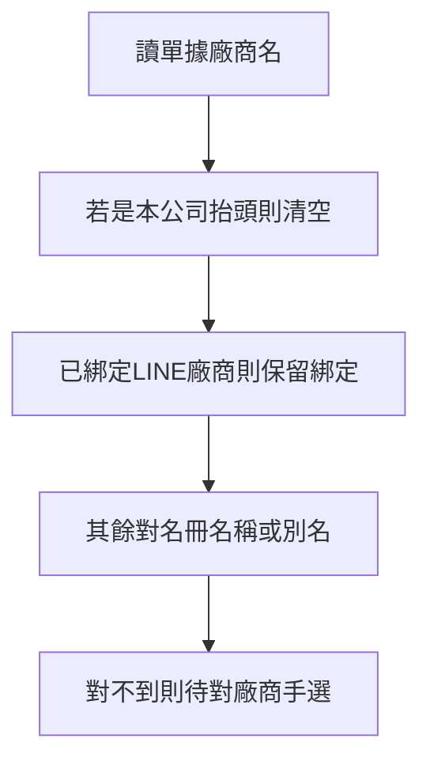
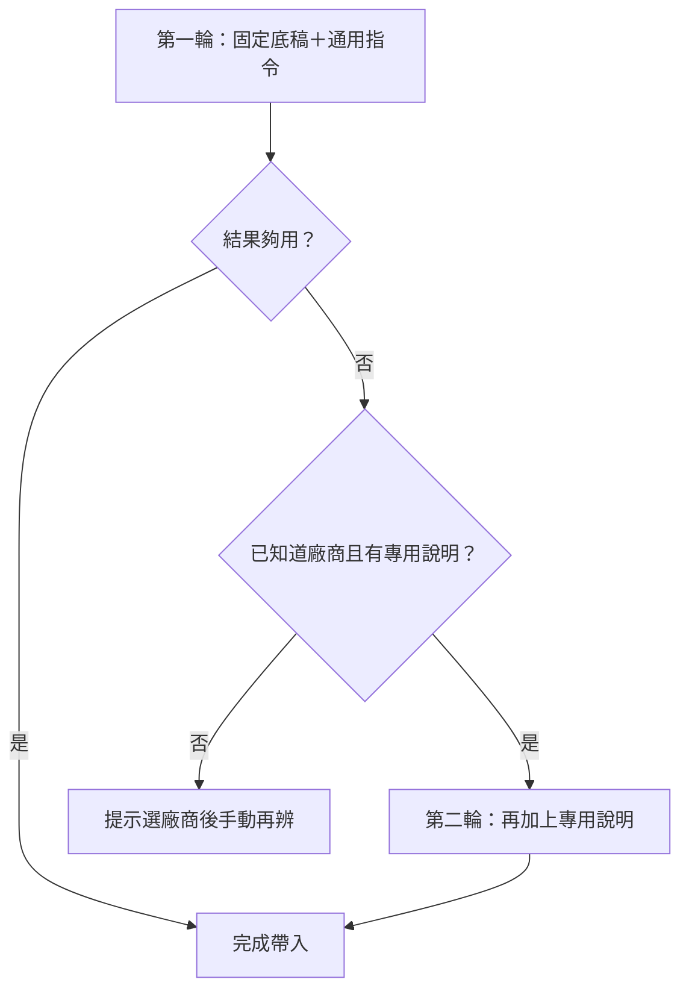

# 待付款廠商慣例與本公司抬頭排除

| 項目 | 說明 |
|------|------|
| 狀態 | **已實作（第一批）**（2026-08-11） |
| 關聯 | [`15_會計系統模組規格書.md`](15_會計系統模組規格書.md)；[`23_待付款稅金三模式計劃.md`](23_待付款稅金三模式計劃.md)；資料字典 `name_aliases` |
| 後端 | `backend/accounting-gas`：`OcrInvoice.js`、`VendorPaymentModule.js`、`PaymentRequestUnified.js`、`MasterSchema.js` |
| 前端 | `payment_request.html`、`ledger_review.html`；名冊別名欄既有 `vendors.html` |

---

## 1. 問題

1. 辨識常把單據上的「添心設計／添鑫創意」當成請款廠商——那是**客戶標示我們（買方）**，不是收款廠商。  
2. 廠商名冊已有別名欄，後端比對未完整落地。  
3. 審核／匯出若廠商未對上名冊或誤用本公司抬頭，有匯錯風險。

---

## 2. 定案行為

### 2.1 本公司抬頭排除

| 白話（圖上） | 程式對照 |
|--------------|----------|
| 讀單據廠商名 | 請款 OCR `vendor_name` |
| 若是本公司抬頭則清空 | `isOwnCompanyName_`／`sanitizeOcrVendorNameAgainstOwnCompany_` |
| 已綁定 LINE 廠商則保留綁定 | `prepareVendorPaymentOpsImage_` 先有 `vendorRec` 不覆寫 |
| 其餘對名冊名稱或別名 | `findVendorRecordByName_`（含 `name_aliases`） |
| 對不到則待對廠商手選 | `vendor_name` 空或「待對廠商」；前端提示 |

排除名單（比對時去空白／公司後綴）：添心設計、添鑫創意、添心室內裝修、添鑫創意室內裝修，及常見全稱變體。

OCR 提示（`ocr_vendor_payment_v7`）：`vendor_name`＝賣方／收款方；買方為本公司時留空。

### 2.2 審核／匯出（軟提醒，不硬擋）

- 辨識階段排除本公司抬頭即可。  
- 未對上名冊或廠商欄仍為本公司時：**畫面提醒**，仍可核准／匯出（單據常不寫廠商名，靠手選或 LINE 綁定）。  
- 提高對中率靠：別名、LINE 綁定優先、名冊預設稅別等廠商慣例。

### 2.3 廠商別名

- 主檔欄位 `name_aliases`（逗號等分隔）寫入 schema。  
- 比對時與 `name` 同等（精確优先，其次單一模糊命中）。

### 2.4 與稅別三模式（SPEC 23）銜接

優先順序：人工已選 ＞ 本筆已存／備註【稅模式】 ＞ OCR 自動套用（23）＞ 名冊 `tax_mode_default` ＞ 預設已含稅。  
名冊可編 `tax_mode_default`；請款／審核表頭三模式 UI 已落地（見 SPEC 23）。

### 2.5 通用／專用辨識指令＋二階段

| 白話 | 程式對照 |
|------|----------|
| 通用指令 | Script Property；名冊頁編輯；`getVendorPaymentOcrCommonHint_` |
| 專用說明 | 廠商欄 `ocr_hint` |
| 合併 prompt | `buildVendorPaymentOcrPromptParts_`；動態段不進 Gemini 固定快取 |
| 二階段 | `handlePaymentRequestOcrAnalyze_`；弱結果判定 `isVendorPaymentOcrResultWeak_` |
| 手動再辨 | 請款頁「用此廠商規則再辨一次」→ `force_vendor_hint` |

弱結果：金額與分攤皆 ≤0，或僅清掉本公司抬頭且無可用金額。

---

## 3. 驗收（人話）

1. 發票買方是添心／添鑫、賣方是真實廠商 → 廠商帶入賣方或手選，不會變成添心／添鑫。  
2. 圖上只有本公司抬頭 → 廠商留空／待對，並提示「客戶標示我們」。  
3. 名冊別名「必美貿易」→ 日常名「亨特地板」可對上。  
4. 未對上名冊 → 黃字提醒，仍可核准（不硬擋）。  
5. LINE 已綁定廠商群送圖 → 即使 OCR 讀到本公司，仍保留綁定廠商。  
6. 通用指令有內容 → 第一輪辨識會套用。  
7. 某廠專用說明＋第一輪偏弱 → 自動第二輪；或手選後按「再辨一次」。

---

## 4. 修訂紀錄

| 日期 | 說明 |
|------|------|
| 2026-08-11 | 第一批：排除本公司、別名比對、核准／匯出硬擋；稅模式預設列第二批 |
| 2026-08-11 | 第二批：稅別三模式 UI＋名冊 `tax_mode_default` 代入 |
| 2026-08-11 | 依使用者回饋：拿掉核准／匯出硬擋，改軟提醒；重點改回辨識排除自家＋廠商慣例提高對中率 |
| 2026-08-11 | 通用／專用辨識指令＋二階段辨識 |
