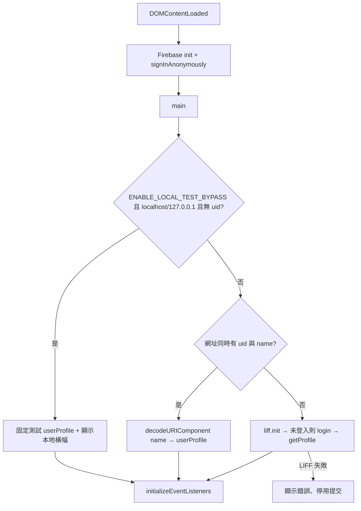
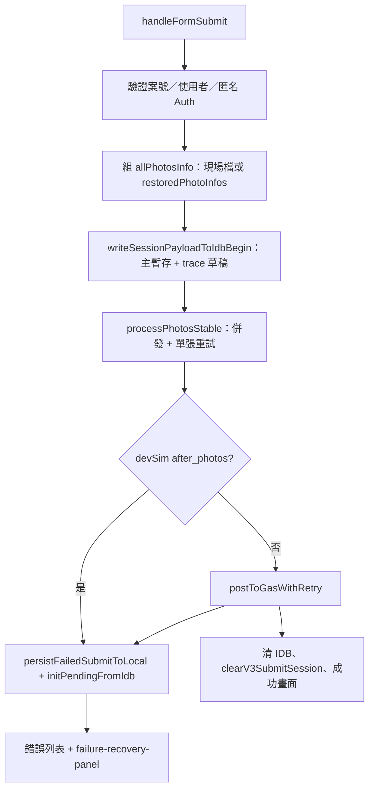
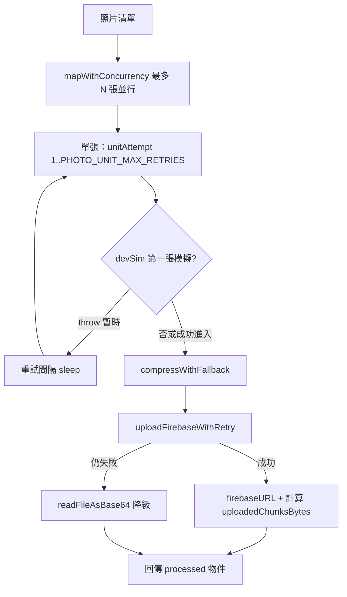

# 施工回報系統 — 前端技術規格（REPORT_SYSTEM_SPEC）

**版本：** 3.0（對應 `modules/projects/reportV3.html`）  
**前一版：** v2.5 以 `reportV2.html` 為主；本文件以 **V3** 為準，V2 僅作歷史對照。

---

## 1. 文件目的與範圍

- **目的：** 記錄 V3 前端架構、使用者身分取得方式、Firebase／GAS／IndexedDB 資料流、可調參數與主要函式職責，供維運與後端對齊欄位時查閱。
- **範圍：** 單頁 `reportV3.html`（ES module）、共用工具 `shared/js/utils.js`（`readFileAsBase64`）。後端 GAS 實作細節以既有部署為準，此處只描述 **V3 送出的欄位與慣例**。
- **機密：** `FIREBASE_CONFIG`、`LIFF_ID`、`GAS_WEB_APP_URL` 等定義於 **`reportV3.html` 的 `<head>` 內 `window.__REPORT_V3_CONFIG__`**，**勿**將金鑰複製進對外文件；更新設定時以該區塊為單一來源。

---

## 2. 架構總覽

V3 延續「**相片優先上 Firebase Storage → 再一次性 POST 至 GAS**」的極速路線，並在 V2 基礎上增加：

| 能力 | 說明 |
|------|------|
| **有限併發上傳** | 以 `PHOTO_UPLOAD_CONCURRENCY` 控制同時上傳張數，避免行動裝置連線過載；任一票失敗時可中止其餘索引派工（見 `mapWithConcurrency`）。 |
| **單張管線重試** | 壓縮 → Firebase（內建重試）→ 失敗則 Base64 降級；整段對「暫時性錯誤」可重跑最多 `PHOTO_UNIT_MAX_RETRIES` 輪。 |
| **GAS 送出重試** | 每次重試**重新建立** `FormData`；逾時 `AbortController`、HTTP 502/503/504/408/429 與網路類錯誤可重試；業務 `success: false` **不重試**。 |
| **IndexedDB 暫存** | 失敗時將表單＋照片（ArrayBuffer）＋失敗鏈（`failureChain`）寫入本機；成功後清除。下次開啟可「一鍵帶入」重送。 |
| **Trace 草稿** | 送出過程中 `reportTrace` 全文 debounce 寫入 `sessionTraceDraft`，與主暫存鍵分離。 |
| **失敗 JSON 上 Storage** | 每次失敗嘗試上傳單一 JSON 至 `failure-report/{案號數字段}/failure-{timestamp}.json`（非經 GAS），供除錯；留存由 Bucket 生命週期管理。 |
| **clientTrace** | 送 GAS 的 JSON 內含版本、URL、可選 `previousFailedAttempt`（上次失敗摘要）與開發模擬標記 `devSimulate`。 |

---

## 3. 使用者身分與頁面初始化

### 3.1 流程圖（bootstrap）

### 3.2 參數說明

| 名稱 | 型別／位置 | 說明 |
|------|------------|------|
| `ENABLE_LOCAL_TEST_BYPASS` | `<head>` 內 `__REPORT_V3_CONFIG__` | `true` 時：僅在 `localhost`／`127.0.0.1` 且**未**帶 `uid` 時略過 LIFF，使用固定測試帳。正式環境應為 **`false`**。 |
| `uid` | 查詢字串 | 與 `name` 併用時視為已解析的 LINE 使用者 id，跳過 LIFF。 |
| `name` | 查詢字串 | 顯示名稱，會 `decodeURIComponent`。 |
| `devSim` | 查詢字串 `=1` | 在非 localhost 也可顯示「失敗模擬」面板（與 `isDevSimAllowed` 一致）。 |

---

## 4. 提交流程（核心）

### 4.1 總流程圖

### 4.2 相片處理子流程

### 4.3 表單驗證規則（前端）

- **案號：** 僅數字；UI 用 `enforceDigits` 過濾非數字；錯誤時 `#projectIdError`。
- **施工項目：** `workType` 必填（select）。
- **內容：** 若無照片、無施工說明、無問題說明，則阻擋提交（至少一項）。

---

## 5. 程式常數一覽（可調）

| 常數 | 預設（參考原始檔） | 用途 |
|------|-------------------|------|
| `CLIENT_VER` | 例：`2026.04.12-V3.12` | 寫入 `clientTrace.ver`；變更行為時應一併遞增以利追蹤。 |
| `PHOTO_UPLOAD_CONCURRENCY` | `5` | Firebase 同時上傳併發數。 |
| `FIREBASE_UPLOAD_MAX_RETRIES` | `3` | 單次 `uploadBytes` 循環重試。 |
| `PHOTO_UNIT_MAX_RETRIES` | `3` | 單張「整段管線」因暫時性錯誤可重跑輪數。 |
| `PHOTO_UNIT_RETRY_BASE_MS` | `400` | 單張重試間隔基底（乘上 `unitAttempt`）。 |
| `GAS_POST_MAX_RETRIES` | `3` | POST GAS 最大嘗試次數。 |
| `GAS_FETCH_TIMEOUT_MS` | `120000` | 單次 fetch 逾時毫秒。 |
| `SCHEMA_PENDING` | `2` | IndexedDB 暫存資料 schema 版本。 |
| `MAX_LOG_LINES` | `220` | `reportTrace` 記憶體列數上限。 |
| `MAX_FAILURE_REPORT_JSON_BYTES` | `480000` | 上傳至 Storage 的失敗 JSON 過大時截斷 `reportTraceFull`。 |
| `AUTO_APPLY_PENDING_ON_LOAD` | `false` | `true` 時有暫存則載入頁面自動帶入表單。 |

壓縮參數（`compressWithFallback`）：`maxSizeMB: 0.4`、`maxWidthOrHeight: 1280`；Web Worker 失敗則改主執行緒。

---

## 6. IndexedDB 設計

| 項目 | 值 |
|------|-----|
| 資料庫名 | `TanxinReportV3` |
| 版本 | `1` |
| Object store | `pending`（單一 store，多 key） |

| Key | 內容摘要 |
|-----|----------|
| `lastFailedSubmit` | 主暫存：`schema`、`batchIdAttempt`、`userId`、`displayName`、`form`、`photos`（含 `ArrayBuffer`）、`failureChain`、`reportTraceFull`、`failure`（相容舊欄位）等。 |
| `sessionTraceDraft` | `{ traceFull, batchId, updatedAt }`，送出中 debounce 更新。 |

**成功送出後：** `idbClearPending()` 刪除上述兩鍵（主暫存與 trace 草稿）。

---

## 7. GAS 請求格式（`buildGasFormData`）

- **方法：** `POST`，`Content-Type` 為 multipart（`FormData`）。
- **主要欄位：**
  - `payload`：`JSON.stringify({ ...finalFormData, photos: processedPhotos })`
  - `finalFormData` 的**每個頂層鍵**（`photos` 除外）另各別 `append`；值若為物件則 `JSON.stringify`。
  - `chunkIndex`：固定 `1`（單 chunk 語意）。
  - `photos`：`JSON.stringify(processedPhotos)`（與 payload 內照片資料一致）。

**`finalFormData` 語意（與後端約定之 action）：**

| 欄位 | 說明 |
|------|------|
| `action` | `'submitFastReport'` |
| `batchId` | `{userId}-{timestamp}` |
| `totalChunks` | `1` |
| `userId` / `userName` | LINE 使用者 |
| `projectId` | 案號字串 |
| `projectNameRaw` | 與 `projectId` 相同（原始設計保留） |
| `workType` | 施工項目選取值 |
| `workDescription` / `problemDescription` | 文字欄 |
| `photos` | **摘要陣列**（僅 `name`、`hasUrl`、`hasBase64` 等，不含完整 Base64，減少 JSON 負載） |
| `clientTrace` | 含 `url`、`ver`、`uid`、`ts`、可選 `previousFailedAttempt`、`devSimulate` |

**GAS 回應：** 期望 JSON，`response.ok && result.success === true` 為成功；`success === false` 為業務失敗，不自動重試。

---

## 8. Firebase Storage 路徑

| 用途 | 路徑模式 |
|------|----------|
| 一般照片 | `reports/{projectId}/{batchId}/{timestamp}_{idx}_{rand}_{safeName}` |
| 失敗記錄 JSON | `failure-report/{案號數字段}/failure-{savedAt}.json` |

匿名登入：`signInAnonymously`；上傳前 `ensureAuthBeforeSubmit()` 再確認 `currentUser`。

---

## 9. 主要函式／責任表

| 函式 | 職責 |
|------|------|
| `reportTrace` / `getFullReportLog` | 組裝時間序列除錯紀錄；觸發 trace 草稿 debounce。 |
| `snapshotClientEnv` | 蒐集瀏覽器環境（版本、href、online、UA、螢幕等）。 |
| `getDeveloperDiagnosticReport` | 產生「複製除錯」用純文字。 |
| `openReportIdb` / `idbSavePending` / `idbLoadPending` / `idbClearPending` | IndexedDB 存取。 |
| `idbPutTraceDraft` / `idbDeleteTraceDraft` | Trace 草稿鍵。 |
| `migrateFailureChainFromSnapshot` | 舊 schema 或單一 `failure` 轉成 `failureChain` 陣列。 |
| `buildPhotoEntriesFromAllPhotosInfo` | 將 `File` 轉 `ArrayBuffer` 供暫存。 |
| `writeSessionPayloadToIdbBegin` | 提交開始時寫入主暫存＋初始 trace。 |
| `compactFailureForPayload` | 從暫存濃縮成 `clientTrace.previousFailedAttempt`（控制長度、不含 Base64）。 |
| `persistFailedSubmitToLocal` | 失敗後合併 `failureChain`、寫 IDB、上傳失敗 JSON；`idb_skip` 模擬時略過寫入。 |
| `uploadFailureReportToFirebase` | 上傳失敗記錄至 `failure-report/...`。 |
| `compressWithFallback` | 壓縮；Worker 失敗改主執行緒。 |
| `uploadFirebaseWithRetry` | 包一層重試的 `uploadBytes` + `getDownloadURL`。 |
| `buildGasFormData` | 組 multipart 欄位。 |
| `postToGasWithRetry` | 重試、逾時、解析 JSON、dev 覆寫回應。 |
| `mapWithConcurrency` | 有限併發；任一項失敗則不再派新索引。 |
| `isTransientPhotoPipelineError` / `isLikelyNetworkError` / `isTransientHttpStatus` | 判斷是否值得重試。 |
| `throwIfDevSimPhotoFirstAttempt` | 僅 dev 模擬：第一張相片暫時／永久失敗。 |
| `processPhotosStable` | 併發 + 單張重試 + 呼叫 `processSinglePhotoOnce`。 |
| `handleFormSubmit` | 整段提交狀態機、統計、成功／失敗 UI。 |
| `main` | LIFF／測試／查詢參數分流後掛事件。 |

---

## 10. UI 與開發輔助

- **進度條：** `startFakeProgress` 在相片階段提供視覺進度（非嚴格對應實際百分比）。
- **統計：** 相片階段秒數、KB/s；GAS 階段耗時。
- **成功畫面：** 約 30 秒後若在 LINE 內則 `liff.closeWindow()`。
- **失敗救援區：** `#failure-recovery-panel`；**複製除錯**按鈕呼叫 `getDeveloperDiagnosticReport`（Clipboard 或 `prompt` 降級）。
- **測試用失敗模擬：** 僅 `isDevSimAllowed()`（localhost／127.0.0.1 或 `?devSim=1`）顯示；模式見畫面上 `<select id="dev-sim-mode">`（GAS 錯誤、非 JSON、網路、逾時、送 GAS 前錯、第一張相片、IDB 略過等）。

---

## 11. 與 V2 的差異（摘要）

| 項目 | V2（舊 SPEC） | V3 |
|------|----------------|-----|
| 併發 | 全量 `Promise.all` 式啟動（舊描述） | **有限併發** + 失敗時停止派發剩餘索引 |
| 重試 | 單層描述 | **Firebase 層**、**單張管線層**、**GAS 層** 分離 |
| 失敗恢復 | 偏 ZIP／緊急路徑（歷史增補） | **IndexedDB 暫存 + failureChain + 雲端失敗 JSON** |
| 除錯 | 基本 log | **結構化 trace + IDB 草稿 + 複製給開發者** |

---

## 12. 維運檢查清單

1. 變更行為時更新 `CLIENT_VER` 與此 SPEC 版本註記。  
2. Firebase：匿名登入、Storage 規則允許寫入 `reports/`、`failure-report/`。  
3. GAS：仍支援 `action: submitFastReport` 與 multipart 欄位慣例。  
4. LIFF：`LIFF_ID` 與部署網域／Endpoint 一致。  
5. 正式上線確認 `ENABLE_LOCAL_TEST_BYPASS === false`。

---

> [!NOTE]
> 後端欄位命名請與專案資料字典一致；若 GAS 欄位有擴充，請同步更新本文件 **§7** 與 `reportV3.html` 內 `finalFormData` 建構處。
