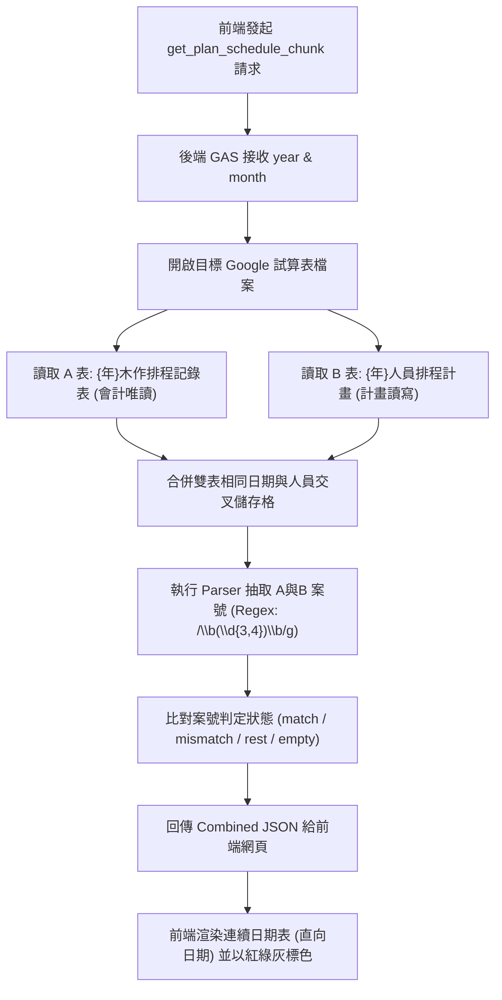
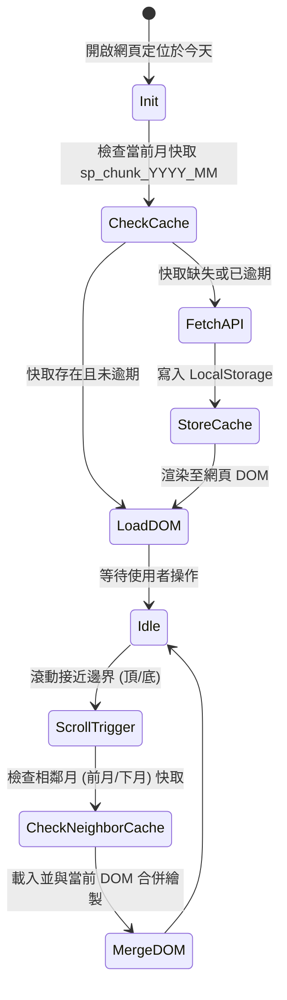
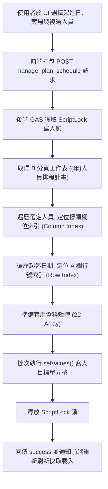

# 人員工作排程系統技術規格書 (SPEC)

本規格書定義「人員工作排程網頁」與「Google Apps Script (GAS) 後端 WebApp」的技術規格、資料格式與資料流流程，作為後續前後端功能實作之唯一依據。

---

## 1. 資料庫設計與分頁安全隔離 (Database Architecture)

為防範排班功能誤觸或毀損用於算薪資與計算成本的會計紀錄，資料庫採用**「同檔案、分工作表分頁、API 讀寫權限隔離」**之承重牆設計：

| 屬性 | A. 會計實績表 (Accounting Actuals) | B. 人員計畫排程表 (Plan Schedule) |
| :--- | :--- | :--- |
| **存放位置** | 同一試算表檔案之分頁：`{年}木作排程記錄表` | 同一試算表檔案之新分頁：`{年}人員排程計畫` |
| **排程網頁權限** | **僅限唯讀 (Read-Only)** | **讀寫 (Read / Write)** |
| **資料來源** | 現場人員打卡回填、會計人工登載之既有流程 | 排程網頁批次套用、單日加註之排班編輯器 |
| **API 讀寫分流** | 限制只呼叫讀取函式，禁止串接 any Update/Write 操作 | 呼叫專用寫入函式，並鎖定該分頁之範圍進行操作 |

---

## 2. 後端 WebApp API 接口規格 (API Specifications)

API 挂載於 CheckinSystem WebApp 的 API 端點（通常調用時夾帶參數 `page=attendance_api` 進入路由分流）。

### A. 獲取曆月排程資料 (GET)
* **Action 名稱**：`get_plan_schedule_chunk`
* **請求參數**：
  * `page`: `attendance_api`
  * `action`: `get_plan_schedule_chunk`
  * `year`: 西元四位數年份 (例 `2026`)
  * `month`: 月份數 `1` ~ `12`
  * `source`: `all` (同時讀取並合併 A 與 B 表) 或 `plan`/`accounting`
* **回傳 JSON 格式**：
  ```json
  {
    "success": true,
    "year": 2026,
    "month": 4,
    "dates": [
      "2026年4月1日 (週三)",
      "2026年4月2日 (週四)"
    ],
    "employees": [
      { "userName": "王小明", "displayName": "王小明", "group": "台南施工" }
    ],
    "grid": {
      "2026年4月1日 (週三)": [
        {
          "userName": "王小明",
          "displayName": "王小明",
          "group": "台南施工",
          "planRaw": "758 星河畔",
          "planCaseNo": "758",
          "accountingRaw": "758 星河畔 (打卡 08:30-17:30)",
          "status": "match"
        }
      ]
    }
  }
  ```

### B. 儲存與批次預排排程 (POST)
* **Action 名稱**：`manage_plan_schedule`
* **Payload 格式**：
  ```json
  {
    "action": "manage_plan_schedule",
    "year": 2026,
    "batchMode": true,
    "start": "2026-04-13",
    "end": "2026-04-28",
    "site": "754 #754 聚丰景",
    "employees": ["王建雄", "何嘉翔"]
  }
  ```
* **後端處理邏輯**：
  1. 呼叫 `LockService.getScriptLock()`，防止並發寫入導致儲存格資料覆蓋。
  2. 根據 `employees` 陣列的姓名匹配 B 分頁表頭中的人員欄位索引。
  3. 計算 `start` 至 `end` 日期在 A 欄中的行號索引。
  4. 批次使用 `setValues()` 寫入 `site` 字串，並在釋放鎖後返回 `success: true`。

---

## 3. 儲存格 Parser 案號抽取與狀態比對 (Data Parsing & Contrast)

系統核心業務邏輯在於比對「預排計畫 (B)」與「會計實績 (A)」是否一致。此比對完全基於**「案號 (純數字)」**：

### A. 案號抽取規則 (Regex)
1. **休假日排除**：將單格內容 `raw` 去除空白後，若符合 `/^休/` → 視為休息日，不抽取案號。
2. **數字抽取**：在非休息日字串上執行 JavaScript 全域正則匹配：
   ```javascript
   const caseNos = raw.match(/\b(\d{3,4})\b/g) || [];
   ```
   * *說明*：只擷取 **3至4位連續數字**（如 754, 758），避免 1~2 位數誤判為樓層（如 25F-6）。
   * *單一主案號 (caseNo)*：取 `caseNos[0]`；若無匹配則為 `null`。

### B. 二部對照狀態定義
比對 `B表 (planCaseNo)` 與 `A表 (accountingCaseNo)` 的值，判定其狀態並標色：
* **`match` (一致)**：兩邊案號非空且相同（顯示為綠色）。
* **`mismatch` (不符)**：兩邊案號不同，或其中一邊缺失（顯示為紅色/警告色）。
* **`rest` (休息)**：任何一邊判定為 `休`（顯示為灰色）。
* **`empty` (無狀態)**：兩邊皆無文字（顯示為背景底色）。

---

## 4. 前端曆月分段快取與無窮滾動 (Infinite Scroll & Local Cache)

為防範一次性載入全年 365 天數據造成的瀏覽器效能卡頓，採用曆月分段快取：
1. **快取配置**：
   * 快取位置：`window.localStorage`。
   * 鍵名格式：`sp_chunk_YYYY_MM` (例 `sp_chunk_2026_04`)。
   * 快取生命週期 (TTL)：10 分鐘。逾期後自動透過 API 向後端重新 Fetch。
2. **垂直無窮滾動 (分段載入)**：
   * 視圖直向往下為日期演進，橫向為人員欄。
   * 當滾動條接近可見視窗頂部/底部時（預留 1 週的緩衝區），前端觸發非同步載入上一月或下一月的曆月 Chunk，並將其合併繪製在 DOM 中。
   * 初始化時，系統自動將滾動位置置中於「今日」線，維持人機舒適。

---

## 5. 系統資料流與流程圖 (Mermaid Diagrams)

### A. 雙來源 API 讀取與合併資料流


### B. 前端曆月分段載入與快取狀態機


### C. 批次區間排班寫入邏輯

