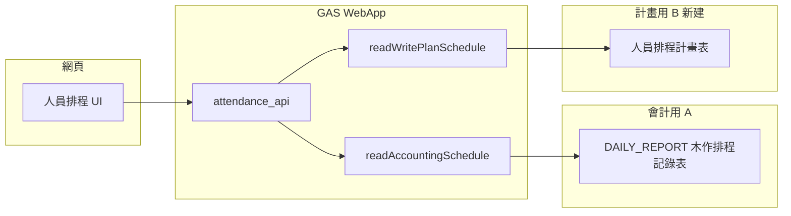

# 人員工作排程網頁 — 計劃書（白話版）

## 你要的東西，用一句話說

一個**網頁**，用來排**接下來要去哪個案場**（預排）。**不能**動到現有「木作排程記錄表」裡給**會計算薪資、算成本**的那份資料；那份只能**讀出來對照**。真正的「排程」存在**另一個記錄位置**，格式**沿用同一套格子寫法**，這樣才能做**預想 vs 真實**（會計登記的實作）**二邊比對**。

---

## 資料來源職責（已定案）


| 來源               | 試算表／表名（沿用現有）                                                                                                                                                      | 誰寫入              | 排程網頁           |
| ---------------- | ----------------------------------------------------------------------------------------------------------------------------------------------------------------- | ---------------- | -------------- |
| **A. 會計實績／成本依據** | `DAILY_REPORT_SHEET_ID` 內 `{年}木作排程記錄表`（與 [Logic_SystemUtils.js](../../backend/CheckinSystem/Logic_SystemUtils.js) `_updateDailyReportSheet_` 相同） | 打卡回填、會計相關既有流程    | **僅讀取**，供參考與比對 |
| **B. 計畫排程（新建）**  | **已定案**：與 **A 同一個 Google 試算表檔案**，**新增一個工作表分頁**（表名例：`{年}人員排程計畫`），與 `{年}木作排程記錄表` **分開兩張表**                                                                          | **僅**排程網頁／排程 API | **讀寫**         |


- **白話**：「同一個 Google 檔」= 瀏覽器裡開的那**一份**試算表；「新分頁」= 底下 **Sheet1、Sheet2** 那種**多一張工作表**，不是把計畫跟會計寫在同一格。程式用**表名**開對的 sheet，就不會誤寫會計表。
- **今天以前的日期**：主要拿 **A** 當歷史參考（與計畫對照）。
- **今天之後**：以 **B** 為編輯對象；**A** 仍可依日累積實績，與 **B** 並列顯示差異。

---

## 白話說明：案號、regex、分段 API（你剛問的三件事）

### 1. 計畫表 B 放哪裡？

- **已定案**：跟會計用的木作表 **同一個 Google 試算表檔案**，**多開一張工作表**（新分頁）專門放「人員排程計畫」。  
- 會計表還是叫 `{年}木作排程記錄表`，計畫表叫例如 `{年}人員排程計畫`，**兩張表分開**，程式只改計畫那張。

### 2. 「案號、regex、跟案場主檔對齊」是什麼意思？（白話）

- **案號**：就是你們平常講的「758 案、761 案」那個 **758、761**——用來認定「是不是同一個案」。  
- **為什麼要抓案號**：格子上可能寫 `758 星河畔 A2`，計畫寫 `758｜星河畔`，字長得不一樣，但 **758 一樣** 就代表同一案；比對時用 **數字編號** 比用整句比較穩。  
- **regex**：就是「程式從字裡**自動找出案號**」的規則（例如找開頭的 3～4 位數）。**你不用會寫 regex**，實作時工程師定一次規則，全站共用。  
- **跟案場主檔對齊**：案場資料（`get_all_sites` 那張）若**有欄位**存專案編號／代號，就對那欄；**若沒有**，就只靠格子裡抓出來的數字比對。**不是**要你另外做一張對照表，除非你想更精準。

### 3. 「startDate／endDate、分段載入、跟 WebApp 怎麼接」？（白話）

- **問題**：一整年可能有 365 列，若一次全載，會慢、也浪費。  
- **做法**：網頁**只跟伺服器要一小段日期**——例如「只要 2026-03-01 到 2026-03-31 這一個月的格子」。這兩個日子就叫 **startDate、endDate**（開始日、結束日）。你捲到別的月份，再跟伺服器要下一段。  
- **chunk**：就是「一次要一塊」的意思，可以按**月**或按**週**切，實作時定一種就好。  
- **跟現有 WebApp 怎麼接**：還是同一支 **部署好的網址**（`doGet` + `action=...`），多幾個新參數（例如 **`year` + `month` 表曆月 chunk**）；回傳 JSON 給網頁畫表。**不用**換專案、換網址，只是在 [WebApp.js](../../backend/CheckinSystem/WebApp.js) 的 API 對照表裡**多加幾個 action**。

---

## 儲存格資料格式（沿用本來表格，白話規格）

結構與現有一致：**第 1 列**＝人員欄名，**A 欄**＝日期列，**交叉格**＝當日內容字串（**純文字**，不強制結構化 DB）。

### 欄名（表頭）

- 範例：`王建雄(C.H.WANG)`
- **慣例**：`中文名` + 可選 `(英文或代號)`。解析時可拆成 `displayName` + `nameNote`，**比對員工主檔時以中文／全稱規則另定**（待辦 `spec-system-meaning` 可併入姓名對照表）。

### 儲存格內文（同一字串可混合多種語意，與現場習慣一致）

下列皆為**合法範例**（你提供的真實資料摘錄）：


| 類型       | 範例                                          | 說明                          |
| -------- | ------------------------------------------- | --------------------------- |
| 休息日      | `休`                                         | 整日休息                        |
| 休 + 附註   | `休/請假一天`、`休/請假一天`                           | `休` 後接 `/` + 假別／說明          |
| 單一案場／地點  | `761星光水悅 25F-6`、`765 健康路老宅更新案`              | 自由文字，與案場主檔**模糊對應**即可        |
| 複合地點（多點） | `添心設計-台南店/731/761星光水悅`、`765 健康路老宅/添心設計-台南店` | 以 `/` 串接多個地點或段落             |
| 案場 + 其他  | `749 王羿閔/添心設計-台南店`、`740 羅嘉文/添心設計-台南店`       | 同格內仍用 `/` 分段（**不要**強制改成第二欄） |
| 部分請假     | `749 王羿閔/請4H`                               | 工作＋請假時數附註                   |


**解析注意（實作時）：**

- `/` **語意過載**：可能是「多地點串接」，也可能是「主內容／附註」（如 `休/請假`、`xxx/請4H`）。**整格字串 `raw` 仍為唯一真實來源**；結構化欄位由 **同一支 parser** 衍生，供比對與 UI。
- 與案場主檔：優先以 **案號** 對齊；**案名**供顯示與次要檢核（見下節）。

### 案號與案名（比對「預想 vs 實際」的核心）

- **目標**：從計畫（B）與木作實績（A）同一格各自解析出 **案號（純數字）**，**只比數字**是否一致；案名給人看，不比對文字全等。
- **案場主檔欄位（已定案）**：依 [PROJECT_DATA_DICTIONARY.md](../PROJECT_DATA_DICTIONARY.md)，`get_all_sites` 回傳物件上之 **`案號`**（Sheet 中文欄名）為**唯一專案編號**（例 `742`）。比對前將主檔 `案號` **正規化為僅數字字串**（見下 `normalizeMasterCaseNo`）。
- **建議寫入 B 的標準格式**（新資料）：`{案號}｜{案名}` 或 `{案號} {案名}`（擇一全專案一致）。例：`758｜星河畔 A2-8F`。

#### 案號 regex 規則（已定案，實作照抄）

1. **休假日**：`raw` 經 `trim()` 後若符合 `/^休/` → **不抽案號**，回傳 `caseNos: []`，比對結果視為 `rest`（與「有案」不比）。
2. **抽取**：在整格 `raw` 上用 **JavaScript** 全域比對：

```text
/\b(\d{3,4})\b/g
```

   - `\d{3,4}`：連續 **3～4** 位數，符合現場慣例（`731`、`758`、`7610` 等）；**不**取 1～2 位，避免誤判樓層（若整格僅 `25F` 無 3 位則無匹配）。
   - `\b`：字詞邊界，避免數字黏在英字母上誤判（實務仍以現場資料抽測微調）。

3. **產出**：
   - `caseNos`：上述 regex **所有** capture 結果陣列（去重、保序），供一格內多地點（`/` 分段）時使用。
   - **單一主要指號 `caseNo`（MVP）**：取 `caseNos[0]`；若陣列空則 `null` → 比對狀態 `unknown`。
4. **進階（選做）**：若 B 與 A 格內皆有**多個**案號，可改為**集合交集非空**即 `match`。
5. **主檔正規化**（與格內抽出比較用）：

```text
normalizeMasterCaseNo(v) = String(v).replace(/\D/g, "")
```

   比對：`normalizeMasterCaseNo(主檔.案號)` 與格內抽出之 `caseNo`／`caseNos`（或交集邏輯）。

6. **比對結果**（UI）：`match`／`mismatch`／`unknown`／`rest` 定義同前。

#### 分段載入：chunk＝**曆月**（已定案）

- 每次 API 請求帶 **`year` + `month`（1～12）**，後端換算為該月 **首日 00:00～末日**（Asia/Taipei）對應之列範圍。
- 與「上下捲動」搭配：進入某月視窗時請求該月；捲入上／下月時再請求相鄰月；可**預抓**前後各一月當緩衝。
- 參數別名：允許同時支援 `startDate`／`endDate`（ISO 日期字串）**但同一請求僅代表一個曆月**，避免歧義。

#### WebApp 請求範例（對照 [BudgetAuditor_Standalone.html](../tools/BudgetAuditor_Standalone.html)）

- **同一寫法**：`const url = new URL(webAppBaseUrl); url.searchParams.set(...); fetch(url, { method: 'GET' })`。
- **差異**：排程 API 掛在 **CheckinSystem** 部署的 Web App（與 Hub／`get_hub_projects_data` 的 base URL **可能不同**；以 Checkin 實際部署網址為準）。
- **Checkin 慣例**（見 [WebApp.js](../../backend/CheckinSystem/WebApp.js)）：使用 `page=attendance_api` 且 `action=<動作名>`，或僅 `action` 為已知動作亦可進 API 路由。

範例（實作 `get_plan_schedule_chunk` 後，`year`/`month` 表曆月 chunk）：

```javascript
const url = new URL(webAppBaseUrl); // CheckinSystem Web App /exec
url.searchParams.set('page', 'attendance_api');
url.searchParams.set('action', 'get_plan_schedule_chunk');
url.searchParams.set('source', 'plan'); // 或 accounting
url.searchParams.set('year', '2026');
url.searchParams.set('month', '3');
// 可選：userId、userName（與現有日誌／權限一致）
const res = await fetch(url.toString(), { method: 'GET' });
const json = await res.json();
```

讀取會計表 A 時將 `source=accounting`（或另設 `action=get_accounting_schedule_chunk`），**唯讀**。

## 實作資料格式規格 (v3.2)

### 1. 取得排程資料 (GET)
**Action**: `get_plan_schedule_chunk`  
**分段載入**: 每次請求帶 `year` + `month`，支援前後月捲動合併。

**回傳 JSON 範例**:
```json
{
  "success": true,
  "year": 2026,
  "month": 4,
  "dates": ["2026年4月1日 (週三)", "2026年4月2日 (週四)", "..."],
  "employees": [
    { "userName": "王小明", "displayName": "王小明", "group": "台南施工" }
  ],
  "grid": {
    "2026年4月1日 (週三)": [
      {
        "userName": "王小明",
        "displayName": "王小明",
        "group": "台南施工",
        "planRaw": "754 聚丰景",
        "planCaseNo": "754",
        "accountingRaw": "754 聚丰景 (08:30-17:30)",
        "status": "match" 
      }
    ]
  }
}
```
- **status 語意**: 
    - `match`: 案號一致
    - `mismatch`: 案號不符或缺一邊
    - `rest`: 標註為「休」
    - `empty`: 無任何排程或實績（優化：後端會過濾掉此類空物件）

### 2. 儲存與批次預排 (POST)
**Action**: `manage_plan_schedule`  
**批次模式 Payload**:
```json
{
  "action": "manage_plan_schedule",
  "year": 2026,
  "payload": {
    "batchMode": true,
    "start": "2026-04-13",
    "end": "2026-04-28",
    "site": "754 #754 聚丰景 Yun Hsiu",
    "employees": ["王建雄", "何嘉翔"]
  }
}
```
- **後端邏輯**: 自動根據 `employees` 姓名匹配 B 表標頭，並根據 `start/end` 計算行號，使用 `setValues()` 批次寫入。

### 3. 案場選擇器資料 (GET)
**Action**: `get_all_sites`  
**回傳格式**:
```json
{
  "success": true,
  "data": [
    { "案號": "754", "siteName": "聚丰景 Yun Hsiu", "專案狀態": "執行中" }
  ]
}
```
- **過濾**: 後端已排除「已結案」與「已結清」案場。

### 4. 前端快取與人員管理規格
- **快取**: 每月 Chunk 緩存於 `localStorage` (鍵名 `sp_chunk_YYYY_MM`)，TTL 10分鐘。
- **人員設定**: `sp_emp_settings` 陣列，存儲 `userName`、`visible` (顯示開關)、`order` (排序)、`group` (自訂組別標籤)。
- **人員過濾**: 嚴格排除 `group` 包含「廠商」之人員。

---

## 現有程式與邊界


| 檔案                                                                                        | 關係                                                               |
| ----------------------------------------------------------------------------------------- | ---------------------------------------------------------------- |
| [Logic_SystemUtils.js](../../backend/CheckinSystem/Logic_SystemUtils.js) | `_updateDailyReportSheet_` **只應繼續寫入 A（會計表）**。排程計畫的寫入**不可**接到此函式。 |
| [Logic_Checkin.js](../../backend/CheckinSystem/Logic_Checkin.js)         | 打卡邏輯不變；與「計畫排程 B」無強制連動（除非日後要做自動對照）。                               |
| [WebApp.js](../../backend/CheckinSystem/WebApp.js)                       | 新增 `action`：讀 A、讀寫 B；**不**把 B 的儲存誤寫到 A。                          |


**案場、員工**：仍用 `get_all_sites`、`get_employees`。

---

## 建議架構（雙來源）




---

## 介面與互動：怎樣才「一目了然」又好排？

以下為**建議**，實作可分期；**底層資料仍是一格一字串**（寫入 B），進階功能只是「少點格子、少打錯」的輔助。

### 1. 主畫面型態：**連續日期表為主**，甘特／色塊為輔（解決「橫列太長」）

- **閱讀首選：連續日期表**（與現有 Excel／Sheet **同構**）：**直行＝日期往下長**、**橫列＝人員**，一次看「某人從上到下連續幾天」很直覺；**橫向只顯示有限人數**（捲動換一批人或分頁），**不會**出現「一整年橫向甘特條過長」的問題。
- **避免橫向過長的配套**：
  - **凍結人名列**（左側 sticky），橫向捲動時仍知是哪一位。
- **垂直捲動＝主操作（不必先選日期範圍）**：
  - 使用者像用 Excel 一樣**直接上下捲**，最直覺；**不要**把「選開始日／結束日」當成進入主畫面的必經步驟。
  - **載入策略**：一次只載入「畫面上看得見的列」＋**上下緩衝**（例如各多 1～2 週），捲到接近頂／底再**非同步補載**前後區間；**全年資料不一次進記憶體**。
  - **API 契約（已定案）**：以 **曆月** 為 chunk（`year` + `month`）；前端合併多個曆月快取，必要時**卸載**離畫面太遠的月份。
  - **開啟時預設捲到「今天」列**（或本週）在視窗中間偏上，不必先選範圍就有上下文。
  - **選用捷徑**：「跳到今天」「跳到某月」僅作**快速定位**，與捲動並存，**非**唯一導航方式。
- **類甘特／色塊**：作為**第二視圖**或「總覽」：**橫軸僅限選定區間**（例如已篩選的 3/20～4/28），用色塊凸顯同案號區段；**不**強制把全年塞在同一螢幕寬度。
- **同組搭檔**（王＋何）：在日期表裡用**相鄰兩列**或**小組摺疊**，與前文一致。
- **管理者**：**「本週誰在哪」**摘要卡（依 **案號** 彙總）＋必要時再進完整表。

### 2. 排程操作：用「區間」填寫，不要只靠點每一天

你的例子（3/20～4/9 去 758、4/13～4/28 去 754）適合用**表單式**一次完成：

- 選人（可複選：王建雄 **+** 何嘉翔）。
- 選**起日、迄日**。
- 選或輸入**案場**（優先從 `get_all_sites` 選 **案號＋案名**，寫入 B 時用標準格式；舊習慣自由文字仍相容）。
- 按「套用」→ 後端或前端**批次**把該區間每格寫成同一案場字串（若有重疊區間，要**提示覆寫或合併**規則，例如 4/13～4/9 與 4/13～4/28 重疊時以**最後一次**或**分段**為準）。

這樣使用者不必連點 20 格，也較不容易漏日。

### 3. 組別／搭檔（王建雄 + 何嘉翔）

- **MVP**：**多選人員**後，同一區間、同一案場**寫入多列**（兩人的 B 表各寫相同內容），不強制在資料庫建「組」實體。
- **進階（選做）**：定義「搭檔組」模板（僅 UI：常用組合一鍵帶出兩人）；或標籤「同組」僅影響**顯示排序**，不改儲存格式。

### 4. 臨時加工作

- **視覺**：在該日格加**小圖示或邊框**（例如閃電／「臨」），與一般段區分。
- **文字**：沿用現有習慣即可，例如 `758…/臨時` 或 `[臨]758`，與「長期段」並存；若當日同時有長期與臨時，**整格字串**仍可 `/` 串接（與現場會計表習慣一致）。
- **操作**：在「區間填寫」之外，加**單日加註**按鈕，只改那一天，不影響整段。

### 5. 與木作排班記錄（A）對照「實際執行」

- **對照層**（擇一或並行）：
  - **雙層**：同一格**上＝計畫（B）**、**下＝實績（A）**；**優先以案號一致**顯示綠／不一致顯示紅或驚嘆號（`unknown` 用灰）。
  - **切換**：Tab「只看計畫」／「只看實績」／「雙層」。
  - **Hover**：顯示雙方 `raw` 與解析出的 `caseNo`／`caseName`。
- **「今天」**：在**直向日期表**上畫**水平「今日」線**（或將今日列置頂固定），上為已發生（A 為主）、下為未來（B 為主）；若仍用橫向甘特輔助視圖則保留垂直今日線。

### 6. 給使用者 vs 管理者的差異（可同一套 UI、權限不同）

- **使用者**：主要看**自己（或自己組）**的列與本週摘要；可提交「臨時」請求（若日後要審核可再接）。
- **管理者**：**全員視圖**、依 **案號** 反查「這段時間誰排了 758」、匯出／列印週表。

---

## 分階段交付

**階段 A — 讀 A + 讀 B（MVP）**

- 建立 **B** 的試算表／工作表與 `Script Properties`。
- API：讀取 A（參考）、讀取 B；回傳含 `raw`；**parser 產出 `caseNo`／`caseName`**（可先只做 B）。
- 前端：**連續日期表**＋雙層對照；**垂直捲動分段載入**（見上文「垂直捲動」），避免一次載全年。

**階段 B — 寫 B + 比對**

- `_managePlanSchedule_`：寫入 **僅 B**、`LockService`；可加 **批次寫入**（區間）減少 API 次數。
- UI：計畫 vs 會計實績（A）**雙層或並列**；**今日線**；差異標色（選做）。

**階段 C — 體驗優化（對應上文「介面與互動」）**

- **區間填寫**、**多人搭檔**一鍵套用；案場色塊／本週摘要；**臨時**單日加註。
- 依姓名關鍵字篩選、匯出 CSV；從 A 複製一段到 B 當底稿（**只寫入 B**）。

---

## 風險與注意事項

- **會計表 A 絕對禁止被排程功能覆寫**；程式碼與權限檢查要分開兩個 spreadsheet ID 或兩個明確的 `openById` 分支。
- **排班歷史**（[ScheduleLogic.js](../../backend/CheckinSystem/ScheduleLogic.js)）仍與 A／B **不同用途**，勿混用。
- **木作 vs 系統櫃**：仍為**人名**辨識，不另開欄；見前文「欄名」。

---

## 小結

- **格式**：`raw` 為真；**案號＋案名**為比對核心（parser 與選案 UI 與案場主檔對齊）；舊自由文字相容。
- **儲存**：**A＝會計唯讀參考**；**B＝真正排程**。
- **產品價值**：**預排（B）** 與 **實績（A）** 以 **案號** 為主比對是否一致。
- **體驗**：**連續日期表**＋**上下捲動**為主；資料**分段載入**；**甘特／色塊**為輔；區間填寫仍用表單一次寫多格，與捲動無衝突。

後續實作前請先完成 **B 的存放位置**（`spec-dual-source`）與 **案號格式／regex**（`spec-case-no-name`），再開 API。