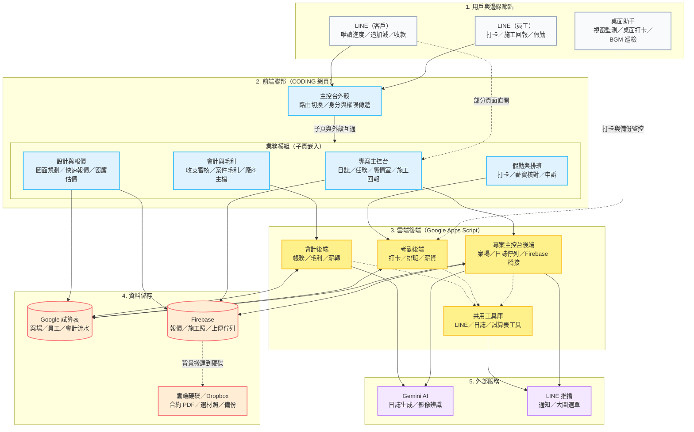

# 添心全域架構圖

**版本**：v1.0（2026-07-09）  
**關聯**：[01_系統架構深編規格書.md](01_系統架構深編規格書.md)、[07_全量系統全景圖.md](07_全量系統全景圖.md)

> 本圖用白話描述「誰連誰、資料往哪走」。圖中不寫函式名與檔名；開發對照見文末「程式對照表」。

---

## 1. 全域生態圖



---

## 2. 程式對照表

| 白話（圖上寫的） | 程式對照（開發用） |
|------------------|-------------------|
| LINE（員工） | 多個 LIFF：`HUB_LIFF_ID`、`REPORT_FORM_LIFF_ID`、`LIFF_ID` 等，見 `shared/js/config.js` |
| LINE（客戶） | 客戶進度頁 `modules/projects/client-construction-progress.html`；收款等走會計 LIFF |
| 桌面助手 | 倉庫 `添心生產力助手/`；`client/src/apiBridge.js`、`monitor.js` |
| 主控台外殼 | `spa/app.js`（Vue 3 路由、`userProfile`、快取優先） |
| 業務模組（子頁嵌入） | `spa/IframeView.js`；各模組在 `modules/` 下以 iframe 開啟 |
| 子頁與外殼互通 | `window.postMessage`；外殼監聽 `openLightbox` 等，見 `01_系統架構深編規格書.md` §1.2 |
| 專案主控台 | `modules/projects/managementconsole.html`、`daily_report.html`、`reportV3.html` |
| 設計與報價 | `modules/InteriorDesigned/LP_LayoutPlanner.html`；`tools/quick-renovation-quote/` |
| 假勤與排班 | `modules/attendance/`（`checkin.html`、`shift_schedule.html` 等） |
| 會計與毛利 | `modules/accounting/`（`index.html` 路由子頁） |
| 專案主控台後端 | `backend/project-console/`；前端 `modules/projects/js/projectApi.js` |
| 考勤後端 | `backend/CheckinSystem/`；前端 `CONFIG.ATTENDANCE_GAS_WEB_APP_URL` |
| 會計後端 | `backend/accounting-gas/`；前端 `CONFIG.ACCOUNTING_GAS_WEB_APP_URL` |
| 共用工具庫 | `backend/core_library/core_library.js`（LINE、日誌、試算表 ID 等） |
| Google 試算表 | 打卡表、會計表、案場表；欄位定義見 `專案全域資料字典.md` |
| Firebase | RTDB `quotations/{案號}`、施工照上傳佇列；`reportV3.html` 內嵌設定 |
| 雲端硬碟／Dropbox | 合約與備份歸檔；施工照由後端 `processFirebaseToDrive_` 從 Firebase 搬運 |
| Gemini AI | `project-console/SiteReportGemini.js`；`accounting-gas/AiVisionLab.js` 等 |
| LINE 推播 | `core_library` 的 LINE API 封裝；各後端 webhook／推播模組 |
| 部分頁面直開 | 客戶進度 LIFF 可直接開子頁，不一定經 HUB 外殼 |
| 打卡與備份監控 | `apiBridge.js` → `CheckinSystem` API；`firebaseService.updateHeartbeat` |
| 背景搬運到硬碟 | `backend/project-console/FirebaseHandler.js` → `processFirebaseToDrive_` |

---

## 3. 與舊版草稿的差異（維護備忘）

| 項目 | 舊草稿問題 | 本版修正 |
|------|-----------|----------|
| Markdown | 開頭 `''mermaid`、未閉合程式碼區塊 | 改為標準 ` ```mermaid ` 區塊 |
| 圖內用語 | 含 `spa/app.js`、`Fetch API`、`processFirebaseToDrive` 等 | 圖內改白話；技術名移入對照表 |
| 設計模組連線 | 僅畫「直連 Firebase」 | LayoutPlanner 讀試算表；快速報價才用 Firebase |
| 專案模組連線 | 僅畫到後端 | 施工回報同時寫 Firebase 與專案後端 |
| 考勤後端 | 未畫到共用工具庫 | 補上 `CheckinSystem` → `core_library` |
| AI／LINE | 僅從共用庫出發 | 專案、會計後端各有 AI；LINE 以共用庫為主 |

---

> **維護**：改程式後先更新「程式對照表」；白話流程沒變就不必重畫整張圖。術語可查 [專有名詞白話對照.md](專有名詞白話對照.md)。
