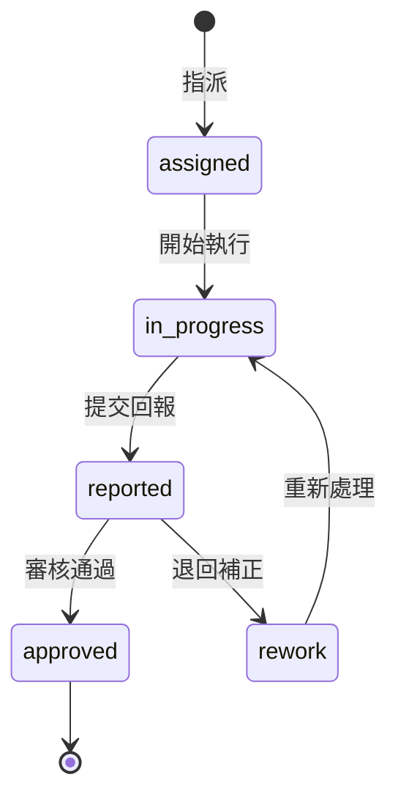

# 添心設計｜助理工作流系統 SPEC

> 狀態：Draft / Incremental implementation  
> 建立日期：2026-09-10  
> 前端入口：`#/assistant-workflow`  
> 前端模組：`modules/info/assistant-workflow.html`

## 1. 產品定位

助理工作流不是單一案件的備忘錄，而是將公司內部可標準化的工作拆成可指派、可執行、可回報、可審核、可追溯的流程。

第一階段聚焦設計師與助理能控制的工作，不把外部工班現場執行納入主要責任鏈。廠商、司機、客戶等外部對象僅作為聯絡節點與等待條件。

## 2. 產品目標

1. 讓助理清楚知道「現在該做哪一步」，避免跳步、漏問與過早承諾。
2. 讓主管能看見誰在何時完成什麼、留下什麼回覆或證據。
3. 將重複工作整理成範本，新增任務時不必重新口頭交代整套流程。
4. 用一致資料計算準時率、退回率、等待時間與一次通過率。
5. 所有案件相關工作以 canonical `project_id` 串接既有專案資料。

## 3. 非目標

- 不取代既有 `ProjectSchedule` 木作產能排程。
- 不在 MVP 直接調度外部工班或取代廠商系統。
- 不導入 Ragic、Trello 等外部任務平台。
- 不修改 `modules/info/onboardingflow.html` v2.4 的新客接洽判斷邏輯。
- 不把 `modules/info/onboardingflow-v2.5-notes.md` 的構想直接實作。

## 4. 使用角色與權限

| 角色 | 建議權限 | 可執行動作 |
|---|---:|---|
| 助理／設計師 | 2+ | 查看與更新自己或所屬案件任務、提交回報 |
| 主管 | 4+ | 建立範本、指派、退回、審核、看部門總覽 |
| 老闆／最高管理 | 5+ | 全部權限、跨組 KPI、系統設定 |

無權限功能直接隱藏；後端仍須再次驗證權限，不可只依賴前端參數。

## 5. 核心生命週期

禁止越級完成。每次狀態變更都新增事件，不覆蓋歷史紀錄。

## 6. 核心資料模型

### 6.1 workflows

| 欄位 | 型別 | 說明 |
|---|---|---|
| workflow_id | string | 工作流實例唯一鍵 |
| template_id | string | 來源範本，可空白 |
| project_id | string | canonical 案件鍵 |
| title | string | 工作流名稱 |
| owner_employee_id | string | 主要負責人 |
| status | enum | active / completed / cancelled |
| due_at | datetime | 整體期限 |
| created_by | string | 建立者 employee_id |
| created_at / updated_at | datetime | ISO 8601 時間 |

### 6.2 tasks

| 欄位 | 型別 | 說明 |
|---|---|---|
| task_id | string | 任務唯一鍵 |
| workflow_id | string | 所屬工作流 |
| project_id | string | 冗餘保存以便查詢與驗證 |
| title / instruction | string | 任務名稱與做法 |
| assignee_employee_id | string | 執行者 |
| reviewer_employee_id | string | 審核者，可空白 |
| status | enum | assigned / in_progress / reported / approved / rework |
| due_at | datetime | 任務期限 |
| sort_order | number | 顯示順序 |
| blocked_by_task_ids | string[] | 必須先完成的任務 |
| required_fields | object[] | 回報必填欄位定義 |
| created_at / updated_at | datetime | ISO 8601 時間 |

### 6.3 task_events

事件採 append-only。

| 欄位 | 型別 | 說明 |
|---|---|---|
| event_id | string | 事件唯一鍵／冪等鍵 |
| task_id / workflow_id / project_id | string | 關聯鍵 |
| event_type | enum | assigned / started / field_updated / reported / approved / rework_requested |
| actor_employee_id | string | 操作者 |
| from_status / to_status | enum | 狀態前後值 |
| payload | object | 欄位值、退回原因、備註 |
| evidence_urls | string[] | 圖片、文件或對話佐證 |
| occurred_at | datetime | 事件時間 |

### 6.4 workflow_templates

保存可重複套用的步驟、相依關係、必填欄位、話術與預設期限，不保存實際案件資料。

## 7. 由參考案例抽出的通用規則

1. 先向內部負責人確認範圍或品項。
2. 再向外部執行者取得可行時間。
3. 有物流時，必須先確認到貨，再安排車趟。
4. 只有在前置時間都確認後，才能向客戶提出或確認時段。
5. 客戶回報是獨立步驟，不能因內部已確認便視為完成。
6. 任一步驟被退回或取消，下游步驟需標記為受影響並重新確認。

## 8. 前端資訊架構

### 8.1 我的工作

- 今日、逾期、等待中、待回報。
- 以「下一個可執行步驟」為主要行動。
- 顯示案件、期限、指派者與阻擋原因。

### 8.2 工作流詳情

- 案件與工作流基本資料。
- 步驟依賴、狀態、負責人與期限。
- 結構化回報欄位、證據與聯絡範本。
- 完整事件時間軸。

### 8.3 審核中心

- 待審核回報、退回原因與再次提交。
- 主管不可直接替執行者補成「已完成」；必要時須留下代理操作事件。

### 8.4 範本管理

- 建立、複製、停用範本。
- 拖曳排序不改變依賴規則；若形成循環依賴必須拒絕儲存。

## 9. 關鍵互動規則

- 被前置任務阻擋的步驟不可開始或提交。
- 「聯絡過」不等於「已確認」；至少要保存回覆內容或證據。
- 狀態寫入使用 `event_id` 做冪等，逾時後先查狀態，不可直接重送寫入。
- 讀取失敗時保留上次成功資料並標記「資料可能不是最新」，不可清空畫面假裝無待辦。
- 手機為主要操作環境；主要按鈕需可單手操作，關鍵資訊避免橫向捲動。
- 日期時間統一儲存 ISO 8601，顯示為台灣時間 `yyyy/mm/dd h:mm`。

## 10. API 草案

| Action | 方法 | 說明 |
|---|---|---|
| get_my_workflows | GET | 依登入 employee_id 取得可見工作流 |
| get_workflow | GET | 依 workflow_id 取得任務與事件 |
| create_workflow | POST | 由範本建立工作流 |
| start_task | POST | assigned / rework → in_progress |
| save_task_draft | POST | 儲存未提交回報草稿 |
| report_task | POST | in_progress → reported |
| review_task | POST | reported → approved / rework |
| get_workflow_templates | GET | 取得可用範本 |

所有寫入回傳 `event_id`、最新 `status`、`updated_at`。後端檢查 `project_id`、操作者權限、狀態轉移與 blocked_by 條件。

## 11. KPI 定義

| 指標 | 計算 |
|---|---|
| 準時完成率 | due_at 前首次 reported 的任務／有期限任務 |
| 一次通過率 | 首次 reported 後直接 approved／已審核任務 |
| 退回率 | 曾出現 rework_requested／已審核任務 |
| 平均執行時間 | started → 首次 reported |
| 平均等待時間 | 前置完成 → started；外部等待另以事件標記排除 |

KPI 用於找流程瓶頸，不以單一數字直接判定員工表現。

## 12. 分階段實作

### P0｜前端原型

- [x] 主控台新增助理工作流入口（權限 2+）。
- [x] 建立步驟依賴、進度、結構化欄位與摘要原型。
- [ ] 將單一參考案例改為可建立多工作流的範本原型。
- [ ] 補上 assigned → in_progress → reported → approved / rework 狀態操作。
- [ ] 補上手機與桌機基本驗收腳本。

### P1｜正式資料層

- [ ] 在 `Backend_GAS` 建立 workflows、tasks、task_events、workflow_templates API。
- [ ] 接入 Hub LIFF 身分與後端權限驗證。
- [ ] 以 project_id 連結現有案件清單，不自建另一套案件名稱。
- [ ] 寫入冪等、讀取快取與錯誤降級。

### P2｜回報與審核

- [ ] 結構化回報、附件證據、退回原因與事件時間軸。
- [ ] 我的工作、主管審核中心、逾期與等待中篩選。
- [ ] LINE／Email 通知只在明確事件觸發，避免重複通知。

### P3｜範本與管理分析

- [ ] 範本編輯與版本化。
- [ ] KPI 與流程瓶頸報表。
- [ ] 舊工作流繼續綁定建立當時的範本版本。

## 13. 驗收條件

1. 助理只能看到自己或所屬案件的工作。
2. 被阻擋步驟無法越級開始或回報。
3. 每次指派、開始、回報、審核與退回都有 actor 與 timestamp。
4. 回報缺少必填欄位或證據時不可提交。
5. 寫入逾時重整後不會產生重複事件。
6. 讀取失敗保留舊資料並明確顯示錯誤。
7. 主管可看待審核、逾期與退回項目；助理看不到不相關案件。
8. 手機 390px 寬度可完成主要操作，桌機無版面溢出。

## 14. 自動迭代規則

每次自動迭代只完成一個可驗證的小項目：

1. 先拉取最新 `main`，閱讀本 SPEC、`AGENTS.md` 與 `TOS/TOS_AUDIT.md`。
2. 不修改 `modules/info/onboardingflow.html` v2.4、`modules/info/cases/`、`modules/info/BAK/`。
3. 優先處理 P0，再依序 P1、P2、P3；需要 `Backend_GAS` 而環境未掛載時停止該項，不假造後端。
4. 先檢查是否有他人新提交；衝突或需求不明確時不覆寫。
5. 修改後執行適用的語法、路由、互動與版面檢查。
6. 只有實質改善且測試通過才提交；沒有安全改善時只回報，不為了產生 commit 硬改。
7. 每次完成後更新本 SPEC 勾選狀態，並在下方追加一行紀錄。

## 15. 迭代紀錄

- 2026-09-10：建立 SPEC；P0 首版以前端步驟依賴與回報摘要作為可操作原型。
