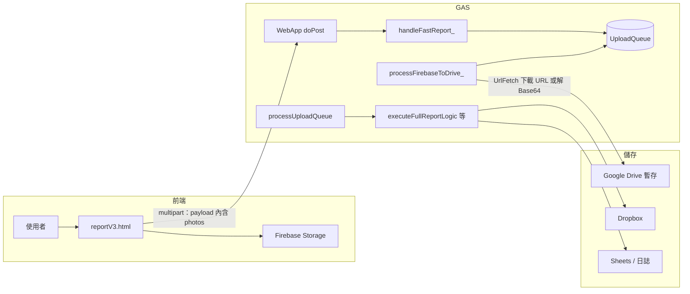
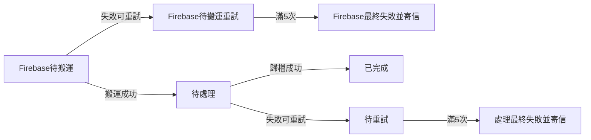

# 添心施工回報系統 — 完整技術規格（現況版）

**文件版本：** 1.0（2026-04-25）  
**合併來源（已於 2026-04-25 封存至 `_DEPRECATED_/2026-04-25_施工回報合併前_SPEC/`，內文未刪）：** `REPORT_SYSTEM_SPEC.md`（V3）、`施工回報_FirebaseStorage_遷移計劃書.md`、`UPLOAD_OPTIMIZATION_PLAN.md`  
**程式對照（權威）：** 前端 `CODING/modules/projects/reportV3.html`；後端 `backend/project-console/`（`WebApp.js`、`FirebaseHandler.js`、`line_reply.js`）

> **目的**：以單一文件描述**目前上線/開發中**的前後端行為、資料流、參數與維運要點。機密（Firebase 金鑰、GAS 網址、LIFF ID）僅存在 `reportV3.html` 的 `window.__REPORT_V3_CONFIG__`，**勿**複製到對外文件。

---

## 1. 系統範圍與兩條主路徑

本系統讓現場人員在 LINE（LIFF）內填寫案號、施工內容並上傳照片，最終產出：Google Drive 連結、Dropbox 備份、「每日工作回報 (回覆)」Sheet、專案日誌與（最後一批完成時）LINE 通知。

| 路徑 | 前端動作 | GAS `action` | 第一階段（即時回應） | 第二階段以後（背景） |
|------|----------|----------------|----------------------|------------------------|
| **A. 極速／現行主線** | `reportV3.html`：相機／檔案 → 壓縮 → 優先上 Firebase → 單次 POST 含 URL 與可選 Base64 降級 | `submitFastReport` | `handleFastReport_()`：寫 `UploadQueue`（狀態 `[Firebase待搬運]`）、排程約 15 秒後執行 `processFirebaseToDrive_` | Firebase→Drive 搬運完改為 `待處理` → 既有 `processUploadQueue()` → Dropbox／Sheet／日誌／LINE |
| **B. 相容舊客戶端** | 舊版多批 Base64 分片 POST | `submitReport` | `handleReportSubmission_()`：直接寫 Drive 暫存取得 `driveFileId`，`UploadQueue` 狀態直接為 `待處理` | 同上 `processUploadQueue()` |

> 舊文件中的 **`report_test.html` + `isTest` 隔離** 屬歷史演進敘述；**現況**以 **`reportV3.html` + `submitFastReport`** 為正式極速路徑。後端測試隔離邏輯已收斂在 `FirebaseHandler` 的搬運與佇列設計內，不必另開一頁才能驗證（除非專案再次拆測試頁）。

---

## 2. 端對端資料流（極速路徑 A）

**使用者可感知的「成功」**（GAS 回 `success: true`）在極速路徑下代表：該次回報**已寫入佇列**並已排定背景搬運；**不是**當下已完成 Dropbox 與所有 Sheet。與舊路徑「先暫存再佇列」的語意一致，只是**不再**在請求內承載大塊 Base64、改由後端從 URL 拉檔或降級 Base64。

**後台搬運要點（`processFirebaseToDrive_`）**（見 `FirebaseHandler.js`）：

- 讀狀態為 `[Firebase待搬運]`（含 `(重試n)`）之列；以 Lock 避免並行寫亂序。
- 每張圖片：`firebaseURL` 存在則 `UrlFetchApp.fetch` 下載；否則可解析 `data`（data URL Base64）建立 Blob（**雙軌降級**與遷移計劃中「回退到 Base64」一致）。
- 寫入 Drive 暫存樹狀目錄（`DRIVE_TEMP_FOLDER_ID` 下，依 `projectId`／`logId`），設定連結可檢視，收集 `driveFileIds`；若來源為 Firebase 成功刪除遠端物件，則以 **GCS REST + OAuth**（`deleteFromFirebase_`）清理。
- 單筆處理完畢將 `資料包(元數據)` 精簡、`狀態` 改 `待處理`，並排程 `processUploadQueue`。
- **失敗／重試：** 可重試錯誤（含「找不到指定 ID」）→ 清 `folder_id_p_`／`folder_id_l_`／`folderId_for_` cache → 標 `[Firebase待搬運] (重試n)`，延遲 1→2→5→10→15 分鐘再喚醒；滿 5 次 → `Firebase搬運失敗(已達上限): …` 並 `MailApp` 寄信（收件：`MANAGER_EMAIL` 或預設 `nephihuang@gmail.com`）。
- **防再犯：** 資料夾快取命中但開不到時，當場清快取並依案號／LogID **重建資料夾**，不把失效 ID 連踩滿 5 次。
- 「搬運中」逾約 15 分鐘自動回收為可重試；觸發器採「先清再建」避免漏喚醒。

**歸檔主線（`processUploadQueue` + `executeFullReportLogic`）**（見 `line_reply.js`）：

- 讀 `待處理`／`待重試 (n)`（且重試延遲已到）：讀 `資料包(元數據)` 與 `Drive檔案ID列表` → 執行 Dropbox 與 Drive 公開連結產生。
- 同 batch 須前一 chunk＝`已完成` 才處理下一列；前段最終失敗**不擋**其他 batch，寄信內容會列出卡住後段。
- `chunkIndex === 1`：建日誌草稿、寫入「每日工作回報 (回覆)」；後續 chunk 追加照片至同一 `logId` 之日誌。
- `chunkIndex === totalChunks`：將完成訊息丟入 LINE 回覆佇列。
- **失敗／重試：** Drive 檔開失敗會拋錯進重試（不清空標已完成）；「找不到指定 ID」時清 folder cache。→ `待重試 (n)`＋遞增延遲；滿 5 次 → `處理失敗(已達上限): …`＋寄信。「處理中」逾約 15 分鐘回收。

**佇列狀態機（白話）**

| 白話（圖上） | 程式對照 |
|---|---|
| Firebase待搬運 | 狀態 `[Firebase待搬運]`／`(重試n)`；`processFirebaseToDrive_` |
| 待處理／待重試 | 狀態 `待處理`／`待重試 (n)`；`processUploadQueue` |
| 已完成 | 狀態 `已完成` |
| Firebase／處理最終失敗並寄信 | `…(已達上限): …`＋`_sendUploadQueueAlertEmail_` |

**手動維運（GAS 編輯器）**：`rescueStuckUploadQueue_`、`retryFirebaseFailures_`、`clearDriveFolderCacheKeys_`、`kickProcessUploadQueue_`（見 `UploadQueueOps.js`）。

`handleFastReport_` 會依照片數量以 **每 4 張一塊** 寫多列（與佇列消化邏輯相同 chunk 模型），`logId` 以 `CacheService` 綁定 `batchId` 約 30 分鐘，使同一批照片共用同一日誌。

---

## 3. 前端 V3 規格（`reportV3.html`）

### 3.1 設定單一來源

- 所有可調參數、**版本字串 `CLIENT_VER`、Firebase 設定、GAS 網址、LIFF ID** 均在 `window.__REPORT_V3_CONFIG__`（頁面 `<head>`）。  
- **參考實例（實際數值以檔內為準，勿在 PR 內重複貼上金鑰）：** `PHOTO_UPLOAD_CONCURRENCY: 5`、`GAS_POST_MAX_RETRIES: 3`、`FIREBASE_UPLOAD_MAX_RETRIES: 3`、`PHOTO_UNIT_MAX_RETRIES: 3`、`PHOTO_UNIT_RETRY_BASE_MS: 400`、`GAS_FETCH_TIMEOUT_MS: 120000`、失敗 JSON 字節上限、IDB 名稱／鍵等。

### 3.2 啟動與身分

- Firebase：`signInAnonymously`；送出前 `ensureAuthBeforeSubmit()` 確認已登入。
- LIFF 或**查詢參數** `uid`+`name` 覆寫、或本機測試（`ENABLE_LOCAL_TEST_BYPASS` 僅限 localhost／127 且建議關閉以逼真相）。
- 開發用 `?devSim=1` 可開啟失敗模擬 UI（GAS/網路/第一張圖/IDB 等路徑）。

### 3.3 提交流程（精簡）

1. 驗證案號（純數字，如 9999 表非案場）、`workType` 必填、內容至少一項（照片／施工說明／問題說明擇一）。
2. 送出開始：寫入 IndexedDB 暫存＋ debounce 的 `sessionTraceDraft`。
3. `processPhotosStable`：有界併發上傳（`mapWithConcurrency`）→ 每張：`compressWithFallback`（**預設** `maxSizeMB: 0.4`, `maxWidthOrHeight: 1280`；可勾選關閉壓縮）→ `uploadFirebaseWithRetry` 失敗則 `readFileAsBase64` 降級。
4. 送出 GAS：`buildGasFormData` → `postToGasWithRetry`（可重试之 HTTP/網路錯誤；**業務** `success: false` 不重试）。
5. 成功則清 IDB、關窗計時等（同原 `REPORT_SYSTEM_SPEC` 描述）。

**Action 名稱：** 固定 `submitFastReport`；**單一 chunk 語意**：`totalChunks: 1`、`chunkIndex: 1` 由前端一筆帶上（實作於 `buildGasFormData` 常數 1，後端若多列拆塊由 `handleFastReport_` 改寫為多列時會帶正確 `chunkIndex`/`totalChunks`）。

**`clientTrace`：** 含 `ver`、`url`、`ts`、`uid` 等；可帶前次失敗摘要 `previousFailedAttempt` 以利除錯，不含完整 Base64。

**失敗處理：**

- 併寫本機 `failureChain`、可上傳單一 JSON 至 `failure-report/{案號路徑}/failure-{timestamp}.json`（Bucket 生命週期另於 Firebase 主控台設定）。
- 「複製除錯」提供工程師可讀報告。

### 3.4 GAS 請求格式

- 使用 `FormData`：至少包含 `payload` 為**完整 JSON 字串**（內容含 `action`, `batchId`, `userId`, `userName`, `projectId`, `workType`, 欄位文字與**完整 `photos` 陣列**）；並將非 `photos` 之頂層鍵重複 `append`（便於 GAS 除錯及相容）；`chunkIndex` 在表單欄位固定為 `1` 給**首包**邏輯參考。
- 後端 `doPost` 讀取：`e.postData.contents` **或** `e.parameter.payload` 解析 JSON（`WebApp.js` 註解說明支援 JSON body 與表單 `payload` 兩路）。

**成功條件（前端）：** `response.ok && result.success === true`。

### 3.5 Firebase Storage 路徑（前端）

- 一般照片：`reports/{projectId}/{batchId}/{timestamp}_{idx}_{rand}_{safeName}`
- 失敗記錄：前綴見 `__REPORT_V3_CONFIG__.FAILURE_REPORT_PREFIX`（例：`failure-report/...`）

僅在規則允許匿名寫入上述前綴時可運作；規則變更須與本檔一併檢視。

---

## 4. 與《上傳優化計劃》的對照（實作狀態）

| 主題 | 計劃書方向 | 現況（2026-04） |
|------|------------|-----------------|
| 減小傳輸體積 | `browser-image-compression` 約 1280 / 0.4MB | **已**：`compressWithFallback` 同參數；可選不壓縮 |
| 減少 GAS 413、長時間佇在同步 I/O | Base64 改走 Firebase 再搬運；後台非同步 | **已**：`submitFastReport` 秒寫佇列 + 背景 `processFirebaseToDrive_` / `processUploadQueue` |
| 分批 ACK | 多批遞迴等後端 ACK | 舊路徑如此；V3 **單包** 送 GAS，後端再佇列內 4 張一列**拆行**；若需更細 ACK 屬**未實作增強** |
| Offline / IndexedDB | 離線全存待重送 | **已**：失敗暫存、一鍵帶入；**未**作背景自動上傳 Service Worker 級全自動 |

---

## 5. 佇列與《遷移計劃》修正說明

- 歷史文件曾列出「FirebaseHandler 與正式流程的落差」。**目前** `handleFastReport_` 已**直接寫入** `UploadQueue` 並排程 `processFirebaseToDrive_`；遷移稿中的「UrlFetch 下載 → Drive → 佇列 `待處理` → `processUploadQueue`」**已實作**，無須再透過測試專用函式分岔即可完成主線。
- **穩定發布策略**（測試頁驗證後手動晉升正式、首週監控）仍適用，唯正式頁面實體名稱已為 **`reportV3.html`**。

---

## 6. 維運檢查清單

1. 行為變更時遞增 `CLIENT_VER` 與本文件**文件版本**或修訂日期。  
2. Firebase：匿名寫入、`failure-report` 前綴、**若啟用刪檔**則 GCS 權限與 Apps Script `devstorage` scope 仍須與 `deleteFromFirebase_` 要求一致。  
3. GAS 部署：`submitFastReport` 可路由、`ProcessFirebase` 與佇列觸發不堆積死觸發器。  
4. 試算表 `UploadQueue` 欄位名稱與程式一致：`狀態`、`資料包(元數據)`、`Drive檔案ID列表`、以及批次相關欄位。  
5. 正式上線前確認 `ENABLE_LOCAL_TEST_BYPASS === false`、LIFF/Endpoint/網域正確。  
6. 欄位名稱與業務**資料字典**一致（見 `SPEC/專案全域資料字典.md`）；GAS/前端欄位擴充時同步本檔 **§3** 與 **§1** 表格。

---

## 7. 取代關係與追溯

- 上述三份合併來源之**完整舊檔**已於 **2026-04-25** 搬至 `CODING/_DEPRECATED_/2026-04-25_施工回報合併前_SPEC/`（各檔首段有封存橫幅；同處有 `README.md` 清單）。僅作本機查閱備存即可。  
- **`REPORT_SYSTEM_SPEC.md`（封存副本）：** 仍具**前端 V3 細部函式名**參考價值；本檔以「系統層、與後端交會」為主。若函式層有歧義，以 `reportV3.html` 為准。  
- **`施工回報_FirebaseStorage_遷移計劃書.md`（封存副本）：** 敘事與部分檔名（`report.html` 分批舊流）**偏歷史**；架構圖中「兩階段＋佇列」**仍正確**，實作細節以本檔＋倉庫程式為准。  
- **`UPLOAD_OPTIMIZATION_PLAN.md`（封存副本）：** 已轉寫為本檔**§4** 對照表。  
- **`backend/project-console/SPEC/08_REPORT_SYSTEM_ACTION_SPEC.md`：** 仍以 `submitReport`／`isTest` 寫的介面，與**現況**不完全一致，維運請**優先**採用本文件與 V3 前端。

---

**最後審閱建議週期：** 每次 GAS 大改版或 Firebase 規則變更後重讀 **§1–§3、§6**。
