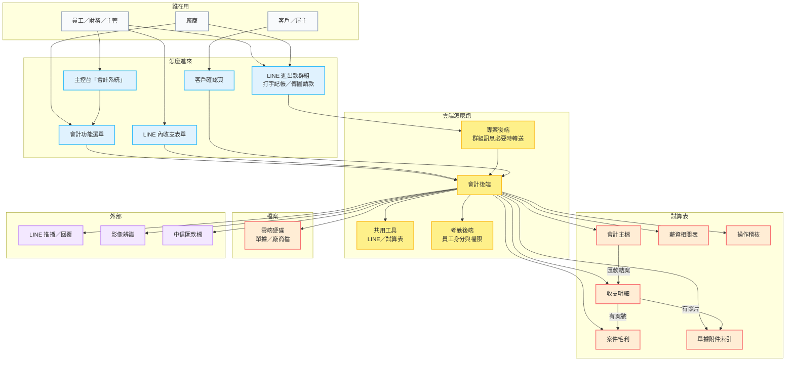
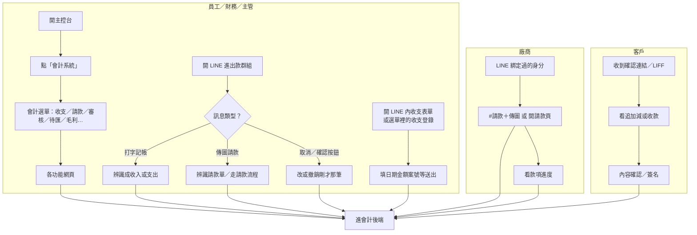
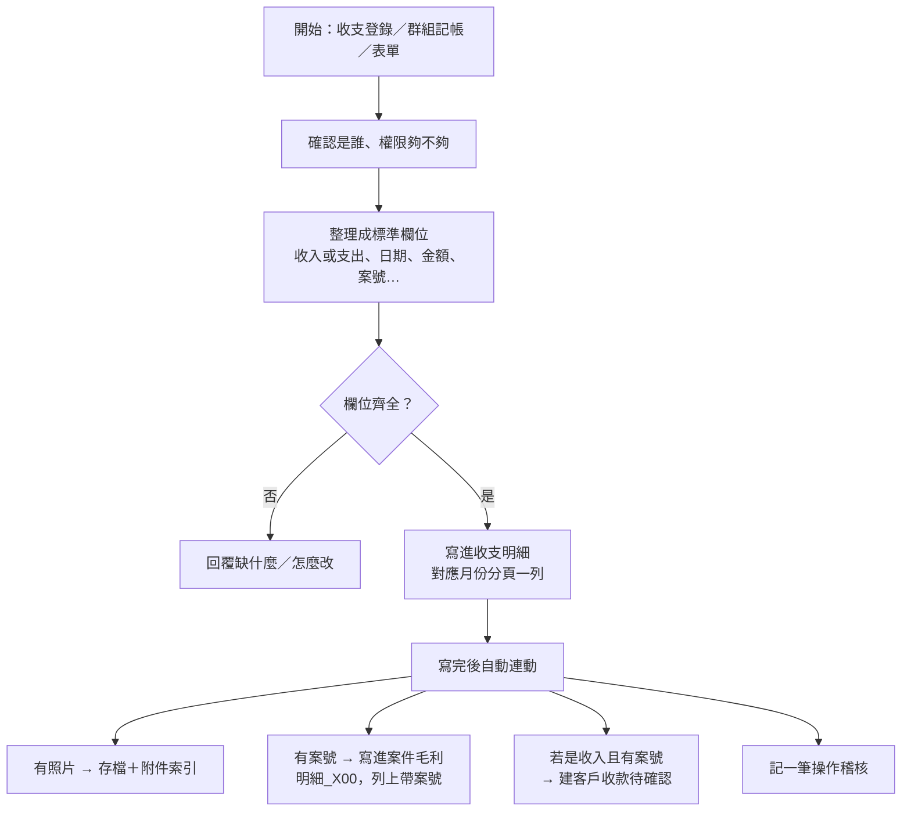
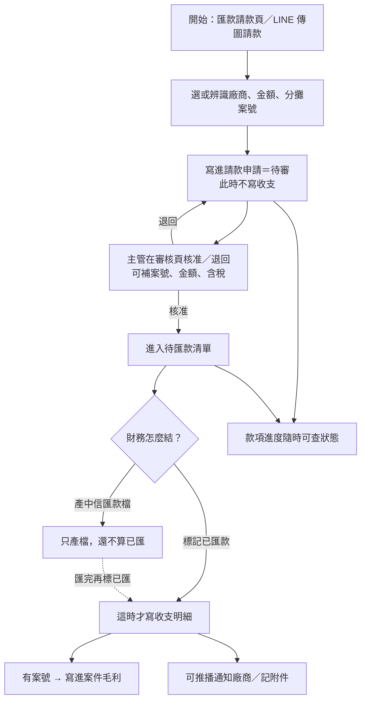
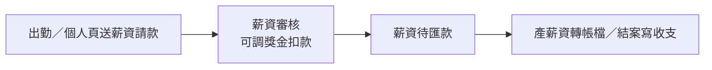
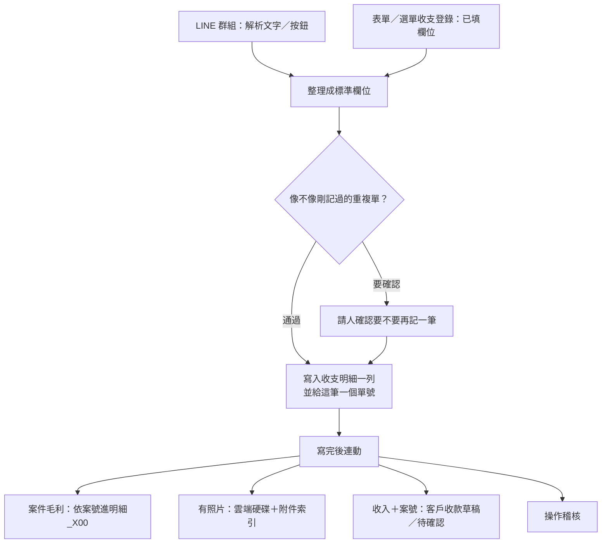
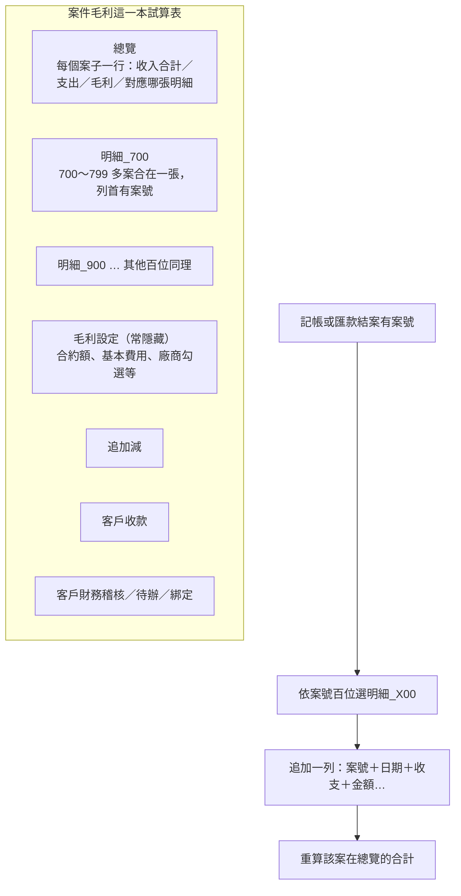
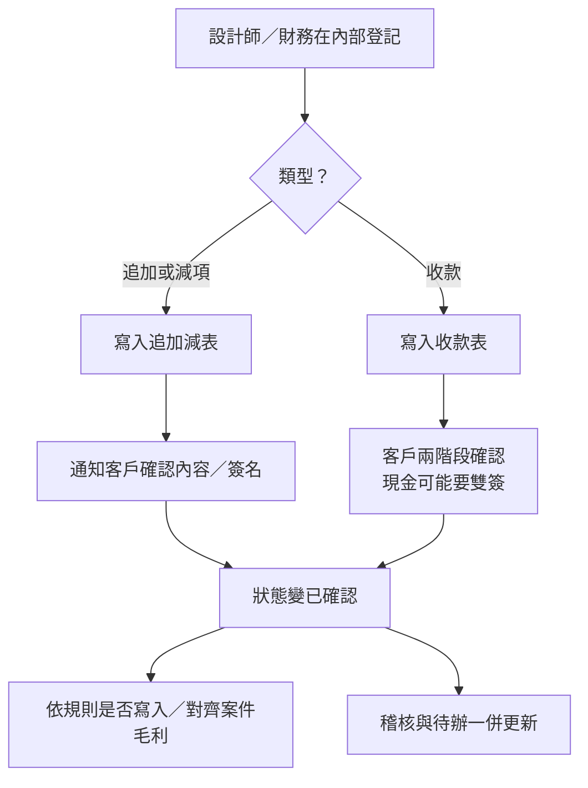

# 添心會計系統架構圖

**版本**：v1.1（2026-07-18）— 細劃入口、兩條錢路、寫帳連動、毛利／客戶財務／薪資  
**關聯**：
- 模組規格：[15_會計系統模組規格書.md](15_會計系統模組規格書.md)
- 功能流程：[添心會計功能流程_3cd03bf5.md](添心會計功能流程_3cd03bf5.md)
- 全專案位置：[全域架構圖.md](全域架構圖.md)
- 資料／試算表：[backend/accounting-gas/SPEC/DATA_MASTER_PLAN.md](../../backend/accounting-gas/SPEC/DATA_MASTER_PLAN.md)
- 身分／快取：[20_會計快取與身分傳承流程圖.md](20_會計快取與身分傳承流程圖.md)

> 圖用白話：「誰進來 → 系統做什麼 → 資料放哪」。圖中不寫函式名與檔名；開發對照見文末「程式對照表」。

---

## 一句話

會計系統＝**人從 LINE／網頁進來** → **會計後端統一處理** → **寫進幾本試算表**（收支、請款、毛利、附件、薪資、客戶財務等）。

錢分兩種：**已發生 → 立刻記帳**；**還沒付 → 請款審核後，匯款結案才記帳**。

---

## 1. 整體架構圖（鳥瞰）

---

## 2. 入口細劃：人從哪裡進來、先碰到什麼

| 入口 | 典型用途 | 接著走哪條錢路 |
|------|----------|----------------|
| 主控台會計選單 | 日常操作最完整 | A 或 B 或查詢／設定 |
| LINE 群組打字 | 現場快速記已發生收支 | **路徑 A** |
| LINE 群組傳圖＋請款 | 廠商／員工送未付款單 | **路徑 B** |
| LINE／網頁收支表單 | 欄位較完整的已發生記帳 | **路徑 A**（與群組同一條寫帳） |
| 客戶確認頁 | 追加減、收款兩階段確認 | 客戶財務（不直接當日常記帳入口） |

---

## 3. 兩條錢的路（細步）

### 3.1 路徑 A：錢已經發生（立刻進帳）

### 3.2 路徑 B：錢還沒付出（請款 → 審核 → 匯款才進帳）

| 步驟 | 白話狀態 | 寫收支？ | 寫毛利？ |
|------|----------|----------|----------|
| 送請款 | 待審 | 否 | 否 |
| 主管核准 | 待匯款 | 否 | 否 |
| 產中信檔 | 仍待匯（僅產檔） | 否 | 否 |
| 標記已匯款 | 已匯款 | **是** | 有案號則是 |
| 財務捷徑直接建待匯 | 跳過待審 | 仍要等標記已匯才寫帳 | 同上 |

### 3.3 薪資（另一條「還沒付」的支線）

> 廠商待匯款 ≠ 薪資待匯款（匯款檔格式與頁面不同，不要混用）。

---

## 4. 記帳同一條（群組 ≈ 表單）— 再細一點

人從哪邊進來可以不同，**寫帳與寫毛利是同一套**：

| 備註標記（表上常見） | 白話從哪來 |
|----------------------|------------|
| 群組記帳 | LINE 進出款群組 |
| 表單／LIFF | 網頁或 LINE 內收支表單 |
| 廠商請款結案 | 待匯款標記已匯後寫入 |

---

## 5. 案件毛利內部怎麼放

| 分頁類型 | 白話用途 |
|----------|----------|
| 總覽 | 找案子、看合計 |
| 明細_X00 | **日常明細唯一入口**（新資料寫這裡） |
| 毛利設定 | 系統記住案的合約與設定 |
| 追加減／收款／稽核／綁定 | 客戶可見財務確認，不是日常記帳本 |
| 舊的「案號_客戶名」 | 歷史遺留；新寫入不再開新的 |

---

## 6. 客戶財務（追加減／收款確認）

---

## 7. 試算表／資料本一覽（細）

| 本子（白話） | 主要放什麼 | 誰常寫入 |
|--------------|------------|----------|
| 收支明細 | 已發生收入／支出，按月分頁 | 路徑 A 立刻；路徑 B 匯款結案時 |
| 會計主檔 | 廠商、請款申請、分攤、LINE 聯絡人、薪資請款等 | 名冊、請款、審核、待匯 |
| 案件毛利 | 總覽、明細_X00、毛利設定、客戶財務相關分頁 | 記帳連動、手動補列、客戶確認 |
| 單據附件索引 | 哪一筆帳對哪幾張照片／檔 | 記帳／請款有上傳時 |
| 薪資統計／薪資請款 | 薪資審核與轉帳相關 | 薪資流程 |
| 操作稽核 | 誰做了什麼 | 幾乎所有寫入後 |

**檔案**：單據照片、廠商報價／合約等進雲端硬碟；試算表多半只存連結與索引。

---

## 8. 人怎麼找功能（選單對照）

| 你要做的事 | 大致入口 | 權限感覺 |
|------------|----------|----------|
| 記一筆已發生收支 | 主控台會計 → 收支登錄；或 LINE 群／表單 | 員工以上 |
| 送還未付的請款 | 待付款／請款頁；或廠商 LINE 請款 | 在職可送 |
| 看自己款項到哪 | 款項進度 | 本人／綁定廠商 |
| 審核請款 | 請款審核 | 主管核准 |
| 廠商匯款結案／產中信檔 | 廠商待匯款 | 財務 |
| 薪資審核／薪資轉帳 | 薪資審核 → 薪資待匯款 | 主管／財務 |
| 查單據照片 | 單據附件 | 財務 |
| 看／調案件賺賠 | 案件毛利 | 財務 |
| 維護廠商與匯款帳戶 | 廠商名冊 | 財務 |
| 追加減／收款給客戶確認 | 客戶財務相關頁；客戶開確認頁 | 設計師／財務／客戶 |

---

## 程式對照表

| 白話（圖上寫的） | 程式對照（開發用） |
|------------------|-------------------|
| 主控台「會計系統」 | CODING HUB `#/accounting` → `modules/accounting/index.html` |
| 會計功能選單／各功能網頁 | `CODING/modules/accounting/`（收支、請款、審核、待匯、毛利、附件、名冊…） |
| LINE 進出款群組 | `accounting-gas` webhook；群訊息常經 `project-console` 轉送 |
| 專案後端轉送 | `project-console/accounting_ingest.js`、`accounting_policy.js` |
| LINE 內收支表單／收支登錄 | `AccountingIngestForm.html`；HUB 內嵌 `accounting_ingest.html` |
| 確認是誰、權限 | LIFF／員工表；`AuthBridge`／考勤 `CheckinSystem` |
| 整理成標準欄位 | `LineIngestParser.js`、`normalizeIngestPayload_` |
| 像不像重複單 | 記帳指紋／重複確認 Flex |
| 寫入收支明細一列 | `SheetWriter.js` → `LEDGER_SPREADSHEET_ID` 月分頁 |
| 寫完後自動連動 | `LedgerPostIngest.js`（`afterLedgerIngest_`） |
| 案件毛利明細_X00 | `MarginModule.js`；`MARGIN_SPREADSHEET_ID` |
| 收入→客戶收款待確認 | `CustomerFinanceModule.js`（`cfCreateReceiptFromLedgerIngest_` 等） |
| 匯款請款／傳圖請款 | `payment_request.html`；LINE OCR／`VendorPaymentModule` |
| 請款申請＝待審 | 主檔 `vendor_payment_request`＋分攤表 |
| 請款審核頁 | `ledger_review.html` |
| 廠商待匯款／標記已匯 | `vendor_payment_finance.html`；標記已匯才寫收支 |
| 產中信匯款檔 | 廠商整批 TXT（與薪資轉帳檔不同） |
| 款項進度 | `vendor_status.html` |
| 薪資審核／待匯 | `payroll_review.html`、`payroll_finance.html` |
| 單據附件索引 | `ATTACHMENT_SPREADSHEET_ID`；`attachments.html` |
| 廠商名冊／LINE 綁定 | `vendors.html`；主檔廠商＋綁定 |
| 客戶確認頁 | `customer-finance-portal.html` |
| 追加減／收款／稽核／綁定 | 毛利表內 `ContractAdjustments`、`CustomerReceipts` 等 |
| 考勤後端身分 | `CheckinSystem` 員工權限 |
| 會計後端本體 | `backend/accounting-gas/` |
| 共用工具 | `backend/core_library/` |
| 影像辨識 | `AiVisionLab.js`／請款 OCR 流程 |
| 操作稽核 | `AuditLog.js`／稽核試算表 |

---

## 維護備註

- **毛利分頁（2026-07-18）**：新寫入收束為 `明細_X00`（列首案號）；不再新建 `案號_客戶名`。舊單一案子分頁可保留查閱，日常以總覽＋明細為準。
- 改動線架構時：先改本圖白話節點 → 再改對照表 → 必要時同步 [15_會計系統模組規格書.md](15_會計系統模組規格書.md)、[添心會計功能流程_3cd03bf5.md](添心會計功能流程_3cd03bf5.md)。

## A4 列印

開啟同資料夾 **[會計系統架構圖_A4列印.html](會計系統架構圖_A4列印.html)**（需連網載入圖表元件）→ 等圖出現 → 按「列印／存成 PDF」→ 紙張選 **A4 直向**（約 8 頁）。
