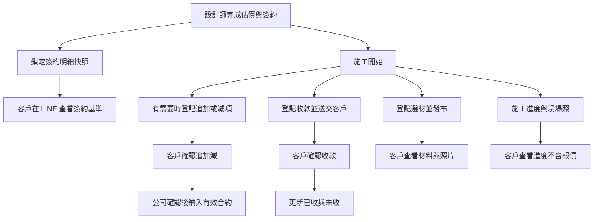
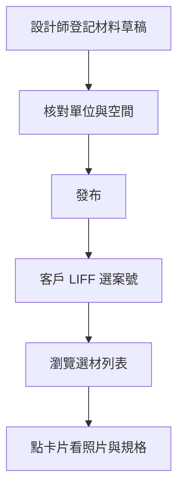

# 未來開發事項（Backlog）

> **用途**：記錄方向與待做想法；**不是**完整計劃書。細節開工再寫進對應 SPEC。  
> **維護**：新想法只寫幾句；開工後移入編號 SPEC，並從本檔「待做」拿掉。  
> **命名慣例**：與 [`00_開發憲法.md`](00_開發憲法.md) 一致—先更新 [`專案全域資料字典.md`](專案全域資料字典.md) 再寫程式。

**Changelog**

| 日期 | 摘要 |
|------|------|
| 2026-07-11 | **Drive 廠商檔方向拍板**：舊樹（工種→廠商）搬進 Drive；新檔也走同格式；工種掛廠商主檔；不寫 OneDrive API、不雙向同步當正式 |
| 2026-07-11 | 對齊過期說明：SPEC 15／DATA_MASTER_PLAN 權限與薪資現況；移出「舊說明過期」待辦 |
| 2026-07-11 | 已完成項移出本檔待辦（H1／H2、LINE 停自動請款）；大方向只留未做 |
| 2026-07-11 | **LINE 傳圖停自動請款**：不再自動核對卡／開建單；請款改網頁。AI 歸類再建單仍為未來項 |
| 2026-07-11 | **H1／H2 已實作**：一般員工可進請款／款項進度；毛利明細網頁可改／刪 |
| 2026-07-11 | 重整：大方向置頂；納入 OneDrive↔Drive、LINE 傳圖、H3／冒煙建議；選材細節改附錄 |
| 2026-07-06 | **總監拍板（B）**：兩層導覽四卡片 IA、簽約快照、減項預設收合、Phase 步序；§13「一案綁定」標過時 |

---

## 大方向（目前優先）

1. **廠商檔只維護 Google Drive（目前最優先之一）** — **方向已拍板；等人搬完舊檔再開工改程式**  
   - **目標**：只維護一個雲端；**新檔遷就舊資料夾格式**，不是舊檔遷就現行「只依廠商名」。  
   - **資料夾**：`裝潢建材廠商／{工種}／{廠商}／…`（工種例：五金、木工、水電材料、石材、地板、系統櫃、其他、拆除、油漆、泥作、金屬加工、建材、玻璃、消防、窗簾、廚衛…）；廠商下可再依資料格式分子夾。  
   - **工種來源**：掛在**廠商主檔**（每次上傳不另選）。  
   - **搬家**：人先把 OneDrive 舊樹**移／同步進 Google Drive**（保留原結構）；搬完再說，再改系統寫入路徑。  
   - **不做**：正式流程用 API 寫 OneDrive；長期 OneDrive↔Drive 雙向同步當唯一真相。  
   - **之後開工**：停或改現行「依廠商名」自動建夾 → 改寫進上述路徑；細節進正式 SPEC。

2. **LINE 傳圖 → AI 歸類後再建請款**  
   每張廠商照片先送 AI 歸類；**明顯是請款單**才產生請款申請。  
   （傳圖已不再自動建請款／核對卡；請款走網頁——已落地，不列待辦。）

3. **客戶「我的案場」選材／簽約／兩層導覽**  
   2026-07-06 已拍板 IA 與步序；完整細節見下方附錄（尚未實作）。

---

## 待開發（短想法）

### 列表暫存（H3｜尚未拍板）

多人同時審／匯時，3 天暫存易看舊單。  
**建議**：先縮短暫存（數分鐘級）＋「重新載入」講清楚；不必狂打後端。

### 冒煙測完清假單

測完立刻清；不要在每次讀試算表加清理。  
收支／毛利測試列清理工具可能清不完 → 餘下人工刪。

---

## 想法／待排（可晚）

| 項 | 一句話 |
|----|--------|
| 零用金請款 | 只有規格、還沒做頁面與後端；用不到就先擱。 |
| 舊頁仍可直連網址 | 選單多半藏了；一般人碰不到，整理時再下架。 |
| 待匯款頁重複「新增」 | 與統一請款頁雙入口；之後可併回請款頁。 |
| 靜態資源版本號不一致 | 少數頁可能吃到舊快取；怪行為時先強制重新整理。 |

---

## 附錄：選材與客戶案場（2026-07-06 拍板細節）

> **狀態**：已決策（總監選 **B**），**尚未實作**。以下為當日拍板全文，供開工時對照；新想法請寫上方短條，勿在此再長篇加計劃。

### 入口與多案

| 決策 | 內容 |
|------|------|
| 多案綁定 | 一 LINE 可綁多案，下拉切案（**以 B5 實作為準**） |
| 主入口 | 單一 LIFF「**我的案場**」；Rich Menu **一個**主入口 |
| §13 對照 | [13_客戶端唯讀施工進度規格書.md](./13_客戶端唯讀施工進度規格書.md) 之「一案綁定」**已過時**；以 B5／本 backlog 為準 → **§13 本體待修訂**（不在本檔改 §13） |

### 客戶第一眼 IA（兩層導覽，非五 tab 橫排）

| 區塊 | 內容 |
|------|------|
| 固定標頭 | **案號＋工地名**固定顯示 |
| 待辦橫幅 | 「**待您處理**」（有才出現） |
| 一行金額 | 有效合約 · 已收 · 未收；有減項時加「**已含簽約後變更，淨額如上**」 |
| 四張大卡片 | **簽約｜變更｜收款｜選材** — 點卡片進第二層明細（非分頁列橫排） |
| 施工進度 | Phase A **不硬併殼**；Phase B 併殼或維持深連結 `client-construction-progress.html` |

### 減項 UX

- 簽約原列**永遠保留不刪**
- 減項列表**預設收合**（`hide_reductions` 預設 `true`）
- 摘要含淨額＋「**另有 N 項變更可查看**」
- **減少範圍**須與加項同等**客戶確認／簽認**流程

### 簽約快照

| 項目 | 決策 |
|------|------|
| 凍結時點 | **訂金／頭期確認後、開工前**；設計師按「**發布給客戶**」才凍結 `ContractBaselineItems` |
| 簽約 PDF | 同時上傳至 Drive **`{案號}/合約`**；無 PDF 須掃描或註明「以紙本為準」 |
| 客戶看單價 | Phase A：**項次＋小計**；單價可選隱藏（**預設可先只秀小計**，待總監日後改） |

### Phase 步序

| 步序 | 內容 |
|------|------|
| **A-1** | 摘要、兩層導覽、減項預設收合、列表改卡片（擴充現有 `customer-finance-portal`） |
| **A-2** | 簽約快照表＋簽約明細分頁 |
| **A-3** | 選材表＋Drive `{案號}/選材`；發布前與簽約不一致 → **黃燈警示** |
| **B** | 施工進度併殼（Phase A 深連結）；選材照 2 年 sweep；追加減 PDF |

### 保留政策（分流）

| 資料 | 政策 |
|------|------|
| 選材 Drive 照 | 結案後 **2 年**（**預設日曆年**；730 天若未另決，以日曆年為準） |
| 合約 PDF、追加減簽認、收款紀錄 | **長期保留**，不與選材照同刪 |

### 擱置／往後

- 施工進度 Phase A 不硬併殼
- 選材工項逐列自動對照 → Phase B
- 2 年自動刪照排程**不擋主線**

---

## 選材表與客戶可見案場資料（整合規格）

> **狀態**：未實作（2026-07-05 總監指示；2026-07-06 **總監拍板 B** 定稿 IA／快照／Phase 步序；細節見上方「總監拍板決策」）  
> **參照模式**：案件毛利 B5「追加減與收款收據」（[`21.案件毛利擴充與薪資連動.MD`](21.案件毛利擴充與薪資連動.MD) §B5；已部署 Phase A）  
> **既有客戶頁**：`customer-finance-portal.html`（追加減＋收款）、`client-construction-progress.html`（施工進度，**不顯示金額**）

### 一句話

施工期間由公司登記材料、簽約基準與追加減／收款，客戶綁定 LINE 後在**同一 LIFF「我的案場」**依案號查閱（**首屏摘要＋四張大卡片**進入簽約／變更／收款／選材；減項預設隱藏但原簽約列不刪）。

### 使用情境（白話）

| 誰 | 什麼時候 | 要做什麼 |
|----|----------|----------|
| 設計師／工務 | 材料下單、進場、定案時 | 登記品名、品牌、規格、數量、單位、使用空間或工項 |
| 客戶 | 想確認「客廳地板用哪一款」「主浴磁磚色號」 | 開 LINE 入口 → 選案號 → 看選材清單（唯讀） |
| 財務／BOSS | 對帳、客訴 | 內部頁依案號查完整紀錄與變更軌跡 |

**不在本期**：客戶自行新增材料、與廠商請款 OCR 自動帶入、與驗收表工項自動連動（可列 Phase B）。

---

### A. 頁面整合（總監拍板：兩層導覽）

> **總監原話**：「是否應該合併在同一頁面？」→ **已決**：合併同一 LIFF，**兩層導覽**（非五 tab 橫排）。

#### 決策結論

| 方案 | 評估 |
|------|------|
| **合併＋兩層導覽（採用）** | 同一客戶、同一案號、同一 `ClientPortalAccess` 綁定；Rich Menu **一個**「我的案場」入口。首屏四張大卡片，點入第二層明細。 |
| 五 tab 橫排 | **不採** — 手機易擠、不符合「第一眼摘要＋大卡片」 |
| 分開多個 LIFF | 客戶易混淆；綁定與案號下拉重複維護。**不採** |

**理由（裝修實務）**

- 客戶心裡是一個「我的案場」：簽了什麼、後來改了什麼、付了多少、現場用了什麼材料，應在同一個地方查。
- **第一眼**：案號＋工地名、待辦橫幅、一行金額、四卡片 — 不必先選分頁。
- **一屏一事**：第二層各區只回答一個問題（簽約明細、變更列表、收款、選材卡片）。
- **主從分明**：金額主線（簽約 → 追加減 → 收款）與施工透明（選材、施工照）分開，但入口同一個。

#### 建議資訊架構（IA）

**客戶 LIFF 殼層**（擴充現有 `customer-finance-portal.html`，**共用**案號下拉與 LINE 驗證）：

```
[我的案場]  ← 頁面標題
[案號下拉 · 742 ○○路]  ← 案號＋工地名固定顯示；沿用 B5 #projectSelect
[待您處理橫幅]  ← 有待確認追加減／收款時才出現
[有效合約 $X · 已收 $Y · 未收 $Z]  ← 有減項時加「已含簽約後變更，淨額如上」
[四張大卡片 — 首屏]
  ┌────────┐ ┌────────┐ ┌────────┐ ┌────────┐
  │  簽約  │ │  變更  │ │  收款  │ │  選材  │
  └────────┘ └────────┘ └────────┘ └────────┘
[點卡片 → 第二層明細 — 一屏一事]
  （施工進度 → Phase A 深連結 client-construction-progress；Phase B 併殼）
```

| 卡片／第二層 | 回答什麼 | 預設顯示 | 資料來源（概要） |
|--------------|----------|----------|------------------|
| **首屏摘要** | 這案現在合約多少、已收多少、還差多少 | **客戶開啟時預設此畫面** | B5 `customer_finance_summary`；減項收合時加「另有 N 項變更可查看」 |
| **簽約** | 當初簽約的工項與金額基準 | 原簽約列＋合計；項次＋小計（單價預設可隱藏） | 見 §B `ContractBaselineItems` |
| **變更** | 簽約後改了什麼 | **現行有效清單**；減項預設收合（§C） | B5 `ContractAdjustments` |
| **收款** | 付了多少、待確認哪些 | 已確認＋待您確認 | B5 `CustomerReceipts` |
| **選材** | 現場定了哪些材料 | 已定案材料卡片 | `MaterialSelections` |
| **施工進度** | 施工到哪、現場紀錄 | Phase A：**深連結**；Phase B 同殼或連結 | project-console；**不顯示報價金額**（對齊 [13](./13_客戶端唯讀施工進度規格書.md)；§13 一案綁定待修訂） |

**內部設計師頁**（擴充 `designer-customer-finance.html` 或並列入口）：

- 列表 → 案號 → 分頁：**追加減｜收款｜簽約基準｜選材｜稽核｜客戶綁定**
- 與毛利頁 `project_margin.html` 仍為**摘要＋連結**，CRUD 不在毛利頁。

#### human-comfortable 預設與文案

| 情境 | 怎麼做 |
|------|--------|
| 客戶第一次開啟 | **首屏摘要**：案號＋工地名、一行「有效合約 $X · 已收 $Y · 未收 $Z」；有減項時「已含簽約後變更，淨額如上」＋「另有 N 項變更可查看」 |
| 待辦橫幅 | 有待確認追加減或收款時顯示「待您處理」 |
| 變更（第二層） | 預設只列**加項**與**淨額摘要**；底部折疊「顯示減項與變更紀錄」（**預設收合**） |
| 簽約（第二層） | 永遠保留原簽約列；**項次＋小計**（單價 Phase A 預設可隱藏） |
| 選材（第二層） | 維持卡片列表；與金額區視覺區隔 |
| 單頁殼層 | 狀態紀錄只掛外層一次；第二層不重複掛 |

**一鍵切換文案（建議）**

| 位置 | 關閉（預設） | 開啟 |
|------|--------------|------|
| 客戶變更（第二層） | 「目前顯示現行有效清單」 | 「顯示減項與變更紀錄」 |
| 客戶簽約（第二層） | （原列照常顯示） | 減項列旁標「減項 · 原項目見簽約」 |
| 內部設計師頁 | 同客戶預設；另提供「預覽客戶畫面」開關 | 切換後等同客戶可見 DTO |

---

### B. 簽約單與估價明細

> **總監原話**：「也可以加入簽約單、簽約的估價單明細」

#### 資料來源（對照 codebase）

| 資料 | 現有位置 | 客戶可見規格 |
|------|----------|--------------|
| **簽約基準總額** | 毛利 meta `contract_amount`；自動值來自 project-console `margin_quotation_summary` → Firebase `quotations/{案號}` 工項加總 | 摘要分頁顯示「簽約基準 $X」；若與有效合約不同，加一行「含追加減後 $Y」 |
| **估價／驗收工項明細** | Firebase `quotations/{案號}` → `context.items[]`（`name`、`zone`、`work_type`、`quantity`、`unit`、`price` 等）；內部經 `SiteReportAcceptance.js` 加總 | **新建**客戶 API：後端讀取後 **DTO 白名單** 下發；需 **快照凍結**（見下） |
| **簽約單 PDF** | 現無統一欄位；實務可能存 Drive 案號資料夾或紙本掃描 | **已決**：上傳 Drive **`{案號}/合約`**；`contract_pdf_urls`（`;` 分隔）；無 PDF 須掃描或註明「以紙本為準」 |
| **追加減正式文件** | B5 Phase B 待辦「追加減 PDF 匯出」 | 變更第二層：已生效者可「下載追加協議」（**Phase B**）；**長期保留**，不與選材照同刪 |

#### 快照凍結（為什麼需要）

- 驗收表／Firebase 工項**施工期仍會改**（審核器可更新 `items`）；客戶看到的「當初簽約明細」不能跟著現場版 drift。
- **已決凍結時點**：**訂金／頭期確認後、開工前**；設計師按「**發布給客戶**」時，將 `items` 複製至毛利試算表 **`ContractBaselineItems`**，之後客戶端**只讀快照**。
- 欄位對齊：`baseline_item_id`、`project_no`、`item_no`、`item_name`、`space_label`（`zone`）、`unit`、`quantity`、`unit_price`、`total_price`、`work_type`；`frozen_at`、`frozen_by`。

#### 客戶可見欄位（簽約明細分頁）

| 顯示（人話） | 來源 | 備註 |
|--------------|------|------|
| 項次 | `item_no` | |
| 項目 | `item_name` | |
| 空間 | `space_label` | |
| 數量、單位 | `quantity`、`unit` | |
| 小計 | `total_price` | **Phase A 預設顯示**；項次＋小計 |
| 單價 | `unit_price` | **可選隱藏**（預設可先只秀小計，待總監日後改） |
| 簽約基準合計 | Σ 快照列 | 應對齊 `contract_amount`（容許四捨五入差，差異顯示黃燈給內部） |
| 簽約文件 | `contract_pdf_urls` | Drive `{案號}/合約`；有則顯示「查看簽約 PDF」 |

**不顯示**：內部備註、`audit_remark`、廠商成本、毛利、草稿工項、`cancelled` 列。

#### 與選材表的關係

| 面向 | 簽約明細 | 選材表 |
|------|----------|--------|
| **時點** | 簽約／估價定案（基準） | 施工中材料定案 |
| **內容** | 工項與合約金額（做什麼、多少錢） | 品牌、色號、規格、照片（用哪一款） |
| **連動** | Phase A **不自動**逐列對照；Phase B 可選 `linked_baseline_item_id` | A-3 發布前與簽約不一致 → **黃燈警示**（內部） |
| **客戶理解** | 「我當初簽了什麼」 | 「現場實際用哪個型号」 |

**裝修實務**：客戶常問「簽約寫 A 款、現場怎麼 B 款」— 簽約明細保留原列，變更走追加減或選材更正（作廢＋新建），**不能讓客戶以為沒簽過**。

#### 建議 API（開工時登錄資料字典）

| 白話 | 程式對照（開發用） |
|------|-------------------|
| 鎖定簽約快照 | `margin_contract_baseline_freeze` |
| 客戶讀簽約明細 | `margin_contract_baseline_portal_list` |
| 內部讀／重凍結 | `margin_contract_baseline_detail`（重凍結需 ≥ 主管） |

---

### C. 追加減項 UX 規則（總監核心要求）

> **總監原話**  
> - 簽約後也可能修改，先前有做追加減  
> - 減少原有東西時**不能刪掉**，加項和減項**並存**  
> - **一鍵隱藏**，**預設隱藏減項**

#### 規則摘要

| # | 規則 | 白話 |
|---|------|------|
| 1 | **減項不刪原列** | 客戶簽約明細裡的工項列**永久保留**；要減少時**另建減項列**（負數金額），或作廢錯誤追加減後新建，但**不刪** `ContractBaselineItems` 原列 |
| 2 | **加減並存** | 畫面上可同時看到「原簽約 $10,000」與「減項 −$2,000」；有效合約由後端加總 |
| 3 | **預設隱藏減項** | 客戶變更第二層預設**不顯示** `total_price < 0` 且已生效之列；`hide_reductions` **預設 `true`** |
| 4 | **一鍵展開** | 客戶與內部皆有 toggle；首屏摘要顯示「另有 N 項變更可查看」 |
| 5 | **減項同等確認** | **減少範圍**須與加項同等**客戶確認／簽認**流程（沿用 B5 兩階段） |
| 6 | **對簽約列減項要指回來源** | 新欄 `offsets_baseline_item_id`（可空）；純簽約後新增工項的追加，不填 |

#### 與 B5 現況對照

| B5 已有 | 本規格擴充 |
|---------|------------|
| `total_price` 正＝追加、負＝減項 | **沿用** |
| `void` 不刪列、`replaces_adjustment_id` 留痕 | **沿用**；對簽約基準減項時改填 `offsets_baseline_item_id` |
| 客戶 API 過濾 `draft`／`void` | **沿用**；再加 `hide_reductions=true`（**預設**） |
| `draft_only` 確認後不可改 | **沿用** |
| 狀態機至 `company_confirmed` 才計入 `adjustments_net` | **沿用** |
| 客戶 LIFF 目前追加減與收款同頁上下堆疊 | Phase A-1 改為**兩層導覽**＋減項隱藏 |

**是否新建狀態？** 不必。減項仍是 `ContractAdjustments` 列、`total_price < 0`；僅新增關聯欄與前端篩選。若減項指向簽約列，原列在**簽約明細**分頁顯示，不在追加減分頁重複刪除。

#### 設計師操作（內部）

1. **純追加**（新工項）：與現行 B5 相同，新增草稿 → 送交客戶。
2. **對原簽約減項**：在追加減表選「對應簽約項次」→ 系統帶出項目名 → 填減少數量／金額（存負 `total_price`）→ **不修改** `ContractBaselineItems`。
3. **更正錯誤追加減**：作廢原列（`void`）＋新建（`replaces_adjustment_id`）；**仍不動**簽約快照。

#### 客戶端顯示邏輯

```
預設（hide_reductions=true）：
  變更第二層 → 只顯示 total_price >= 0 且非 void 的列 ＋ 待確認項
  首屏摘要 → effective_contract（已含減項淨額）＋「另有 N 項變更可查看」

展開「顯示減項與變更紀錄」：
  變更第二層 → 另列減項（紅字、標「減項」）
  簽約第二層 → 原列仍在；若有 offsets 連結，減項列顯示「對應項次 N」
```

#### 白話驗收

- [ ] 客戶**預設只看到現行有效清單**（加項＋待確認）；展開後才看到減項與完整變更紀錄。
- [ ] 對某簽約工項做減項後，**簽約明細仍看得到原項目**；客戶不會以為「沒簽過這項」。
- [ ] 隱藏減項時，**摘要的有效合約額仍正確**（後端已扣減項）。
- [ ] 內部頁可一鍵切換「客戶預覽模式」，與客戶 DTO 一致。
- [ ] 作廢列不 silent 消失；展開紀錄時可見「已作廢」標示（**待總監確認**：客戶可見 vs 僅內部稽核）

#### 建議欄位擴充（`ContractAdjustments`）

| 欄位 | 說明 |
|------|------|
| `offsets_baseline_item_id` | 可空；減少**原簽約**某列時指向 `ContractBaselineItems.baseline_item_id` |
| `display_group` | 可選；同一次變更包的加減列可同組，方便 UI 摺疊 |

API：`margin_customer_finance_portal_data` 增加 query／body `hide_reductions`（預設 `true`）。

---

### D. 收款、選材、照片與簽約 — 整體關係

#### 白話流程圖



| 白話（圖上） | 程式對照（開發用） |
|--------------|-------------------|
| 設計師完成估價與簽約 | Firebase `quotations/{案號}`；毛利 `contract_amount` |
| 鎖定簽約明細快照 | `margin_contract_baseline_freeze` → `ContractBaselineItems` |
| 客戶在 LINE 查看簽約基準 | `margin_contract_baseline_portal_list`；LIFF 簽約明細分頁 |
| 登記選材並發布 | `margin_material_create`／`publish` → `MaterialSelections` |
| 客戶查看材料與照片 | `margin_material_portal_list`；Drive `{案號}/選材` |
| 登記追加或減項 | `margin_adjustment_create` → `ContractAdjustments` |
| 客戶確認追加減 | `margin_adjustment_customer_confirm_content`／`customer_sign` |
| 公司確認後納入有效合約 | `margin_adjustment_company_confirm`；重算 `effective_contract` |
| 登記收款並送交客戶 | `margin_receipt_create`／`submit` → `CustomerReceipts` |
| 客戶確認收款 | `margin_receipt_customer_confirm_stage1`／`stage2` |
| 更新已收與未收 | `customer_finance_summary.receipts_confirmed_total`／`outstanding` |
| 施工進度與現場照 | `client-construction-progress.html`；`page=project` |
| 客戶查看進度不含報價 | [13](./13_客戶端唯讀施工進度規格書.md) DTO 剝除 `price` |
| 案號綁定與切換 | `client_portal_bind`；`cfVerifyCustomerProjectAccess_` |
| 結案後選材照片保留 | `materialSelectionRetentionSweep_`；`photos_purged_at` |

#### 模組關係（一表看懂）

| 客戶想問 | 分頁 | 主表／來源 | 與其他模組 |
|----------|------|-----------|------------|
| 當初簽多少？ | 簽約明細 | `ContractBaselineItems` 快照 | 總額對齊 `contract_amount` |
| 後來改了什麼？ | 追加減 | `ContractAdjustments` | ±`adjustments_net` → `effective_contract` |
| 付了多少？ | 收款 | `CustomerReceipts` | → `receipts_confirmed_total` |
| 現在還差多少？ | 摘要 | 即時計算 | `outstanding` |
| 地板用哪一款？ | 選材 | `MaterialSelections` | 與簽約工項可選連結，Phase A 不強制 |
| 施工到哪？ | 施工進度 | Firebase 工項完成度＋日誌 | **不顯示金額** |
| 現場照片？ | 選材詳情／施工進度 | Drive 選材夾／施工回報 | 選材照 `{案號}/選材`；施工照 `{logId}` |

---

### 與「收款紀錄」（B5 收款收據）對照

| 面向 | 收款收據（已實作） | 選材表（建議） |
|------|-------------------|----------------|
| **業務目的** | 記錄客戶付款、雙方確認金額 | 記錄施工選用材料、供客戶查閱透明 |
| **主實體** | `CustomerReceipts` 工作表 | 新建 `MaterialSelections` 工作表（同毛利試算表） |
| **案號分配** | 每列 `project_no`；`ClientPortalAccess` 綁 LINE↔案 | **相同**：一列一材料、必帶案號 |
| **多案支援** | 顧客列表「專案編號／專案號碼」可「、」分隔多案；LIFF 下拉切案 | **已決沿用** B5 多案綁定與切案 UX |
| **客戶可見** | `customer-finance-portal.html`；DTO 白名單 | **擴充同 LIFF「我的案場」**：兩層導覽四卡片；與簽約／變更／收款**同一入口**（§A）；**唯讀**為主 |
| **客戶操作** | 兩階段確認收款（①②） | **Phase A 建議僅瀏覽**；追加減仍兩階段確認；若需「已知悉」可 Phase B 再加輕量確認 |
| **內部 CRUD** | `designer-customer-finance.html` | 擴充分頁「選材」＋「簽約基準」；或 `designer-material-selection.html` 併入同案詳情 |
| **狀態機** | draft → … → customer_confirmed（複雜） | **簡化**：`draft`／`published`（客戶可見）／`void` |
| **稽核** | `CustomerFinanceAudit` | 共用稽核表或 `MaterialSelectionAudit`（格式同 B5 audit 列） |
| **待辦／推播** | ReplyQueue + `CustomerFinanceTodos` | Phase A 可不做；材料定案可 Phase B 推播「新材料已更新」 |
| **權限** | 客戶僅綁定案；設計師 ≥3 CRUD | **相同** |
| **後端模組** | `accounting-gas/master/CustomerFinanceModule.js` | 新模組 `MaterialSelectionModule.js` 或擴充同檔 |
| **API 前綴** | `margin_receipt_*`、`margin_customer_finance_*` | 建議 `margin_material_*`（與 WebApp 路由同 B5 群組） |
| **毛利頁摘要** | 有效合約／已收／未收 | 可選：案場詳情加「選材 N 筆」連結（Phase B） |

#### 程式對照（開發用）

| 白話 | 收款收據（現有） | 選材表（建議） |
|------|------------------|----------------|
| 客戶開 LINE 看資料 | `margin_customer_finance_portal_data` | 同殼多 action：`margin_material_portal_list`、`margin_contract_baseline_portal_list` |
| 設計師列表總覽 | `margin_customer_finance_overview` | `margin_material_overview` |
| 單案詳情 CRUD | `margin_customer_finance_detail` | `margin_material_detail` |
| 新增一筆 | `margin_receipt_create` | `margin_material_create` |
| 上傳照片 | （B5 轉帳證明前端直寫 URL） | `margin_material_upload_photo` → Drive `{案號}/選材` |
| 綁定客戶 LINE | `client_portal_bind` | **沿用**，不另建綁定表 |
| 驗證客戶能否看此案 | `cfVerifyCustomerProjectAccess_` | **沿用** |

---

### 建議資料欄位

> 試算表表頭用 **snake_case**（對齊 B5、`專案全域資料字典` §8）。  
> **畫面與客戶文案一律寫「案號」**；後端試算表欄位名 `project_no` 與 B5 相同（會計毛利模組慣例；新功能開工前應在資料字典 **§9 選材表** 正式登錄）。

| 欄位（試算表） | 客戶可見 | 資料格式 | 說明 |
|----------------|----------|----------|------|
| `selection_id` | ❌ | String | 主鍵 UUID |
| `project_no` | ✅（顯示為案號） | String | 關聯案場；對照顧客列表「專案編號／專案號碼」 |
| `item_no` | ✅ | Number | 同案自動編號（1, 2, 3…） |
| `material_name` | ✅ | String | 材料名稱（白話品名，如「超耐磨地板」「矽酸鈣板」） |
| `brand` | ✅ | String | 品牌（如 Panasonic、麗仕、特定磁磚系列） |
| `spec` | ✅ | String | 規格（厚度、色號、尺寸、型號） |
| `quantity` | ✅ | Number | 數量 |
| `unit` | ✅ | String | 單位（見下方工種單位防呆） |
| `space_label` | ✅ | String | 使用空間（客餐廳、主臥、次臥1、全室…） |
| `trade_category` | ✅ | String | 工項大類（保護、拆除、水電、泥作、木作、系統櫃、油漆、地板…） |
| `selected_at` | ✅ | String | 選定／定案日期（Asia/Taipei `yyyy-MM-dd`） |
| `status` | 內部全狀態；客戶只看 published | String | `draft`／`published`／`void` |
| `note` | 內部備註可選隱藏 | String | 備註（客戶可見版與內部版 Phase B 可拆 `note_internal`） |
| `drive_file_ids` | ❌ | String | Google Drive 檔案 ID，**逗號分隔**（對齊 project-console `Drive檔案ID列表`；供期滿刪檔與權限管理） |
| `photo_urls` | ✅（未過期時） | String | 客戶可開之 Drive 檢視連結，**分號 `;` 分隔**（對齊出勤申訴 `attachmentUrls`、收支 `savePhotosToFolder_` 回傳格式） |
| `photos_purged_at` | ❌ | String | 照片已依保留政策清除之時間（ISO）；有值時客戶端不顯示 `photo_urls` |
| `created_by` | ❌ | String | 登記人 userId |
| `created_at` / `updated_at` | ❌ | String | ISO 時間 |
| `voided_at` | ❌ | String | 作廢時間 |
| `replaces_selection_id` | ❌ | String | 更正時指向被取代列（留痕不刪列） |

**與顧客列表對照**

- 試算表：`project-console` 回報試算表分頁 **`顧客列表`**
- 關鍵欄：`UID`、`GID`、`名稱`、**`專案編號`**（相容 **`專案號碼`**）
- 多案：案號以 **`、`** 分隔寫入同一格；綁定時 `client_portal_bind` 可同步追加（B5 Phase B 已實作）

**與案場資料對照**

- 案場主檔欄位 **`案號`**（§1）為唯一專案編號；選材表 `project_no` 必須與其字串一致（如 `742`）

**試算表如何記照片（對照現有模式）**

| 模式 | 現有程式 | 選材表建議 |
|------|----------|------------|
| 上傳 | Base64 → `folder.createFile` → `ANYONE_WITH_LINK` 檢視 | **相同**（複用 `savePhotosToFolder_` 精神；模組內 `ensureMaterialSelectionFolder_`） |
| 連結格式 | `https://drive.google.com/file/d/{id}/view` | **相同** |
| 檔案 ID 列表 | project-console 佇列欄 `Drive檔案ID列表`（逗號） | 試算表欄 `drive_file_ids`（逗號） |
| 多張 URL 串接 | 出勤申訴 `attachmentUrls`（`;`） | 試算表欄 `photo_urls`（`;`） |
| 收款轉帳證明 | B5 `transfer_proof_urls`（字串；前端上傳後寫入） | 選材不走單據年月夾；改走**案號／選材**（見下節） |
| 附件索引（可選 Phase B） | `MasterSchema.attachment`：`drive_file_id`＋`drive_url` | `source_type=material_selection`；`entity_id=selection_id` |

---

### 照片存放（Google Drive · 總監 2026-07-06）

**一句話**：選材照片存 **Google 雲端硬碟**，放在該案 **案件資料夾** 底下的 **`選材`** 子資料夾；路徑慣例對齊 project-console 既有案號樹狀結構。

#### 路徑慣例（對齊 codebase）

現有 project-console 在 `DRIVE_TEMP_FOLDER_ID`（Script Property）根目錄下，以 **`{案號}`** 為第一層（見 `drive_handler.js`、`FirebaseHandler.js`）；施工回報再建 **`{LogID}`** 第二層。Dropbox 平行路徑為 `/添心設計/設計圖/{project}/施工照`（`dropbox_api.js`），**選材表不走 Dropbox**。

**建議 Drive 目錄樹**（與 LogID 資料夾**同層**，不巢狀在單次日誌下）：

```
{DRIVE_TEMP_FOLDER_ID 根}
└── {project_no}                 ← 與施工回報／Firebase 搬運相同「案號」第一層
    ├── {logId}                  ← 既有：施工回報暫存
    ├── 合約                     ← 簽約 PDF（**已決**；長期保留，不與選材照同刪）
    └── 選材                     ← 本功能專用（結案後 2 年 sweep）
        └── {selection_id}_{n}.jpg
```

| 項目 | 建議 |
|------|------|
| 根資料夾 | `PropertiesService.getScriptProperties().getProperty('DRIVE_TEMP_FOLDER_ID')`（與 project-console 共用） |
| 案號第一層 | `project_no` 字串（與案場主檔 `案號` 一致，如 `742`） |
| 選材子資料夾 | 固定名稱 **`選材`**（繁體；勿與 `施工照` 混用） |
| 分享權限 | 上傳後 `ANYONE_WITH_LINK` 檢視（對齊 `savePhotosToFolder_`、`_normalizeAndOpenDriveLinksCsv_`） |
| 上傳 API | 設計師頁 Base64 → `margin_material_upload_photo`（建議）；後端寫入上述路徑並回傳 `drive_file_ids`＋`photo_urls` |

**內部頁**：可提供「在雲端硬碟開啟選材資料夾」連結（`https://drive.google.com/drive/folders/{folderId}`），資料夾 ID 可快取於案號層（對齊廠商 `drive_folder_id` 模式）。

---

### 保留政策與自動刪除（總監 2026-07-06）

> **總監原話**：「僅保存至結案後的 2 年後自動刪除？」  
> **已決**：**僅選材 Drive 照**以案場 **`結案日`** 起算保留 **2 個日曆年**（**預設日曆年**；730 天若未另決以日曆年為準），期滿自動刪 Drive 檔案；試算表列保留文字、清空照片欄。  
> **分流**：**合約 PDF、追加減簽認、收款紀錄長期保留**，不與選材照同刪。  
> 2 年 sweep **不擋 Phase A 主線**（Phase B 排程）。

#### 與現有 codebase 對照

| 項目 | 現況 | 選材表 |
|------|------|--------|
| 結案判定 | `isMarginProjectClosed_`：`專案狀態` = **`已結案`**（有 `結案日` 但狀態非已結案**不算**） | **沿用** |
| 結案日來源 | 案場試算表欄 `結案日`（Asia/Taipei `yyyy-MM-dd`） | **沿用**；起算日 = `結案日` 當日 00:00 |
| 類似保留政策 | 員工離職封存 **90 天**（`EmployeeLogic.js`）；**無**「結案後 N 年刪客戶資料」先例 | **選材照**新建 2 年 sweep；**合約 PDF／收款／追加減簽認**長期保留 |
| Drive 刪檔 | `deleteDriveFilesByUrls_`／`Drive.Files.trash`（`ProjectLogic.js`） | 期滿時依 `drive_file_ids` 批次 trash |
| 試算表列 | B5 作廢留列、稽核不 silent 刪 | **不刪列**；寫 `photos_purged_at`、清空 `photo_urls`／`drive_file_ids` |

#### 自動刪除機制（建議）

| 面向 | 建議 |
|------|------|
| **誰執行** | `accounting-gas` 每日時間驅動觸發器（建議函式 `materialSelectionRetentionSweep_`；與 `MaterialSelectionModule.js` 同檔） |
| **掃描對象** | `MaterialSelections` 中 `photos_purged_at` 為空且 `drive_file_ids` 非空；`project_no` 對應案場已結案且 `結案日` + **2 年** ≤ 今天（Asia/Taipei） |
| **刪 Drive** | 是—依 `drive_file_ids` 呼叫 trash；失敗寫稽核、下次重試 |
| **刪試算表列** | **否**（建議）— 材料文字紀錄保留供內部查詢；僅照片欄清空 |
| **稽核** | `MaterialSelectionAudit` 或共用 audit：`action=photos_purged`、`payload_json` 含刪除檔數與 `結案日` |
| **未結案案件** | 照片**不**進入 2 年倒數；施工期間與保固查詢照常 |
| **作廢列** | 隨**全案**期滿一併清除照片（不單獨提前刪，避免稽核斷裂） |

#### 客戶 LIFF 失效時機

| 時點 | 客戶端行為 |
|------|------------|
| 結案前 | 已 `published` 之材料照常顯示照片（見 human-comfortable 載入態） |
| 結案後～滿 2 年 | **照常**顯示（保留政策僅影響雲端檔案生命週期，不關閉 LIFF 入口） |
| 滿 2 年且 sweep 完成 | `margin_material_portal_list` **不回傳** `photo_urls`；卡片仍顯示品名／規格／空間；詳情顯示人話：「照片已超過保留期限，如需查閱請聯絡設計師。」 |
| 綁定與案號 | **不因照片清除而解除** `ClientPortalAccess`；與 B5 相同，僅內容縮減 |

#### 待總監確認（照片保留）

- [x] 2 年是否採**日曆年**（`結案日` 加 2 年同日）或固定 **730 天** → **已決：預設日曆年**
- [ ] 期滿後內部設計師頁是否仍顯示「已清除」佔位圖示，或完全隱藏照片區
- [ ] 是否需結案當下 LINE 推播告知客戶「選材照片將保留 2 年」（Phase B）

#### 待總監確認（頁面整合 · 簽約 · 追加減）

- [x] **LIFF 合併方案** → **已決**：同一 LIFF「我的案場」＋**兩層導覽四卡片**；施工進度 Phase A **深連結**，Phase B 併殼
- [x] **客戶開啟預設畫面** → **已決**：首屏**摘要**（案號＋工地名、待您處理橫幅、一行金額、四卡片）
- [x] **簽約明細快照** → **已決**：**訂金／頭期確認後、開工前**；設計師「發布給客戶」才凍結（BOSS 重凍結待實作時定權限）
- [x] **簽約 PDF** → **已決**：上傳 Drive **`{案號}/合約`**；無 PDF 須掃描或註明以紙本為準
- [ ] **減項展開時作廢列**：客戶是否看得到「已作廢」追加減，或僅內部稽核可見
- [x] **簽約明細是否顯示單價** → **已決**：Phase A **項次＋小計**；單價可選隱藏（**預設可先只秀小計**）
- [ ] **追加減 PDF**（B5 Phase B）與簽約 PDF 是否同一區塊「文件下載」（Phase B 待排）

---

### 客戶端 UI 要點（human-comfortable）

**頁面骨架（已決）**：`[我的案場]` → `[案號＋工地名]` → `[待您處理橫幅]` → `[一行金額]` → `[四張大卡片]` → 點卡片進第二層

| 原則 | 怎麼做 |
|------|--------|
| **兩層導覽** | 首屏四卡片（簽約｜變更｜收款｜選材）；**非**五 tab 橫排 |
| **一屏一事** | 第二層各區只回答一個問題；列表改卡片，點卡片才進詳情 |
| **四態** | 載入中／空／錯／成功 — 各區獨立四態文案 |
| **人話** | 不顯示 `selection_id`、狀態碼；`published` 顯示「已定案」 |
| **案號切換** | 沿用 B5 `#projectSelect`；一 LINE 多案下拉切案 |
| **單頁殼層** | 狀態紀錄只掛外層一次 |
| **手機** | 卡片全寬、觸控區 ≥44px；照片可點大圖 |
| **減項摘要** | 首屏「另有 N 項變更可查看」；變更第二層預設收合 |
| **照片載入／過期** | 同 §選材表既有規格；過期人話不顯示 Drive ID |

---

### 裝修實務防呆（tianxin-design-assistant）

依 [`company_renovation_standards.md`](../.agents/skills/tianxin-design-assistant/resources/company_renovation_standards.md) 與 [`專案全域資料字典.md`](專案全域資料字典.md)：

1. **單位必須對工項**
   - 地坪／天花板：**坪** 或 **才**（1 才 = 30.3×30.3 cm；36 才 ≈ 1 坪）
   - 櫃體延長、軌道、包管：**尺**（台尺，1 尺 ≈ 30.3 cm）
   - 無法拆尺寸的雜項（保護、粗清、局部修補）：**式**
   - 窗簾布料：**才**；窗簾軌道：**尺**（對齊窗簾估價 §7）
   - **禁止**同一列混用「片／箱」却不寫換算；必要時備註欄寫清「1 箱 = N 片」

2. **空間與工項要分開**
   - `space_label` 用公司四大分區邏輯（客餐廳、主臥、次臥、全室）
   - `trade_category` 用估價單工種順序（保護→拆除→水電→…），避免只寫「材料」却與空間對不上

3. **品牌規格要夠施工用**
   - 磁磚／地板：色號 + 尺寸 + 表面（亮／霧）
   - 矽酸鈣板：厚度（如 9mm）+ 品牌（麗仕等）
   - 五金：進口緩衝鉸鏈等級可寫在 `spec`，避免只寫「基本五金」

3a. **選材照片要拍什麼（裝修實務）**
   - **色號／型錄**：磁磚背標、地板樣品標籤、油漆色卡（與 `spec` 色號互相對照）
   - **樣品確認**：送樣板、門片把手實品、檯面石材小样（避免「口頭說 A 款、現場變 B 款」）
   - **現場鋪設確認**：鋪完未填縫／未清場前之局部照（對應 `space_label`；木地板鋪設方向、磁磚對花可入鏡）
   - **不必拍**：與材料無關之施工進度全景（那是施工回報 `施工照` 的範圍）；一筆材料建議 **1～3 張** 重點照，避免洗版

4. **损耗不 silently 改数量**
   - 地磚 ×1.1、木地板 ×1.15 损耗应在 `note` 註明「含损耗」或拆「下單數量／實鋪數量」— Phase B 可加欄

5. **石材、家具不混表**
   - 廚具檯面、石材工程：可標 `trade_category=石材工程`，與系統櫃板材分列
   - 有 `has_furniture_order` 的案：家具選材 Phase B 另表或標 `source=furniture`，不與裝修主表混用（對齊 B5 家具訂單決策）

6. **更正留痕**
   - 客戶已可見後若要改规格：**作廢＋新建**，不直接改 `published` 列（對齊追加減 draft_only 精神）

---

### 建議實作步驟（總監拍板 Phase 步序）

| 步序 | 內容 | 產出 |
|------|------|------|
| **0. 規格定稿** | 本節 §A–§D + 資料字典 §9 選材、§10 簽約基準 | **已完成拍板**（2026-07-06） |
| **A-1** | 摘要、兩層導覽、減項預設收合、列表改卡片（擴充 `customer-finance-portal`） | 客戶首屏＋四卡片＋變更收合 |
| **A-2** | `ContractBaselineItems` 快照表＋簽約第二層；凍結 API；`{案號}/合約` PDF | 設計師可發布、客戶可看簽約 |
| **A-3** | `MaterialSelections`＋Drive `{案號}/選材`；發布前與簽約不一致 → **黃燈** | 選材 CRUD＋客戶卡片 |
| **整合** | 內部頁分頁；`client_portal_bind` 沿用；會計入口卡片 | 與 B5 同一綁定 |
| **B** | 施工進度併殼（A 深連結過渡）；選材照 2 年 `materialSelectionRetentionSweep_`；追加減 PDF | 依總監排程；**sweep 不擋 A 主線** |
| **Phase B 往後** | LINE 推播、選材工項逐列自動對照、损耗雙欄 | 依總監排程 |

#### 後端試算表與 API（跨 A-2／A-3）

| 項目 | 說明 |
|------|------|
| 試算表 | `MaterialSelections`＋`ContractBaselineItems`（＋audit）；`ensureMaterialSelectionSheets_` |
| API | 選材 `margin_material_*`；簽約 `margin_contract_baseline_*`；portal 加 `hide_reductions`（預設 true） |
| 內部前端 | 擴充 `designer-customer-finance.html`；追加減 `offsets_baseline_item_id` |

#### 流程（白話）



| 白話（圖上） | 程式對照（開發用） |
|--------------|-------------------|
| 設計師登記材料草稿 | `margin_material_create`；`status=draft` |
| 核對單位與空間 | 前端驗證 + 工項列舉 |
| 發布 | `margin_material_publish` → `published` |
| 客戶 LIFF 選案號 | `margin_material_portal_list` + `cfVerifyCustomerProjectAccess_` |
| 瀏覽選材列表 | DTO 白名單欄位 |
| 點卡片看照片 | 詳情 API 或 list 內嵌 `photo_urls`；過期列不帶 URL |
| 照片存雲端 | `margin_material_upload_photo` → `{案號}/選材` |
| 期滿清照片 | `materialSelectionRetentionSweep_`；`deleteDriveFilesByUrls_` 同精神 |

---

### 驗收清單（白話）

- [ ] （整合）客戶 LIFF 同一案號可從首屏四卡片進入簽約／變更／收款／選材，案號下拉只需選一次
- [ ] 變更第二層預設不顯示減項；首屏顯示「另有 N 項變更可查看」；展開後才看見負數列
- [ ] 對簽約工項做減項後，簽約明細仍保留原列；有效合約額與摘要一致
- [ ] 簽約明細來自快照，Firebase 現場版改動不影響客戶已發布內容
- [ ] 設計師可以針對某案號新增、修改草稿，發布後客戶才看得到
- [ ] 同一客戶 LINE 綁了 742、776 兩案時，下拉可切換，且**看不到**未綁定的案
- [ ] 客戶畫面只顯示人話（品名、品牌、規格、數量、單位、空間、日期），沒有錯誤碼或整包 JSON
- [ ] 載入中、沒資料、連線失敗、成功更新四種狀態都有清楚提示
- [ ] 單位欄有列舉或提示（坪／才／尺／式），與工項大类搭配合理（地板不会默认「式」）
- [ ] 作廢的材料客户端不显示或标「已作废」，历史不 silently 消失
- [ ] 顧客列表有案號但未 `ClientPortalAccess` 绑定时，内部页有黄色警告（沿用 B5）
- [ ] 未绑定客户无法仅凭案号 URL 偷看材料
- [ ] 手機上卡片可读、照片可点开、案号切换不需重新登录
- [ ] 選材照片上傳後出現在 Drive **`{案號}/選材`**，試算表同時有 `drive_file_ids` 與 `photo_urls`
- [ ] 客戶端照片載入失敗有單張重試，不整頁當掉
- [ ] 模擬 `photos_purged_at` 後，客戶仍看得到材料文字，照片區顯示「已超過保留期限」人話（無破圖、無錯誤碼）
- [ ] （整合測試）已結案且結案日超過 2 年之案：`retention_sweep` 會 trash Drive 檔並清空照片欄、寫稽核

---

### 關聯 SPEC／程式（實作時必讀）

| 類型 | 路徑 |
|------|------|
| B5 完整規格 | `CODING/SPEC/21.案件毛利擴充與薪資連動.MD` §B5 |
| 驗收表／簽約工項來源 | Firebase `quotations/{案號}`；`backend/project-console/SiteReportAcceptance.js` |
| 客戶施工進度（不含金額） | `CODING/SPEC/13_客戶端唯讀施工進度規格書.md` |
| 資料字典 | `CODING/SPEC/專案全域資料字典.md` |
| 公司工種／材料標準 | `CODING/.agents/skills/tianxin-design-assistant/resources/company_renovation_standards.md` |
| 後端 B5 模組 | `backend/accounting-gas/master/CustomerFinanceModule.js` |
| Drive 案號樹／刪檔 | `backend/project-console/drive_handler.js`、`ProjectLogic.js`（`deleteDriveFilesByUrls_`） |
| Drive 上傳範本 | `backend/accounting-gas/SheetWriter.js`（`savePhotosToFolder_`） |
| 結案判定 | `backend/accounting-gas/master/MarginModule.js`（`isMarginProjectClosed_`） |
| 後端路由 | `backend/accounting-gas/WebApp.js` |
| 客戶 LIFF 頁 | `CODING/modules/accounting/customer-finance-portal.html` |
| 設計師內部頁 | `CODING/modules/accounting/designer-customer-finance.html` |
| 前端 API | `CODING/shared/js/accounting_api.js` |
| 顧客列表讀取 | `backend/accounting-gas/master/CustomerFinanceModule.js`（`cfSearchOfficialCustomers_`） |
| 多案綁定 | `client_portal_bind`；`backend/project-console/line_reply.js`（`#案號` 指令） |

---

*最後更新：2026-07-11 — 大方向置頂（OneDrive↔Drive、LINE 傳圖政策、H1／H2）；選材拍板細節改附錄。先前：2026-07-06 總監拍板 B。*
