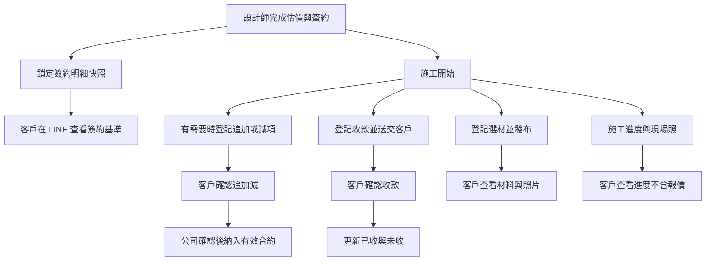
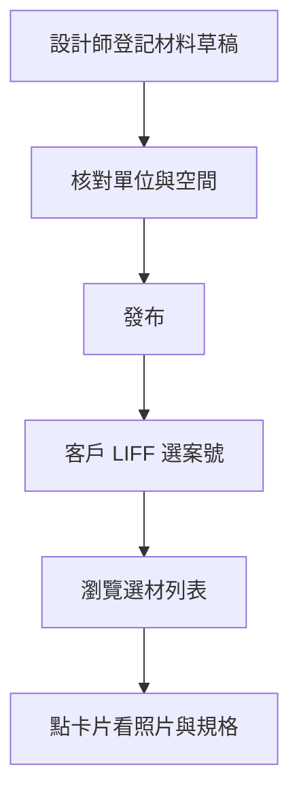

# 未來開發事項（Backlog）

> **用途**：記錄方向與待做想法；**不是**完整計劃書。細節開工再寫進對應 SPEC。  
> **維護**：新想法只寫幾句；開工後移入編號 SPEC，並從本檔「待做」拿掉。  
> **命名慣例**：與 [`00_開發憲法.md`](00_開發憲法.md) 一致—先更新 [`專案全域資料字典.md`](專案全域資料字典.md) 再寫程式。

## 項目總覽（2026-07-23）

### 未完／一半（本檔待做）

| 狀態 | 項 | 一句話 |
|------|----|--------|
| **一半** | LINE 傳圖 → 廠商夾＋快審 | 已停自動請款（靜默）；**未做**自動存廠商夾、快審分類 UI |
| **一半** | 我的案場（選材／簽約／兩層導覽） | 收款確認已有；**追加減不放收款頁**（§2.1）；**未做**四卡片殼、簽約／追加減核對專頁、簽約快照、選材 |
| **一半** | **客人自助綁定＋裝修案會員 Rich Menu** | 主路徑＝申請→**待審核**→通過才換會員選單（可多案）；**未做**申請頁、審核頁、狀態欄、自動換選單、六格圖稿（見 §4）；會員六格文案／預設選單／驗證／掃碼＝**特助已定**（§4） |
| **一半** | 個人假勤全覽（特休） | **MVP 已完成**（2026-07-23）：個人頁年度統計、給額試算、明細列表；**Phase B 待做**年底處置 UI、核准即時重算（見 SPEC 17 §4.8） |
| **未完** | 列表暫存（H3） | 3 天暫存易看舊單；尚未拍板縮短 TTL |
| **未完** | 冒煙測完清假單 | 流程建議；無自動清完保證 |
| **未完** | 零用金請款 | 僅規格，無頁面／後端；**勿用已廢棄 payee 名冊** |
| **未完** | 訂編案號對照最終去留 | 暫留表不開頁；待拍板廢／改靠案場 |
| **未完** | 待匯款頁重複「新增」 | 與請款頁雙入口；之後可併 |
| **未完** | §13「一案綁定」修訂 | 規格書本體仍過時（附錄已註；綁定主路徑改見 §4） |

### 已完成（已移出待辦，勿再排）

| 項 | 去向 |
|----|------|
| 主檔空白頁收斂＋LINE 併廠商欄＋狀態輔助可刪 | SPEC 15 v1.10、VENDOR_LINE_BINDING v1.2、LOG 2026-07-18 |
| 舊頁直連（payees／approve／docs／compose） | 轉址殼；選單已拿掉舊卡 |
| 廠商 Drive 路徑（`~裝潢建材廠商／工種／廠商`） | SPEC 22、`accounting-gas` SPEC／LOG 2026-07-16 |
| H1 一般員工請款／款項進度 | SPEC 15 |
| H2 毛利明細網頁可改／刪 | 檢測報告 2026-07-11 |
| LINE 傳圖停自動請款（靜默） | 現行行為；**快審仍屬上方「一半」** |
| SPEC 15／薪資說明對齊 | SPEC 15 v1.8 |
| 多檔試算表併回會計主檔 | 程式指向主檔；部署搬檔與舊檔封存已確認（2026-07-23） |
| 靜態資源版本號不一致 | `modules/accounting` 及相關頁 `?v=` 已統一至各檔最高版（2026-07-23） |

**Changelog（精簡）**

| 日期 | 摘要 |
|------|------|
| 2026-07-23 | **特助定案（總監可改）**：①確認後「提出異議」＝**可再開洽談**（已確定入帳後客人不可自助異議）；②會員六格定稿＝收款／簽約追加減核對／我的案場／施工進度／綁定新專案／了解添心；③自助驗證＝**甲＋一律待審**；④掃碼乙＝仍須 ≥4 審核；⑤未綁定預設＝**四格**；⑥Phase 1 最小可上線範圍寫死（§4.7／§4.8） |
| 2026-07-23 | **§2.1 核對狀態流＋驗收**：客人可見洽談中；三態＝洽談中→客戶已確認→已確定；整單簽＋一鍵勾選；異議規則見同日「特助定案」條 |
| 2026-07-23 | **§4 綁定審核已拍板**：放置＝**獨立小頁（方案 C）**；審核／代綁權限 **≥4**（其後同日特助定案補齊選單／驗證／掃碼） |
| 2026-07-23 | **§4 綁定審核頁**：主路徑改「申請→待審核→通過才換會員選單」；駁回維持預設選單可再申請；**推薦**獨立「客戶綁定審核」頁（會計 HUB）；狀態機＋對照表需加 `pending`／`rejected`；（放置／權限後於同日另條拍板） |
| 2026-07-23 | **§2.1 收款≠追加減**：收款確認頁**不承載**追加減（正式產品決策）；未來「簽約單＝追加減」專頁做品項核對驗收／問題改進／備註；會員待補格候選標「簽約／追加減核對」；與「我的案場」變更卡對齊 |
| 2026-07-23 | **§4 客人自助綁定**：主路徑改「客人申請綁定」（可多案）；內部代綁改後備（其後同日特助定案寫死六格／驗證） |
| 2026-07-23 | 多檔試算表併回會計主檔標記完成；靜態資源 `?v=` 全庫統一（accounting_api→41、list_cache→5、hub_ref_cache→2） |
| 2026-07-18 | 記待辦：稽核／互動／附件／Gemini 併回會計主檔（減開檔） |
| 2026-07-18 | 主檔收斂拍板入檔；舊頁轉址；收款帳戶／費用分類廢棄 |
| 2026-07-18 | 頂部總覽：已完成移出；未完／一半列表；刪冗餘 Changelog |
| 2026-07-12 | 個人假勤全覽、LINE 快審方向入檔 |
| 2026-07-11 | H1／H2／停自動請款／Drive 方向拍板（後者 7/16 已實作） |
| 2026-07-06 | 總監拍板 B：我的案場 IA／Phase |

---

## 大方向（細節）

### 0. 多檔試算表併回會計主檔｜已完成（2026-07-23）

**痛點**：每次動作另開稽核等檔太慢。

**已做（程式）**：
- `getAuditSpreadsheetId`／`getCommsSpreadsheetId`／`getAttachmentSpreadsheetId` → **優先會計主檔**
- 主檔確保分頁：稽核紀錄、互動紀錄、附件索引、Gemini使用紀錄、Gemini額度彙總
- 首次 bootstrap（≥4）從舊独立檔**搬一次**（目標分頁尚空才搬）
- 操作稽核**不要步步寫**：略過 view_list／view_detail／login_ok／client_*／bootstrap

**部署後（2026-07-23 已確認完成）**：
1. 財務 ≥4 開一次會計選單（觸發搬檔＋LINE 綁定遷移）✓
2. 確認主檔新分頁有資料後，舊「會計操作稽核／廠商互動／單據附件」档案可封存（先別刪到確認無誤）✓

### 0.1 部署後：LINE 綁定遷移（必記）

部署 accounting-gas 後，**財務權限 ≥4 第一次開會計選單**時，會把舊分頁「廠商LINE綁定」還在用的資料，搬進廠商兩欄 `line_ids_accounting`／`line_ids_official`。確認名冊 LINE 還在後，才可刪「廠商LINE綁定」分頁。

### 1. LINE 傳圖 → 廠商夾＋快審分類｜一半

- **已做**：只傳圖不建單、不核對卡；請款走網頁；`#請款` 僅開入口。  
- **未做**：自動存進 `~裝潢建材廠商／{工種}／{廠商}`；快審（廢棄／請款／報價／出貨／其他）；AI 建議分類。  
- **不做**：恢復「傳圖即 OCR 自動建請款」。

### 2. 客戶「我的案場」選材／簽約／兩層導覽｜一半

- **已做**：B5 收款確認 LIFF（客戶頁追加減區塊已隱藏，與 §2.1 一致）；員工可預覽客戶頁。  
- **未做**：首屏四卡片、**簽約／追加減核對專頁**（§2.1）、簽約快照、選材表、減項預設收合等（見下方附錄；已拍板未實作）。  
- **入口前提**：客人如何綁到案號 → **以 §4 客人自助為主**（申請後須**內部審核通過**才算有效綁定；內部代綁為後備）；會員 Rich Menu「收款確認」只對準**收款**；「變更／追加減」對準核對驗收體驗（§2.1），**不**塞進收款確認。

### 2.1 簽約單／追加減核對（與收款分離）｜產品決策（2026-07-23）

> **狀態**：**核對範圍／狀態流／驗收方式已拍板**；專頁與核對 UX **尚未實作**。客戶收款頁已隱藏追加減＝與此決策一致（正式分離，**不是**暫時藏）。

#### 決策（已決）

| 項目 | 內容 |
|------|------|
| **收款確認頁不承載追加減** | 「收款確認」只做付款確認。追加減／簽約變更**不**放在同一頁上下堆疊。 |
| **與客戶 UI 一致** | 客戶頁已隱藏追加減區塊；升級為**正式產品方針＝分離**，日後也不應再把追加減塞回收款頁。 |
| **「我的案場」四卡片對齊** | 首屏四卡＝**簽約｜變更｜收款｜選材**。「變更／追加減」走**核對驗收體驗**（本節未來專頁或變更第二層）；**收款**卡只進收款確認。 |
| **核對範圍** | 客人**可以看到還沒談妥的內容**（洽談中亦可見明細）；須經**客戶確認並寫入系統**，才變成「確定項目」。不是「只給看已核准」。 |
| **驗收方式** | **整單簽一次**＋**一鍵勾選**全部品項（已決；不做「逐項各簽一次」）。 |

#### 未來能力（待開工）

客戶（或已綁定之裝修案會員）可在**專屬頁／專區**看到「**簽約單＝追加減**」（現場語意：簽約後變更單當可核對的合約附件），並可進行：

1. **品項核對驗收**（整單簽＋一鍵勾選，見下方狀態流）  
2. **問題改進**  
3. **備註**

#### 核對狀態流（白話｜已拍板作法）

> **設計原則**：客人可先看到「還在談」的清單，但畫面必須清楚標出**尚未定案**，避免誤以為已報價定案或已入帳。  
> **與現有追加減狀態對齊**：客人側三態是產品語意；入帳仍以「公司確認後才計入有效合約」為準（現場語意＝**已確定／已核准入帳**）。

```
內部開出／討論變更
        ↓
【1 洽談中】客人可見明細（標籤：洽談中・尚未定案）
        ↓  客人整單簽名一次 ＋ 一鍵勾選全部品項
        ↓  （確認前可填「問題改進／備註」）
【2 客戶已確認】系統記下：確認時間、簽名、勾選結果
        ↓  公司依客戶確認結果落實
【3 已確定】正式入系統為確定工項（計入有效合約／已核准入帳）
```

| 階段（客人看到的標籤） | 白話 | 客人可做什麼 | 是否算「確定項目」 | 對齊現有追加減（開發用） |
|------------------------|------|--------------|--------------------|--------------------------|
| **1. 洽談中** | 內部開出或討論中的追加減／變更；客人**可看明細** | 看清單、填問題改進／備註；**尚未**完成整單確認 | **否**（未定案） | 對應「已開放給客人看、尚未完成客戶確認」的列（含草案公開給客人看的作法；實作時對齊現行狀態機，勿讓未確認列計入有效合約） |
| **2. 客戶已確認** | 客人已整單簽＋一鍵勾選完成 | 預設**鎖定**內容與備註（見下方）；等待公司落實 | **客戶側已定**；尚未入帳 | 對齊：客戶確認內容／簽名完成 → 等公司確認（現行 `customer_signed`／`pending_company` 語意） |
| **3. 已確定** | 公司依客戶確認結果正式入系統 | 唯讀為主；下載／查閱已定案變更 | **是**（已入帳） | 對齊：`company_confirmed`（公司確認、計入有效合約；現場常稱「已核准」） |

**驗收動作（已決）**

| 動作 | 規則 |
|------|------|
| **整單簽一次** | 同一張變更單／核對單只簽一次，涵蓋當次清單全部品項 |
| **一鍵勾選** | 提供「全部勾選／核對完成」；完成後系統記錄勾選結果（與簽名、確認時間一併留存） |
| **系統必記** | 確認時間、簽名、勾選結果（稽核可追溯） |

**「問題改進／備註」與「提出異議」規則（特助決定・總監可改）**

| 時機 | 作法 | 理由（一句） |
|------|------|--------------|
| **確認前**（仍在洽談中） | 客人可自由填寫／修改「問題改進」「備註」 | 談的過程本來就會改口，要能寫下來。 |
| **客戶已確認**（尚未公司入帳） | 內容預設**鎖定**；客人可按「**提出異議**」→ 該單回到**洽談中**，重新走整單簽＋一鍵勾選；公司側必留：異議時間、原確認簽名／勾選留痕 | 裝修常在「先簽再說」後才發現漏項／尺寸不符，一律鎖死會逼現場改走作廢重開，更亂。 |
| **已確定（公司確認入帳）** | 客人**不可**自助異議；若要改，由內部作廢／再開新變更單 | 已入帳＝合約效力起算；客人自助重開會把帳與毛利打亂。 |

> **已定**：採「**可調（可異議重開洽談）**」，但**僅限「客戶已確認」階段**；不是確認後永遠可改，也不是一律鎖死。

**UI 防呆（必做｜舉手）**

- 凡狀態＝**洽談中**：列表與明細頂部須有清楚狀態標籤（建議文案：**「洽談中・尚未定案」**；可用次要色，勿用「成功綠」）。  
- 金額旁可加一句提示：「此為討論中內容，確認並經公司落實後才算確定項目。」  
- **已確定**才可用「已定案／已入帳」語意；勿讓洽談中外觀長得像已簽約報價單。

#### 與會員 Rich Menu 的關係

- 會員六格文案**已定稿**（見 §4.4）；其中一格＝**「簽約／追加減核對」**，導向本節專頁（未上線前可先導「我的案場 → 變更」或「即將開放」占位頁）。  
- **收款確認**與**簽約／追加減核對**分開佔格、分開導向，勿混成同一頁。

#### 仍可調（非阻擋開工）

1. 洽談中要不要推播提醒客人「有新的討論中變更」（實作排程再定；預設 Phase 2 再做）。  
2. 若總監日後改成「客戶已確認後亦不可異議」→ 改本節上表即可。

### 3. 個人假勤全覽（含特休）｜MVP 已完成（2026-07-23）

- **已做**：個人頁「年度統計」分頁（`leave_year_stats_panel.js`）；曆年快取、給額自動試算＋覆寫、剩餘、補休／加班／遲早退、各月小計、特休逐筆明細、夜間 06:00 重算。  
- **人事維護**：試算表 `假勤年度統計` 欄位 `yearEndDisposition*`（保留／折現）；員工主檔 `特休給額覆寫`。  
- **Phase B 待做**：年底處置選擇 UI（12/15 截止提醒）、假勤核准事件即時重算、折現串薪資。  
- **離職**：週年制結算仍由人事人工處理，不併入個人曆年頁。  
- 規格：[`17_個人薪資出勤頁計劃書.md`](17_個人薪資出勤頁計劃書.md) §4.8。

### 4. 客人自助綁定專案＋裝修案會員 Rich Menu｜規格草案（2026-07-23）

> **狀態**：**特助定案已寫死**（總監可改）—驗證甲＋一律待審、掃碼乙仍須 ≥4 審、會員六格／預設四格文案、Phase 1 最小範圍。審核頁＝**獨立小頁（方案 C）**；審核／代綁權限 **≥4**。  
> **官方 LINE**：`@uis9604v`（同一帳號服務客人與內部）。  
> **取代說法**：先前以「內部人員幫綁」為**主流程**之敘述，改為 **客人自助申請綁定＝主路徑**；內部代綁**保留為後備**。  
> **關鍵防呆**：**未審核通過前不可換會員選單**；待審／已駁回都不算「有效綁定」。

#### 4.1 客人視角（主路徑）

```
客人加官方 LINE（@uis9604v）
        ↓
未綁定：看到「預設 Rich Menu」→ 點「申請綁定專案」
        ↓
開「客人申請綁定頁」（缺口：需新建）→ 填案號＋本人資料送出
        ↓
進入「待審核」（寫入對照表，狀態＝待審）→ 客人仍看預設選單（或已是會員則維持會員選單）
        ↓
內部在「綁定審核頁」核准／駁回
        ↓
【通過】對照表改為已通過 → 若此 LINE 尚無其他有效綁定，才換成「裝修案會員專屬 Rich Menu」
【駁回】對照表改為已駁回 → 維持預設選單（若無其他有效綁定）→ 客人可再申請
        ↓
可再點「綁定新專案」重複申請 → 同一 LINE 綁多案（下拉切案沿用現況；新案同樣要審）
```

| 步驟 | 白話 | 備註 |
|------|------|------|
| 1 | 加公司官方 LINE | `@uis9604v` |
| 2 | 點「申請綁定專案」 | **可重複**；每通過一次多綁一案 |
| 3 | 送出申請 → **待審核** | **不換**會員選單；客人應看到「已送出、等候審核」 |
| 4 | 內部核准後才進會員選單 | 見 §4.3；選單六格見 §4.4；**僅在「至少一筆已通過」時掛上** |
| 5 | 之後要加案 | 會員選單點「綁定新專案」（同一申請頁；新案仍走待審） |

**與舊說法差異**：不再是「客人填完就立刻換會員選單」；中間多了**內部審核**一步。

#### 4.2 內部代綁（後備／內部）

| 項目 | 決定 |
|------|------|
| 是否保留 | **保留**（現場、財務、客人手機不熟、驗證失敗時由內部補綁） |
| 現況入口 | 會計「追加減與收款管理」單案詳情的「客戶綁定」分頁；案場更新頁（NewSiteForm）也可幫綁 |
| 現況能力 | 搜尋顧客列表或貼 LINE 編號 → **直接寫入已通過**（現行無待審）；可多案；可解除 |
| 與審核頁關係 | **代綁＝後備捷徑**（可跳過待審直接生效）；**審核頁＝自助申請佇列**（見 §4.9）。兩者可並存，勿混成同一 UX |
| 權限 | **客人自助＝無員工權限**。**內部代綁／審核＝員工權限 ≥4（已拍板）**。現行程式門檻偏鬆（`client_portal_bind` 約 ≥2）→ 開工時改對齊 **≥4** |

#### 4.3 Rich Menu 切換規則

| 狀態 | 客人看到的選單 | 何時切換 |
|------|----------------|----------|
| **沒有任何「已通過」綁定**（含：未申請、僅待審、僅駁回、全部已解除） | **預設 Rich Menu（四格，§4.3.1）** | 加好友後的預設；或最後一筆有效綁定解除後 |
| **至少一筆「已通過」綁定** | **裝修案會員專屬 Rich Menu**（六格，§4.4） | **審核通過當下**（或內部代綁寫入已通過當下）自動掛上；之後再綁新案**不必換選單** |
| **全部已通過都解除** | 退回預設 Rich Menu | 內部解除最後一筆有效綁定時 |

**硬規則**：`待審核`／`已駁回` **不觸發**換會員選單；客人頁 API 也**不可**因待審／駁回而放出該案資料。

##### 4.3.1 未綁定預設 Rich Menu（特助決定・總監可改）

> **理由**：未綁定客人還不能進案場／收款；選單只要「把人導去申請」＋「認識公司」，格數少、好畫圖。

| 格 | 文案 | 導向 |
|----|------|------|
| 1 | **申請綁定專案** | 客人申請綁定頁（§4.5） |
| 2 | **了解添心** | `https://info.tanxin.space/modules/info/LandingPage.html` |
| 3 | **常見問題** | 既有 FAQ／官網常見問答頁（與舊客戶三欄 FAQ 同源即可；若無獨立頁則暫同落地頁錨點） |
| 4 | **聯絡客服** | 開官方 LINE 聊天室（或公司對外聯絡頁）；讓還沒綁案的人也找得到人 |

**現況差距（實作前必知）**

- 後端已有「客戶版選單 ID」設定位，舊客戶選單為三欄（施工進度／網站／FAQ），**與本節六格會員選單／四格預設選單不同**，需重做圖稿與熱區。  
- 綁定成功時**尚未**自動把會員選單掛到該客人身上；全員同步選單也**未**涵蓋客戶桶。  
- **缺口**：預設選單 vs 會員選單兩套 ID、**審核通過／解除**時的自動掛／卸邏輯。  
- **缺口**：對照表**需加審核狀態**（見 §4.10）；現行只有 `active`／`revoked`。

#### 4.4 裝修案會員 Rich Menu（六格文案｜特助決定・總監可改）

> **理由**：對齊「收款 ≠ 追加減核對 ≠ 案場殼」；施工進度沿用既有唯讀頁；綁定新專案／了解添心為固定入口。

| 格 | 文案 | 導向 |
|----|------|------|
| 1 | **收款確認** | 既有客戶**收款**確認流程；**不含**追加減（§2.1） |
| 2 | **簽約／追加減核對** | §2.1 專頁；未上線前 →「即將開放」占位，或暫導「我的案場 → 變更」（殼未上線則占位） |
| 3 | **我的案場** | 「我的案場」四卡片殼（簽約｜變更｜收款｜選材）；殼未上線前 → 占位或暫導收款頁＋說明 |
| 4 | **施工進度** | 既有 `client-construction-progress.html`（唯讀；**不顯示金額**） |
| 5 | **綁定新專案** | 與「申請綁定專案」**同一頁**（客人申請綁定頁） |
| 6 | **了解添心** | `https://info.tanxin.space/modules/info/LandingPage.html` |

> **收款確認**與**簽約／追加減核對**必須分開佔格、分開導向。附錄先前「Rich Menu 一個主入口」→ **會員期改為本表六格**。

#### 4.5 客人申請綁定頁（缺口＋驗證方案｜特助決定）

**缺口**：目前**沒有**給客人自己填的「申請綁定專案」頁；只有內部幫綁介面＋客人看資料的案場頁。  
→ 規格標註：**需新建客人申請綁定頁**（LIFF，開在官方 LINE 內，才能拿到客人自己的 LINE 編號）。

**既有資料結構（方案必須靠這些，勿另造主檔）**

| 白話 | 程式對照 |
|------|----------|
| 客人↔案號對照表（可多案、可解除） | `ClientPortalAccess`（`project_no`、`customer_line_user_id`、`status`、`bound_by_user_id`…） |
| 寫入／解除綁定（現行＝員工呼叫；**立刻 active**） | `client_portal_bind`／`client_portal_revoke` |
| 官方顧客名冊（名稱、UID、案號可「、」多案） | 顧客列表 |
| 客人看收款（追加減已決策不放同頁；核對專頁見 §2.1） | `customer-finance-portal.html`（現況）；未來核對頁另訂 |
| 內部幫綁 UI（共用） | `customer_finance_bind.js` → `designer-customer-finance.html`「客戶綁定」分頁、`NewSiteForm.html` 綁定區 |
| 會計 HUB 入口 | `modules/accounting/index.html`「追加減與收款」卡（頁門檻 ≥2）；**新卡「客戶綁定審核」門檻 ≥4** |

**身分核對（特助決定・總監可改）**

| 方案 | 作法 | 本回合定案 |
|------|------|------------|
| **甲 案號＋姓名（可選末四碼）** | 客人填**案號**＋**姓名**；可選填**手機末四碼**加強對。與顧客列表／案場客戶名比對通過後，才允許「送出待審」 | **主路徑採甲當預篩** |
| **乙 現場／合約掃碼** | 內部產本案專用 QR／連結；客人用自己的 LINE 打開即帶入案號並送出申請 | **Phase 2 加做**；見下方掃碼規則 |
| **丙 一律內部審核** | 送出 → **待審核** → ≥4 核准才「已通過」並換選單 | **一律必審**（含甲通過、含乙掃碼成功） |

**已定組合**：**甲（預篩）＋丙（一律待審）**。  
**理由**：案號＋姓名擋掉明顯亂填；末四碼可選、降低姓名暱稱卡關；但裝修現場常見「家人代申請／姓名不完全一致」，最終仍要人眼過一關，不可甲過就直通會員。

**簽約掃碼（乙）預設（特助決定・總監可改）**

| 項目 | 決定 |
|------|------|
| 掃碼成功後 | **仍寫入待審核**，須 **≥4 審核通過**才換選單／開案 |
| 審核體驗 | 掃碼進來的待審列可標「掃碼申請」；審核者可一鍵核准（預填已齊） |
| 不做 | 掃碼直通「已通過」（免審）— 與「QR 可能被轉傳／截圖」風險不符 |
| 內部急需當下綁好 | 改走 **代綁後備**（≥4 直寫已通過），不要把免審塞進掃碼 |

**申請防呆（開工前必做｜特助決定）**

| 規則 | 決定 | 理由 |
|------|------|------|
| 同一 LINE＋同一案號已有 `pending` | **禁止重送**；畫面顯示「已送出、等候審核」 | 避免佇列重複 |
| 同一 LINE＋同一案號已 `active` | **禁止再申請**；提示「已綁定」 | 免重複列 |
| 同一 LINE＋同一案號曾 `rejected` | **允許再申請**（新一筆 pending） | 駁回後可改正再來 |
| 姓名比對 | 去空白後**全等**（大小寫不敏感）；對不上則不可送出，文案引導「請用合約／名冊上的姓名，或請設計師代綁」 | 先嚴後寬；暱稱案走代綁 |
| 末四碼 | **選填**；有填才驗；未填不擋送出 | 降低卡關、仍給願意填的人加一層 |

**推薦落地**：主路徑＝**丙＋甲**；簽約日可加 **乙**（仍待審）。內部代綁（§4.2）直寫「已通過」。

#### 4.6 權限分界（已拍板）

| 誰 | 做什麼 | 權限 |
|----|--------|------|
| **客人** | 自助申請綁定、看自己**已通過**的案、確認收款等 | **無員工權限**；只靠自己的 LINE 身分＋對照表 |
| **員工（審核）** | 看待審佇列、核准／駁回 | **≥4（已拍板）** |
| **員工（內部代綁／解除）** | 代綁、解除 | **≥4（已拍板）**；現行程式約 ≥2 → 開工時改對齊 |

**HUB 卡片可見性（特助決定・開工前必做）**：會計選單「客戶綁定審核」卡 **僅 ≥4 可見**；「追加減與收款」維持現行門檻（約 ≥2）。避免權限文案「審核 ≥4」與「HUB 人人看得到審核卡」打架。

#### 4.7 落地 Phase（自助為主｜特助決定 Phase 1 範圍）

| Phase | 做什麼 | 不做什麼 | 驗收（白話） |
|-------|--------|----------|--------------|
| **0 規格拍板** | 本檔特助定案＋總監同意／微調 | — | 驗證／選單文案／Phase 1 邊界無「待拍板」 |
| **1 最小可上線** | 見下方「Phase 1 清單」 | 見下方「Phase 1 不做」 | 客人能申請→待審→≥4 通過→換會員選單；駁回不換；可多案再申請 |
| **2 六格齊備＋案場對齊** | 核對專頁（§2.1）、我的案場四卡殼、掃碼乙、選材、§13 修訂、待審推播 | — | 六格皆有真實導向；收款與核對分離可走完 |

**Phase 1 做（最小可上線）**

1. 客人申請綁定頁（甲：案號＋姓名，可選末四碼）→ 只寫 `pending`  
2. `ClientPortalAccess` 加 `pending`／`rejected`；讀案／換選單**只認** `active`  
3. 獨立「客戶綁定審核」小頁（方案 C）＋會計 HUB 一卡（≥4）  
4. 審核核准／駁回 API；代綁／解鎖門檻改 **≥4**  
5. **兩套 Rich Menu ID**：預設四格＋會員六格圖稿／熱區；通過才掛、全解除才卸  
6. 會員六格：**收款確認／綁定新專案／了解添心／施工進度**走真實頁；**簽約／追加減核對**與**我的案場**可先「即將開放」占位（文案已定死，勿再 XXXX）  
7. 申請成功／待審中畫面文案（「已送出、等候審核」）

**Phase 1 不做**

- 簽約／追加減核對完整 UX（整單簽、一鍵勾選、異議）→ **Phase 2**  
- 「我的案場」四卡片殼、簽約快照、選材 → **Phase 2／附錄 Phase A**  
- 掃碼乙、待審 LINE 推播、洽談中變更推播  
- 兩個官方帳號分開；未綁定／待審就開放查案；甲過就直通免審  
- 本輪**不部署**收款頁隱藏（程式已做；部署另排）

**不做（全期仍禁）**：未審就換會員選單；收款頁再塞追加減。

#### 4.8 已定／特助決定（原待拍板清單）

1. ~~審核頁放哪~~ → **已拍板：方案 C（獨立小頁）**（見 §4.9）  
2. ~~誰有權審／代綁~~ → **已拍板：≥4**  
3. ~~方案乙掃碼後是否仍要審~~ → **特助決定：仍須 ≥4 審核**（掃碼只當預填／標註來源；急需用代綁）  
4. ~~會員三格待補文案~~ → **特助決定**：格2 **簽約／追加減核對**；格3 **我的案場**；格4 **施工進度**（見 §4.4）  
5. ~~未綁定預設選單~~ → **特助決定：四格**＝申請綁定專案｜了解添心｜常見問題｜聯絡客服（見 §4.3.1）  
6. ~~追加減核對範圍／整單簽 vs 逐項勾~~ → **已拍板**：見 §2.1  
7. ~~確認後提出異議~~ → **特助決定：客戶已確認可異議重開；已確定入帳後不可自助異議**（見 §2.1）  
8. ~~Phase 1 範圍~~ → **特助決定**：見 §4.7  

#### 4.9 審核頁放置（已拍板｜方案 C）

> **已拍板（2026-07-23）**：採 **方案 C**——**獨立小頁「客戶綁定審核」**，由會計 HUB 一卡進入（可深連結）；審核／代綁權限 **≥4**。單案「客戶綁定」分頁**保留作代綁後備**，不作主審核佇列。

**現況適合掛「待審核綁定」的入口（調查摘要｜決策依據留檔）**

| 現況位置 | 白話 | 適不適合當「主審核佇列」 |
|----------|------|---------------------------|
| 會計「追加減與收款管理」→ 單案「客戶綁定」分頁 | 財務／行政已在用的幫綁區 | **弱**：要先選案才進得去；審核本質是**跨案佇列**，不該藏在單案裡 → **保留代綁，不作主佇列** |
| 案場更新頁（NewSiteForm）綁定區 | 現場設計師更新案場時可幫綁 | **弱作主佇列**：偏單案、現場捷徑 |
| 會計 HUB（`index.html`） | 已有「追加減與收款」卡；可再加一卡 | **已採**：掛獨立審核小頁 |
| pending／審核相關既有頁 | 追加減「待客戶確認」、收款「待審」等 | **無關**：那是費用／收款狀態，不是客戶綁定 |

**方案對照（已決採 C；A／B 僅備查）**

| 方案 | 放哪 | 誰會用 | 權限 | 結論 |
|------|------|--------|------|------|
| A | 「追加減與收款管理」列表加「待審綁定」區塊 | 財務／行政 | 審核可另鎖 ≥4 | **未採**（審核與追加減 CRUD 混頁） |
| B | 案場更新頁加「本案待審」 | 現場設計師 | ≥3 或 ≥4 | **未採**（跨案佇列差） |
| **C（已拍板）** | **獨立小頁「客戶綁定審核」**，會計 HUB 一卡進入 | 財務／行政／總監指定審核者 | **≥4（已拍板）** | **採用** |

**為何採 C（白話｜留檔）**

1. 審核是「誰申請了還沒過」的**整批佇列**，不是「先點進某一案再找綁定」。  
2. 現行「客戶綁定」分頁在**單案詳情**裡，適合**代綁後備**，不適合當主審核台。  
3. 獨立頁才能把審核權限穩穩設成 ≥4，又不牽連日常追加減頁（≥2）。  
4. 與「客人填完就換選單」切割清楚：**申請頁（客人）→ 審核頁（員工）→ 通過才換選單**。

#### 4.10 綁定狀態機（白話＋程式缺口）

| 白話狀態 | 建議寫入 `status` | 客人能否看該案 | 是否換會員選單 | 現況 |
|----------|-------------------|----------------|----------------|------|
| **待審核** | `pending` | 否 | 否 | **缺口：需加**（現行 `client_portal_bind` 只寫 `active`） |
| **已通過** | `active` | 是 | 若為該 LINE 第一筆已通過 → 是 | 現行有 |
| **已駁回** | `rejected` | 否 | 否（無其他已通過則維持預設） | **缺口：需加**；駁回後允許同一 LINE＋案號再申請 |
| **已解除** | `revoked` | 否 | 若為最後一筆已通過被解除 → 卸回預設 | 現行有 |

**API／讀取規則（開工必守）**

- 客人自助送出 → 只可建立／更新為 `pending`（不可直寫 `active`）。  
- 審核通過 → `pending`→`active`，並觸發換選單判斷。  
- 審核駁回 → `pending`→`rejected`；**不**掛會員選單。  
- 內部代綁 → 可直寫 `active`（後備捷徑）。  
- 所有「有效綁定」判斷（LIFF 讀案、換選單）**只認 `active`**；`pending`／`rejected`／`revoked` 一律不算。  
- **需加**：審核用 action（例如列出待審、approve、reject）與（建議）待審通知；現行無 pending API。  
- **需加（開工前｜特助決定）**：申請列建議欄位 `apply_source`（`form`／`qr`）、`applicant_name`、`applicant_phone_last4`（可空）、`reviewed_by`／`reviewed_at`／`reject_reason`，方便審核頁顯示與稽核。

---

## 待開發（短想法｜未完）

### 列表暫存（H3｜尚未拍板）

多人同時審／匯時，3 天暫存易看舊單。  
**建議**：先縮短暫存（數分鐘級）＋「重新載入」講清楚。

### 冒煙測完清假單

測完立刻清；不要在每次讀試算表加清理。工具清不完 → 餘下人工刪。

---

## 想法／待排（可晚｜未完）

| 項 | 一句話 |
|----|--------|
| 零用金請款 | 只有規格、還沒做頁面與後端；用不到就先擱。 |
| 舊頁仍可直連網址 | 選單多半藏了；一般人碰不到，整理時再下架。 |
| 待匯款頁重複「新增」 | 與統一請款頁雙入口；之後可併回請款頁。 |

---

## 附錄：選材與客戶案場（2026-07-06 拍板細節）

> **狀態**：已決策（總監選 **B**），**尚未實作**。以下為當日拍板全文，供開工時對照；新想法請寫上方短條，勿在此再長篇加計劃。

### 入口與多案

| 決策 | 內容 |
|------|------|
| 多案綁定 | 一 LINE 可綁多案，下拉切案（**以 B5 實作為準**） |
| 綁定主路徑 | **客人自助申請**（可重複綁多案）→ **待審核** → **通過才有效**；驗證＝**甲（案號＋姓名，可選末四碼）＋一律待審**；掃碼乙＝仍須 ≥4 審；內部代綁＝**後備**（見 **§4**）；審核頁＝**獨立小頁方案 C**、權限 **≥4**（§4.9 已拍板） |
| 主入口（案場內容） | 單一 LIFF「**我的案場**」殼層仍成立（首屏摘要＋卡片） |
| 會員 Rich Menu | **審核通過（至少一筆已通過）後**改掛**六格會員選單**（收款確認｜簽約／追加減核對｜我的案場｜施工進度｜綁定新專案｜了解添心）；**待審／駁回不換選單**。**收款確認不含追加減**；核對見 §2.1 |
| §13 對照 | [13_客戶端唯讀施工進度規格書.md](./13_客戶端唯讀施工進度規格書.md) 之「一案綁定／僅內部綁」**已過時**；以 B5／§4／本 backlog 為準 → **§13 本體待修訂** |

### 客戶第一眼 IA（兩層導覽，非五 tab 橫排）

| 區塊 | 內容 |
|------|------|
| 固定標頭 | **案號＋工地名**固定顯示 |
| 待辦橫幅 | 「**待您處理**」（有才出現） |
| 一行金額 | 有效合約 · 已收 · 未收；有減項時加「**已含簽約後變更，淨額如上**」 |
| 四張大卡片 | **簽約｜變更｜收款｜選材** — 點卡片進第二層明細（非分頁列橫排）。**變更／追加減**＝核對驗收體驗（§2.1），**不是**塞進收款確認；**收款**卡只進付款確認 |
| 施工進度 | Phase A **不硬併殼**；Phase B 併殼或維持深連結 `client-construction-progress.html` |

### 減項 UX

- 簽約原列**永遠保留不刪**
- 減項列表**預設收合**（`hide_reductions` 預設 `true`）
- 摘要含淨額＋「**另有 N 項變更可查看**」
- **減少範圍**須與加項同等**客戶確認／簽認**流程

### 簽約快照

| 項目 | 決策 |
|------|------|
| 凍結時點 | **訂金／頭期確認後、開工前**；設計師按「**發布給客戶**」才凍結 `ContractBaselineItems` |
| 簽約 PDF | 同時上傳至 Drive **`{案號}/合約`**；無 PDF 須掃描或註明「以紙本為準」 |
| 客戶看單價 | Phase A：**項次＋小計**；單價可選隱藏（**預設可先只秀小計**，待總監日後改） |

### Phase 步序

| 步序 | 內容 |
|------|------|
| **A-1** | 摘要、兩層導覽、減項預設收合、列表改卡片（擴充現有 `customer-finance-portal`） |
| **A-2** | 簽約快照表＋簽約明細分頁 |
| **A-3** | 選材表＋Drive `{案號}/選材`；發布前與簽約不一致 → **黃燈警示** |
| **B** | 施工進度併殼（Phase A 深連結）；選材照 2 年 sweep；追加減 PDF |

### 保留政策（分流）

| 資料 | 政策 |
|------|------|
| 選材 Drive 照 | 結案後 **2 年**（**預設日曆年**；730 天若未另決，以日曆年為準） |
| 合約 PDF、追加減簽認、收款紀錄 | **長期保留**，不與選材照同刪 |

### 擱置／往後

- 施工進度 Phase A 不硬併殼
- 選材工項逐列自動對照 → Phase B
- 2 年自動刪照排程**不擋主線**

---

## 選材表與客戶可見案場資料（整合規格）

> **狀態**：未實作（2026-07-05 總監指示；2026-07-06 **總監拍板 B** 定稿 IA／快照／Phase 步序；細節見上方「總監拍板決策」）  
> **參照模式**：案件毛利 B5「追加減與收款收據」（[`21.案件毛利擴充與薪資連動.MD`](21.案件毛利擴充與薪資連動.MD) §B5；已部署 Phase A）  
> **既有客戶頁**：`customer-finance-portal.html`（**收款確認**；追加減區塊已隱藏，正式方針＝與收款分離，見 §2.1）、`client-construction-progress.html`（施工進度，**不顯示金額**）

### 一句話

施工期間由公司登記材料、簽約基準與追加減／收款，客戶綁定 LINE 後在**同一 LIFF「我的案場」**依案號查閱（**首屏摘要＋四張大卡片**進入簽約／變更／收款／選材；減項預設隱藏但原簽約列不刪）。

### 使用情境（白話）

| 誰 | 什麼時候 | 要做什麼 |
|----|----------|----------|
| 設計師／工務 | 材料下單、進場、定案時 | 登記品名、品牌、規格、數量、單位、使用空間或工項 |
| 客戶 | 想確認「客廳地板用哪一款」「主浴磁磚色號」 | 開 LINE 入口 → 選案號 → 看選材清單（唯讀） |
| 財務／BOSS | 對帳、客訴 | 內部頁依案號查完整紀錄與變更軌跡 |

**不在本期**：客戶自行新增材料、與廠商請款 OCR 自動帶入、與驗收表工項自動連動（可列 Phase B）。

---

### A. 頁面整合（總監拍板：兩層導覽）

> **總監原話**：「是否應該合併在同一頁面？」→ **已決**：合併同一 LIFF，**兩層導覽**（非五 tab 橫排）。

#### 決策結論

| 方案 | 評估 |
|------|------|
| **合併＋兩層導覽（採用）** | 同一客戶、同一案號、同一 `ClientPortalAccess` 綁定；案場內容進同一 LIFF「我的案場」。會員期 Rich Menu 為**六格**（§4），非「整張只有一個按鈕」。首屏四張大卡片，點入第二層明細。 |
| 五 tab 橫排 | **不採** — 手機易擠、不符合「第一眼摘要＋大卡片」 |
| 分開多個 LIFF | 客戶易混淆；綁定與案號下拉重複維護。**不採** |

**理由（裝修實務）**

- 客戶心裡是一個「我的案場」：簽了什麼、後來改了什麼、付了多少、現場用了什麼材料，應在同一個地方查。
- **第一眼**：案號＋工地名、待辦橫幅、一行金額、四卡片 — 不必先選分頁。
- **一屏一事**：第二層各區只回答一個問題（簽約明細、變更／追加減核對、收款、選材卡片）。
- **主從分明**：金額主線（簽約 → 追加減 → 收款）與施工透明（選材、施工照）分開，但入口同一個；**追加減核對與收款確認分頁／分卡**，不上下堆同一收款頁（§2.1）。
- **合併殼 ≠ 混功能**：「我的案場」可同一殼，但收款卡／會員「收款確認」格**不承載**追加減。

#### 建議資訊架構（IA）

**客戶 LIFF 殼層**（擴充現有 `customer-finance-portal.html`，**共用**案號下拉與 LINE 驗證）：

```
[我的案場]  ← 頁面標題
[案號下拉 · 742 ○○路]  ← 案號＋工地名固定顯示；沿用 B5 #projectSelect
[待您處理橫幅]  ← 有待確認追加減／收款時才出現
[有效合約 $X · 已收 $Y · 未收 $Z]  ← 有減項時加「已含簽約後變更，淨額如上」
[四張大卡片 — 首屏]
  ┌────────┐ ┌────────┐ ┌────────┐ ┌────────┐
  │  簽約  │ │  變更  │ │  收款  │ │  選材  │
  └────────┘ └────────┘ └────────┘ └────────┘
[點卡片 → 第二層明細 — 一屏一事]
  （施工進度 → Phase A 深連結 client-construction-progress；Phase B 併殼）
```

| 卡片／第二層 | 回答什麼 | 預設顯示 | 資料來源（概要） |
|--------------|----------|----------|------------------|
| **首屏摘要** | 這案現在合約多少、已收多少、還差多少 | **客戶開啟時預設此畫面** | B5 `customer_finance_summary`；減項收合時加「另有 N 項變更可查看」 |
| **簽約** | 當初簽約的工項與金額基準 | 原簽約列＋合計；項次＋小計（單價預設可隱藏） | 見 §B `ContractBaselineItems` |
| **變更** | 簽約後改了什麼；**核對驗收體驗**（品項核對／問題改進／備註，§2.1） | **現行有效清單**；減項預設收合（§C）；**不**塞進收款確認 | B5 `ContractAdjustments`；未來核對專頁 |
| **收款** | 付了多少、待確認哪些 | 已確認＋待您確認 | B5 `CustomerReceipts` |
| **選材** | 現場定了哪些材料 | 已定案材料卡片 | `MaterialSelections` |
| **施工進度** | 施工到哪、現場紀錄 | Phase A：**深連結**；Phase B 同殼或連結 | project-console；**不顯示報價金額**（對齊 [13](./13_客戶端唯讀施工進度規格書.md)；§13 一案綁定待修訂） |

**內部設計師頁**（擴充 `designer-customer-finance.html` 或並列入口）：

- 列表 → 案號 → 分頁：**追加減｜收款｜簽約基準｜選材｜稽核｜客戶綁定**
- 與毛利頁 `project_margin.html` 仍為**摘要＋連結**，CRUD 不在毛利頁。

#### human-comfortable 預設與文案

| 情境 | 怎麼做 |
|------|--------|
| 客戶第一次開啟 | **首屏摘要**：案號＋工地名、一行「有效合約 $X · 已收 $Y · 未收 $Z」；有減項時「已含簽約後變更，淨額如上」＋「另有 N 項變更可查看」 |
| 待辦橫幅 | 有待確認追加減或收款時顯示「待您處理」 |
| 變更（第二層） | 預設只列**加項**與**淨額摘要**；底部折疊「顯示減項與變更紀錄」（**預設收合**） |
| 簽約（第二層） | 永遠保留原簽約列；**項次＋小計**（單價 Phase A 預設可隱藏） |
| 選材（第二層） | 維持卡片列表；與金額區視覺區隔 |
| 單頁殼層 | 狀態紀錄只掛外層一次；第二層不重複掛 |

**一鍵切換文案（建議）**

| 位置 | 關閉（預設） | 開啟 |
|------|--------------|------|
| 客戶變更（第二層） | 「目前顯示現行有效清單」 | 「顯示減項與變更紀錄」 |
| 客戶簽約（第二層） | （原列照常顯示） | 減項列旁標「減項 · 原項目見簽約」 |
| 內部設計師頁 | 同客戶預設；另提供「預覽客戶畫面」開關 | 切換後等同客戶可見 DTO |

---

### B. 簽約單與估價明細

> **總監原話**：「也可以加入簽約單、簽約的估價單明細」

#### 資料來源（對照 codebase）

| 資料 | 現有位置 | 客戶可見規格 |
|------|----------|--------------|
| **簽約基準總額** | 毛利 meta `contract_amount`；自動值來自 project-console `margin_quotation_summary` → Firebase `quotations/{案號}` 工項加總 | 摘要分頁顯示「簽約基準 $X」；若與有效合約不同，加一行「含追加減後 $Y」 |
| **估價／驗收工項明細** | Firebase `quotations/{案號}` → `context.items[]`（`name`、`zone`、`work_type`、`quantity`、`unit`、`price` 等）；內部經 `SiteReportAcceptance.js` 加總 | **新建**客戶 API：後端讀取後 **DTO 白名單** 下發；需 **快照凍結**（見下） |
| **簽約單 PDF** | 現無統一欄位；實務可能存 Drive 案號資料夾或紙本掃描 | **已決**：上傳 Drive **`{案號}/合約`**；`contract_pdf_urls`（`;` 分隔）；無 PDF 須掃描或註明「以紙本為準」 |
| **追加減正式文件** | B5 Phase B 待辦「追加減 PDF 匯出」 | 變更第二層：已生效者可「下載追加協議」（**Phase B**）；**長期保留**，不與選材照同刪 |

#### 快照凍結（為什麼需要）

- 驗收表／Firebase 工項**施工期仍會改**（審核器可更新 `items`）；客戶看到的「當初簽約明細」不能跟著現場版 drift。
- **已決凍結時點**：**訂金／頭期確認後、開工前**；設計師按「**發布給客戶**」時，將 `items` 複製至毛利試算表 **`ContractBaselineItems`**，之後客戶端**只讀快照**。
- 欄位對齊：`baseline_item_id`、`project_no`、`item_no`、`item_name`、`space_label`（`zone`）、`unit`、`quantity`、`unit_price`、`total_price`、`work_type`；`frozen_at`、`frozen_by`。

#### 客戶可見欄位（簽約明細分頁）

| 顯示（人話） | 來源 | 備註 |
|--------------|------|------|
| 項次 | `item_no` | |
| 項目 | `item_name` | |
| 空間 | `space_label` | |
| 數量、單位 | `quantity`、`unit` | |
| 小計 | `total_price` | **Phase A 預設顯示**；項次＋小計 |
| 單價 | `unit_price` | **可選隱藏**（預設可先只秀小計，待總監日後改） |
| 簽約基準合計 | Σ 快照列 | 應對齊 `contract_amount`（容許四捨五入差，差異顯示黃燈給內部） |
| 簽約文件 | `contract_pdf_urls` | Drive `{案號}/合約`；有則顯示「查看簽約 PDF」 |

**不顯示**：內部備註、`audit_remark`、廠商成本、毛利、草稿工項、`cancelled` 列。

#### 與選材表的關係

| 面向 | 簽約明細 | 選材表 |
|------|----------|--------|
| **時點** | 簽約／估價定案（基準） | 施工中材料定案 |
| **內容** | 工項與合約金額（做什麼、多少錢） | 品牌、色號、規格、照片（用哪一款） |
| **連動** | Phase A **不自動**逐列對照；Phase B 可選 `linked_baseline_item_id` | A-3 發布前與簽約不一致 → **黃燈警示**（內部） |
| **客戶理解** | 「我當初簽了什麼」 | 「現場實際用哪個型号」 |

**裝修實務**：客戶常問「簽約寫 A 款、現場怎麼 B 款」— 簽約明細保留原列，變更走追加減或選材更正（作廢＋新建），**不能讓客戶以為沒簽過**。

#### 建議 API（開工時登錄資料字典）

| 白話 | 程式對照（開發用） |
|------|-------------------|
| 鎖定簽約快照 | `margin_contract_baseline_freeze` |
| 客戶讀簽約明細 | `margin_contract_baseline_portal_list` |
| 內部讀／重凍結 | `margin_contract_baseline_detail`（重凍結需 ≥ 主管） |

---

### C. 追加減項 UX 規則（總監核心要求）

> **總監原話**  
> - 簽約後也可能修改，先前有做追加減  
> - 減少原有東西時**不能刪掉**，加項和減項**並存**  
> - **一鍵隱藏**，**預設隱藏減項**

#### 規則摘要

| # | 規則 | 白話 |
|---|------|------|
| 1 | **減項不刪原列** | 客戶簽約明細裡的工項列**永久保留**；要減少時**另建減項列**（負數金額），或作廢錯誤追加減後新建，但**不刪** `ContractBaselineItems` 原列 |
| 2 | **加減並存** | 畫面上可同時看到「原簽約 $10,000」與「減項 −$2,000」；有效合約由後端加總 |
| 3 | **預設隱藏減項** | 客戶變更第二層預設**不顯示** `total_price < 0` 且已生效之列；`hide_reductions` **預設 `true`** |
| 4 | **一鍵展開** | 客戶與內部皆有 toggle；首屏摘要顯示「另有 N 項變更可查看」 |
| 5 | **減項同等確認** | **減少範圍**須與加項同等**客戶確認／簽認**流程（沿用 B5 兩階段） |
| 6 | **對簽約列減項要指回來源** | 新欄 `offsets_baseline_item_id`（可空）；純簽約後新增工項的追加，不填 |

#### 與 B5 現況對照

| B5 已有 | 本規格擴充 |
|---------|------------|
| `total_price` 正＝追加、負＝減項 | **沿用** |
| `void` 不刪列、`replaces_adjustment_id` 留痕 | **沿用**；對簽約基準減項時改填 `offsets_baseline_item_id` |
| 客戶 API 過濾 `draft`／`void` | **沿用**；再加 `hide_reductions=true`（**預設**） |
| `draft_only` 確認後不可改 | **沿用** |
| 狀態機至 `company_confirmed` 才計入 `adjustments_net` | **沿用** |
| 客戶 LIFF 曾追加減與收款同頁上下堆疊 | **產品決策（2026-07-23）**：收款頁**不承載**追加減（已隱藏；正式分離）。變更／追加減走**簽約／追加減核對**體驗（§2.1）＋「我的案場」變更卡；Phase A-1 兩層導覽時亦勿再塞回收款頁 |

**是否新建狀態？** 不必。減項仍是 `ContractAdjustments` 列、`total_price < 0`；僅新增關聯欄與前端篩選。若減項指向簽約列，原列在**簽約明細**分頁顯示，不在追加減分頁重複刪除。

#### 設計師操作（內部）

1. **純追加**（新工項）：與現行 B5 相同，新增草稿 → 送交客戶。
2. **對原簽約減項**：在追加減表選「對應簽約項次」→ 系統帶出項目名 → 填減少數量／金額（存負 `total_price`）→ **不修改** `ContractBaselineItems`。
3. **更正錯誤追加減**：作廢原列（`void`）＋新建（`replaces_adjustment_id`）；**仍不動**簽約快照。

#### 客戶端顯示邏輯

```
預設（hide_reductions=true）：
  變更第二層 → 只顯示 total_price >= 0 且非 void 的列 ＋ 待確認項
  首屏摘要 → effective_contract（已含減項淨額）＋「另有 N 項變更可查看」

展開「顯示減項與變更紀錄」：
  變更第二層 → 另列減項（紅字、標「減項」）
  簽約第二層 → 原列仍在；若有 offsets 連結，減項列顯示「對應項次 N」
```

#### 白話驗收

- [ ] 客戶**預設只看到現行有效清單**（加項＋待確認）；展開後才看到減項與完整變更紀錄。
- [ ] 對某簽約工項做減項後，**簽約明細仍看得到原項目**；客戶不會以為「沒簽過這項」。
- [ ] 隱藏減項時，**摘要的有效合約額仍正確**（後端已扣減項）。
- [ ] 內部頁可一鍵切換「客戶預覽模式」，與客戶 DTO 一致。
- [ ] 作廢列不 silent 消失；展開紀錄時可見「已作廢」標示（**待總監確認**：客戶可見 vs 僅內部稽核）

#### 建議欄位擴充（`ContractAdjustments`）

| 欄位 | 說明 |
|------|------|
| `offsets_baseline_item_id` | 可空；減少**原簽約**某列時指向 `ContractBaselineItems.baseline_item_id` |
| `display_group` | 可選；同一次變更包的加減列可同組，方便 UI 摺疊 |

API：`margin_customer_finance_portal_data` 增加 query／body `hide_reductions`（預設 `true`）。

---

### D. 收款、選材、照片與簽約 — 整體關係

#### 白話流程圖



| 白話（圖上） | 程式對照（開發用） |
|--------------|-------------------|
| 設計師完成估價與簽約 | Firebase `quotations/{案號}`；毛利 `contract_amount` |
| 鎖定簽約明細快照 | `margin_contract_baseline_freeze` → `ContractBaselineItems` |
| 客戶在 LINE 查看簽約基準 | `margin_contract_baseline_portal_list`；LIFF 簽約明細分頁 |
| 登記選材並發布 | `margin_material_create`／`publish` → `MaterialSelections` |
| 客戶查看材料與照片 | `margin_material_portal_list`；Drive `{案號}/選材` |
| 登記追加或減項 | `margin_adjustment_create` → `ContractAdjustments` |
| 客戶確認追加減 | `margin_adjustment_customer_confirm_content`／`customer_sign` |
| 公司確認後納入有效合約 | `margin_adjustment_company_confirm`；重算 `effective_contract` |
| 登記收款並送交客戶 | `margin_receipt_create`／`submit` → `CustomerReceipts` |
| 客戶確認收款 | `margin_receipt_customer_confirm_stage1`／`stage2` |
| 更新已收與未收 | `customer_finance_summary.receipts_confirmed_total`／`outstanding` |
| 施工進度與現場照 | `client-construction-progress.html`；`page=project` |
| 客戶查看進度不含報價 | [13](./13_客戶端唯讀施工進度規格書.md) DTO 剝除 `price` |
| 案號綁定與切換 | `client_portal_bind`；`cfVerifyCustomerProjectAccess_` |
| 結案後選材照片保留 | `materialSelectionRetentionSweep_`；`photos_purged_at` |

#### 模組關係（一表看懂）

| 客戶想問 | 分頁 | 主表／來源 | 與其他模組 |
|----------|------|-----------|------------|
| 當初簽多少？ | 簽約明細 | `ContractBaselineItems` 快照 | 總額對齊 `contract_amount` |
| 後來改了什麼？ | 追加減 | `ContractAdjustments` | ±`adjustments_net` → `effective_contract` |
| 付了多少？ | 收款 | `CustomerReceipts` | → `receipts_confirmed_total` |
| 現在還差多少？ | 摘要 | 即時計算 | `outstanding` |
| 地板用哪一款？ | 選材 | `MaterialSelections` | 與簽約工項可選連結，Phase A 不強制 |
| 施工到哪？ | 施工進度 | Firebase 工項完成度＋日誌 | **不顯示金額** |
| 現場照片？ | 選材詳情／施工進度 | Drive 選材夾／施工回報 | 選材照 `{案號}/選材`；施工照 `{logId}` |

---

### 與「收款紀錄」（B5 收款收據）對照

| 面向 | 收款收據（已實作） | 選材表（建議） |
|------|-------------------|----------------|
| **業務目的** | 記錄客戶付款、雙方確認金額 | 記錄施工選用材料、供客戶查閱透明 |
| **主實體** | `CustomerReceipts` 工作表 | 新建 `MaterialSelections` 工作表（同毛利試算表） |
| **案號分配** | 每列 `project_no`；`ClientPortalAccess` 綁 LINE↔案 | **相同**：一列一材料、必帶案號 |
| **多案支援** | 顧客列表「專案編號／專案號碼」可「、」分隔多案；LIFF 下拉切案 | **已決沿用** B5 多案綁定與切案 UX |
| **客戶可見** | `customer-finance-portal.html`；DTO 白名單 | **擴充同 LIFF「我的案場」**：兩層導覽四卡片；與簽約／變更／收款**同一入口**（§A）；**唯讀**為主 |
| **客戶操作** | 兩階段確認收款（①②）；**追加減不在收款頁**（§2.1） | **Phase A 建議僅瀏覽收款**；追加減／變更核對驗收另頁（§2.1：洽談中可見；整單簽＋一鍵勾選；問題改進／備註）；若需「已知悉」可 Phase B 再加輕量確認 |
| **內部 CRUD** | `designer-customer-finance.html` | 擴充分頁「選材」＋「簽約基準」；或 `designer-material-selection.html` 併入同案詳情 |
| **狀態機** | draft → … → customer_confirmed（複雜） | **簡化**：`draft`／`published`（客戶可見）／`void` |
| **稽核** | `CustomerFinanceAudit` | 共用稽核表或 `MaterialSelectionAudit`（格式同 B5 audit 列） |
| **待辦／推播** | ReplyQueue + `CustomerFinanceTodos` | Phase A 可不做；材料定案可 Phase B 推播「新材料已更新」 |
| **權限** | 客戶僅綁定案；設計師 ≥3 CRUD | **相同** |
| **後端模組** | `accounting-gas/master/CustomerFinanceModule.js` | 新模組 `MaterialSelectionModule.js` 或擴充同檔 |
| **API 前綴** | `margin_receipt_*`、`margin_customer_finance_*` | 建議 `margin_material_*`（與 WebApp 路由同 B5 群組） |
| **毛利頁摘要** | 有效合約／已收／未收 | 可選：案場詳情加「選材 N 筆」連結（Phase B） |

#### 程式對照（開發用）

| 白話 | 收款收據（現有） | 選材表（建議） |
|------|------------------|----------------|
| 客戶開 LINE 看資料 | `margin_customer_finance_portal_data` | 同殼多 action：`margin_material_portal_list`、`margin_contract_baseline_portal_list` |
| 設計師列表總覽 | `margin_customer_finance_overview` | `margin_material_overview` |
| 單案詳情 CRUD | `margin_customer_finance_detail` | `margin_material_detail` |
| 新增一筆 | `margin_receipt_create` | `margin_material_create` |
| 上傳照片 | （B5 轉帳證明前端直寫 URL） | `margin_material_upload_photo` → Drive `{案號}/選材` |
| 綁定客戶 LINE | `client_portal_bind` | **沿用**，不另建綁定表 |
| 驗證客戶能否看此案 | `cfVerifyCustomerProjectAccess_` | **沿用** |

---

### 建議資料欄位

> 試算表表頭用 **snake_case**（對齊 B5、`專案全域資料字典` §8）。  
> **畫面與客戶文案一律寫「案號」**；後端試算表欄位名 `project_no` 與 B5 相同（會計毛利模組慣例；新功能開工前應在資料字典 **§9 選材表** 正式登錄）。

| 欄位（試算表） | 客戶可見 | 資料格式 | 說明 |
|----------------|----------|----------|------|
| `selection_id` | ❌ | String | 主鍵 UUID |
| `project_no` | ✅（顯示為案號） | String | 關聯案場；對照顧客列表「專案編號／專案號碼」 |
| `item_no` | ✅ | Number | 同案自動編號（1, 2, 3…） |
| `material_name` | ✅ | String | 材料名稱（白話品名，如「超耐磨地板」「矽酸鈣板」） |
| `brand` | ✅ | String | 品牌（如 Panasonic、麗仕、特定磁磚系列） |
| `spec` | ✅ | String | 規格（厚度、色號、尺寸、型號） |
| `quantity` | ✅ | Number | 數量 |
| `unit` | ✅ | String | 單位（見下方工種單位防呆） |
| `space_label` | ✅ | String | 使用空間（客餐廳、主臥、次臥1、全室…） |
| `trade_category` | ✅ | String | 工項大類（保護、拆除、水電、泥作、木作、系統櫃、油漆、地板…） |
| `selected_at` | ✅ | String | 選定／定案日期（Asia/Taipei `yyyy-MM-dd`） |
| `status` | 內部全狀態；客戶只看 published | String | `draft`／`published`／`void` |
| `note` | 內部備註可選隱藏 | String | 備註（客戶可見版與內部版 Phase B 可拆 `note_internal`） |
| `drive_file_ids` | ❌ | String | Google Drive 檔案 ID，**逗號分隔**（對齊 project-console `Drive檔案ID列表`；供期滿刪檔與權限管理） |
| `photo_urls` | ✅（未過期時） | String | 客戶可開之 Drive 檢視連結，**分號 `;` 分隔**（對齊出勤申訴 `attachmentUrls`、收支 `savePhotosToFolder_` 回傳格式） |
| `photos_purged_at` | ❌ | String | 照片已依保留政策清除之時間（ISO）；有值時客戶端不顯示 `photo_urls` |
| `created_by` | ❌ | String | 登記人 userId |
| `created_at` / `updated_at` | ❌ | String | ISO 時間 |
| `voided_at` | ❌ | String | 作廢時間 |
| `replaces_selection_id` | ❌ | String | 更正時指向被取代列（留痕不刪列） |

**與顧客列表對照**

- 試算表：`project-console` 回報試算表分頁 **`顧客列表`**
- 關鍵欄：`UID`、`GID`、`名稱`、**`專案編號`**（相容 **`專案號碼`**）
- 多案：案號以 **`、`** 分隔寫入同一格；綁定時 `client_portal_bind` 可同步追加（B5 Phase B 已實作）

**與案場資料對照**

- 案場主檔欄位 **`案號`**（§1）為唯一專案編號；選材表 `project_no` 必須與其字串一致（如 `742`）

**試算表如何記照片（對照現有模式）**

| 模式 | 現有程式 | 選材表建議 |
|------|----------|------------|
| 上傳 | Base64 → `folder.createFile` → `ANYONE_WITH_LINK` 檢視 | **相同**（複用 `savePhotosToFolder_` 精神；模組內 `ensureMaterialSelectionFolder_`） |
| 連結格式 | `https://drive.google.com/file/d/{id}/view` | **相同** |
| 檔案 ID 列表 | project-console 佇列欄 `Drive檔案ID列表`（逗號） | 試算表欄 `drive_file_ids`（逗號） |
| 多張 URL 串接 | 出勤申訴 `attachmentUrls`（`;`） | 試算表欄 `photo_urls`（`;`） |
| 收款轉帳證明 | B5 `transfer_proof_urls`（字串；前端上傳後寫入） | 選材不走單據年月夾；改走**案號／選材**（見下節） |
| 附件索引（可選 Phase B） | `MasterSchema.attachment`：`drive_file_id`＋`drive_url` | `source_type=material_selection`；`entity_id=selection_id` |

---

### 照片存放（Google Drive · 總監 2026-07-06）

**一句話**：選材照片存 **Google 雲端硬碟**，放在該案 **案件資料夾** 底下的 **`選材`** 子資料夾；路徑慣例對齊 project-console 既有案號樹狀結構。

#### 路徑慣例（對齊 codebase）

現有 project-console 在 `DRIVE_TEMP_FOLDER_ID`（Script Property）根目錄下，以 **`{案號}`** 為第一層（見 `drive_handler.js`、`FirebaseHandler.js`）；施工回報再建 **`{LogID}`** 第二層。Dropbox 平行路徑為 `/添心設計/設計圖/{project}/施工照`（`dropbox_api.js`），**選材表不走 Dropbox**。

**建議 Drive 目錄樹**（與 LogID 資料夾**同層**，不巢狀在單次日誌下）：

```
{DRIVE_TEMP_FOLDER_ID 根}
└── {project_no}                 ← 與施工回報／Firebase 搬運相同「案號」第一層
    ├── {logId}                  ← 既有：施工回報暫存
    ├── 合約                     ← 簽約 PDF（**已決**；長期保留，不與選材照同刪）
    └── 選材                     ← 本功能專用（結案後 2 年 sweep）
        └── {selection_id}_{n}.jpg
```

| 項目 | 建議 |
|------|------|
| 根資料夾 | `PropertiesService.getScriptProperties().getProperty('DRIVE_TEMP_FOLDER_ID')`（與 project-console 共用） |
| 案號第一層 | `project_no` 字串（與案場主檔 `案號` 一致，如 `742`） |
| 選材子資料夾 | 固定名稱 **`選材`**（繁體；勿與 `施工照` 混用） |
| 分享權限 | 上傳後 `ANYONE_WITH_LINK` 檢視（對齊 `savePhotosToFolder_`、`_normalizeAndOpenDriveLinksCsv_`） |
| 上傳 API | 設計師頁 Base64 → `margin_material_upload_photo`（建議）；後端寫入上述路徑並回傳 `drive_file_ids`＋`photo_urls` |

**內部頁**：可提供「在雲端硬碟開啟選材資料夾」連結（`https://drive.google.com/drive/folders/{folderId}`），資料夾 ID 可快取於案號層（對齊廠商 `drive_folder_id` 模式）。

---

### 保留政策與自動刪除（總監 2026-07-06）

> **總監原話**：「僅保存至結案後的 2 年後自動刪除？」  
> **已決**：**僅選材 Drive 照**以案場 **`結案日`** 起算保留 **2 個日曆年**（**預設日曆年**；730 天若未另決以日曆年為準），期滿自動刪 Drive 檔案；試算表列保留文字、清空照片欄。  
> **分流**：**合約 PDF、追加減簽認、收款紀錄長期保留**，不與選材照同刪。  
> 2 年 sweep **不擋 Phase A 主線**（Phase B 排程）。

#### 與現有 codebase 對照

| 項目 | 現況 | 選材表 |
|------|------|--------|
| 結案判定 | `isMarginProjectClosed_`：`專案狀態` = **`已結案`**（有 `結案日` 但狀態非已結案**不算**） | **沿用** |
| 結案日來源 | 案場試算表欄 `結案日`（Asia/Taipei `yyyy-MM-dd`） | **沿用**；起算日 = `結案日` 當日 00:00 |
| 類似保留政策 | 員工離職封存 **90 天**（`EmployeeLogic.js`）；**無**「結案後 N 年刪客戶資料」先例 | **選材照**新建 2 年 sweep；**合約 PDF／收款／追加減簽認**長期保留 |
| Drive 刪檔 | `deleteDriveFilesByUrls_`／`Drive.Files.trash`（`ProjectLogic.js`） | 期滿時依 `drive_file_ids` 批次 trash |
| 試算表列 | B5 作廢留列、稽核不 silent 刪 | **不刪列**；寫 `photos_purged_at`、清空 `photo_urls`／`drive_file_ids` |

#### 自動刪除機制（建議）

| 面向 | 建議 |
|------|------|
| **誰執行** | `accounting-gas` 每日時間驅動觸發器（建議函式 `materialSelectionRetentionSweep_`；與 `MaterialSelectionModule.js` 同檔） |
| **掃描對象** | `MaterialSelections` 中 `photos_purged_at` 為空且 `drive_file_ids` 非空；`project_no` 對應案場已結案且 `結案日` + **2 年** ≤ 今天（Asia/Taipei） |
| **刪 Drive** | 是—依 `drive_file_ids` 呼叫 trash；失敗寫稽核、下次重試 |
| **刪試算表列** | **否**（建議）— 材料文字紀錄保留供內部查詢；僅照片欄清空 |
| **稽核** | `MaterialSelectionAudit` 或共用 audit：`action=photos_purged`、`payload_json` 含刪除檔數與 `結案日` |
| **未結案案件** | 照片**不**進入 2 年倒數；施工期間與保固查詢照常 |
| **作廢列** | 隨**全案**期滿一併清除照片（不單獨提前刪，避免稽核斷裂） |

#### 客戶 LIFF 失效時機

| 時點 | 客戶端行為 |
|------|------------|
| 結案前 | 已 `published` 之材料照常顯示照片（見 human-comfortable 載入態） |
| 結案後～滿 2 年 | **照常**顯示（保留政策僅影響雲端檔案生命週期，不關閉 LIFF 入口） |
| 滿 2 年且 sweep 完成 | `margin_material_portal_list` **不回傳** `photo_urls`；卡片仍顯示品名／規格／空間；詳情顯示人話：「照片已超過保留期限，如需查閱請聯絡設計師。」 |
| 綁定與案號 | **不因照片清除而解除** `ClientPortalAccess`；與 B5 相同，僅內容縮減 |

#### 待總監確認（照片保留）

- [x] 2 年是否採**日曆年**（`結案日` 加 2 年同日）或固定 **730 天** → **已決：預設日曆年**
- [ ] 期滿後內部設計師頁是否仍顯示「已清除」佔位圖示，或完全隱藏照片區
- [ ] 是否需結案當下 LINE 推播告知客戶「選材照片將保留 2 年」（Phase B）

#### 待總監確認（頁面整合 · 簽約 · 追加減）

- [x] **LIFF 合併方案** → **已決**：同一 LIFF「我的案場」＋**兩層導覽四卡片**；施工進度 Phase A **深連結**，Phase B 併殼
- [x] **客戶開啟預設畫面** → **已決**：首屏**摘要**（案號＋工地名、待您處理橫幅、一行金額、四卡片）
- [x] **簽約明細快照** → **已決**：**訂金／頭期確認後、開工前**；設計師「發布給客戶」才凍結（BOSS 重凍結待實作時定權限）
- [x] **簽約 PDF** → **已決**：上傳 Drive **`{案號}/合約`**；無 PDF 須掃描或註明以紙本為準
- [x] **收款頁不承載追加減** → **已決（2026-07-23）**：正式分離；變更／追加減走核對驗收（§2.1），不塞收款確認
- [ ] **減項展開時作廢列**：客戶是否看得到「已作廢」追加減，或僅內部稽核可見
- [x] **簽約明細是否顯示單價** → **已決**：Phase A **項次＋小計**；單價可選隱藏（**預設可先只秀小計**）
- [ ] **追加減 PDF**（B5 Phase B）與簽約 PDF 是否同一區塊「文件下載」（Phase B 待排）
- [x] **簽約／追加減核對**：範圍＝客人可見洽談中；驗收＝整單簽＋一鍵勾選；三態見 §2.1（2026-07-23 已拍板）

---

### 客戶端 UI 要點（human-comfortable）

**頁面骨架（已決）**：`[我的案場]` → `[案號＋工地名]` → `[待您處理橫幅]` → `[一行金額]` → `[四張大卡片]` → 點卡片進第二層

| 原則 | 怎麼做 |
|------|--------|
| **兩層導覽** | 首屏四卡片（簽約｜變更｜收款｜選材）；**非**五 tab 橫排。變更＝核對驗收（§2.1），收款＝付款確認，**分開** |
| **一屏一事** | 第二層各區只回答一個問題；列表改卡片，點卡片才進詳情 |
| **四態** | 載入中／空／錯／成功 — 各區獨立四態文案 |
| **人話** | 不顯示 `selection_id`、狀態碼；`published` 顯示「已定案」 |
| **案號切換** | 沿用 B5 `#projectSelect`；一 LINE 多案下拉切案 |
| **單頁殼層** | 狀態紀錄只掛外層一次 |
| **手機** | 卡片全寬、觸控區 ≥44px；照片可點大圖 |
| **減項摘要** | 首屏「另有 N 項變更可查看」；變更第二層預設收合 |
| **照片載入／過期** | 同 §選材表既有規格；過期人話不顯示 Drive ID |

---

### 裝修實務防呆（tianxin-design-assistant）

依 [`company_renovation_standards.md`](../.agents/skills/tianxin-design-assistant/resources/company_renovation_standards.md) 與 [`專案全域資料字典.md`](專案全域資料字典.md)：

1. **單位必須對工項**
   - 地坪／天花板：**坪** 或 **才**（1 才 = 30.3×30.3 cm；36 才 ≈ 1 坪）
   - 櫃體延長、軌道、包管：**尺**（台尺，1 尺 ≈ 30.3 cm）
   - 無法拆尺寸的雜項（保護、粗清、局部修補）：**式**
   - 窗簾布料：**才**；窗簾軌道：**尺**（對齊窗簾估價 §7）
   - **禁止**同一列混用「片／箱」却不寫換算；必要時備註欄寫清「1 箱 = N 片」

2. **空間與工項要分開**
   - `space_label` 用公司四大分區邏輯（客餐廳、主臥、次臥、全室）
   - `trade_category` 用估價單工種順序（保護→拆除→水電→…），避免只寫「材料」却與空間對不上

3. **品牌規格要夠施工用**
   - 磁磚／地板：色號 + 尺寸 + 表面（亮／霧）
   - 矽酸鈣板：厚度（如 9mm）+ 品牌（麗仕等）
   - 五金：進口緩衝鉸鏈等級可寫在 `spec`，避免只寫「基本五金」

3a. **選材照片要拍什麼（裝修實務）**
   - **色號／型錄**：磁磚背標、地板樣品標籤、油漆色卡（與 `spec` 色號互相對照）
   - **樣品確認**：送樣板、門片把手實品、檯面石材小样（避免「口頭說 A 款、現場變 B 款」）
   - **現場鋪設確認**：鋪完未填縫／未清場前之局部照（對應 `space_label`；木地板鋪設方向、磁磚對花可入鏡）
   - **不必拍**：與材料無關之施工進度全景（那是施工回報 `施工照` 的範圍）；一筆材料建議 **1～3 張** 重點照，避免洗版

4. **损耗不 silently 改数量**
   - 地磚 ×1.1、木地板 ×1.15 损耗应在 `note` 註明「含损耗」或拆「下單數量／實鋪數量」— Phase B 可加欄

5. **石材、家具不混表**
   - 廚具檯面、石材工程：可標 `trade_category=石材工程`，與系統櫃板材分列
   - 有 `has_furniture_order` 的案：家具選材 Phase B 另表或標 `source=furniture`，不與裝修主表混用（對齊 B5 家具訂單決策）

6. **更正留痕**
   - 客戶已可見後若要改规格：**作廢＋新建**，不直接改 `published` 列（對齊追加減 draft_only 精神）

---

### 建議實作步驟（總監拍板 Phase 步序）

| 步序 | 內容 | 產出 |
|------|------|------|
| **0. 規格定稿** | 本節 §A–§D + 資料字典 §9 選材、§10 簽約基準 | **已完成拍板**（2026-07-06） |
| **A-1** | 摘要、兩層導覽、減項預設收合、列表改卡片（擴充 `customer-finance-portal`） | 客戶首屏＋四卡片＋變更收合 |
| **A-2** | `ContractBaselineItems` 快照表＋簽約第二層；凍結 API；`{案號}/合約` PDF | 設計師可發布、客戶可看簽約 |
| **A-3** | `MaterialSelections`＋Drive `{案號}/選材`；發布前與簽約不一致 → **黃燈** | 選材 CRUD＋客戶卡片 |
| **整合** | 內部頁分頁；`client_portal_bind` 沿用；會計入口卡片 | 與 B5 同一綁定 |
| **B** | 施工進度併殼（A 深連結過渡）；選材照 2 年 `materialSelectionRetentionSweep_`；追加減 PDF | 依總監排程；**sweep 不擋 A 主線** |
| **Phase B 往後** | LINE 推播、選材工項逐列自動對照、损耗雙欄 | 依總監排程 |

#### 後端試算表與 API（跨 A-2／A-3）

| 項目 | 說明 |
|------|------|
| 試算表 | `MaterialSelections`＋`ContractBaselineItems`（＋audit）；`ensureMaterialSelectionSheets_` |
| API | 選材 `margin_material_*`；簽約 `margin_contract_baseline_*`；portal 加 `hide_reductions`（預設 true） |
| 內部前端 | 擴充 `designer-customer-finance.html`；追加減 `offsets_baseline_item_id` |

#### 流程（白話）



| 白話（圖上） | 程式對照（開發用） |
|--------------|-------------------|
| 設計師登記材料草稿 | `margin_material_create`；`status=draft` |
| 核對單位與空間 | 前端驗證 + 工項列舉 |
| 發布 | `margin_material_publish` → `published` |
| 客戶 LIFF 選案號 | `margin_material_portal_list` + `cfVerifyCustomerProjectAccess_` |
| 瀏覽選材列表 | DTO 白名單欄位 |
| 點卡片看照片 | 詳情 API 或 list 內嵌 `photo_urls`；過期列不帶 URL |
| 照片存雲端 | `margin_material_upload_photo` → `{案號}/選材` |
| 期滿清照片 | `materialSelectionRetentionSweep_`；`deleteDriveFilesByUrls_` 同精神 |

---

### 驗收清單（白話）

- [ ] （整合）客戶 LIFF 同一案號可從首屏四卡片進入簽約／變更／收款／選材，案號下拉只需選一次
- [ ] 變更第二層預設不顯示減項；首屏顯示「另有 N 項變更可查看」；展開後才看見負數列
- [ ] 對簽約工項做減項後，簽約明細仍保留原列；有效合約額與摘要一致
- [ ] 簽約明細來自快照，Firebase 現場版改動不影響客戶已發布內容
- [ ] 設計師可以針對某案號新增、修改草稿，發布後客戶才看得到
- [ ] 同一客戶 LINE 綁了 742、776 兩案時，下拉可切換，且**看不到**未綁定的案
- [ ] 客戶畫面只顯示人話（品名、品牌、規格、數量、單位、空間、日期），沒有錯誤碼或整包 JSON
- [ ] 載入中、沒資料、連線失敗、成功更新四種狀態都有清楚提示
- [ ] 單位欄有列舉或提示（坪／才／尺／式），與工項大类搭配合理（地板不会默认「式」）
- [ ] 作廢的材料客户端不显示或标「已作废」，历史不 silently 消失
- [ ] 顧客列表有案號但未 `ClientPortalAccess` 绑定时，内部页有黄色警告（沿用 B5）
- [ ] 未绑定客户无法仅凭案号 URL 偷看材料
- [ ] 手機上卡片可读、照片可点开、案号切换不需重新登录
- [ ] 選材照片上傳後出現在 Drive **`{案號}/選材`**，試算表同時有 `drive_file_ids` 與 `photo_urls`
- [ ] 客戶端照片載入失敗有單張重試，不整頁當掉
- [ ] 模擬 `photos_purged_at` 後，客戶仍看得到材料文字，照片區顯示「已超過保留期限」人話（無破圖、無錯誤碼）
- [ ] （整合測試）已結案且結案日超過 2 年之案：`retention_sweep` 會 trash Drive 檔並清空照片欄、寫稽核

---

### 關聯 SPEC／程式（實作時必讀）

| 類型 | 路徑 |
|------|------|
| B5 完整規格 | `CODING/SPEC/21.案件毛利擴充與薪資連動.MD` §B5 |
| 驗收表／簽約工項來源 | Firebase `quotations/{案號}`；`backend/project-console/SiteReportAcceptance.js` |
| 客戶施工進度（不含金額） | `CODING/SPEC/13_客戶端唯讀施工進度規格書.md` |
| 資料字典 | `CODING/SPEC/專案全域資料字典.md` |
| 公司工種／材料標準 | `CODING/.agents/skills/tianxin-design-assistant/resources/company_renovation_standards.md` |
| 後端 B5 模組 | `backend/accounting-gas/master/CustomerFinanceModule.js` |
| Drive 案號樹／刪檔 | `backend/project-console/drive_handler.js`、`ProjectLogic.js`（`deleteDriveFilesByUrls_`） |
| Drive 上傳範本 | `backend/accounting-gas/SheetWriter.js`（`savePhotosToFolder_`） |
| 結案判定 | `backend/accounting-gas/master/MarginModule.js`（`isMarginProjectClosed_`） |
| 後端路由 | `backend/accounting-gas/WebApp.js` |
| 客戶 LIFF 頁 | `CODING/modules/accounting/customer-finance-portal.html` |
| 設計師內部頁 | `CODING/modules/accounting/designer-customer-finance.html` |
| 前端 API | `CODING/shared/js/accounting_api.js` |
| 顧客列表讀取 | `backend/accounting-gas/master/CustomerFinanceModule.js`（`cfSearchOfficialCustomers_`） |
| 多案綁定 | `client_portal_bind`；`backend/project-console/line_reply.js`（`#案號` 指令） |

---

*最後更新：2026-07-23 — 特助定案：異議可調（入帳後不可自助）、會員六格／預設四格文案、甲＋一律待審、掃碼仍須審、Phase 1 最小範圍；§2.1／§4 已對齊。*
