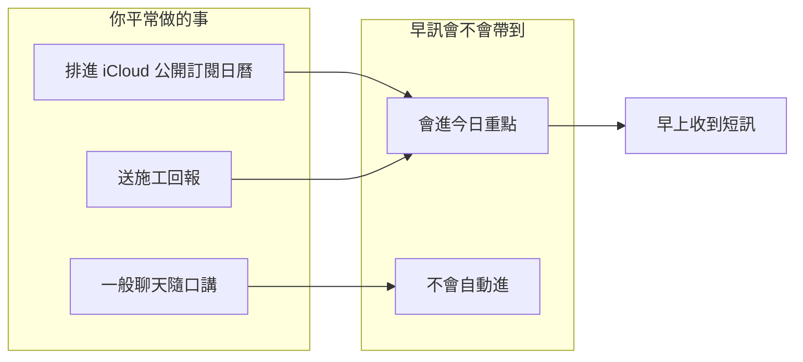

# 每日重點提醒 — 人機計劃（先做：早訊）

**文件版本：** 0.2（2026-08-02）  
**狀態：** 計劃中（先做早訊；隨口記提醒為下一階段）  
**程式細節：** 見同資料夾 [`每日重點提醒_實作備註.md`](每日重點提醒_實作備註.md)

---

## 目標

早上打開訊息，一眼就知道：**今天必做、明天要預留、工地有沒有該盯的**——不用自己翻行事曆、聊天紀錄、施工回報。

---

## 範圍（這一版）

| 做 | 不做（這版） |
| --- | --- |
| 到點自動送「今日重點」短訊 | 自動掃一般 LINE 群舊對話大海撈針 |
| 內容來自：**添心小幫手同一份 iCloud 公開訂閱日曆**＋施工回報（近況） | 另接 Google 日曆當主來源；新建完整網頁（細節用既有每日回報頁） |
| 可送到 Telegram／Email（可再加 LINE） | 強迫人改工作習慣一次到位 |

**人要記住的唯一規則：**  
重要的事 → 寫進（小幫手已訂閱的）行事曆，或走施工回報，或（下一階段）私訊助手說「提醒：…」。  
隨便聊過的群組一句話，**不會**自動進早訊。

---

## 動作流程

### A. 早上收「今日重點」

| 步驟 | 人做什麼 | 畫面呈現 | 結果／下一步 |
| --- | --- | --- | --- |
| 1 開始 | 不用按；到點自動收到 | 一則短訊，標題清楚寫「今日重點」 | — |
| 2 進行中 | 可先掃標題再細看 | 固定四段；沒有就寫「無」 | — |
| 3a 成功 | 看完、該做的去做 | 每條一句話＋時間或案名 | 要細節 → 回關鍵字或開每日回報頁 |
| 3b 失敗 | 看到失敗說明 | 「今日重點暫無法整理，可稍後再要一次」 | 人知道是整理失敗，不是沒行程 |

### B. 想看工地細節時

| 步驟 | 人做什麼 | 畫面呈現 | 結果／下一步 |
| --- | --- | --- | --- |
| 1 開始 | 早訊裡去看工地，或開每日回報頁 | 先出框架／上次摘要；標「更新中」 | — |
| 2 偏久 | 可先看已有摘要 | 仍看得出在更新 | — |
| 3a 成功 | 掃近幾日回報 | 「更新中」消失；重點在上 | 可點某一案看更多 |
| 3b 失敗 | 看說明、再試 | 人話說明；舊摘要能留則留 | 知道卡在載入 |

### C. 隨口記下「明天要記得」（下一階段）

| 步驟 | 人做什麼 | 畫面呈現 | 結果／下一步 |
| --- | --- | --- | --- |
| 1 開始 | 私訊助手：`提醒：明天 A 案驗收` | 立刻回「已記下，會進明早重點」 | — |
| 2 進行中 | 可繼續做事 | 「記下中…」（若需要） | — |
| 3a 成功 | 確認一句即可 | 「已排進明天預告」；可說取消 | 明早出現在對應段落 |
| 3b 失敗 | 看說明 | 「沒記下，請再發一次」 | 可重試 |

---

## 早訊訊息範本（人看到的樣子）

```text
今日重點 · 8/2（日）
狀態：已整理

■ 今天必做
・10:00 客戶看屋（信義）
・下午前回覆冷氣報價

■ 明天預告
・09:30 A 案驗收
・無其他行程

■ 工地相關
・B 案：昨日泥作完成，今日預計放樣
・C 案：缺材料照片，待補

■ 其他
・無

— 回「展開 B」看該案細節；或開每日回報頁 —
```

**空資料時仍要四段，例如：**

```text
■ 今天必做
・無

■ 明天預告
・無

■ 工地相關
・近兩日尚無新回報

■ 其他
・無
```

**整理失敗時：**

```text
今日重點 · 8/2
狀態：整理失敗

今日重點暫無法整理（來源連不上或逾時）。
請稍後跟助手說「再給今日重點」重試一次。
```

**部分來源沒到時（一行狀態說清楚）：**

```text
狀態：已整理（行事曆未連上，僅含工地）
```

---

## 資料從哪來（用人話）



| 你平常怎麼做 | 會不會進明早重點 |
| --- | --- |
| 寫進添心小幫手那份 iCloud 公開訂閱日曆 | 會（今天＋明天） |
| 施工回報有送／案場有記案號 | 會 |
| 跟助手講「提醒：…」（下一階段） | 會 |
| 隨便在一般群聊一句 | 不會 |

---

## 階段

| 順序 | 人得到什麼 | 狀態 |
| --- | --- | --- |
| 1 | 早訊＝iCloud 日曆＋施工回報；可寄 Email／Telegram | **先做**（日曆來源已定） |
| 2 | 私訊「提醒：…」會進明早清單 | 下一階段 |
| 3 | 自動掃一般 LINE 舊對話 | 不做（雜、易錯） |

---

## 自檢

- [x] 主計劃是動作流程，不是程式清單
- [x] 收訊／看工地／隨口記都有開始→進行中→結束
- [x] 失敗有人話、能再試
- [x] 預設是短摘要，不是整表灌爆
- [x] 有訊息範本可對稿

