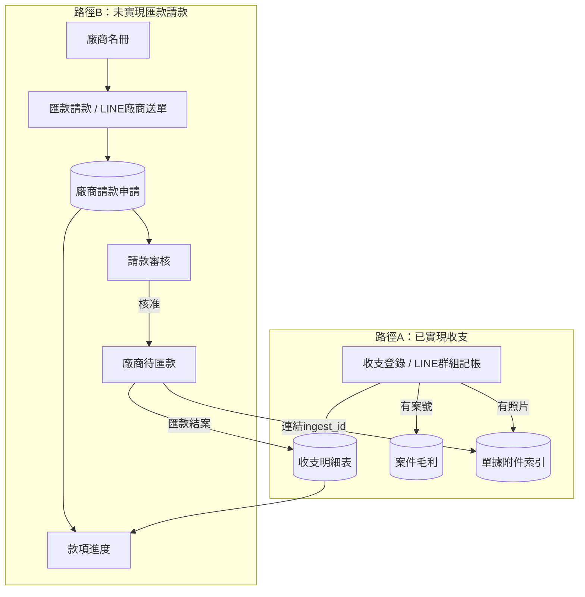
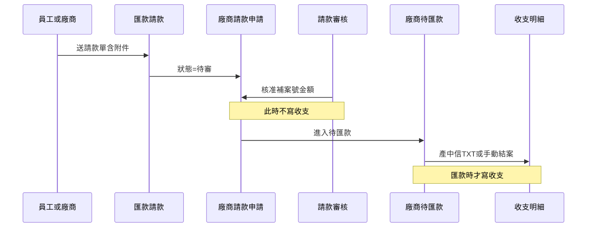

# 添心會計 — 各大項功能與流程串接

## 系統入口


|                                                            | 入口                                                                                                    | 八大模組主選單（截圖畫面）                                                                                         |
| ---------------------------------------------------------- | ----------------------------------------------------------------------------------------------------- | ----------------------------------------------------------------------------------------------------- |
| 群組記帳、廠商 `#請款` 送單（經 `project-console` 轉發至 `accounting-gas`） | 路徑                                                                                                    | 說明                                                                                                    |
| HUB 主控台                                                    | `#/accounting-ingest`、`#/accounting`                                                                  | 權限 ≥4 顯示「收支登錄」「會計功能」兩張卡片（`[CODING/spa/Dashboard.js](d:\Dropbox\CodeBackups\CODING\spa\Dashboard.js)`） |
| 會計功能選單                                                     | `[CODING/modules/accounting/index.html](d:\Dropbox\CodeBackups\CODING\modules\accounting\index.html)` |                                                                                                       |
| LINE                                                       | 官方帳號、進出款項群組                                                                                           |                                                                                                       |


後端統一走 `[accounting-gas](d:\Dropbox\CodeBackups\backend\accounting-gas)`；規格總覽見 `[CODING/SPEC/15_會計系統模組規格書.md](d:\Dropbox\CodeBackups\CODING\SPEC\15_會計系統模組規格書.md)`。

---

## 八大模組功能一覽

### 1. 收支登錄（全員）

- **用途**：記**已發生**的收入或支出（群組／表單）
- **重點**：直接寫收支明細，**不進請款審核**
- **頁面**：`accounting_ingest.html`；HUB 也可直進 `#/accounting-ingest`
- **寫入**：收支明細試算表（`LEDGER_SPREADSHEET_ID`）
- **連動**：有案號 → 自動寫入案件毛利；有照片 → 單據附件索引

### 2. 匯款請款（全員）

- **用途**：錢**還沒付**出去時，選廠商或員工送請款單
- **重點**：建立「待審」請款，等主管核准後才進待匯款
- **頁面**：`payment_request.html`
- **寫入**：會計主檔「廠商請款申請」分頁（`vendor_payment_request`）
- **入口**：靜態頁表單；或 LINE 廠商 `#請款` + 傳圖

### 3. 款項進度（廠商／員工）

- **用途**：查看自己款項的審核與匯款狀態
- **頁面**：`vendor_status.html`
- **資料來源**：合併「廠商請款申請」+「收支明細」（廠商只看自己綁定身分）

### 4. 廠商名冊（財務以上，權限 ≥4）

- **用途**：維護廠商主檔、統編、匯款帳戶、LINE 綁定
- **頁面**：`vendors.html`
- **寫入**：會計主檔「廠商」「廠商LINE綁定」
- **連動**：匯款請款、待匯款選廠商時都依此主檔

### 5. 請款審核（財務以上可見；核准需 ≥5）

- **用途**：審核廠商／員工匯款請款
- **重點**：核准後**只進待匯款，此時不寫收支**
- **頁面**：`ledger_review.html`
- **操作**：核准（補案號、金額）／退回

### 6. 廠商待匯款（財務以上，權限 ≥4）

- **用途**：看待匯款清單、財務直接新增、編輯、產中信 TXT
- **重點**：**匯款結案時才寫收支明細**（同時標記已匯款）
- **頁面**：`vendor_payment_finance.html`
- **捷徑**：財務可用 `vendor_payment_create` 跳過審核直接建待匯款

### 7. 單據附件（進階）（財務以上，權限 ≥4）

- **用途**：依關鍵字或 `ingest_id` 查附件；各頁有照片可燈箱預覽
- **頁面**：`attachments.html`
- **寫入**：單據附件索引試算表（`ATTACHMENT_SPREADSHEET_ID`）
- **連動**：收支登錄、請款送單時上傳的照片都會建索引

### 8. 案件毛利（財務以上，權限 ≥4）

- **用途**：各案收入、支出明細與毛利
- **重點**：記帳有案號會**自動寫入**；也可手動補列
- **頁面**：`project_margin.html`
- **寫入**：案件毛利試算表（`MARGIN_SPREADSHEET_ID`，一案子一分頁）

---

## 核心分流：兩條主流程

系統把款項分成兩類，走不同路：




**一句話區分**：

- **已付／已收** → 收支登錄，直接進帳
- **還沒付** → 匯款請款 → 審核 → 待匯款 → 匯款時才進帳

---

## 請款子流程（路徑 B 細部）




| 步驟    | 模組        | 狀態變化     | 是否寫收支 |
| ----- | --------- | -------- | ----- |
| 1. 送單 | 匯款請款      | 待審       | 否     |
| 2. 核准 | 請款審核（≥5）  | 已審 → 待匯款 | 否     |
| 3. 匯款 | 廠商待匯款（≥4） | 已匯款      | **是** |
| 查進度   | 款項進度      | 全程可查     | —     |


財務捷徑：待匯款頁可直接 `create` 建單，跳過步驟 1–2。

---

## 橫向連動（跨模組資料流）


| 觸發點        | 連動目標        | 條件                          |
| ---------- | ----------- | --------------------------- |
| 收支登錄成功     | 案件毛利        | 有 `project_no`              |
| 收支登錄成功     | 單據附件索引      | 有上傳照片                       |
| 請款送單       | 單據附件索引      | 有 `drive_urls`              |
| 待匯款結案      | 收支明細 + 附件連結 | `export_ctbc` 或 `mark_paid` |
| 待匯款結案      | 案件毛利        | 寫收支時帶案號                     |
| 廠商名冊       | 匯款請款／待匯款    | 選廠商、帶匯款帳戶                   |
| 廠商 LINE 綁定 | 款項進度        | 廠商只看自己的單                    |


---

## 權限門檻摘要


| 操作                 | 最低權限         |
| ------------------ | ------------ |
| 收支登錄、匯款請款          | 全員（LIFF 登入）  |
| 款項進度（廠商）           | 廠商 LINE 綁定身分 |
| 財務功能（名冊、待匯款、附件、毛利） | ≥ 4          |
| 請款核准               | ≥ 5          |
| HUB 會計入口           | ≥ 4          |


---

## 主要資料表對照


| 試算表         | 用途      | 相關模組             |
| ----------- | ------- | ---------------- |
| 收支明細表       | 所有已實現收支 | 收支登錄、待匯款結案       |
| 會計主檔／廠商請款申請 | 請款流程狀態  | 匯款請款、審核、待匯款、款項進度 |
| 會計主檔／廠商     | 廠商主檔    | 廠商名冊             |
| 單據附件索引      | 照片與單據連結 | 單據附件、各頁上傳        |
| 案件毛利明細      | 各案損益    | 案件毛利（自動＋手動）      |


---

## 隱藏／舊版（不在主選單）

- **收款帳戶（舊）** `payees.html` — 已改由待匯款手動輸入或廠商名冊
- **廠商請款審核（舊）** `vendor_payment_approve.html` — 已併入「請款審核」
- **廠商自助登記** `vendor_register.html` — 廠商 LINE 自填主檔，寫入同一張廠商表

---

## 關鍵程式位置（供查閱）

- 選單定義：`[index.html` L33–88](d:\Dropbox\CodeBackups\CODING\modules\accounting\index.html)
- 請款全流程：`[VendorPaymentModule.js](d:\Dropbox\CodeBackups\backend\accounting-gas\master\VendorPaymentModule.js)`
- 記帳後連動（附件、毛利）：`[LedgerPostIngest.js](d:\Dropbox\CodeBackups\backend\accounting-gas\master\LedgerPostIngest.js)`
- 請款規格：`[VENDOR_PAYMENT_REQUEST_SPEC.md](d:\Dropbox\CodeBackups\backend\accounting-gas\SPEC\VENDOR_PAYMENT_REQUEST_SPEC.md)`

---

## 使用者確認：4 → 2 → 5 → 6 是否正確？

**結論：合適。** 這是「未實現匯款請款」的**標準主線**（廠商／員工請款 → 主管審 → 財務匯款）。

| 編號 | 模組 | 在此流程的角色 |
|------|------|----------------|
| **4** | 廠商名冊 | **前置**：先有廠商主檔、統編、匯款帳戶、LINE 綁定 |
| **2** | 匯款請款 | **送單**：建立待審請款（或 LINE 廠商 `#請款` 等同此步） |
| **5** | 請款審核 | **審核**：主管核准 → 進待匯款（此時不寫收支） |
| **6** | 廠商待匯款 | **結案**：產中信 TXT 或手動結案 → **此時才寫收支** |

### 有欠缺嗎？有，但要分「沒進主線」vs「真的漏」

**不在 4→2→5→6 主線內（但系統需要）：**

| 編號 | 模組 | 為何沒排進主線 |
|------|------|----------------|
| **1** | 收支登錄 | **另一條路**：錢已付／已收，直接記帳，不經請款 |
| **3** | 款項進度 | **查詢用**：全程旁路可查，不是操作步驟 |
| **7** | 單據附件 | **橫切功能**：2、1 上傳照片時自動建索引，財務事後查 |
| **8** | 案件毛利 | **彙總結果**：6 或 1 寫收支且有案號時自動帶入 |

**主線上的例外／捷徑（要寫進 SPEC）：**

- **4 → 6 跳過 2、5**：財務在待匯款頁直接新增（`vendor_payment_create`），已知要付、不必先送審
- **LINE 廠商送單**：略過員工操作 **2**，但仍走 **5 → 6**（廠商名冊仍要先有或自助登記）
- **退回**：5 退回後可重新送 **2**，不進 6

### 完整兩條路對照

```
路徑 A（已實現）：1 收支登錄 → 收支明細 →（有案號）8 案件毛利
路徑 B（未實現）：4 廠商名冊 → 2 匯款請款 → 5 請款審核 → 6 廠商待匯款 → 收支明細 →（有案號）8
旁路查詢：3 款項進度（B 全程 + 已匯款後）
橫切：7 單據附件（1、2 有照片時）
```

---

## 待寫入 SPEC 的內容（確認後執行）

### 目標檔案 1：[`CODING/SPEC/15_會計系統模組規格書.md`](d:\Dropbox\CodeBackups\CODING\SPEC\15_會計系統模組規格書.md)

**插入位置**：§1.3 專案數據關聯之後，新增 **§1.4 模組編號與流程串接**；版本列加 **v1.8（2026-06-22）**。

**草案正文**：

```markdown
### 1.4 模組編號與流程串接

主選單八大模組（`modules/accounting/index.html`）編號與名稱對照：

| 編號 | 模組 | 頁面 | 最低權限 |
|------|------|------|----------|
| 1 | 收支登錄 | `accounting_ingest.html` | 全員 |
| 2 | 匯款請款 | `payment_request.html` | 全員 |
| 3 | 款項進度 | `vendor_status.html` | 廠商綁定／員工 |
| 4 | 廠商名冊 | `vendors.html` | ≥4 |
| 5 | 請款審核 | `ledger_review.html` | 可見 ≥4；核准 ≥5 |
| 6 | 廠商待匯款 | `vendor_payment_finance.html` | ≥4 |
| 7 | 單據附件（進階） | `attachments.html` | ≥4 |
| 8 | 案件毛利 | `project_margin.html` | ≥4 |

#### 路徑 A：已實現收支

`1 收支登錄`（或 LINE 群組記帳）→ 收支明細試算表 → 有案號時自動寫入 `8 案件毛利`；有照片時建 `7 單據附件` 索引。**不經** 2／5／6。

#### 路徑 B：未實現匯款請款（標準主線）

**4 → 2 → 5 → 6**

1. **4 廠商名冊**：維護廠商主檔、統編、匯款帳戶、LINE 綁定（前置條件）。
2. **2 匯款請款**：員工選廠商送單，或廠商 LINE `#請款` 送單 → `vendor_payment_request`（待審）。
3. **5 請款審核**：主管核准（≥5，補案號／金額）→ 待匯款。**核准時不寫收支**。
4. **6 廠商待匯款**：財務產中信 TXT 或手動結案 → **此時寫收支明細**並標已匯款。

全程可用 **3 款項進度** 查審核／匯款狀態；**7 單據附件** 於送單或記帳時自動索引，財務事後查詢；**6 或 1 寫收支且有案號** 時自動帶入 **8 案件毛利**。

#### 路徑 B 例外

| 情境 | 流程 |
|------|------|
| 財務已知要付、免審 | **4 → 6**（`vendor_payment_create`，跳過 2、5） |
| 廠商 LINE 送單 | 等同 2，仍走 **5 → 6** |
| 審核退回 | 5 退回 → 重新 2 |
| 已付現金／轉帳 | 走路徑 A（**1**），不走 4→2→5→6 |

詳細 API 與狀態欄位見 `backend/accounting-gas/SPEC/VENDOR_PAYMENT_REQUEST_SPEC.md`。
```

### 目標檔案 2：[`backend/accounting-gas/SPEC/VENDOR_PAYMENT_REQUEST_SPEC.md`](d:\Dropbox\CodeBackups\backend\accounting-gas\SPEC\VENDOR_PAYMENT_REQUEST_SPEC.md)

**插入位置**：§4 審核與匯款 標題下，第一段加：

```markdown
> **主選單流程編號**：標準主線為 **4 廠商名冊 → 2 匯款請款 → 5 請款審核 → 6 廠商待匯款**；財務可直接 **4 → 6** 建待匯款。總覽見 `CODING/SPEC/15_會計系統模組規格書.md` §1.4。
```

