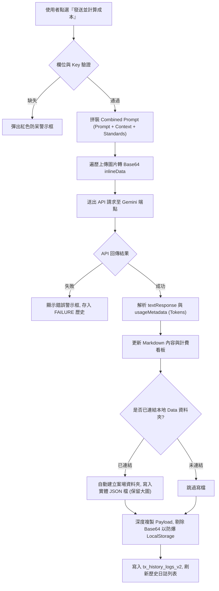
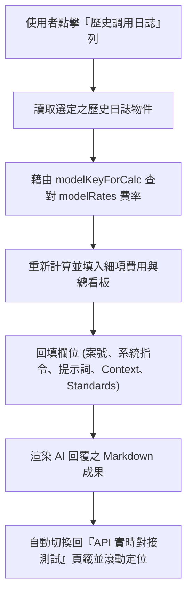

# 添心系統 - AI API Token 成本與測試工具技術規格書 (SPEC)

本文件定義「API Token 成本計算與測試工具」之功能規格、技術架構與數據對接標準，作為添心系統導入 AI 功能之計費核銷底座與工務測試平台。

---

## 1. 系統定位與設計目的
* **會計對帳基礎**：作為添心系統後續導入 AI 功能（如報價單審核、施工日誌分析）時，精準試算、記錄每次調用 Input/Output Token 數與台幣/美金花費的對帳底座。
* **工務沙盒測試**：提供設計總監、工務助理第一線的 AI 提示詞調校沙盒，支援多圖上傳與現場實務工法規範庫對照。

---

## 2. 核心功能規格 (Functional Specifications)

### A. 輸入欄位職責解耦 (Decoupling)
為了達到高內聚與靈活的比對測試，輸入區徹底拆分為四個獨立區塊，在發送前由 JS 動態拼裝打包送出：
1. **用戶提示詞 (Prompt / 任務指引)**：定義 AI 要執行的具體任務。
2. **參考內文 (Context)**：置放被審核的材料清單、施工日誌、合約條款等現場數據。
3. **比對標準規範 (Standards)**：置放公司標準法規、工法基準，作為 AI 核對 Context 的事實依據。
4. **系統指令 (System Instruction)**：設定 AI 的角色設定、口氣與輸出格式限制。

### B. 預設系統與用戶提示詞範本
支援下拉選單一鍵快速切換，自動初始化帶入以下預設任務：
* **【工務與設計助理】(assistant)**：專門分析施工照片與「案子歷史資料序列（時間線事件）」，理清已完成項目時間點，評估當前工程進度是否符合預期，並提供下一步工種銜接與防範雷區建議。
* **【現場監工】(inspector)**：對照照片與施工規範，指出不符工法之處。
* **【報價單審計】(audit)**：核對報價數量與單價，指出高於市場行情或重複計價的灌水品項。
* **【法規助理】(legal)**：對照室內裝修管理辦法與建照圖面進行合規性檢查。

### C. 高規木作與水電標準規範庫
預設搭載公司最新工法基準，點擊快捷鍵即可自動 append 插入「比對標準規範」中：
* **輕鋼架天花板吊筋**：吊筋間距最大小於 90cm；冷氣機/主燈處增設雙向加強吊筋。
* **水電專用迴路**：高功率電器櫃使用獨立迴路（2.0mm單芯或5.5mm²絞線）；強弱電分管配置且距離大於 15cm。
* **櫃體散熱與留白**：系統高深櫃背面留 5cm 以上散熱空間；電鍋拉盤上方留白大於 10cm。
* **木作結構與各部工法 (高端標準)**：
  * *天花板*：使用低甲醛防潮集成角材，雙向骨架間距在 **30x30cm 或 30x36cm (1.2台尺) 內**以防下陷；矽酸鈣板接縫留 3mm V型溝防裂；重物處用 18mm 木心板雙層加強。
  * *壁板*：靠外牆處塗防潮漆加鋪防潮布；打底角材骨架間距不得大於 **36cm (1.2台尺) 內**；垂直度與平整度誤差小於 2mm/m。
  * *電視牆*：壁掛承重處使用 18mm 木心板底板加強；預留直徑 50mm (2吋) 以上大月彎隱藏穿線管槽（孔口出線處做防割手收邊）。
  * *半腰背牆*：床頭上緣水平誤差小於 1mm/m；檯面收邊 45度斜角密合拼縫。

---

## 3. 本機 Data 自動歸檔與還原系統

### A. 本機 Data 資料夾背景對接
利用 HTML5 **File System Access API** 實現零後端伺服器（Serverless）的實體檔案讀寫：
* **資料夾 Handle 記憶 (IndexedDB)**：使用者首次點選「連結 Data 資料夾」後，系統會將 DirectoryHandle 儲存在本地 IndexedDB 中。每次重新開啟網頁時，僅需點擊一次 **「🔑 授權讀寫權限」**，即可在不重新選取資料夾的情況下恢復連結。
* **自動背景寫入 JSON**：API 發送成功後，自動於選定的 data 目錄下以 **案號** 為名建立子資料夾（如 `data/A2026-001/`），並以 `[案號]_[YYYY-MM-DD_HH-mm-ss].json` 格式背景存檔。
* **檔案寫入內容**：
  ```json
  {
    "projectId": "案號/案場",
    "timestamp": "時間",
    "model": "模型展示名稱",
    "requestPayload": { "contents": [ ... ], "systemInstruction": { ... } },
    "response": "AI Markdown 回覆",
    "metrics": { "inputTokens": 0, "outputTokens": 0, "costUsd": 0.0, "costTwd": 0.0 }
  }
  ```

### B. LocalStorage QuotaExceeded 防爆機制
為了防止多張施工照片的 Base64 數據擠爆瀏覽器僅 5MB 的 LocalStorage：
* 本地實體 JSON 檔案完整儲存含有大圖 Base64 的 `requestPayload`。
* 存入 localStorage `tx_history_logs_v2` 之前，系統會深度複製 payload，並將 `inlineData.data` 剔除，替換為簡短說明字串，在實現「文字欄位與計費還原」的同時，保障 LocalStorage 的存儲安全。

### C. 歷史存檔「點選一鍵還原」工作流
點選下方歷史日誌表格的任一筆記錄：
1. 自動切換回 **「API 實時對接測試」** 頁籤。
2. 將該記錄的 Project ID, Model 參數還原；並將 Payload 中備份的 System Instruction、Prompt、Context、Standards 全部**自動回填**至輸入欄位。
3. 將該筆記錄儲存的 Response Markdown 重新渲染於回傳預覽區，並平滑滾動到預覽位置，實現快速回溯與比對。

---

## 4. 最新官方 API 計費費率矩陣 (2026 最新版)
計費矩陣預設搭載 2026 官方定價（每百萬 Tokens 計算）：
* **Gemini 2.5 Flash**：Input $0.30 / Output $2.50
* **Gemini 2.5 Pro**：Input $1.25 / Output $10.00 (基於 ≤ 200k tokens 標準定價)
* **Gemini 3.5 Flash**：Input $1.50 / Output $9.00
* **Gemini 3.1 Pro**：Input $2.00 / Output $12.00
* **Gemini 3.1 Flash-Lite**：Input $0.25 / Output $1.50

---

## 5. 本地開發熱重載 (Hot Reload) 避坑配置
由於本機自動寫檔會將 JSON 檔案寫入 `tools/api-token-cost-calculator/data/` 中，若使用 VS Code Live Server 等工具預覽，會因為偵測到檔案變更而引發網頁無限重整。
* **解決方案**：本工具已在主專案目錄 `.vscode/settings.json` 與工具子目錄 `tools/api-token-cost-calculator/.vscode/settings.json` 下同步完成工作區配置，強制排除 `data/` 的監控：
  ```json
  {
    "liveServer.settings.ignoreFiles": [
      "**/data/**",
      "data/**",
      "data",
      "**/data",
      ".vscode/**"
    ]
  }
  ```

---

## 6. 多圖 Token 計量與成本評估機制 (Image Token Math)
裝修現場施工大圖（高解析度）上傳時，Token 的計量標準對於預算評估極為關鍵。Gemini 的多模態計費細則如下：
* **解析度縮放**：圖片在送入模型前會先等比縮放，寬高上限為 1024 像素。
* **網格 Tile 裁切收費**：
  * 對於小於 512x512 像素的圖片，僅計為 1 個 Tile，消耗 **258 Tokens** + 85 Tokens 的基礎開銷 = **343 Tokens**。
  * 對於大於 512x512 像素（例如 1024x1024 滿載）的圖片，會被切割為 4 個 512x512 的 Tiles。此時消耗 4 × 258 = **1032 Tokens** + 85 Tokens 基礎開銷 = **1117 Tokens**。
* **實務評估指引**：
  * 裝修細節（如角材接縫、線徑標示）需要高辨識率，應維持高解析度上傳，單圖估計為 1,117 Tokens。
  * 若同時對比 10 張施工實況照，圖片輸入開銷約為 11,170 Tokens。使用 **Gemini 2.5 Flash** 測試的圖片成本僅約美金 **$0.00335**（約台幣 **$0.11**），性價比極高。

---

## 7. 三階段安全防呆機制 (Three-Stage Safeguards)
為保障人機舒適（human-comfortable）與系統健壯性，設計了三階段容錯：
1. **API 金鑰缺失防護**：未輸入 API 金鑰時，點擊發送將被攔截，並在最上方彈出紅色警示框，提示使用者前往設定頁籤填寫，防止發送無效請求。
2. **雙空發送防護 (Task & Visual)**：若「用戶提示詞」與「上傳圖片」同時為空，發送按鈕將被鎖定，防範無意義的 Token 消耗與空內容拋錯。
3. **對帳日誌容錯與防爆**：
   * 當 LocalStorage 中存儲的 JSON 數據損毀或殘缺時，加載函數會對 `requestPayload` 及費率執行防空 fallback 處理，確保歷史列表與計費看板決不因為數據殘缺而崩潰。
   * 將 LocalStorage 的 payload 中的 Base64 大圖欄位主動以標示文字代替，杜絕 QuotaExceededError 的拋出。

---

## 8. 系統資料流與流程圖 (Mermaid Diagrams)

### A. API 調用、本機自動寫檔與 LocalStorage 防爆流程


### B. 歷史對帳日誌「一鍵還原」資料流


---

## 9. 正式生產環境安全性防範 (Production Security & Proxy)
本計算網頁為純前端 (Client-side) 離線沙盒，API 金鑰存於本地 LocalStorage，此模式**嚴禁直接用於外網公開之生產環境**。
* **金鑰洩漏風險**：前端程式碼與 LocalStorage 中的金鑰極易遭瀏覽器套件、XSS 攻擊或惡意腳本竊取。
* **後端安全代理 (Proxy API) 架構**：
  1. 正式添心系統部署時，前端網頁僅將 `Prompt`、`Context` 與圖片發送至添心後端專屬的 API 路由（例如 `/api/v1/analyze`）。
  2. 後端伺服器（GAS / Node.js Express / Firebase Functions）將 `GEMINI_API_KEY` 以加密環境變數（Environment Variables）安全保管於雲端，代為轉發向 Google API。
  3. 後端伺服器獲取 Response 後返回給前端，從而實現前端「零金鑰暴露」的安全架構。

---

## 10. 大規模文本與超長合約處理機制 (Large Context & RAG Selection)
當面對整本裝修合約、高層公寓消防全套法規等超長文本（超過 10 萬字）比對時，直接塞入 Context 會導致計費 Token 飆增與 AI 反應遲緩：
* **情境 A：高精度法律/條約比對**：
  * 對於需要考量全局上下文的合約條款，建議選用具備 200 萬 Token 窗口之 **Gemini 2.5 Pro** 模型直接處理。
* **情境 B：常規工法/法規檢索 (RAG 方案)**：
  * 採用 **RAG (檢索增強生成)** 架構。後端先將全套法規拆分為 500 字的「文字切片 (Chunks)」，並保留 10% 重疊區 (Overlap)。
  * 透過 Vector Embedding（向量嵌入）將切片存入向量資料庫。
  * 當使用者輸入提示詞時，系統僅檢索出關聯度最高之 3-5 個法規片段，作為 Context 送給 AI，達成「高準確度、極低 Token 成本」的實務優勢。


