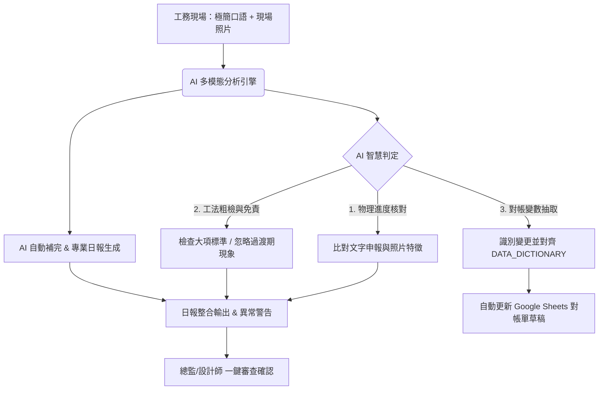

# AI 施工回報與每日工作報告系統規劃案 (AI Construction Report System Plan)

本規劃案基於總監指導之 [木作工程分析要點.md](file:///c:/Users/a9999/Dropbox/CodeBackups/CODING/tools/api-token-cost-calculator/%E8%B3%87%E6%96%99%E5%BA%AB/%E6%9C%A8%E4%BD%9C%E5%B7%A5%E7%A8%8B%E5%88%86%E6%9E%90%E8%A6%81%E9%BB%9E.md)，針對如何利用 AI（特別是多模態大型語言模型）自動判斷施工狀況、稽核照片、補完專業日報以及自動對帳進行系統設計。

---

## 1. 系統核心架構與工作流

AI 施工日報系統的目標是實現**「工務端零阻力輸入，設計端高精準查核」**。整體工作流如下：

---

## 2. 施工回報要點 (工務輸入與 AI 判斷重點)

AI 判斷施工狀況時，應聚焦於以下核心要點，並避免陷入過於微觀的刁難。

### A. 進度物理狀態判定 (Progress & Phase Detection)
*   **工務輸入**：上傳空間照片（限制 1~2 張，避免 Token 浪費）與口語文字。
*   **AI 判斷邏輯**：
    *   **比對實體狀態**：識別照片中是「角材骨架」、「隱蔽加強與配管」、「封板中/完工」還是「油漆面漆」。
    *   **進度防呆**：如果工務文字寫「客廳封板完成」，但照片中仍是裸露的角材與吊筋，AI 必須主動抓出此衝突，並標記為 `[進度異常警告]`。

### B. 工法大項抓漏與「階段性跨工種免責」 (Quality Review & Exemption)
為避免 AI 對於正常過渡狀態進行無效警示，必須嚴格執行免責過濾：
1.  **大項粗檢**：AI 僅檢查肉眼可見的重大瑕疵（如：骨架明顯下陷、大面積天花板變形歪斜、地坪保護板未鋪設）。
2.  **油漆免責**：木作階段的「釘孔未補、接縫未批土、板材表面墨線與鉛筆記號」一律判定為正常。
3.  **水電免責**：木作開孔處「未安裝插座面板、未見電器盒固定」一律判定為正常。
4.  **清潔免責**：地面的「鋸屑、粉塵、木碎料」一律視為正常施工狀態，不發警告。

### C. 財務與變更參數自動抽取 (Finance Parameter Extraction)
*   **機制**：AI 需從口語敘述中提取出「設計變更」或「追加減」的關鍵欄位。
*   **規格對齊**：提取的參數名稱必須與 [專案全域資料字典.md](file:///c:/Users/a9999/Dropbox/CodeBackups/CODING/SPEC/專案全域資料字典.md) 完全一致。
    *   *範例*：工務口語提到：「今天把主臥的床頭插座往左移了半尺」。
    *   *AI 抽取*：識別為 `MepSockets` 變動，抽取數量為增加（或移位），自動生成變更對帳草稿。

---

## 3. 實施具體步驟 (How to Implement)

如果總監決定要由 AI 來幫忙判斷並提供每日工作報告，建議分三階段落地：

### 第一階段：AI 日報生成與分析 Prototyping (目前可直接進行)
1.  **建立 Prompt 模板**：
    *   撰寫專用的 System Prompt，將 [木作工程分析要點.md](file:///c:/Users/a9999/Dropbox/CodeBackups/CODING/tools/api-token-cost-calculator/%E8%B3%87%E6%96%99%E5%BA%AB/%E6%9C%A8%E4%BD%9C%E5%B7%A5%E7%A8%8B%E5%88%86%E6%9E%90%E8%A6%81%E9%BB%9E.md) 作為 Context（少廢話、尊稱總監、注重防潮防震、實務單位採用台尺/坪/才）。
2.  **測試 CLI 分析工具**：
    *   在 `tools/` 目錄下建立一個輕量級指令指令碼（如 `report-analyzer.py` 或 Node.js 腳本）。
    *   輸入：`工務極簡口語` 與 `照片路徑`。
    *   輸出：JSON 格式的結構化報告（含今日進度、瑕疵查核、明日交接提醒、對帳參數）。

### 第二階段：與後端 (GAS / Sheets) 管道對接
1.  **整合至 GAS 後端**：
    *   在 `backend/` 專案中，建立一個接收 LINE Webhook 的 Endpoint。
    *   當工務在 LINE 群組發送施工照片與簡短口語時，GAS 將該資料轉發至 Gemini API。
2.  **自動填寫 Sheets 日誌**：
    *   將 AI 產生的結構化報告，自動寫入「每日工程日誌表」。
    *   若有參數變更（如 `MepSockets`），將其寫入「追加減確認暫存區」，等待總監一鍵確認後併入結算。

### 第三階段：設計端 Review Web UI (無縫體驗)
1.  **開發前端 Dashboard**：
    *   設計一個極簡 premium 風格的網頁介面。
    *   展示今日各案場的「AI 稽核報告」，並以**綠/黃/紅**燈號標示進度與安全狀態。
    *   提供「一鍵發送至業主 LINE」功能，自動將 AI 補完的精美報告發給客戶，大幅提升公司專業形象。

---

## 4. 總監 Review 與下一步行動

請總監評估：
1.  本規劃案的 **AI 判定邏輯**（進度核實、階段免責、參數抽取）是否符合現場實務？
2.  我們是否要先在 `tools/` 底下寫一個 **AI 日報分析 Prototype 腳本**，用幾張真實的案場照片與口語來驗證模型的判定準確度？
