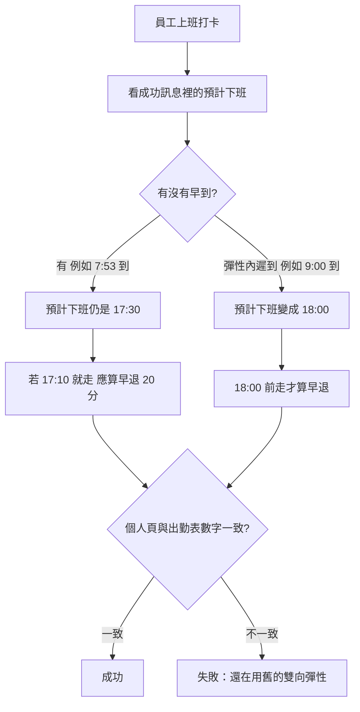

# 下一輪該改什麼

更新時間：2026-08-26 23:44（台北）

**本輪一句話：** 優先把「最早 17:30 才能下班」做到打卡與早退數字一致；遠端看不到後端倉庫，須本機套用現成修補。公開案例／YouTube 本輪不排。

## 本輪新提案

| # | 一句話 | 急不急 | 建議你 |
|---|--------|--------|--------|
| 1 | 早到不能提早走：打卡「預計下班」與早退分數要跟新規定同一套 | P0 | 做 |
| 2 | 測客人底部大圖時，私訊指令要真的能換成四格／六格／員工 | P1 | 做 |

## 還沒收尾

（本輪是第一份看板，沒有舊條目可接。下列兩項已定案但本輪不要開工，避免被當成新提案。）

| # | 一句話 | 急不急 | 建議你 |
|---|--------|--------|--------|
| A | 出勤獎金改新制：程式已備好，等公司宣布再生效 | P1 | 可等 |
| B | 客人「我的裝修案」測試警語先留著 | P2 | 可等 |

## 你怎麼用

- 回聊天說「做第 1 個」或「做第 2 個」
- 一次只做一件
- 不上線，除非你說可以

---

# 白話說明

## 1）早到不能提早走

**誰得到什麼：** 員工打卡、主管看出勤時，早到的人不能提早下班；遲到若還在彈性內，下班時間往後延。數字要跟老闆 7 月底定的規則同一套，不要儀表板一套、實際打卡又一套。

**現況：** 網頁側的算法已改成「單向」。後端打卡成功訊息、出勤報表的早退，自 7/31 起沒有書面紀錄說已套用；後來後端有為別的事上過線，但沒寫這件事。本環境也打不開後端倉庫，無法遠端對過。

**人怎麼驗收**

- 成功：7:53 到 → 仍 17:30 才可走；9:00 到 → 18:00 才可走；7:53 到卻 17:10 走 → 早退 20 分；個人頁與出勤表同一數字。
- 失敗：早到的人看到預計下班早於 17:30，或早退被算少。卡在「後端還沒換成新算法」或「換了還沒發布」。
- 再試：本機套用現成修補 → 用上面三個例子對一次 → 你點頭後才發布打卡後端。若本機一看已經是新算法，在紀錄打勾即可，不必重做。

## 2）測客人底部大圖的指令要真能換

**誰得到什麼：** 內部測試「我的裝修案」期間，有權限的人在官方帳號私訊打指定句子，只換**自己**聊天室下方大圖（未綁定四格／會員六格／換回員工），不必每次重建全公司選單。

**現況：** 說明頁已寫怎麼打；8/14 紀錄註明「實際切換要等後端」。之後沒有寫已上線。客人頁仍在測試，這條會卡住測試節奏。

**人怎麼走完**

| 步驟 | 人做什麼 | 畫面呈現 | 結果／下一步 |
|------|----------|----------|--------------|
| 1 開始 | 在官方帳號私訊打測試句子（員工／四格／六格） | 系統應回覆已換成哪一種，或說明權限不夠 | — |
| 2 進行中 | 關掉再打開聊天室，或等幾秒 | 下方大圖換成對應版本 | 只影響自己 |
| 3a 成功 | 看底部大圖 | 四格＝未綁定測；六格＝會員測；員工＝測完還原 | 可接著測客人頁 |
| 3b 失敗 | 看回覆 | 沒反應、說不認識指令、或全公司都被改到 | 先不要當全公司預設；改完再打一次 |

- 失敗時卡在：後端還沒認這句指令，或認了但沒真的換圖。再試：確認是私訊官方帳號、句子打對、測完換回員工。

## 還沒收尾（先不要做）

**A. 出勤獎金新制**  
颱風假不當缺勤、生理假不扣獎金等規則已定，程式也做成可切換。現在仍走舊制。**等你宣布再生效**，這輪不要硬切。宣布後抽幾個例子對金額即可。

**B. 客人測試警語**  
綁定／選材／收款頁頂部仍寫「測試階段、僅供參考」。測試沒宣告結束前不要拿掉。

## 本輪不排

- 公開案例頁、知識頁大批改寫、網站地圖大批增刪（別的流程負責）
- 自助綁定改回「一律人工審」：8/14 已改口為對上即通過，不要開回去
- TOS 大項（結案快照、報價／合約權威、案件狀態機）範圍太大，不是這一刀

---

# 實作備註

給接手改程式的人。上面白話沒寫的檔名與風險放這裡。

## 提案 1｜單向彈性下班後端對齊

| 項目 | 內容 |
|------|------|
| 建議模組 | `nephi4377/Backend_GAS` → CheckinSystem；對照 CODING `patches/backend-flex-off-time-one-way-9804/` |
| 建議檔案 | 後端：`Logic_AttendanceReport.js`（`_computeReportLateEarly_`）、`Logic_Checkin.js`（預計下班字串）；前端已在 `shared/js/utils.js`；政策 `SPEC/打卡彈性下班政策.md`；LOG 勾選 `LOG/2026-07-31_LOG.md` |
| 做法 | 依 patch 的 `APPLY.md` 套用；`node patches/backend-flex-off-time-one-way-9804/verify-algorithm.mjs` 應 3/3；本機 `upload.bat` 後看 Backend_GAS Actions |
| 技術風險 | 本自動化環境對 `Backend_GAS` 為 404／無權限，**不能遠端確認 main 是否已含此改**。8/3、8/11 CheckinSystem 有過部署，但 LOG 未提單向彈性。若已套用，驗收三例通過即可結案，勿重複改公式。 |
| 驗收對照 | 白話 §1 三例：07:53→17:30；09:00→18:00；07:53 且 17:10 走→早退 20。個人頁與出勤儀表板一致。 |
| 上線 | 需人說可以才 `upload.bat`／clasp |

## 提案 2｜`#測試選單` 後端

| 項目 | 內容 |
|------|------|
| 建議模組 | Backend_GAS 官方 LINE 指令處理（project-console 一側）；前端說明已在 `modules/info/LINE_commands_help.html` |
| 建議對照 | `LOG/2026-08-14_LOG_測試選單切換.md`；`SPEC/專有名詞白話對照.md`「#測試選單」 |
| 技術風險 | 同樣無法遠端讀後端。若指令已上線，打開說明頁打一次即可把本條標完成。切換必須**只改自己**，禁止寫成全公司預設選單。 |
| 驗收對照 | 白話 §2 表格：員工／四格／六格可來回切；他人不受影響；測完能換回員工。 |

## 還沒收尾 A／B（不要這輪開工）

| 項 | 對照 |
|----|------|
| A | `SPEC/22_假勤與出勤獎金規則計劃.md` §6；Checkin Script Property `ATTENDANCE_BONUS_POLICY` 缺省 `legacy`；宣布後才 `v2` |
| B | `modules/accounting/customer-finance-portal.html` 測試階段文案；`LOG/2026-08-16_LOG_客人頁測試警語.md` |

## 本輪訊號摘要（規劃用）

- liff-checkin `main`：近兩日幾乎都是案例頁／sitemap（避開）；產品向最後落地約 8/22 待付款錯誤回報。CI 僅 Pages 建置且綠燈。無 open issue。PR #11 草稿（假勤文件）內容已在 main；PR #12 為案例頁，不排。
- `Backend_GAS`：此 token 下列出的 nephi4377 倉只有 `liff-checkin`、`TAUpdata`，GitHub 回 404，後端待辦只能靠本倉 patch／LOG／SPEC。
- 未採用：TOS P0 結案／合約權威（太大）；自助綁定改回待審（8/14 總監改口覆蓋）。
