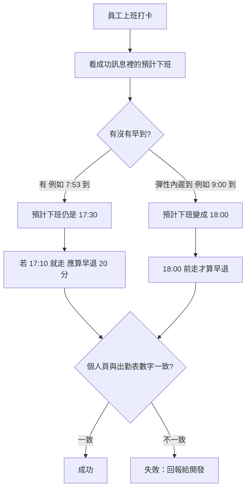

# 下一輪該改什麼

更新時間：2026-08-29 14:26（台北）

**本輪一句話：** 本輪無高價值提案。續1（最早 17:30 下班）與續2（測試選單私訊換圖）今日已上線並對齊 GitHub；還沒收尾只剩 A、B 兩件等宣布／測完。公開案例／YouTube 本輪不排。

## 本輪新提案

| # | 一句話 | 急不急 | 建議你 |
|---|--------|--------|--------|
| — | 本輪無高價值提案 | — | 略過 |

## 還沒收尾

（續1、續2 今日已部署結案，從本表移除；A、B 原樣保留。）

| # | 一句話 | 急不急 | 建議你 |
|---|--------|--------|--------|
| A | 出勤獎金改新制：程式已備好，等公司宣布再生效 | P1 | 可等 |
| B | 客人「我的裝修案」測試警語先留著 | P2 | 可等 |

## 你怎麼用

- 要動手：回聊天「做 A」或「做 B」（這輪沒有新的第 N 個）
- 一次只做一件
- 不上線，除非你說可以
- A、B 先不要做，等宣布／測完再說
- 續1／續2 已上線，若要抽查：打卡看預計下班、私訊打測試選單看底部大圖

---

# 白話說明

## 本輪結案）最早 17:30 才能下班（續1）

**誰得到什麼：** 員工打卡、主管看出勤時，早到的人不能提早下班；遲到若還在彈性內，下班時間往後延。數字跟老闆 7 月底定的規則同一套。

**現況：** 今日後端已上線（CheckinSystem @381），GitHub 也已對齊。本機公式驗證仍 3/3 通過。

**若要抽查**

- 成功：7:53 到 → 仍 17:30 才可走；9:00 到 → 18:00 才可走；7:53 到卻 17:10 走 → 早退 20 分。
- 失敗：早到的人看到預計下班早於 17:30，或早退被算少。再試：確認是正式打卡後端、不是舊快取頁面。

## 本輪結案）測客人底部大圖的私訊指令（續2）

**誰得到什麼：** 有權限的人在官方帳號私訊打指定句子，只換**自己**聊天室下方大圖（未綁定四格／會員六格／換回員工），不必每次重建全公司選單。

**現況：** 今日後端已上線（project-console @584）。沒權限會回一句話說明，不會靜默失敗。

**若要抽查**

| 步驟 | 人做什麼 | 畫面呈現 | 結果／下一步 |
|------|----------|----------|--------------|
| 1 開始 | 在官方帳號私訊打測試句子（員工／四格／六格） | 系統應回覆已換成哪一種，或說明權限不夠 | — |
| 2 進行中 | 關掉再打開聊天室，或等幾秒 | 下方大圖換成對應版本 | 只影響自己 |
| 3a 成功 | 看底部大圖 | 四格＝未綁定測；六格＝會員測；員工＝測完還原 | 可接著測客人頁 |
| 3b 失敗 | 看回覆 | 沒反應、說不認識指令、或全公司都被改到 | 先不要當全公司預設；回報給開發 |

## A）出勤獎金新制（可等，不要這輪開工）

**誰得到什麼：** 宣布之後，員工請假／颱風天沒來時，本薪與出勤獎金要依法、依公司新規則算（颱風不當缺勤、生理假不扣獎金等）。

**現況：** 程式已做成可切換，現在仍走舊制。**等你宣布再生效**。宣布前硬切會讓本月薪資對不上大家習慣的數字。

- 成功（宣布後才適用）：抽幾張假單，金額跟新規則例子一致；員工頁與主管審核預帶同一個數。
- 現在不要做：沒宣布就維持舊制。

## B）客人測試警語（可等，不要這輪拿掉）

**誰得到什麼：** 客人從 LINE 開綁定、選材、收款時，看得到「現在是測試、僅供參考」，避免把未齊資料當成正式結果。

**現況：** 8/16 起三個入口都有同一則說明。測試沒宣告結束前不要拿掉。

- 失敗時不要當成系統壞掉：那是說明，不是連線錯誤。客人仍可查看、確認收款或申請綁定。

## 本輪不排

- 公開案例頁、知識頁大批改寫、網站地圖大批增刪（別的流程負責；12:19 後又多了案例 #157／#243 與 sitemap，不排進本看板）
- 自助綁定改回「一律人工審」：8/14 已改口為對上即通過，不要開回去
- TOS 大項（結案快照、報價／合約權威、案件狀態機）範圍太大，不是這一刀
- 會計列表暫存縮短：還沒拍板，不硬排
- 案例 #611 公開頁（PR #12）不排
- 會計 OAuth 明示範圍：今日已隨後端一併上線（@296），不是新待辦
- Pages CI 密集提交時中間 run 會被取消、最後一筆已綠，屬正常，不開新案
- 會計免登入測試開關：8/5 已查過是後端開關，正式改要 LINE 登入才關；仍等你點頭才關，不硬列新案

---

# 實作備註

給接手改程式的人。上面白話沒寫的檔名與風險放這裡。

## 本輪結案｜續1 單向彈性下班

| 項目 | 內容 |
|------|------|
| 部署 | CheckinSystem **@381**（2026-08-29）；Backend_GAS `9cfdad7`；CODING LOG `LOG/2026-08-29_LOG_單向彈性下班.md` |
| 建議檔案 | `Logic_SystemUtils.js`、`_computeFlexOffTimeOneWay_`；`Logic_AttendanceReport.js`；`ScheduledTasks.js` |
| 驗收對照 | 07:53→17:30；09:00→18:00；07:53 且 17:10 走→早退 20。`node patches/backend-flex-off-time-one-way-9804/verify-algorithm.mjs` 仍 3/3 |

## 本輪結案｜續2 `#測試選單`

| 項目 | 內容 |
|------|------|
| 部署 | project-console **@584**（2026-08-29）；CODING LOG `LOG/2026-08-29_LOG_測試選單切換.md` |
| 建議對照 | `modules/info/LINE_commands_help.html`；`SPEC/專有名詞白話對照.md` |
| 驗收對照 | 員工／四格／六格可來回切；他人不受影響；無權限有一句回覆 |

## 還沒收尾 A／B（不要這輪開工）

| 項 | 對照 |
|----|------|
| A | `SPEC/22_假勤與出勤獎金規則計劃.md` §6；Checkin Script Property `ATTENDANCE_BONUS_POLICY` 缺省 `legacy`；宣布後才 `v2` |
| B | `modules/accounting/customer-finance-portal.html` 測試階段文案；`LOG/2026-08-16_LOG_客人頁測試警語.md` |

## 本輪訊號摘要（規劃用）

- 上一份看板：2026-08-29 12:19 台北，結論無新提案；續1／續2 仍列待做。
- **本輪重大變化（12:19→14:26）**：13:08 台北，Backend_GAS `9cfdad7` 對齊已上線 GAS（單向彈性、測試選單無權限回覆、會計 oauthScopes）；CODING `3a154ed` 補 LOG／說明頁。續1／續2 視為結案，從「還沒收尾」移除。其後提交僅案例 #157／#243、sitemap、Cloud Agent 環境設定，無產品向新案。
- liff-checkin `main`：CI Pages 本輪 06:26 UTC 已綠。無 open issue。PR #11 草稿（假勤文件）內容已在 main；PR #12 為案例 #611，不排。
- `Backend_GAS`：本輪 token 可讀 `nephi4377/Backend_GAS`；Actions 三子專案 clasp 皆綠。線上會計探針仍回精簡 JSON（version 27），POST 回 HTML。
- 未採用：TOS P0 結案／合約權威（太大）；自助綁定改回待審（8/14 總監改口覆蓋）；H3 列表暫存縮短（未拍板）；會計免登入測試開關（等你點頭才關）。
